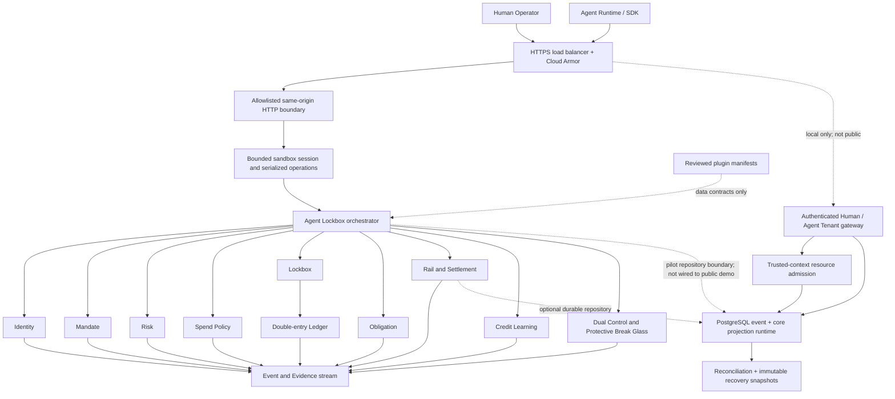

# IPO.ONE

[](https://github.com/CPTM511/IPO.ONE/actions/workflows/quality.yml)

**Machine-readable credit obligations for humans and agents.**

IPO.ONE is an Agent-first, human-compatible protocol layer for creating,
controlling, settling, repaying, and verifying credit obligations across Web2
and Web3 systems.

```text
Identity + Payment + Obligation
```

The current protocol kernel makes the operating controls explicit:

```text
Identity + Mandate + Payment + Obligation + Evidence
```

IPO.ONE is not a lending marketplace, wallet, bank, or universal credit score.
It is infrastructure for applications, agents, providers, originators, payment
rails, compliance partners, and capital systems that need to share one
auditable obligation state without collapsing identity, authorization, money
movement, accounting, and risk into one black box.

> **Current status:** the public, no-real-funds sandbox is live at
> [https://ipo.one](https://ipo.one). Release
> `00598584f437f71ebb1dd8a3517585ad8fc96ce9` runs behind a Google Cloud global
> HTTPS load balancer, Google-managed TLS, Cloud Armor, and a load-balancer-only
> Cloud Run origin with its default URL disabled. External readiness, 5xx,
> latency, capacity, and edge-deny monitoring are configured. The public API
> intentionally remains an isolated process-local sandbox: SECURITY-001 is
> approved only for local non-funds implementation. Provider-neutral Human and
> workload authentication plus deny-by-default capability/object authorization
> now exist locally but are not exposed by `ipo.one`. Exact-command durable
> dual control and a disabled-by-default protective break-glass state machine
> are also implemented and PostgreSQL-tested locally. Atomic trusted-context
> resource admission now implements the approved SEC-D08 Actor/client/Tenant/
> operation limits, credential/discovery throttles, idempotent economic charge,
> bounded resources, generic retry metadata, and forced-RLS persistence locally.
> DATA-003 now adds a local PostgreSQL-backed Tenant Command Gateway foundation:
> fail-closed Membership/client/controller facts, durable authorization resources,
> exact-payload audit and command authority, atomic admission completion,
> Human-controlled Agent Subject creation, durable non-executable Mandate drafts,
> owner-authorized integrity reads, reason-coded terminal draft revocation,
> domain-anchored resource capacity, and bounded Agent self-read. It is not
> mounted on the public
> API, and the remaining Lockbox credit/spend/revenue/repayment, worker, approval,
> and administrative handlers are not yet composed. The Human IdP, durable
> Credential provisioning, production cross-Tenant quota/edge provider,
> production role assignment, named break-glass custodians/review owner,
> notification delivery, and protected deployment approval remain gates. It
> performs no real lending, custody, KYC, underwriting, private-data processing,
> or production fund movement. Real-value use is prohibited.

## The Product Thesis

Payments answer whether value moved. IPO.ONE answers the wider credit question:

- Who or what incurred the obligation?
- Which Principal is economically responsible?
- What authority permitted the action?
- Where and for what purpose could value be spent?
- Which cashflow route captures repayment?
- What amount remains outstanding?
- Which evidence proves settlement, repayment, delinquency, or default?
- Can another platform or Agent verify that state without trusting a private
  spreadsheet or a proprietary score?

The long-term product is a composable credit-state protocol. Applications can
embed its schemas, policies, APIs, Evidence, and adapter contracts like building
blocks while regulated functions remain with licensed and certified partners.
KYC, KYP, on-ramp, off-ramp, payment, chain, and risk providers connect through
reviewed plugin contracts; IPO.ONE does not need to become every provider.

## Why Start With Agent Lockbox

The first commercial wedge is the **Agent Lockbox Credit Primitive**. An Agent
can incur tightly scoped provider obligations while revenue is captured into a
controlled Lockbox and routed to repayment before surplus is released.

```text
Agent Subject
  -> Principal and revocable Mandate
  -> CAIP-10 account binding
  -> Lockbox and deterministic credit line
  -> allowlisted Provider spend
  -> Transfer Intent and Settlement Evidence
  -> revenue capture
  -> automated repayment waterfall
  -> updated Evidence and credit recommendation
```

This is a practical starting point because Agent identity, spend destinations,
provider categories, API consumption, and cashflows can be constrained and
observed programmatically. Human credit remains schema-compatible from day one,
but production Human lending is intentionally out of scope until licensed
Originators, consent, privacy, loan-tape, legal, capital, and stop-loss controls
are approved.

## Public Beta Experience

One shared protocol state serves two first-class interaction modes:

| Mode | Designed for | Current capabilities |
| --- | --- | --- |
| Human Operator | Product, risk, operations, compliance, and partner teams | Guided lifecycle, position summary, Mandate and Agent state, credit learning, Transfers, Evidence, Ledger integrity, plugins, and risk visibility |
| Agent Runtime | Agent developers and machine clients | OpenAPI 3.1.2, zero-dependency JavaScript SDK, stable Problem Details, request correlation, sandbox-session continuity, and live request history |

The complete sandbox flow demonstrates:

1. Agent Subject and economic Principal creation.
2. Bounded, revocable Mandate activation.
3. Mock CAIP-10 execution-account binding.
4. Lockbox and balanced Ledger account creation.
5. Deterministic, explainable credit-line decision.
6. Allowlisted, purpose-bound Provider spend.
7. Event-sourced Transfer Intent, exact quote, authorization, submission, and
   finalized Settlement Receipt.
8. Revenue capture, repayment allocation, and credit-utilization release.
9. Versioned obligation, Rail, Ledger, audit, and Evidence events.
10. Evidence-derived credit learning without rewarding the same event twice.

The named healthy, risky, and recovery cycles are synthetic product scenarios.
They are visibly labelled and must not be treated as underwriting evidence.

## Architecture



### Protocol Components

| Component | Responsibility | Current implementation |
| --- | --- | --- |
| Identity | Principal, Agent/Human Subject, CAIP account references | Agent flow live; Human execution blocked |
| Authentication | Human OIDC/PKCE BFF and sender-bound Agent/Provider/system identity | Approved local non-funds foundation with closed claims, active Actor/Credential binding, DPoP/mTLS, session/CSRF controls, and lifecycle events; not wired to the public sandbox |
| Authorization | Shared Human/Agent capability policy, Membership/client/controller binding, object ownership, AccessGrants, live checks, MFA, reasons, idempotency, approval, revalidation, and allow/deny audit | Approved local non-funds foundation with private short-lived v2 decisions, PostgreSQL Membership/resource/audit adapters, non-enumerating denials, and exact payload binding; not wired to the public sandbox |
| Approval | Exact-command proposal, two-role decisions, atomic single execution, and separately gated protective break glass | Durable PostgreSQL local non-funds boundary with forced RLS, immutable/guarded records, Event/Evidence/outbox linkage, restart recovery, and reconciliation; disabled/not wired on the public sandbox |
| Resource Admission | Versioned Actor/client/Tenant/operation/network/account rates, concurrency, bytes, durable counts, queue/export/time/retry/cost budgets, and resource-blind denial | Approved SEC-D08 local non-funds boundary with deterministic and PostgreSQL atomic stores, restart leases, coarse retry classes, and low-cardinality telemetry; not wired to the public sandbox |
| Tenant Command Gateway | One authenticated protocol and serializable commit boundary for Human/Agent operations | PostgreSQL-backed DATA-003 foundation with exact replay identity, row-locked authorization facts, immutable Human-to-Agent controller assignment, atomic audit/Event/Evidence/projection/admission completion, and five reviewed pilot operations; local non-funds only |
| Mandate | Capability, counterparty, asset, amount, time, nonce, and revocation scope | Process-local demo service plus durable, integrity-checked `mandate.v2` draft creation, Human owner read, and terminal draft revocation; drafts remain unsigned and non-executable |
| Spend Policy | Provider allowlist, category, transaction, daily, and obligation limits | Enforced before spend and Rail submission |
| Obligation | Principal, amount, due state, repayment, overdue/default-compatible lifecycle | Versioned local aggregate |
| Lockbox | Revenue capture and repayment source | Projected through balanced Ledger postings |
| Ledger | Accounting source of truth | Append-only, double-entry, positive, balanced, asset-scoped, idempotent |
| Rail | Transfer Intent, exact quote, finality, settlement, reversal Evidence | Event-sourced sandbox adapter; no network or funds |
| Evidence | Portable event envelope, hashes, aggregate version, causation, correlation, finality | `evidence_event.v2` emitted across the kernel |
| Credit Learning | Explainable behavior signals and next-cycle recommendations | Deterministic, rule-based, evidence-aware demo engine |
| Plugin Registry | Trust state and data contract for KYC/KYP, Rail, Provider, chain, and risk adapters | Manifest validation only; no executable plugin loading |
| Persistence | Tenant ownership, batch command idempotency, aggregate versions, events, outbox, inbox, normalized state, immutable snapshots, replay | Nine reversible PostgreSQL migrations now cover Tenant/Actor/Membership/AccessGrant, approval/break-glass, resource admission, authorization resources/audit, command execution authority, and durable identity-resource capacity with forced RLS; public demo composition remains process-local |
| Reconciliation | Event/state/Ledger/approval checks, discrepancy Evidence, dry-run planning, approval-gated repair | Deterministic PostgreSQL service and operator runbook; no automatic production repair |

### Repository Layout

```text
apps/
  api/                 Node.js API and same-origin static server
  web/                 Responsive Human Operator and Agent Runtime UI
api/openapi/           OpenAPI 3.1.2 public contract
packages/
  api-contract/        Request IDs and RFC 9457 Problem Details
  domain/              Shared protocol enums, validators, IDs, and schemas
  mvp-flow/            Vertical-slice composition and demo controller
  sdk/                 Alpha JavaScript client and TypeScript declarations
modules/
  authentication/      Provider-neutral Human and sender-bound workload identity
  authorization/       Deny-by-default capability and object authorization
  tenant-command-gateway/ Authenticated durable Human/Agent transaction boundary
  approval/            Durable dual control and protective break glass
  abuse-control/       Atomic rate, resource, cost, and enumeration admission
  identity/            Principals, Subjects, and account bindings
  ledger/              Double-entry accounting
  lockbox/             Revenue capture
  obligation/          Obligation lifecycle
  spend-policy/        Provider and purpose controls
  risk/                Deterministic credit decisions and freeze controls
  payment/             No-funds payment and repayment instructions
  rail/                Event-sourced transfer and settlement kernel
  settlement/          Compatibility projection over Rail Evidence
  persistence/         PostgreSQL event, core projection, reconciliation, and replay runtime
  plugin-registry/     Reviewed integration manifests
  credit-learning/     Explainable signals and recommendations
  event-audit/         Append-only event and Evidence storage
  admin/               Exposure, integrity, and audit views
db/migrations/         Ordered, reversible PostgreSQL migrations
schemas/v2/            Language-neutral protocol contracts
security/test/         Live adversarial HTTP suite
docs/                  ADRs, product guidance, launch gates, and threat model
```

## Developer Contract

The machine contract is
[`api/openapi/ipo-one.v1.json`](api/openapi/ipo-one.v1.json), currently
`0.3.0-alpha.4`. It declares 21 paths and 21 operations. Successful and failed
responses carry `X-Request-ID`; failures use RFC 9457-compatible
`application/problem+json` with stable machine codes.

| Surface | Operations |
| --- | --- |
| System | liveness/readiness, Human/Agent discovery, security contact, and OpenAPI |
| Agent | create Subject/Principal, bind account, create Lockbox, request credit, read status |
| Credit | Provider spend, revenue capture, auto repayment, evidence evaluation, credit profile |
| Rail and Evidence | settlement, Rail inventory, Transfer Intent replay proof, Admin audit |
| Demo | current state, healthy/risky/recovery scenarios, complete vertical slice, reset |

The SDK is source-available at [`packages/sdk`](packages/sdk). It generates a
high-entropy sandbox session, propagates request IDs, encodes path segments,
rejects credentials embedded in base URLs, exposes typed API failures, and never
automatically retries a mutation.

```js
import { IpoOneClient } from "./packages/sdk/src/index.js";

const ipo = new IpoOneClient({ baseUrl: "http://127.0.0.1:3000" });

let state = await ipo.createAgent({ displayName: "Treasury Agent" });
const agentId = state.agent.subjectId;

state = await ipo.bindWallet(agentId, {
  accountId: "eip155:8453:0x1111111111111111111111111111111111111111"
});
state = await ipo.createLockbox(agentId);
state = await ipo.requestCreditLine(agentId);
```

Sandbox sessions preserve one workflow; they do not authenticate a person,
workload, organization, wallet, or tenant. Do not place private data in them.

## Use the Public Sandbox

The hosted surface is available to both humans and machine clients:

- Human control plane: [https://ipo.one](https://ipo.one)
- Agent discovery: [https://ipo.one/.well-known/ipo-one.json](https://ipo.one/.well-known/ipo-one.json)
- OpenAPI 3.1.2: [https://ipo.one/openapi.json](https://ipo.one/openapi.json)
- Security contact: [https://ipo.one/.well-known/security.txt](https://ipo.one/.well-known/security.txt)
- Readiness: [https://ipo.one/readyz](https://ipo.one/readyz)

Run the repository's complete Agent lifecycle against the public endpoint:

```sh
BASE_URL=https://ipo.one pnpm run smoke:api
```

This creates only synthetic, short-lived demo state. A sandbox session ID is
not a credential, and the public service must never receive secrets, private
customer data, raw KYC/PII, legal agreements, or real payment instructions.

## Run Locally

### Prerequisites

- Node.js 24.18.0 LTS
- pnpm 11.1.3
- PostgreSQL 17 only for the optional durable-event test suite

```sh
pnpm install --frozen-lockfile
pnpm run dev
```

Open:

- Control plane: `http://127.0.0.1:3000`
- Health: `http://127.0.0.1:3000/healthz`
- Liveness: `http://127.0.0.1:3000/livez`
- Readiness: `http://127.0.0.1:3000/readyz`
- Agent discovery: `http://127.0.0.1:3000/.well-known/ipo-one.json`
- OpenAPI: `http://127.0.0.1:3000/openapi.json`
- Complete proof: `http://127.0.0.1:3000/v1/demo/vertical-slice`

Reset one sandbox session:

```sh
curl -X POST \
  -H 'Content-Type: application/json' \
  -H 'X-IPO-ONE-Sandbox-Session: readme_demo_session_001' \
  -d '{}' \
  http://127.0.0.1:3000/v1/demo/reset
```

## Security Model

The public server is intentionally narrow. It adds no third-party browser
scripts, fonts, images, analytics, remote plugins, production credentials, or
fund-moving adapter.

| Boundary | Enforced control |
| --- | --- |
| HTTP | strict parser, explicit methods, JSON media types, no compressed bodies, 16 KiB headers, 64 KiB bodies, 2,048-character targets |
| JSON | object roots, per-operation field allowlists, depth/node/string limits, prohibited prototype keys |
| Financial values | decimal strings only, no floats, no leading-zero ambiguity, maximum 78 digits |
| Browser | same-origin CSP, frame denial, MIME protection, no referrer, restricted permissions, text-safe rendering |
| State | 30-minute TTL, 128 sessions/process, serialized session operations, 32 mutations/session, reset support |
| Optional durable store | Server-created transaction-local Tenant Security Context, non-owner role verification, tenant-aware foreign keys, forced PostgreSQL RLS, and cross-tenant key isolation |
| Local pilot AuthN | Closed JWT/header claims, asymmetric JOSE, bounded pinned JWKS, active Actor/Credential binding, HMAC identity references, OIDC PKCE host sessions, CSRF, DPoP/mTLS, replay protection, revocation, and recent phishing-resistant MFA; not enabled on the public runtime |
| Local pilot AuthZ | Versioned deny-by-default policies, capability intersection, Membership/client binding, Actor/Tenant ownership, exact AccessGrants, live checks, reason/idempotency/approval rules, private short-lived decisions, TOCTOU revalidation, and awaited allow/deny audit; not enabled on the public runtime |
| Local pilot Approval | Server-prepared exact-command proposals, distinct Risk/Operations approvers, current Credential/Membership/MFA revalidation, serializable single execution, immutable Evidence, forced RLS, and protective-only break glass; local non-funds only and not enabled on the public runtime |
| Local pilot Admission | Closed `abuse_001.v1` policy over trusted Actor/client/Tenant/network/account context; atomic rates, concurrency, bytes, durable counts, queue/export/retry/cost, replay disposition, restart leases, forced RLS, coarse retry metadata, and low-cardinality telemetry; local non-funds only and not enabled on the public runtime |
| Local pilot Tenant Gateway | Admission before lookup; exact authenticated replay identity; serializable authorization/Event/Evidence/projection/response/resource-transition commit; immutable controller binding; RLS plus row-locked TOCTOU checks; Agent Subject create, Draft Mandate create/read/revoke, and Agent self-read implemented locally but not enabled publicly |
| Availability fallback | 600 requests/process/minute, 64 concurrent requests, 256 connections, bounded header/request/socket/keep-alive timeouts |
| Public origin | explicit Host allowlist, trusted-proxy HTTPS proof, HSTS, load-balancer-only Cloud Run ingress, disabled default origin |
| Errors | closed Problem Details and replacement of unsafe request/session identifiers |
| Runtime | shell-free distroless Node 24 LTS image, digest pinning, UID 65532, immutable release ID, structured PII-safe application logs |
| Supply chain | locked pnpm graph, frozen install, production audit, read-only CI permissions, full-SHA GitHub Actions, read-only container smoke |

Application limits are defense in depth. They are not a substitute for TLS,
edge DDoS controls, origin policy, monitoring, incident response, or an
independent penetration test. The complete attacker model, control matrix, and
residual-risk register are in
[`IPO.ONE Public Sandbox Threat Model v0.3`](docs/security/IPO_ONE_SANDBOX_THREAT_MODEL_v0.3.md).
Report vulnerabilities according to [`SECURITY.md`](SECURITY.md).

## Public Deployment

The public boundary keeps GoDaddy authoritative DNS and places a Google Cloud
global external HTTPS load balancer and Cloud Armor in front of a
load-balancer-only Cloud Run origin. The same `https://ipo.one` origin serves
the Human Console, Agent API, OpenAPI contract, and discovery document.

| Deployment fact | Verified value |
| --- | --- |
| GCP project / region | `ipo-one-public-sandbox-cptm511` / `asia-southeast1` |
| Release | `00598584f437f71ebb1dd8a3517585ad8fc96ce9` |
| CI | [Quality Gate run 29250998398](https://github.com/CPTM511/IPO.ONE/actions/runs/29250998398) |
| Image | `asia-southeast1-docker.pkg.dev/ipo-one-public-sandbox-cptm511/ipo-one/public-sandbox@sha256:53186cf01d969e8e12988f6164f8f069bb0b180d853fe73a3d95f7342a602105` |
| Edge | Reserved IP `136.68.214.66`, managed TLS, minimum TLS 1.2, Cloud Armor host allowlist and per-IP throttle |
| Origin | Cloud Run revision `ipo-one-public-sandbox-00001-szw`; ingress restricted to internal/load-balancer; default URL disabled |
| Monitoring | Three-region HTTPS readiness check; readiness, 5xx, P99 latency, capacity, and Cloud Armor rate-limit policies; edge-deny metric |
| DNS | Root A changed only; NS, MX, SPF/TXT, `www`, and `apiv1` records preserved |

The deployment facts above are public-sandbox evidence, not a claim of formal
verification or financial-production authorization. Full commands, rollback
state, scanner results, and residual gates are recorded in
[`IPO.ONE Public Sandbox Deployment Evidence v0.1`](docs/security/IPO_ONE_PUBLIC_SANDBOX_DEPLOYMENT_EVIDENCE_v0.1.md).

- Architecture decision: [`ADR-014`](docs/architecture/ADR-014-public-sandbox-hosting-boundary.md)
- Deployment runbook: [`deploy/gcp/README.md`](deploy/gcp/README.md)
- Issue evidence: [`OPS-001A`](docs/codex/tasks/OPS_001_PUBLIC_SANDBOX_HOSTING_BASELINE.md)
- Launch policy: [`launch-policy.v1.json`](deploy/launch-policy.v1.json)
- Executable evidence gate: [`OPS-002`](docs/codex/tasks/OPS_002_EXECUTABLE_LAUNCH_EVIDENCE_GATE.md)

The public container deliberately refuses to start unless it receives the
exact no-real-funds acknowledgement and an HTTPS, HSTS, trusted-ingress
configuration. No cloud credential belongs in a repository `.env` file.

## Verification

```sh
pnpm run check          # boundaries, contracts, migrations, deployment/policy, unit tests
pnpm run check:approval-policy
pnpm run check:launch-policy
pnpm run test:security  # live adversarial HTTP and state-bounding suite
pnpm run demo           # isolated Agent Lockbox vertical slice
pnpm audit --prod       # published production dependency advisories
```

Release evidence is private and must identify the exact green commit. The
committed pending template is designed to fail:

```sh
pnpm run launch:verify -- \
  --evidence deploy/approvals/public-sandbox.local.json \
  --profile public_sandbox \
  --expected-sha <exact-green-40-character-commit-sha>
```

Passing verifies the evidence contract only. It does not grant GitHub, GCP,
GoDaddy, tenant, fund, Provider, KYC/KYP, or production permission.

With the dev server running:

```sh
pnpm run smoke:api
```

The optional PostgreSQL suite is destructive only inside a database whose name
contains `test`; it refuses other database names.

```sh
export DATABASE_URL=postgresql://127.0.0.1:5432/ipo_one_test
pnpm run test:postgres
```

That suite covers migration up/down/up, injected
rollback before and after core projection writes, multi-event idempotency,
concurrent writers, outbox lease
recovery, transactional inbox deduplication, restart replay, normalized core
state, projection hashes, Ledger/state reconciliation, durable two-role approval
and atomic execution, protective break-glass declaration through review, atomic
multi-adapter admission races, restart-retained rates, economic replay/resource
rollback, same- and cross-Tenant ownership denial, concurrent Membership
revocation, durable Gateway replay, drift Evidence, and approval-gated
idempotent repair. GitHub Actions repeats the locked install,
all repository and adversarial checks, PostgreSQL recovery, isolated demo,
dependency audit, and live smoke on every push and pull request.

## Commercial Positioning

IPO.ONE is designed as an embedded infrastructure and protocol business, not a
consumer balance-sheet lender.

### Initial Customers and Partners

| Segment | Problem IPO.ONE is designed to solve |
| --- | --- |
| Agent platforms and developers | Give Agents bounded provider credit and a portable repayment record without unrestricted wallets |
| Compute, data, model, and workflow providers | Convert approved usage into explicit, monitorable obligations with settlement Evidence |
| Payment, stablecoin, on/off-ramp, and chain providers | Integrate through one normalized Transfer and Evidence contract instead of bespoke credit logic |
| Originators and capital partners | Receive consistent obligation, cashflow, delinquency, and loan-tape-grade state while retaining regulated responsibilities |
| KYC, KYP, compliance, and risk providers | Issue scoped attestations through reviewed plugins without placing raw PII onchain or in the protocol core |

### Revenue Hypotheses

These are commercialization hypotheses, not announced pricing:

- platform subscription for policy, control-plane, Evidence, and reporting;
- usage fees per active obligation, verified settlement, or Evidence workflow;
- enterprise fees for certified adapters, private deployment, support, and
  reconciliation operations;
- institution-grade portfolio, risk, and capital reporting;
- protocol or network fees only after legal, market, governance, and fund-path
  review.

The defensible layer is the normalized obligation graph and its verified event
history: identity, delegated authority, provider spend, cashflow capture,
repayment, default-compatible state, and portable Evidence available to both
humans and Agents.

## Maturity and Roadmap

| Stage | Product state | Gate |
| --- | --- | --- |
| Public sandbox | Live | No real funds or private data; hosted at `ipo.one` with approved cloud/edge/DNS controls and explicit residual governance gates |
| Closed design-partner pilot | Policy-locked | Complete authenticated Lockbox handler composition, production IdP/Credential provisioning, least-privilege roles, tenant/RLS, dual control, abuse limits, recovery, legal/security/privacy review |
| Controlled production Agent credit | Policy-locked | Closed-pilot exit, signed provider and capital partners, reviewed custody/fund paths, caps/loss owner, independent review, on-call and stop-loss |
| Human-compatible and multi-chain network | Long term | Licensed Originators, Consent/KYC references, loan tape, stop-loss covenants, finality/reorg controls, portable Credit Passport and attestations |

Near-term engineering priorities are:

1. Complete `DATA-003` on the implemented durable Agent Subject and Mandate-draft
   foundation: compose verified CAIP-10 binding, credit request, allowlisted spend, Lockbox
   revenue, repayment, worker, approval, protective-risk, audit/export, and
   reconciliation handlers; add two-Tenant negative tests for each while the
   public demo remains isolated.
2. Add cryptographically signed Mandate activation, account challenge proof,
   nonce/replay protection, active-Mandate suspension/revocation, and key rotation.
3. Certify out-of-process Provider, KYP, payment, on/off-ramp, and chain adapters
   with signed requests, webhook replay protection, revocation, and failure policy.
4. Complete the remaining public-sandbox governance: protected-environment
   release approval, named alert recipients, incident/takedown ownership,
   reviewed log retention, and an independent external security assessment.
5. Add finality/reorg handling, capacity reservations, product telemetry, scheduled
   reconciliation, incident operations, backup, restore, and disaster recovery.

The requirement trace and commercialization sequence are maintained in
[`IPO.ONE Commercialization Roadmap v0.3`](docs/guidance/IPO_ONE_COMMERCIALIZATION_ROADMAP_v0.3_DRAFT.md).
The precise public-beta gate is
[`IPO.ONE Public Beta Launch Readiness v0.3`](docs/guidance/IPO_ONE_PUBLIC_BETA_LAUNCH_READINESS_v0.3.md).

## Project Governance

Product and protocol decisions follow this hierarchy:

1. [`Product Description and PRD v1`](docs/guidance/IPO_one_Product_Description_and_PRD_v1.md)
2. [`MVP Build PRD and Technical Architecture v0.1`](docs/guidance/IPO_ONE_MVP_Build_PRD_Technical_Architecture_Codex_Task_Spec_v0.1_FINAL.md)
3. Reviewed ADRs in [`docs/architecture`](docs/architecture)
4. Issue-scoped implementation tasks in [`docs/codex/tasks`](docs/codex/tasks)

Architecture review and roadmap drafts are proposals until named human review.
Contracts, real funds, permissions, privacy boundaries, production dependencies,
and deployment changes require explicit Founder/CTO/Security review.

## Safety Notice

This repository is engineering software and product research. It is not
financial, legal, investment, compliance, or underwriting advice. It must not
be used to originate loans, custody assets, make production credit decisions,
store raw KYC/PII, or move real value in its current form.

IPO.ONE's ambition is to become the shared trust layer through which humans,
Agents, providers, originators, payment systems, and capital can exchange
verifiable credit state. This repository makes that thesis concrete, runnable,
and reviewable without pretending the public sandbox is already the finished
financial network.
