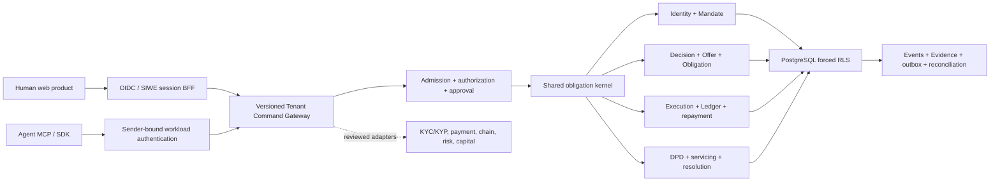

# IPO.ONE

[](https://github.com/CPTM511/IPO.ONE/actions/workflows/quality.yml)
[](.node-version)
[](api/openapi/ipo-one.v1.json)
[](deploy/launch-policy.v1.json)

## Programmable credit infrastructure for humans and agents

IPO.ONE turns credit into a shared, machine-readable obligation lifecycle. It
binds identity, authority, payment intent, accounting, servicing, and Evidence
without forcing Human and Agent products into separate financial systems.

```text
Identity + Payment + Obligation
```

Mandates constrain authority; versioned Evidence proves the resulting state.

The result is one auditable state machine for answering five questions:

1. Who or what incurred the obligation?
2. Which Principal and authority permitted it?
3. What is owed, under which terms, and to whom?
4. How did execution, repayment, delinquency, or resolution change the state?
5. Which versioned Evidence proves every transition?

**[Product Charter v1.1](docs/guidance/IPO_ONE_PRODUCT_CHARTER_v1.1.md)** ·
**[Tenant protocol](api/tenant-protocol/ipo-one.tenant-protocol.v1.json)** ·
**[Security](SECURITY.md)** ·
**[Commercialization roadmap](docs/guidance/IPO_ONE_COMMERCIALIZATION_ROADMAP_v0.3_DRAFT.md)**

> [!IMPORTANT]
> This repository's commercial candidate is a closed, persistent,
> **no-real-funds** product. It does not authorize lending, custody, withdrawals,
> real payment execution, raw KYC/PII storage, or production underwriting. The
> current `ipo.one` deployment is an older public sandbox release and is not the
> durable commercial candidate described below. A new release must pass the
> exact-commit gates in [`deploy/launch-policy.v1.json`](deploy/launch-policy.v1.json).

## Product

Human and Agent entry modes share the same deterministic kernel, PostgreSQL
truth, authorization policy, Ledger, servicing model, and Evidence envelope.

| Product surface | Implemented capability | Release state |
| --- | --- | --- |
| Human | Guided Subject and Consent creation, explainable Decision and Offer, exact acceptance, Obligation execution, repayment schedule, multi-position recovery, DPD/default/cure, servicing, and owner Evidence | Persistent local closed pilot; remote production access locked |
| Agent | Principal-controlled Subject, one-use CAIP-10 account proof, bounded Mandate, credential-free handoff, 11 MCP tools, Offer acceptance, execution, repayment, servicing, and Evidence | Persistent local stdio pilot; remote production access locked |
| Authentication | OIDC Authorization Code + PKCE BFF, standard-provider subject mapping, SIWE, durable Credentials, transactions, sessions and events, atomic deprovisioning, CSRF, DPoP/mTLS, revocation, and recent-MFA policy | Implementation and PostgreSQL tests complete; IdP registration, secret binding, hosted abuse controls, and production composition remain gates |
| Authorization | Deny-by-default capabilities, Membership/client/controller binding, object ownership, AccessGrants, dual control, live revalidation, non-enumerating denial, and immutable audit | Durable local boundary; public exposure locked |
| Credit kernel | One Human/Agent lifecycle for Intent, Decision, Offer, Obligation, execution, repayment, servicing, resolution, Ledger, and Evidence | Durable and restart-safe with synthetic or redacted inputs |
| Operations | Risk portfolio, servicing queue, protective freeze, reconciliation, bounded alert state, health metrics, feedback aggregates, and runbooks | Local operator surfaces; protected scheduling/on-call integration remain gates |
| Networks | CAIP-2/CAIP-10 adapters, Base Sepolia (`eip155:84532`) primary profile, X Layer Testnet (`eip155:1952`) portability profile, finality/reorg/replay tests | Test networks only; no mainnet, asset, bridge, or capital commitment |

### Human lifecycle

```text
Sign in
  -> create or recover Human Subject
  -> record Consent and identity Evidence reference
  -> submit Credit Intent
  -> receive explainable Decision and Offer
  -> accept exact terms
  -> create shared Obligation and repayment schedule
  -> execute in a non-withdrawable sandbox
  -> repay, service, cure, restructure, repurchase, or write off
  -> verify Ledger and Evidence
```

### Agent lifecycle

```text
Principal signs in
  -> creates Agent Subject
  -> proves CAIP-10 execution account
  -> activates bounded Mandate
  -> exports credential-free MCP handoff
  -> Agent submits Intent and receives Offer
  -> Agent accepts and executes within policy
  -> repayment and servicing update the same Obligation
  -> Principal, Agent, and Auditor verify Evidence
```

The Agent handoff contains authority metadata, not a bearer credential, private
key, caller-selected capability set, or funds permission.

## Architecture



### Invariants

- Human and Agent modes never fork the Obligation, Ledger, risk, event, or
  Evidence model.
- Every caller receives a server-created Authentication Context; authentication
  never grants business authority by itself.
- Every mutation is schema-closed, authorized, admitted, idempotent, and
  committed atomically with audit/Event/Evidence state.
- Financial values use exact decimal strings; Ledger postings are append-only,
  asset-scoped, positive, idempotent, and double-entry balanced.
- Tenant data uses tenant-aware foreign keys, a non-owner runtime role,
  transaction-local security context, fixed search path, and forced RLS.
- Raw KYC/PII, provider credentials, wallet keys, session handles, CSRF values,
  and external identity subjects do not enter portable Evidence.
- Chain IDs and account IDs use CAIP-2 and CAIP-10; business Obligation IDs stay
  chain-agnostic.
- Real funds, production Human credit, external provider execution, arbitrary
  withdrawals, and black-box scoring fail closed behind versioned launch policy.

## Protocol surfaces

| Surface | Contract |
| --- | --- |
| Durable Human/Agent application protocol | [38-operation Tenant catalog](api/tenant-protocol/ipo-one.tenant-protocol.v1.json) |
| Portable data contracts | [46 JSON Schemas](schemas/v2) |
| Agent runtime | [Local MCP host](apps/agent-mcp) and [JavaScript SDK](packages/sdk) |
| Human runtime | [Tenant HTTP boundary](apps/tenant-api) and [responsive web product](apps/web) |
| Authentication | [Provider-neutral AuthN module](modules/authentication) |
| Persistence | [25 reversible migrations](db/migrations) and [event runtime](modules/persistence) |
| Historical public contract | [OpenAPI 3.1.2](api/openapi/ipo-one.v1.json); retained for the current sandbox only, not the commercial Tenant protocol |

All errors use stable machine codes. Private protocol requests and results are
versioned and closed before execution or commit. Human UI and Agent MCP/SDK are
co-equal adapters over the same application protocol.

## Run the persistent no-funds product

### Prerequisites

- Node.js `24.18.0`
- pnpm `11.1.3`
- PostgreSQL `17`

The repository pins the runtime in both [`.nvmrc`](.nvmrc) and
[`.node-version`](.node-version).

```sh
nvm use
pnpm install --frozen-lockfile
pnpm run check:runtime
```

Create an empty local PostgreSQL database and start the private product:

```sh
export DATABASE_URL=postgresql://127.0.0.1:5432/ipo_one_private_pilot
pnpm run pilot:start
```

The launcher migrates the database, creates a non-owner `NOBYPASSRLS` runtime
role, and binds three loopback-only workspaces:

- Human Borrower: `http://127.0.0.1:8787/#human`
- Principal / Agent Authority: `http://127.0.0.1:8788/#human`
- Risk Operations: `http://127.0.0.1:8789/#risk`

The local launcher uses explicitly synthetic identities and no real value. It
is for deterministic product verification, not a substitute for the gated OIDC,
SIWE, participant-provisioning, privacy, or legal deployment steps.

### Agent account proof and MCP handoff

Create an Agent Subject in the Principal workspace and download its one-use
account challenge. Prove the configured local account:

```sh
DATABASE_URL=postgresql://127.0.0.1:5432/ipo_one_private_pilot \
  pnpm run pilot:agent:prove -- ./ipo-one-agent-account-challenge.json
```

Activate a bounded Mandate, download the exact runtime handoff, and start the
local MCP process:

```sh
DATABASE_URL=postgresql://127.0.0.1:5432/ipo_one_private_pilot \
  pnpm run pilot:agent -- ./agent-handoff.json
```

## Verification

The default gate validates the runtime, dependency boundaries, schemas,
OpenAPI, migrations, deployment templates, launch/approval/abuse/operations
policy, Tenant protocol, and unit suites:

```sh
pnpm run check
pnpm run test:security
pnpm run test:transport
pnpm audit --prod
```

The PostgreSQL suite refuses databases whose name does not contain `test` and
exercises migration up/down/up, rollback, replay, concurrency, forced RLS,
cross-Tenant denial, Ledger reconciliation, approval, admission, servicing,
operations, durable authentication, session revocation, and restart recovery:

```sh
export DATABASE_URL=postgresql://127.0.0.1:5432/ipo_one_test
pnpm run test:postgres
```

Chain portability and observation tests are separate and remain non-funds:

```sh
pnpm run test:chain:conformance
pnpm run test:indexer:reorg
pnpm run test:chain:live-unit
```

## Security model

| Boundary | Control |
| --- | --- |
| Browser | same-origin CSP, frame denial, MIME protection, no remote scripts/fonts/analytics, Secure host-only cookies, CSRF origin and token binding |
| Human AuthN | OIDC code + PKCE, nonce/state/redirect/provider binding, one-use SIWE, internal Credential mapping, durable session rotation/revocation, recent phishing-resistant MFA |
| Agent AuthN | asymmetric JWT, issuer/audience/algorithm pinning, bounded JWKS, DPoP or trusted mTLS, replay protection, internal Credential binding |
| Authorization | deny by default, capability intersection, Actor/Membership/client/controller/resource checks, exact-command approval, commit-time revalidation |
| Database | dedicated non-owner login role, complete table/column privilege allowlist, no role inheritance/SET ROLE/schema creation, fixed transaction search path, forced RLS |
| Financial state | exact decimals, double-entry balance, idempotent posting, controlled execution, reconciliation and immutable Evidence |
| Privacy | hashes, encrypted off-chain references, redacted views, bounded retention, no raw KYC/PII onchain or in public Evidence |
| Release | exact commit, immutable image digest, named time-bounded gates, rollback evidence, profile capability lock |

See [`SECURITY.md`](SECURITY.md), the
[`public sandbox threat model`](docs/security/IPO_ONE_SANDBOX_THREAT_MODEL_v0.3.md),
and the
[`CHAIN-001B runbook`](docs/security/IPO_ONE_CHAIN_001B_TESTNET_RUNBOOK_v0.1.md).

## Release truth

Release state is code, not marketing language:

- `public_sandbox` is the only enabled launch profile. It forbids real funds,
  Human credit, private Tenant data, and external Provider execution.
- `closed_non_funds_pilot` remains disabled until its exact security,
  authentication, restore, reconciliation, penetration-test, privacy/legal,
  support, and participant gates pass and the policy is revised.
- `controlled_agent_credit_pilot` remains disabled until the closed pilot exits
  cleanly and Provider, custody, fund-path, capital, chain/asset, loss-owner,
  independent-review, on-call, and stop-loss gates pass.

No commit, README, UI switch, or verbal approval can impersonate those external
facts. A release requires evidence for the exact green commit:

```sh
pnpm run launch:verify -- \
  --evidence deploy/approvals/public-sandbox.local.json \
  --profile public_sandbox \
  --expected-sha <exact-green-40-character-commit-sha>
```

Passing this command validates the evidence contract; it does not itself grant
GitHub, GCP, DNS, IdP, Provider, legal, capital, custody, or fund authority.

## Repository map

```text
apps/
  agent-mcp/          Local credential-free Agent MCP boundary
  private-pilot/      Persistent no-funds product composition
  tenant-api/         Authenticated Human/Agent HTTP transport
  web/                Human, Principal/Agent, Risk, and Evidence UI
api/
  tenant-protocol/    Durable private application protocol
  openapi/            Historical public sandbox contract
modules/
  authentication/    Human and workload identity/session boundary
  authorization/     Deny-by-default policy and live decisions
  tenant-command-gateway/ Atomic shared application protocol
  approval/           Dual control and protective operations
  abuse-control/      Rate, capacity, enumeration, and cost admission
  identity/           Principal, Human, Agent, and account bindings
  risk/               Explainable decision and portfolio controls
  obligation/         Shared obligation lifecycle
  payment/            Execution and repayment instructions
  ledger/             Double-entry accounting
  servicing/          DPD, cure, default, restructure, and resolution
  persistence/        PostgreSQL events, projections, replay, and reconciliation
db/migrations/        Ordered reversible schema changes
schemas/v2/           Language-neutral protocol contracts
security/test/        Adversarial HTTP and policy regression tests
docs/                 Charter, ADRs, task evidence, runbooks, and launch gates
```

## Commercial model

IPO.ONE is designed as embedded credit infrastructure, not a consumer
balance-sheet lender. Initial commercial hypotheses include platform access,
active-obligation and verified-settlement usage, certified adapter and private
deployment services, reconciliation/operations support, and institution-grade
portfolio reporting. Pricing, capital structure, Provider selection, and any
network fee remain unannounced until reviewed independently.

The defensible layer is the normalized obligation graph and its verifiable
history: identity, delegated authority, approved spend, execution, repayment,
delinquency, resolution, Ledger state, and portable Evidence available to both
humans and Agents.

## Governance

Project decisions follow this hierarchy:

1. [Product Charter v1.1](docs/guidance/IPO_ONE_PRODUCT_CHARTER_v1.1.md)
2. [MVP Build PRD and Technical Architecture v0.1](docs/guidance/IPO_ONE_MVP_Build_PRD_Technical_Architecture_Codex_Task_Spec_v0.1_FINAL.md)
3. Reviewed [architecture decisions](docs/architecture)
4. Issue-scoped [implementation tasks](docs/codex/tasks)

Architecture reviews and roadmap documents remain proposals until their named
reviewers approve them. Contracts, funds movement, permissions, privacy
boundaries, production dependencies, and deployment changes require explicit
review and verifiable release evidence.

## Safety notice

IPO.ONE is engineering software under active development. It is not financial,
legal, investment, compliance, or underwriting advice. Do not use the current
repository to originate real loans, custody assets, store raw KYC/PII, make
production credit decisions, or move real value.
