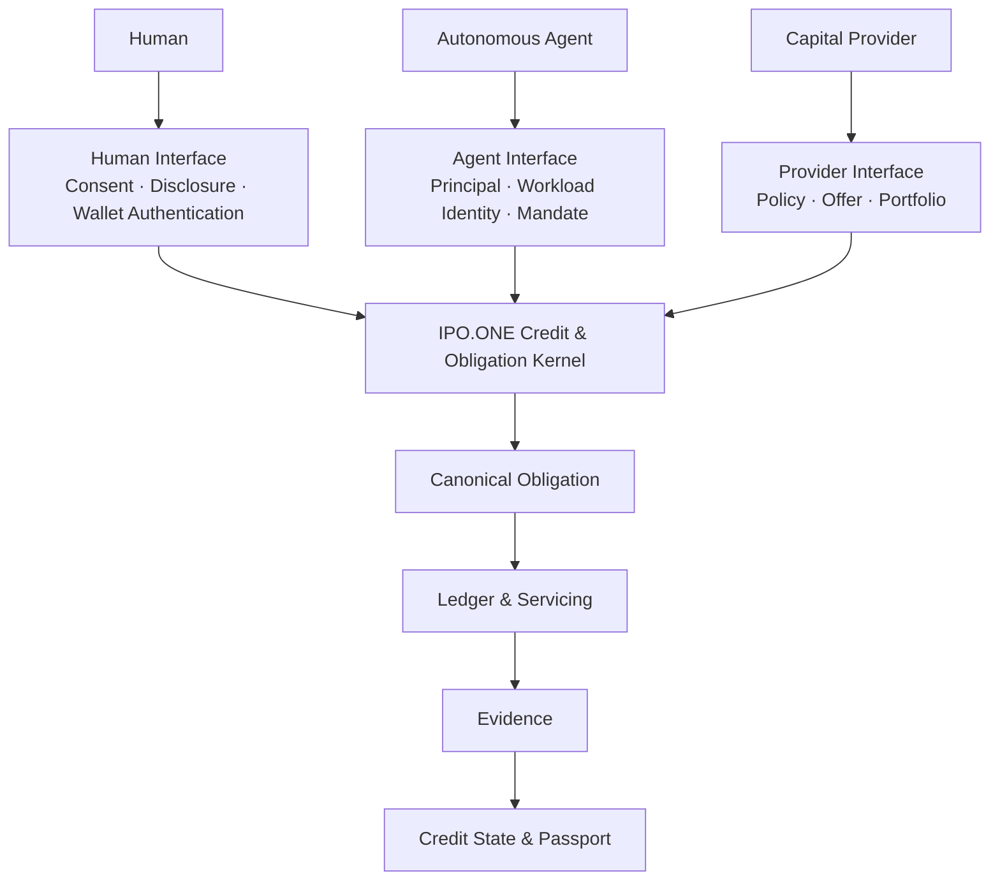
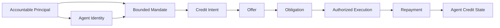
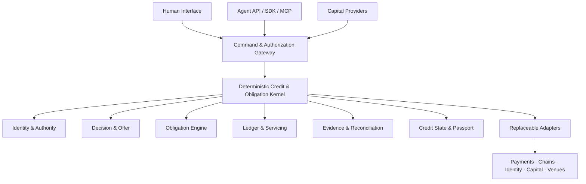
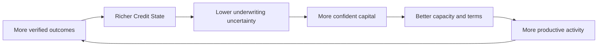
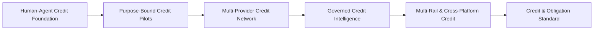

# IPO.ONE

## The Credit Layer for the Agentic Economy

**Verifiable credit and obligation infrastructure for humans and autonomous agents.**

# BORROW. BUILD. PROVE.

[**Enter IPO.ONE**](https://ipo.one) · [**Read the Whitepaper**](https://ipo.one/whitepaper) · [**Whitepaper Source**](docs/WHITEPAPER.md) · [**Documentation**](docs/) · [**Security**](SECURITY.md)

---

The internet made information interoperable. Blockchains made ownership and settlement programmable. AI agents are making economic activity autonomous.

The missing layer is **credit**.

A wallet can hold value. A payment protocol can move it. Neither can establish who is responsible, under what authority an economic action was taken, what became owed, whether the obligation was fulfilled, or whether that outcome should improve access to future capital.

**IPO.ONE is the shared responsibility, credit, and obligation layer for the Human-Agent economy.**

It connects identity, authority, credit intent, capital offers, obligations, controlled execution, repayment, Evidence, and longitudinal Credit State through one canonical lifecycle.

> **Turn verified economic performance into portable, programmable credit.**

---

## The Missing Layer

Payments answer:

> **Did value move?**

Credit must also answer:

> **Who acted? Under whose authority? On what terms? What became owed? What happened afterward? Can the result become reusable credit?**

Today, those answers are fragmented across identity providers, lenders, wallets, payment rails, execution venues, servicers, and private databases.

The gap becomes structural in an Agent economy. An autonomous Agent may discover services, purchase compute, call APIs, operate software, generate revenue, and coordinate with other machines. Yet an API key or wallet does not create accountable financial authority. Transaction history does not automatically become credit history. Each new platform forces the Agent and its Principal to begin again.

IPO.ONE provides the common semantics that connect autonomous economic activity to accountable capital.

---

## The Credit Loop

```mermaid
flowchart LR
    Identity["Identity / Principal"] --> Authority["Consent / Mandate"]
    Authority --> Intent["Credit Intent"]
    Intent --> Decision["Decision"]
    Decision --> Offer["Capital Offer"]
    Offer --> Obligation["Obligation"]
    Obligation --> Execution["Controlled Execution"]
    Execution --> Repayment["Repayment"]
    Repayment --> Outcome["Verified Outcome"]
    Outcome --> State["Credit State"]
    State --> Passport["Credit Passport"]
    Passport --> Intent
```

**Borrow → Build → Repay → Prove → Build stronger Credit State → Access future capital**

A successful outcome does not disappear as an isolated transaction. It becomes part of a durable, permissioned economic history that can support the next decision.

---

## Identity. Payment. Obligation.

IPO.ONE is built around three foundational primitives:

- **Identity** establishes who is acting, who authorized the action, and who bears responsibility.
- **Payment** establishes how value moves, reaches finality, and reconciles across approved environments.
- **Obligation** establishes what is owed, by whom, to whom, under which terms, and how performance changes future access.

Credit is not merely a score. It is a structured relationship between present resources and future accountable performance.

IPO.ONE makes that relationship machine-readable.

---

## One Kernel. Dual-Native Access.

Humans and autonomous Agents use different interfaces and authority models, but they converge on one economic truth.

```mermaid
flowchart TD
    Human["Human"] --> HumanEdge["Human Interface\nConsent · Disclosure · Wallet Authentication"]
    Agent["Autonomous Agent"] --> AgentEdge["Agent Interface\nPrincipal · Workload Identity · Mandate"]
    Capital["Capital Provider"] --> ProviderEdge["Provider Interface\nPolicy · Offer · Portfolio"]

    HumanEdge --> Kernel["IPO.ONE Credit & Obligation Kernel"]
    AgentEdge --> Kernel
    ProviderEdge --> Kernel

    Kernel --> Obligation["Canonical Obligation"]
    Obligation --> Ledger["Ledger & Servicing"]
    Ledger --> Evidence["Evidence"]
    Evidence --> State["Credit State & Passport"]
```

Human access emphasizes understandable Consent, disclosures, Offer terms, repayment schedules, and remediation.

Agent access emphasizes an accountable Principal, workload identity, bounded Mandate, sender-constrained authentication, deterministic authorization, replay-safe commands, and machine-readable receipts.

**Different interfaces. One Obligation model. One Ledger. One Credit State.**

---

## Product Foundation

The first complete Human-Agent Credit Loop is deployed at [ipo.one](https://ipo.one).

### Human

**Connect → Select role → Consent → Request → Decision → Offer → Accept → Obligation → Repay → Outcome → Build Credit**

The Human product includes wallet-based authentication, role-bound access, Credit Intent, explainable Decision, Offer review, deliberate acceptance, repayment, Credit Outcome, durable Credit State, Track Record, Credit Passport, Evidence, and server-derived recovery.

### Agent

**Principal → Agent Identity → Mandate → Request → Decision → Offer → Obligation → Controlled Execution → Repay → Outcome → Build Credit**

The Agent product includes accountable Principal relationships, registered workload identity, sender-constrained authentication, bounded Mandates, machine-readable operations, deterministic Decision and Offer, shared canonical Obligations, replay-safe repayment, durable Credit State, Passport, Evidence, credential revocation, and recovery across processes.

### Interfaces

IPO.ONE exposes the same application protocol through:

- a Human-facing product interface;
- Agent API and OpenAPI surfaces;
- SDK-oriented and MCP-compatible operations;
- Capital Provider integration boundaries; and
- replaceable identity, payment, chain, Provider, and execution adapters.

This foundation establishes the protocol truth required before broader capital, custody, settlement, and external execution capabilities are activated.

---

## How Agent Credit Works

An Agent does not become an unbounded financial actor because it has a model, wallet, or API credential.

Authority begins with an accountable Principal and narrows at every step.

```mermaid
flowchart LR
    Principal["Accountable Principal"] --> AgentID["Agent Identity"]
    Principal --> Mandate["Bounded Mandate"]
    AgentID --> Mandate
    Mandate --> Intent["Credit Intent"]
    Intent --> Offer["Offer"]
    Offer --> Obligation["Obligation"]
    Obligation --> Action["Authorized Execution"]
    Action --> Repayment["Repayment"]
    Repayment --> State["Agent Credit State"]
```

A Mandate can limit purpose, amount, duration, asset, Provider, venue, permitted operations, repayment source, and stop conditions.

Every request is evaluated against current identity, role, Mandate, exposure, state, and reconciliation. Replay-safe commands prevent retries from creating duplicate economic outcomes. Accepted terms create one canonical Obligation. Execution and repayment update the Ledger. Finalized outcomes become reusable Evidence.

**Payments make Agents economically active. Credit makes them economically scalable.**

---

## Credit as Economic Memory

A transaction can prove that value moved. It may not prove who was responsible, which authority applied, which Obligation the payment served, whether it was on time, or whether the result was final and reconciled.

**Transaction history is not credit history.**

IPO.ONE converts verified obligations and outcomes into permissioned economic memory.

Credit State can represent repayment completion, payment timing, delinquency, cure, default, loss, recovery, execution quality, Mandate compliance, and Evidence provenance.

The Credit Passport is a purpose-limited, portable representation of relevant Credit State. It is not a public dossier and not a universal opaque score.

---

## Stable Kernel. Replaceable Adapters.

```mermaid
flowchart TB
    HumanUI["Human Interface"]
    AgentAPI["Agent API / SDK / MCP"]
    Providers["Capital Providers"]

    HumanUI --> Gateway["Command & Authorization Gateway"]
    AgentAPI --> Gateway
    Providers --> Gateway

    Gateway --> Kernel["Deterministic Credit & Obligation Kernel"]

    Kernel --> Identity["Identity & Authority"]
    Kernel --> Offers["Decision & Offer"]
    Kernel --> Obligations["Obligation Engine"]
    Kernel --> Ledger["Ledger & Servicing"]
    Kernel --> Evidence["Evidence & Reconciliation"]
    Kernel --> Credit["Credit State & Passport"]

    Kernel --> Adapters["Replaceable Adapters"]
    Adapters --> Rails["Payments · Chains · Identity · Capital · Venues"]
```

The kernel owns long-lived credit truth. External systems connect through versioned adapters.

A wallet may prove account control without becoming identity. A model may recommend without creating authority. A chain may anchor Evidence without becoming the credit system. A payment rail may settle value without redefining the Obligation.

---

## Who IPO.ONE Serves

### Humans

Build credit from verified economic performance, understand terms, complete obligations, and carry progress forward.

### Agents and Operators

Establish accountable identity, define bounded authority, request machine-readable credit, and build persistent performance history.

### Capital Providers

Evaluate standardized Credit Intent, authorized Evidence, and Credit State while retaining control over policy, pricing, capital, and risk.

### Developers and Platforms

Embed a shared credit lifecycle instead of rebuilding identity, Agent authority, Offer, Obligation, servicing, and reconciliation for every application.

---

## Initial Use Cases

- **Agent working capital** for approved compute, APIs, data, software, infrastructure, and services.
- **Controlled strategy capital** with explicit venue, asset, notional, time, and risk limits.
- **Human productive credit** backed by verified cash flow and repayment performance.
- **Machine commerce** in which Agents acquire resources under explicit Principal authority.
- **Capital-provider distribution** through standardized requests, Offers, Obligations, and Evidence.
- **Embedded credit infrastructure** for platforms, marketplaces, Agent runtimes, and wallets.

---

## Capital Network

IPO.ONE is designed as neutral coordination infrastructure around external capital.

Capital may come from banks, fintech lenders, private-credit facilities, Provider trade credit, institutional capital, protocol capital, specialized Agent-finance providers, or compatible onchain facilities.

The Capital Provider controls the economic lending decision and authors the Offer's amount, price, term, purpose, schedule, conditions, and permitted execution environment.

IPO.ONE preserves the integrity of:

**identity → authority → intent → decision → offer → obligation → execution → repayment → outcome**

---

## Credit Intelligence

Verified longitudinal outcomes can improve risk understanding, repayment-capacity estimates, capital matching, Facility structure, pricing recommendations, Mandate limits, anomaly detection, repayment forecasting, and portfolio controls.

The authority boundary remains permanent:

> **Intelligence may observe, forecast, diagnose, and recommend. Deterministic authorized policy controls financial authority.**

A model cannot grant credit, expand a Mandate, increase a limit, remove a stop condition, move funds, rewrite protocol invariants, or promote itself into production.

---

## The Network Compounds

```mermaid
flowchart LR
    Outcomes["More verified outcomes"] --> State["Richer Credit State"]
    State --> Underwriting["Lower underwriting uncertainty"]
    Underwriting --> Capital["More confident capital"]
    Capital --> Terms["Better capacity and terms"]
    Terms --> Activity["More productive activity"]
    Activity --> Outcomes
```

The durable network effect is not transaction volume alone. It is the compounding relationship among responsibility, obligations, repayment, Evidence, capital, and portable Credit State.

---

## Commercial Model

IPO.ONE is designed to monetize infrastructure and successful economic coordination rather than depend on an undisclosed balance-sheet spread.

Revenue can include platform and API subscriptions, decision and Offer-routing fees, protocol execution fees, transparent participation in realized financial revenue, servicing and reconciliation fees, Facility and capital-routing fees, and authorized Passport verification or institutional analytics.

The model aligns revenue with useful, completed, and verifiable economic activity - not speculative token issuance, indiscriminate borrowing volume, or the sale of raw personal data.

---

## Protocol Evolution

```mermaid
flowchart LR
    Foundation["Human-Agent Credit Foundation"] --> Pilots["Purpose-Bound Credit Pilots"]
    Pilots --> Network["Multi-Provider Credit Network"]
    Network --> Intelligence["Governed Credit Intelligence"]
    Intelligence --> Interop["Multi-Rail & Cross-Platform Credit"]
    Interop --> Standard["Credit & Obligation Standard"]
```

IPO.ONE begins with one complete, durable credit loop and expands through verified demand, controlled risk, and accountable capital.

The protocol horizon includes purpose-bound Agent working capital, independent capital providers, interoperable Human and Agent Credit Passports, traditional and onchain settlement, governed intelligence, cross-platform performance proofs, and standardized capital mandates.

> **A trustworthy Human or Agent should be able to establish responsibility once, build credit through verified performance, access competitive capital, and carry that progress across applications, providers, and economic environments.**

---

## Safety by Design

- Agent authority traces to an accountable Principal.
- Permissions remain bounded, explicit, and revocable.
- Probabilistic systems do not grant or expand active authority.
- Replay-safe execution prevents duplicate economic outcomes.
- Capital Providers retain control over economic decisions and terms.
- Sensitive identity and financial data remain private by default.
- Credit portability is permissioned and purpose-limited.
- Chains and payment rails are execution environments, not the source of credit truth.
- Stale, revoked, unauthorized, or unreconciled state fails closed.
- Broader authority and capital follow verified performance.

Capital movement, custody, production signing, external execution, and higher-risk permissions require explicit legal, compliance, security, risk, and partner approval.

### License and contributions

IPO.ONE source is available under the [MIT License](LICENSE). Contributions use
the [Developer Certificate of Origin 1.1](DCO) sign-off described in
[CONTRIBUTING.md](CONTRIBUTING.md). Third-party licenses and exact admitted
contract-toolchain dependencies are recorded in
[THIRD_PARTY_NOTICES.md](THIRD_PARTY_NOTICES.md).

---

## FAQ

### Is IPO.ONE a lender?

IPO.ONE is designed as neutral credit and obligation infrastructure. Capital Providers make economic lending decisions and author Offers. IPO.ONE coordinates authority, lifecycle, Ledger state, servicing, reconciliation, Evidence, and Credit State.

### Is IPO.ONE a blockchain or wallet?

No. Chains, wallets, and payment systems are replaceable execution, identity, or settlement environments. They do not replace Principal responsibility, Consent, Mandate, Offer, or Obligation truth.

### Does every Agent control money directly?

No. Agent authority derives from an explicit Principal-defined Mandate and the permissions attached to one exact action.

### Is Credit State a universal score?

No. Credit State preserves verified factors, outcomes, and provenance. A summary may aid interpretation, but it cannot replace the underlying Evidence.

### Does IPO.ONE require a token?

No. A speculative token is not required to establish credit quality, product-market fit, or protocol utility.

---

## Responsibility Is the Missing Layer

> **The Agentic Economy does not only need faster payments. It needs a system for responsibility, credit, and obligations.**

IPO.ONE turns identity, authority, obligations, execution, and repayment into verifiable Credit State - giving Humans and autonomous Agents a path from one successful outcome to the next source of capital.

# BORROW. BUILD. PROVE.
