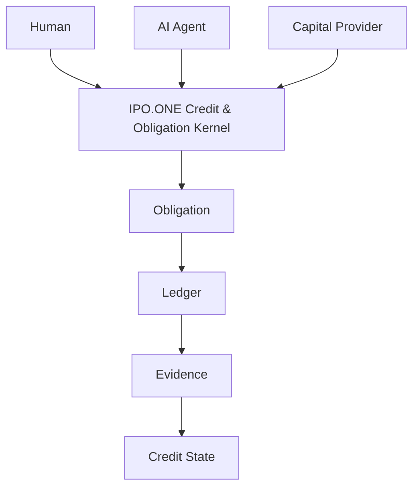
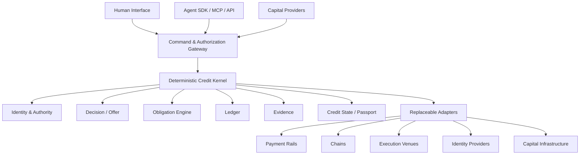
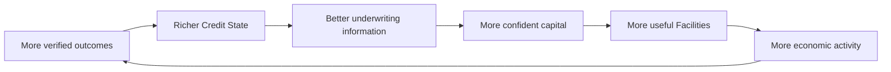

# IPO.ONE

### Verifiable Credit Infrastructure for Humans and Agents

**BORROW. BUILD. PROVE.**

IPO.ONE is a neutral credit and obligation infrastructure layer for the
Human-Agent economy. It provides a common model for identity, authority, credit
intent, capital offers, obligations, controlled execution, repayment, Evidence,
and longitudinal Credit State.

Humans and autonomous Agents enter through different interfaces and authority
models, then converge on one economic truth. A successful outcome does not end
as an isolated transaction: it can become permissioned, portable evidence for
the next decision and the next source of capital.

IPO.ONE is not primarily a lending company, consumer lending app, wallet,
blockchain, trading bot, KYC vendor, custody provider, or universal credit-score
company. It is the coordination and verification layer around responsibility
before, during, and after value moves.

[**Enter IPO.ONE**](https://ipo.one) ·
[**Product Charter**](docs/guidance/IPO_ONE_PRODUCT_CHARTER_v1.1.md) ·
[**Documentation**](docs/) ·
[**Security**](SECURITY.md)

## Why IPO.ONE

Payments answer a narrow but essential question:

> **Did value move?**

Credit requires a durable answer to a longer sequence:

> **Who committed?** 
> **Under whose authority?** 
> **On what terms?** 
> **What became owed?** 
> **What happened afterward?** 
> **Can that outcome become reusable credit?**

Today, those answers are fragmented across identity systems, lenders, wallets,
payment rails, execution venues, servicers, and private databases. The result is
duplicated integration, weak portability, and a transaction history that often
cannot establish who was responsible or whether an obligation was fulfilled.

The gap becomes more important in an Agent economy. An API key or wallet may let
software call a service, but it does not establish accountable financial
authority. An Agent needs a Principal, a bounded and revocable Mandate,
deterministic authorization, replay-safe commands, purpose limits, and a record
of what it owed and how it performed.

IPO.ONE provides the shared obligation semantics that connect these systems
without turning any one external rail into the source of credit truth.

## The Credit Loop

```mermaid
flowchart LR
    Identity["Identity / Principal"] --> Authority["Consent / Mandate"]
    Authority --> Intent["Credit Intent"]
    Intent --> Decision["Decision"]
    Decision --> Offer["Capital Offer"]
    Offer --> Obligation["Obligation"]
    Obligation --> Execution["Execution"]
    Execution --> Repayment["Repayment"]
    Repayment --> Outcome["Credit Outcome"]
    Outcome --> State["Credit State"]
    State --> Passport["Credit Passport"]
    Passport --> Intent
```

The loop is simple to state and difficult to make trustworthy:

**Borrow → Build → Repay → Prove → Build stronger Credit State → Access future
capital**

Each transition must preserve the relevant identity, authority, terms, policy,
timing, and Evidence lineage. Credit State is therefore not a browser profile
or an opaque score. It is a longitudinal view derived from verified economic
outcomes and the provenance needed to interpret them.

## One Kernel, Two Native Entry Modes

```mermaid
flowchart TD
    Human["Human"] --> Kernel["IPO.ONE Credit & Obligation Kernel"]
    Agent["AI Agent"] --> Kernel
    Capital["Capital Provider"] --> Kernel

    Kernel --> Obligation["Obligation"]
    Obligation --> Ledger["Ledger"]
    Ledger --> Evidence["Evidence"]
    Evidence --> CreditState["Credit State"]
```

Human UI and Agent API, SDK, or MCP operations are different interfaces over
the same application protocol. They can use different authentication and
presentation, but neither may fork the Offer, Obligation, Ledger, servicing,
Evidence, or Credit State model.

Human entry emphasizes understandable Consent, disclosures, identity
attestations, Offer terms, schedules, repayment, and remediation. Agent entry
emphasizes an accountable Principal, workload identity, bounded Mandate,
sender-constrained authentication, idempotent commands, and machine-readable
receipts.

**Different interfaces. One Obligation model. One Credit State.**

## How Agent Credit Works

An Agent does not become an unbounded financial actor because it has an API key
or a wallet. Authority begins with an accountable Principal and narrows at each
step.

```mermaid
flowchart LR
    Principal["Principal"]
    AgentID["Agent Identity"]
    Mandate["Bounded Mandate"]
    Request["Credit Intent"]
    Offer["Offer"]
    Obligation["Obligation"]
    Action["Authorized Execution"]
    Evidence["Evidence"]
    Reputation["Credit State"]

    Principal --> AgentID
    Principal --> Mandate
    AgentID --> Mandate
    Mandate --> Request
    Request --> Offer
    Offer --> Obligation
    Obligation --> Action
    Action --> Evidence
    Evidence --> Reputation
```

The authority chain is explicit:

1. **Principal accountability.** A responsible person or organization binds
   the Agent to an accountable economic relationship.
2. **Agent Identity.** A workload identity identifies the software actor; it is
   not itself authority to borrow or spend.
3. **Bounded Mandate.** The Principal grants revocable authority constrained by
   purpose, amount, time, asset, Provider or venue, and permitted operations.
4. **Sender-constrained authentication.** Requests are bound to the approved
   client key rather than relying on a freely replayable bearer secret.
5. **Deterministic authorization.** Current Mandate, role, Tenant, expiry,
   revocation, cap, state, and reconciliation checks decide whether an exact
   command may proceed.
6. **Replay-safe commands.** Idempotency and concurrency controls prevent a
   retry from creating a second economic outcome.
7. **Obligation creation.** Exact accepted terms become one canonical record of
   what is owed and the schedule that governs repayment.
8. **Controlled execution and repayment.** Use of proceeds stays inside the
   accepted purpose and authority; payments update the canonical Ledger.
9. **Verified outcomes.** Completion, timing, delinquency, cure, default, loss,
   and resolution become typed Evidence.
10. **Persistent Credit State.** Authorized future decisions can use relevant
    verified history without silently expanding the Agent's authority.

This separation between identity, responsibility, and exact authority is a
foundational IPO.ONE property.

## Humans and Agents

| Human path | Agent path |
| --- | --- |
| **Connect → Verify → Consent → Request → Offer → Accept → Obligation → Repay → Build Credit** | **Principal → Agent Identity → Mandate → Request → Offer → Obligation → Controlled Execution → Repay → Build Credit** |
| Human-readable disclosure and deliberate consent | Machine-readable scope and Principal-controlled authority |
| Human authentication and identity-attestation references | Workload authentication and sender-constrained requests |
| Visible terms, schedule, repayment, and remediation | Idempotent commands, exact limits, and structured receipts |

Both paths normalize into the same canonical Subject, Offer, Obligation,
Facility, Ledger, servicing, Event, Evidence, and Credit State model. Entry-mode
parity means shared economic truth—not identical interfaces or identical
authority.

## Core Protocol Primitives

| Primitive | Definition |
| --- | --- |
| **Subject** | The Human or Agent whose economic activity and credit history are represented. |
| **Principal** | The accountable party that holds or grants authority for commitments. |
| **Agent Identity** | A verifiable workload identity bound to a Subject and Principal relationship. |
| **Mandate** | A bounded, versioned, revocable grant defining what an Agent may request, accept, or execute. |
| **Consent** | A Human's explicit, scoped authorization for disclosure or lifecycle action. |
| **Verification Attestation** | A privacy-aware reference to verified identity, account control, eligibility, or another external fact. |
| **Credit Intent** | A request for capital stating amount, asset, purpose, duration, and applicable authority. |
| **Decision** | A versioned, explainable assessment produced under deterministic active policy. |
| **Offer** | Capital Provider-authored economic terms, conditions, scope, schedule, and lifecycle status. |
| **Authorization** | Current permission to perform one exact action under current identity, authority, policy, and state. |
| **Facility** | Purpose-bound capacity created from an accepted Offer and its Obligation; never independent lending authority. |
| **Obligation** | The canonical accepted economic commitment: what is owed, by whom, to whom, under which terms. |
| **Ledger** | Append-only double-entry economic truth for execution, payment, allocation, and balance. |
| **Evidence** | A typed, attributable record of a state transition, observation, receipt, provenance, and reconciliation status. |
| **Credit Outcome** | A finalized performance result such as on-time repayment, cure, default, loss, or resolution. |
| **Credit State** | Longitudinal verified economic performance derived from canonical outcomes and Evidence. |
| **Credit Passport** | A permissioned, portable representation of relevant verified factors, outcomes, and provenance. |

These primitives are deliberately composable. A wallet can prove account
control without becoming identity, a Decision can explain risk without creating
authority, and a Credit Passport can inform a lender without becoming a
universal score.

## Capital Providers

IPO.ONE is designed as neutral coordination infrastructure around external
capital. Capital may originate from:

- banks;
- fintech lenders;
- private-credit providers;
- institutional Facilities;
- protocol capital;
- specialized Agent-finance providers; or
- compatible onchain capital sources connected through reviewed adapters.

The Capital Provider controls the economic lending decision. It can review an
authorized underwriting packet, apply its private policy, and author the Offer's
limit, price, term, repayment structure, purpose, per-draw bounds, and
conditions. A borrower or authorized Principal accepts an exact Offer version.

IPO.ONE coordinates the integrity of:

**identity → authority → intent → decision → offer → obligation → execution →
repayment → outcome**

That boundary separates **capital decision** from **protocol truth**. Capital
Providers decide whether and on what terms to lend. IPO.ONE preserves the
permission, version, Ledger, servicing, reconciliation, and Evidence truth of
the resulting lifecycle.

## Architecture

```mermaid
flowchart TB
    HumanUI["Human Interface"]
    AgentSDK["Agent SDK / MCP / API"]
    Providers["Capital Providers"]

    HumanUI --> Gateway["Command & Authorization Gateway"]
    AgentSDK --> Gateway
    Providers --> Gateway

    Gateway --> Kernel["Deterministic Credit Kernel"]

    Kernel --> Identity["Identity & Authority"]
    Kernel --> Offers["Decision / Offer"]
    Kernel --> Obligations["Obligation Engine"]
    Kernel --> Ledger["Ledger"]
    Kernel --> Evidence["Evidence"]
    Kernel --> Credit["Credit State / Passport"]

    Kernel --> Adapters["Replaceable Adapters"]

    Adapters --> Payments["Payment Rails"]
    Adapters --> Chains["Chains"]
    Adapters --> Venues["Execution Venues"]
    Adapters --> IdentityProviders["Identity Providers"]
    Adapters --> CapitalRails["Capital Infrastructure"]
```

The organizing principle is **Stable Kernel + Replaceable Adapters**.

The kernel owns canonical credit semantics: identity relationships, authority,
Offer and Obligation versions, deterministic policy, Ledger state, servicing,
Evidence, reconciliation, and Credit State. Commands enter through an
authenticated, authorized, versioned gateway and are designed to commit state,
Event, Evidence, and outbox work atomically.

External identity services, payment rails, chains, Providers, execution venues,
and capital infrastructure connect behind reviewed adapters. They can evolve
without redefining what an Obligation, payment, delinquency, or verified outcome
means. Chain-aware records can use portable CAIP identifiers while the business
Obligation remains chain-agnostic.

Sensitive Human data, raw KYC/PII, credentials, private keys, raw signatures,
and lender-private policy remain off public and onchain surfaces by default.
Stale, unknown, unauthorized, or unreconciled state fails closed.

## Evidence and Credit State

IPO.ONE is not merely recording transactions.

**Transaction history ≠ credit history**

A transaction can prove that a transfer was submitted or settled. It may not
prove who was responsible, what authority applied, which Obligation the payment
served, how the repayment waterfall was allocated, whether it was on time, or
whether the result was finalized and reconciled.

Credit State can incorporate verified outcomes such as:

- Obligations created and their accepted terms;
- repayment completion and allocation;
- payment timing and maximum days past due;
- delinquency and cure;
- restructure, repurchase, default, write-off, loss, recovery, and resolution;
- authority provenance and revocation state; and
- Evidence lineage, observation time, finality, and reconciliation.

The Credit Passport is a permissioned, portable view of the relevant factors
and outcomes. The Subject controls disclosure scope where applicable, and the
recipient receives verifiable context rather than unrestricted access to raw
history. A summary may aid reading, but it cannot replace the underlying factor
record or act as one universal, opaque number.

## Credit Intelligence

Verified longitudinal outcomes can support a more useful intelligence layer.
Over time, that layer can improve:

- risk understanding;
- capital matching;
- Facility and repayment-structure recommendations;
- pricing recommendations;
- Mandate and purpose-limit recommendations;
- anomaly detection; and
- repayment forecasting.

The authority boundary remains firm:

> **Intelligence may recommend. Deterministic authorized policy controls
> financial authority.**

A learning model can operate as a versioned shadow challenger and be evaluated
against point-in-time outcomes. It cannot approve credit, change active policy,
expand authority, increase a limit, remove a stop condition, or promote itself.

## Example Use Cases

### Agent Working Capital

An autonomous commercial Agent requests temporary capital to complete a bounded
task. Its Principal-defined Mandate limits purpose, amount, Provider, duration,
and permitted execution. Repayment and task outcomes become reusable Evidence.

### Trading / Strategy Capital

An approved Agent can use a purpose-bound Facility with explicit venue, asset,
notional, time, and risk limits. This profile can connect through execution
adapters while reusing the same Offer, Obligation, Ledger, repayment, Evidence,
and Credit State kernel.

### Human Credit Portability

A Human builds verified performance history across completed Obligations and
can disclose relevant outcomes to compatible providers without exposing an
unbounded raw dossier.

### Machine Commerce

Agents request resources or capital under explicit Principal authority,
complete work through controlled operations, and generate machine-verifiable
repayment history.

### Capital Provider Distribution

A lender can evaluate standardized Credit Intent, authorized Evidence, and
Credit State instead of building a bespoke identity, Agent, servicing, and
receipt integration for every channel.

## Why the Network Can Compound

```mermaid
flowchart LR
    Outcomes["More verified outcomes"] --> State["Richer Credit State"]
    State --> Underwriting["Better underwriting information"]
    Underwriting --> Capital["More confident capital"]
    Capital --> Facilities["More useful Facilities"]
    Facilities --> Activity["More economic activity"]
    Activity --> Outcomes
```

Every reconciled repayment or adverse outcome can improve the information
available for a future authorized decision. More useful information can reduce
integration and uncertainty for capital, which can create more appropriate
Facilities and more verified outcomes.

The network compounds through normalized responsibility and performance—not
through fake traction, public scoring, or token speculation.

## Design Principles

- **Human-Agent dual native.** Different entry modes share one economic kernel.
- **Principal accountability.** Agent authority traces to a responsible party.
- **Bounded authority.** Purpose, amount, time, asset, Provider, venue, and
  operation limits remain explicit and revocable.
- **Deterministic financial permissions.** Probabilistic systems do not grant or
  expand active authority.
- **Portable verified outcomes.** Relevant performance can travel with its
  provenance and permission boundary.
- **External capital neutrality.** Capital Providers own economic Offers;
  IPO.ONE coordinates lifecycle integrity.
- **Privacy-aware Evidence.** Prove the necessary fact without publishing raw
  sensitive data.
- **Chain and rail agnosticism.** Canonical credit truth does not belong to one
  settlement network.
- **Replaceable adapters.** External integrations evolve behind stable protocol
  semantics.
- **Fail-closed authorization.** Stale, ambiguous, unauthorized, revoked, or
  unreconciled state cannot create new risk.
- **Evidence before expansion.** New authority follows durable, reviewable
  outcomes rather than promises.

## FAQ

### Is IPO.ONE a lender?

IPO.ONE is designed as neutral credit and obligation infrastructure. Capital
Providers make the economic lending decision and author Offers; IPO.ONE
coordinates authority, lifecycle, Ledger, servicing, reconciliation, Evidence,
and Credit State.

### Is IPO.ONE a blockchain?

No. IPO.ONE is a credit and obligation layer that can use multiple settlement
or Evidence rails. Chains are replaceable adapters, not the canonical product
definition.

### Is IPO.ONE a wallet?

No. A wallet may prove account control or submit an authorized operation, but it
does not replace identity, Principal responsibility, Consent, Mandate, Offer, or
Obligation truth.

### Does every Agent control its own money?

No. Agent authority derives from an explicit Principal-defined Mandate and the
current permissions attached to an exact action. Possessing an API key, model,
or wallet does not create open-ended borrowing, withdrawal, or transfer power.

### What is an Obligation?

An Obligation is the canonical accepted economic commitment: who owes what, to
whom, under which exact terms, schedule, authority, and servicing rules.

### What is Credit State?

Credit State is the longitudinal, verified economic performance derived from
canonical outcomes such as repayment, timing, delinquency, cure, default, loss,
and resolution, together with their Evidence provenance.

### What is a Credit Passport?

A Credit Passport is a permissioned, portable representation of relevant
verified factors, outcomes, and Evidence. It is not a public dossier or a
universal opaque score.

### How is IPO.ONE different from a payment protocol?

Payments establish movement of value. IPO.ONE models responsibility and
authority before payment, the accepted Obligation around it, and the verified
outcome afterward.

### How is IPO.ONE different from a credit score?

IPO.ONE focuses on verifiable underlying state, factors, outcomes, and
provenance rather than reducing a Human or Agent to one universal number.

### Can Humans and Agents use the same system?

Yes. They have different entry, authentication, and authorization models, then
normalize into the same Offer, Obligation, Ledger, servicing, Evidence, and
Credit State kernel.

## Ecosystem and Interfaces

IPO.ONE is designed to expose one protocol through role-appropriate interfaces:

- **Human interface** for identity, Consent, credit request, Offer review,
  repayment, remediation, Evidence, and Credit Passport;
- **Agent API** for versioned, authenticated, idempotent operations and stable
  structured errors;
- **SDK** for typed integration with the same application protocol;
- **MCP** for discoverable Agent tools constrained by the same Mandate and
  authorization checks;
- **Capital Provider integration** for authorized underwriting packets,
  bilateral Offers, portfolio state, and Evidence;
- **payment adapters** for execution, receipt, settlement, and repayment rails;
- **identity adapters** for privacy-aware verification and attestations;
- **chain adapters** for portable account, finality, indexing, and anchoring
  boundaries; and
- **execution venue adapters** for purpose-bound operations and reconciliation.

Not every compatible adapter or broader-market capability is active by default.
Availability and authority are separate: integrations must remain explicit,
versioned, permissioned, and truthfully discoverable.

## Responsibility Is the Missing Layer

> The Agent economy does not only need faster payments. It needs a system for
> responsibility.

IPO.ONE turns identity, authority, obligations, execution, and repayment into
verifiable Credit State—giving Humans and Agents a path from one successful
outcome to the next source of capital.

**BORROW. BUILD. PROVE.**
