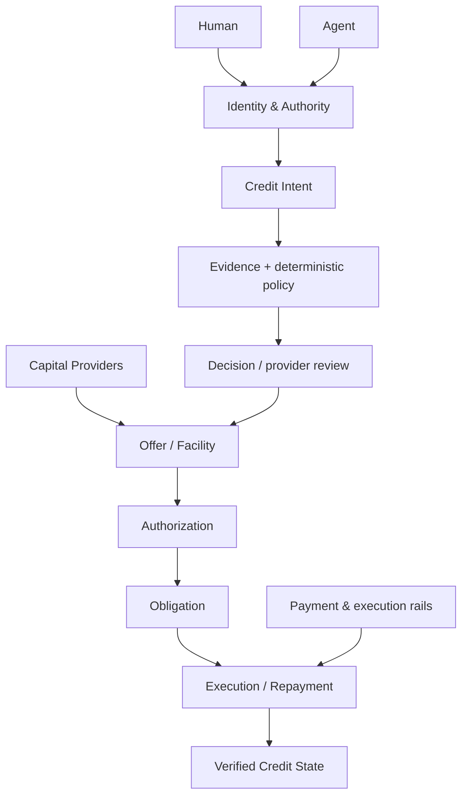

# IPO.ONE

### The Native Credit & Obligation Protocol for the Human-Agent Economy

**BORROW. BUILD. PROVE.**

The next economy will be operated by people and autonomous software. Agents can
already transact, but they have no standard way to carry responsibility,
authority, obligations, and repayment history across runtimes. Many people also
create valuable economic evidence that never becomes portable credit. IPO.ONE
is building one canonical system in which Humans and Agents can request capital
under bounded authority, meet obligations, and turn verified outcomes into
reusable Credit State.

[**Live Product**](https://ipo.one) ·
[**Whitepaper**](docs/guidance/IPO_ONE_PRODUCT_CHARTER_v1.1.md) ·
[**Documentation**](docs/) ·
[**Security**](SECURITY.md)

## The problem

Payment networks can show that value moved. Credit requires a longer and more
demanding record: who may commit, under whose authority, for what purpose, on
which terms, what is now owed, and what actually happened next.

For many Humans, economic activity is fragmented across platforms, so useful
performance history is neither portable nor easy to verify. Agents face the
same structural gap in a newer form. They can execute tasks and payments, but
generally lack persistent Credit State, explicit Principal responsibility,
bounded borrowing authority, standardized Obligations, and reusable repayment
history.

The problem is not merely payment. It is a shared system of responsibility:

> **Who can commit? Under whose authority? For what purpose? What is owed? What
> happened? Can that performance become credit?**

## Single kernel. Dual entry.

Human-native and Agent-native experiences enter separately, then normalize into
one canonical lifecycle. The interfaces differ; the economic truth does not.


```mermaid
flowchart TD
  Human["Human"] --> Authority["Identity & Authority"]
  Agent["Agent"] --> Authority
  Authority --> Intent["Credit Intent"]
  Intent --> Review["Evidence + deterministic policy"]
  Review --> Decision["Decision / provider review"]
  Capital["Capital Providers"] --> Offer["Offer / Facility"]
  Decision --> Offer
  Offer --> Authorization["Authorization"]
  Authorization --> Obligation["Obligation"]
  Obligation --> Execution["Execution / Repayment"]
  Rails["Payment & execution rails"] --> Execution
  Execution --> State["Verified Credit State"]
```

Capital generally comes from external lenders, Providers, and Facilities.
IPO.ONE coordinates identity, authority, Evidence, credit state, capital
routing, Obligations, execution, and settlement. It is not primarily a
consumer lender, trading bot, wallet, KYC provider, balance-sheet lender,
blockchain, token protocol, or custody platform.

## What IPO.ONE does

IPO.ONE organizes credit around nine connected planes:

1. **Identity & Authority** binds a Subject to an accountable Principal,
   Consent or Mandate, and the exact scope in which a commitment may be made.
2. **Credit Account & Passport** carries permissioned factors and outcomes,
   including active and completed Obligations, repayment, delinquency, cure,
   and Evidence provenance. It is not a universal score.
3. **Decisions & Offers** combine deterministic, explainable policy with
   Capital Partner judgment. The Capital Partner owns the economic Offer.
4. **Obligation Kernel** turns exact accepted terms into one versioned
   Obligation, Facility, repayment schedule, and servicing state machine.
5. **Execution & Repayment** constrains permitted use, records economic events,
   applies the repayment waterfall, and updates the canonical Ledger.
6. **Evidence** makes each important transition typed, attributable,
   replayable, and reconcilable without publishing sensitive source data.
7. **Capital & Provider Routing** connects qualified Intent to bilateral
   Offers and purpose-bound Facilities without making IPO.ONE the default
   balance-sheet lender.
8. **Replaceable Rails** isolate wallets, payment Providers, chains, Venues,
   identity services, and attestations behind versioned adapters.
9. **Credit Intelligence Network** is the long-term learning layer: verified
   outcomes can improve recommendations and risk understanding over time.
   Intelligence may recommend and learn; only approved deterministic policy
   can control financial authority.

Trading Capital follows the same model as a purpose-bound Facility profile. It
does not create a second Ledger, risk system, or source of credit truth.

## Humans and Agents

| Human entry | Agent entry |
| --- | --- |
| Connect → Verify and Consent → Request → Receive Offer → Accept → Use Capital → Repay → Build Credit | Principal → Agent Identity → AccountBinding → Mandate → Request → Offer → Controlled Execution → Repay → Build Credit |

Human entry emphasizes understandable disclosures, Consent, identity
references, terms, schedules, and remediation. Agent entry emphasizes an
accountable Principal, machine identity, CAIP-10 account proof, bounded Mandate,
idempotent commands, and queryable receipts.

**Different edges. One Obligation system. One Credit State model.**

## Capital Providers

IPO.ONE is designed to coordinate external capital rather than lend primarily
from its own balance sheet. Banks, fintechs, private-credit firms,
institutional Facilities, protocol or Provider capital, and eventually
compatible onchain Facilities can compete to finance qualified Obligations.

The borrower creates a Credit Intent. Authorized identity, authority, and
performance Evidence inform deterministic policy and provider review. The
Capital Partner sets the limit, price, term, repayment structure, permitted
purpose, and conditions in a versioned Offer. Exact acceptance creates a
bounded Obligation and Facility; execution, repayment, delinquency, and
resolution become portable Evidence.

Capital Partners own bilateral credit decisions. IPO.ONE owns permission
integrity, versioning, Ledger and servicing state, reconciliation, and Evidence
of those decisions.

## Protocol primitives

| Primitive | Purpose |
| --- | --- |
| **Subject** | The Human or Agent whose economic activity is represented. |
| **Principal** | The accountable party responsible for authority and commitments. |
| **Mandate** | A bounded, revocable grant controlling what an Agent may request or execute. |
| **VerificationAttestation** | A privacy-preserving reference to identity, account, or eligibility evidence. |
| **CreditIntent** | A request describing amount, asset, purpose, duration, and authority. |
| **CreditProfile / Passport** | A permissioned view of verified factors, Obligations, and outcomes. |
| **Offer** | Capital Partner-authored economic terms with an exact version and lifecycle. |
| **Authorization** | Current permission to accept or perform a specific bounded action. |
| **Obligation** | The canonical record of what is owed, under which terms, and to whom. |
| **Ledger** | Append-only, double-entry economic truth for execution and repayment. |
| **Evidence / CreditState** | Verifiable transition records and the longitudinal result they support. |

## Architecture

IPO.ONE separates a stable protocol kernel from replaceable adapters.

The canonical path is **Tenant Protocol → TenantCommandGateway → deterministic
Human/Agent kernel → PostgreSQL truth**. Human UI and Agent MCP/API/SDK are
co-equal interfaces over that path. Commands are versioned, authorized,
idempotent, and committed with Ledger, Event, Evidence, and reconciliation
state.

Wallets, identity verification, Capital Providers, payment rails, chains,
Venues, and attestation systems connect through adapters. External systems can
change without changing what a Subject, Offer, Obligation, repayment, default,
or Evidence record means. Chain-aware identifiers use CAIP boundaries while
business Obligations remain chain-agnostic.

Sensitive Human data, raw KYC/PII, credentials, private keys, raw signatures,
and lender-private policy stay off public and onchain surfaces by default.
Stale, unknown, unauthorized, or unreconciled state fails closed.

## What is live today

> [!IMPORTANT]
> **Current release — M1-B: Hosted No-Real-Funds Product**
>
> Public origin: [https://ipo.one](https://ipo.one)
>
> Hosted product release: `74ac425dad33bf667ee2550e33e36220dcfed402`

The current hosted artifact provides:

- a wallet/SIWE Human entry and a guided synthetic credit lifecycle;
- a Principal-controlled Agent lifecycle with local MCP and SDK integration;
- bilateral Capital Partner Offer creation and exact Offer acceptance;
- one shared Human/Agent Obligation, repayment, servicing, Ledger, and Evidence
  model;
- durable PostgreSQL canonical state with server-derived workspace recovery;
- controlled, non-withdrawable sandbox execution and synthetic repayment;
- a public Agent API contract and a queryable deployment capability document;
  and
- Base Sepolia and X Layer Testnet adapter profiles for test and portability
  work, with no mainnet or capital commitment.

The hosted product is deliberately zero-funded and uses synthetic or redacted
data only. Its [live capability document](https://ipo.one/.well-known/ipo-one.json)
reports real-value activation disabled.

| Enabled in M1-B | Locked |
| --- | --- |
| Hosted Human product, Agent protocol surfaces, Capital Partner workflow, PostgreSQL durability, synthetic execution, repayment, Ledger, Evidence | Real funds, mainnet, production signer, custody, arbitrary withdrawal, external Provider execution, Venue writes, protocol fees, and real Human lending |

`Production-hosted` describes the availability of this no-funds artifact. It
does not mean real-value production is approved. Activation still requires
separate legal, capital, custody, Provider, signer, risk, security, privacy,
operations, and transaction-specific review. See the
[M1-B release record](docs/releases/M1_B_RELEASE.md) for exact release and
rollback identity.

## Why IPO.ONE can matter

Verified economic outcomes can become reusable Credit State. As more Humans,
Agents, Capital Providers, execution rails, and repayment histories
participate, IPO.ONE can build a progressively richer network of portable,
verifiable credit information.

The durable advantage is not token speculation. It is the normalized history
of responsibility, authority, terms, execution, repayment, delinquency,
resolution, and reconciliation; the integrations that let capital and
Providers act on that history; Agent-native distribution; and one protocol
that works for Humans and Agents across multiple rails.

Over time, a governed Credit Intelligence layer can learn from point-in-time
outcomes and improve recommendations. Active authority remains deterministic,
explainable, versioned, capped, and subject to human-controlled promotion.

## Design principles

- **Dual-native by design.** Humans and Agents are first-class entry modes over
  one economic kernel.
- **External capital, neutral coordination.** Capital Providers decide whether
  to lend; IPO.ONE preserves the integrity of the resulting lifecycle.
- **Continuous intelligence, bounded authority.** Learning can inform policy
  but cannot silently grant credit or expand permissions.
- **Rail-agnostic.** Payment, chain, Venue, and identity integrations remain
  replaceable without forking canonical credit semantics.
- **Portable progress.** Good repayment and operating outcomes should not
  disappear when a Human changes platform or an Agent changes runtime.
- **Evidence before expansion.** Each new authority or market follows durable,
  reconciled, independently reviewable proof.

## Developers: start here

The full local product runs with synthetic data and no real value. The reviewed
multi-container path currently requires Apple Silicon macOS, Lima 2.2+, Node.js
26.5.0, and pnpm 11.1.3.

```sh
pnpm install --frozen-lockfile
pnpm run check
pnpm run local:auth:init -- --wallet 0xYOUR_BASE_SEPOLIA_WALLET
pnpm run local:up
```

Open the [Human Borrower workspace](http://127.0.0.1:8787/#request-credit) or
the [Principal / Agent Authority workspace](http://127.0.0.1:8788/#request-credit).
For the machine-facing path, create the Agent in the Principal workspace, prove
its account, activate the exact Mandate, and start the local stdio adapter:

```sh
pnpm run local:agent:prove -- <repository-local-challenge.json>
pnpm run local:agent -- ./agent-handoff.json
```

The [local pilot guide](deploy/local/README.md) covers setup, role workspaces,
restart recovery, and safety boundaries. None of these commands creates funds
authority or a public endpoint.

## Current interfaces

| Interface | Entry point |
| --- | --- |
| Human product | [ipo.one](https://ipo.one) |
| Agent API | [Hosted OpenAPI](https://ipo.one/agent-openapi.json) |
| Agent MCP | [Local MCP adapter](apps/agent-mcp/) |
| SDK | [JavaScript SDK](packages/sdk/) |
| Tenant protocol | [Versioned operation catalog](api/tenant-protocol/ipo-one.tenant-protocol.v1.json) |
| Schemas | [Portable data contracts](schemas/v2/) |
| Security | [Security policy and reporting](SECURITY.md) |
| Whitepaper | [Product Charter v1.1](docs/guidance/IPO_ONE_PRODUCT_CHARTER_v1.1.md) |

## Roadmap

**Foundation → Real Participant Pilot → Live Testnet Agent Credit → Controlled
Real Value → Multi-Capital / Multi-Rail Network → Human-Agent Credit Protocol**

M1-B establishes the hosted no-funds foundation. Every later stage is a target,
not a deployed capability. Closed-pilot participation, live testnet execution,
controlled real value, new capital sources, and new rails each retain their own
permission, security, risk, legal, and Evidence gates.

## Borrow. Build. Prove.

Credit should not reset whenever a person changes platform, an Agent changes
runtime, or capital moves to another rail.

Verified performance should travel.

**IPO.ONE**
