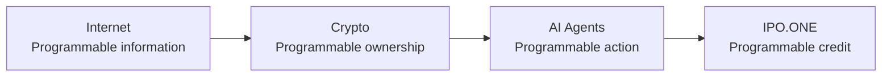
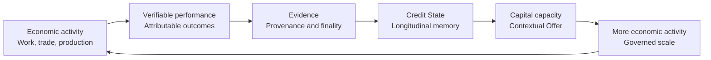
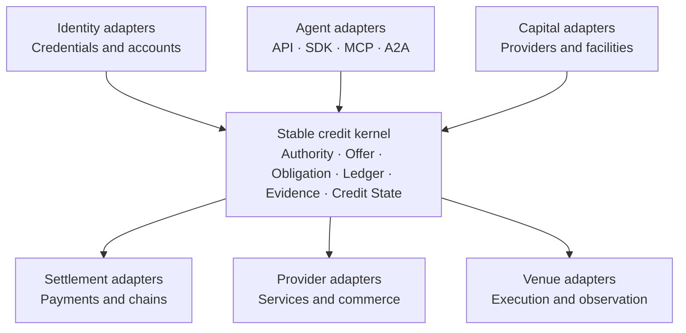
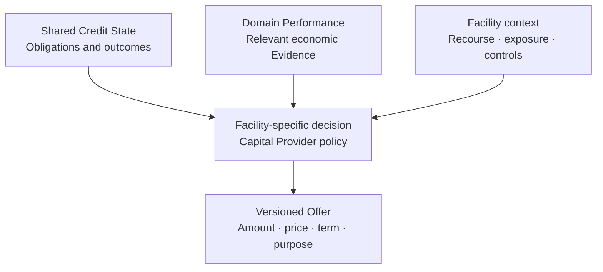
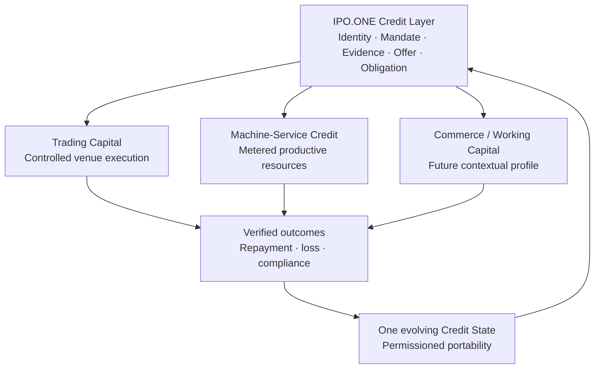

# IPO.ONE

## The Credit Layer for the Agentic Economy

### Turn verified Agent performance into capital.

# BORROW. BUILD. PROVE.

**Perform. Prove. Build Credit. Access Capital. Scale.**

**Founding Edition III · September 2026**

---

## Document Status

This whitepaper defines the founding economic thesis, protocol architecture, commercial logic, safety boundaries and long-term direction of IPO.ONE. It is a strategic protocol document, not a claim that every described capability is active.

The document uses three status lenses:

| Lens | Meaning in this edition |
| --- | --- |
| **Current Foundation** | Capabilities supported by current repository authority and verified runtime or deployment Evidence as of September 3, 2026. |
| **Product Evolution** | Approved or intended work whose activation still depends on named product, risk, legal, operational, deployment or counterparty gates. |
| **Protocol Horizon** | Long-term applications of the architecture. These are directions, not current products or commitments. |

At publication inspection, the public product is an authenticated, durable, **no-real-funds** Beta. Its verified Human and Principal journeys operate through one obligation kernel. Separate bounded Base Sepolia and Hyperliquid Testnet exercises established specific test-asset and reconciliation Evidence; they are not production real-value finance. Product Constitution v1.6 also authorizes one exact synthetic metered machine-service profile for the public no-funds Beta, but the repository did not yet contain completed hosted acceptance Evidence for that profile when this edition was prepared.

No current status in this document authorizes mainnet lending, real-value capital, custody, unrestricted transfer or withdrawal, external Provider execution, production venue signing, automatic model authority, public real-value liquidity or Human cash lending. The canonical [Product Constitution](https://github.com/CPTM511/IPO.ONE/blob/main/docs/PRODUCT_CONSTITUTION.md) resolves runtime product truth.

This document is not an offer of credit, securities, tokens or investment products. It is not legal, regulatory, tax or investment advice. Any actual credit or capital relationship requires applicable agreements, qualified counterparties, approvals and jurisdiction-specific review.

---

## Foundational Proposition

The Internet made information programmable.

Crypto made ownership and settlement programmable.

AI Agents are making economic action programmable.

The next missing primitive is **programmable credit**.

Autonomous economic actors can already purchase services, allocate resources, trade, operate software and produce economically useful work. Yet most still depend on pre-funded balances, the balance sheet of a Principal, or an allowance that disappears at the edge of one platform. Capability is increasing faster than accountable access to capital.

> **A trustworthy economic actor should be able to earn greater access to capital through verifiable performance.**

IPO.ONE is designed to make that process machine-readable, portable, governable and interoperable:

> **Economic Activity → Verifiable Performance → Evidence → Credit State → Underwriting → Capital Access → New Economic Activity**

In operating language:

> **Perform. Prove. Build Credit. Access Capital. Scale.**

Capital is the resource an economic actor gains access to. Credit is why that access can be rationally extended. A bank, lender, fund, Provider, pool or prime broker can supply capital. IPO.ONE's differentiated role is to connect responsibility, authority, Evidence, Obligations and economic outcomes so that trustworthy performance can become credit capacity.

> **Payments let Agents spend what they have. Credit lets Agents operate beyond what they have.**

---

## Abstract

IPO.ONE is the Credit Layer for the Agentic Economy: subject-neutral credit and obligation infrastructure with an Agent-first market narrative.

The protocol starts from a distinction. Payment records movement of value. Credit records responsibility across time. A complete credit relationship must identify who acted, who authorized the action, who remains accountable, why resources were extended, which terms were accepted, what became owed, how the Obligation performed and what the outcome should mean for future access.

IPO.ONE represents that relationship through one shared kernel. Human and Agent interfaces normalize into the same Subjects, Principals, Consent or Mandates, Credit Intents, Decisions, Offers, Facilities, Obligations, Ledger entries, servicing states, Events, Evidence, reconciliation and Credit State. The **Obligation** is the atomic economic commitment. The **Ledger** is canonical accounting truth. **Evidence** establishes what occurred and with what provenance. **Credit State** preserves longitudinal credit performance.

This edition adds an explicit semantic layer: **Domain Performance Evidence**. An Agent may possess attributable economic history before it has ever borrowed through IPO.ONE. Trading performance, machine-service unit economics, commerce operations or service revenue may be relevant to a future capital decision if the Evidence is trustworthy, permitted and appropriate to that Facility. Domain Performance does not become a second score or a second source of truth. It remains typed Evidence interpreted in context.

Credit can be portable. Underwriting remains contextual. Strong performance in one domain may improve confidence, but it does not automatically justify capital in another. Capital Providers retain the economic lending decision. Models may observe, forecast and recommend; approved deterministic policy authorizes, and the kernel executes.

Trading Capital and Metered Machine-Service Credit demonstrate how materially different activities can reuse one protocol. Neither defines IPO.ONE. The long-term system is **one kernel, many Facility profiles, one evolving Credit State**.

---

## Executive Summary

### The category

IPO.ONE is **The Credit Layer for the Agentic Economy**. It is not a wallet, payment rail, exchange, identity provider, reputation score or universal lender.

### The value proposition

> **Turn verified economic performance into credit — and credit into capital capacity.**

For the Agent-first frontier:

> **Turn verified Agent performance into capital.**

### The protocol

IPO.ONE connects one canonical lifecycle:

> **Subject → Principal / Authority → Evidence → Credit Intent → Decision → Capital Offer → Obligation → Controlled Execution → Repayment / Resolution → Credit State → Future Capital Access**

Human and Agent modes differ at the edge. They do not fork the Obligation, Ledger, Evidence, servicing or credit truth.

### The architecture

The architecture is **Stable Kernel + Replaceable Adapters + Extensible Facility Profiles**. Adapters can connect identity, Agent protocols, wallets, payment systems, chains, capital sources, Providers and venues. They may transport, observe, verify, reconcile or execute within authority. They cannot create credit authority, rewrite accepted terms, expand exposure or redefine an Obligation.

### The market discipline

The protocol ceiling is broad; commercial execution must remain narrow. Early validation should focus on environments where performance is observable, attribution is reliable, authority is bounded, capital need is material and repayment or economic resolution can be verified.

### The permanent boundary

> **Intelligence may observe, learn, forecast, diagnose and recommend. Approved deterministic policy authorizes. The kernel executes.**

---

# Part I — The Agentic Economic Transition

## 1. From Programmable Information to Programmable Credit

The digital economy has advanced through successive primitives.

The Internet separated information from physical distribution. Open protocols made publishing, messaging and computation interoperable across networks.

Crypto and blockchains made digital ownership, signatures and settlement programmable across shared ledgers.

AI Agents are separating economic action from continuous human operation. Software can interpret goals, discover services, call tools, coordinate with other systems, allocate resources and produce outcomes.

Each transition exposes the next missing layer. Autonomous action without accountable credit remains limited by whatever balance has already been deposited.



Credit does not merely add another payment method. It allows a responsible actor to use present resources against an accountable commitment to future performance. That creates productive capacity, but also risk. Authority, terms, exposure, repayment, default, correction and loss must become explicit.

The Agentic Economy does not only need faster payments. It needs a system for responsibility, credit and obligations.

## 2. Why Payment Is Not Credit

A payment system answers operational questions:

- Did value move?
- Through which rail?
- When was it observed?
- Was technical finality reached?

A credit system must answer additional economic questions:

- Who acted, and under whose authority?
- Who is accountable?
- Why was capital extended?
- What terms were accepted?
- What became owed?
- Was the Obligation fulfilled, cured, restructured, written off or otherwise resolved?
- What should the outcome mean for future capital access?

The same transfer can be an advance, a purchase, a principal repayment, a fee, a refund, collateral movement, a reversal or an unrelated payment. A transaction hash alone does not identify which economic fact occurred.

> **Payment records movement of value. Credit records responsibility across time.**

A wallet can hold money. A payment protocol can move money. Identity can prove a credential or account relationship. Reputation can expose signals. An execution venue can perform an action. None of these alone creates a canonical credit relationship.

IPO.ONE does not replace these systems. It gives their observations economic meaning inside an accepted Obligation.

## 3. Economic Memory: Performance Becomes Credit

An economically productive Agent should not have to begin from zero in every new environment.

Repeated performance can create economic memory. Economic memory can strengthen underwriting confidence. Under an approved Capital Provider policy, stronger confidence may support greater capacity, better terms or access to a more appropriate Facility. It never creates automatic entitlement to capital.



Performance matters on both sides of the first Obligation.

Before credit, relevant external Domain Performance may inform an initial decision. After credit, utilization, repayment, Mandate compliance, delinquency, cure, loss and recovery strengthen the protocol's own longitudinal Credit State.

Economic performance does not automatically become credit. Evidence must be attributable, trustworthy, relevant, sufficiently complete, permitted for the decision and evaluated under current risk policy.

## 4. Why Economic Agents Need Capital Beyond Pre-Funded Balances

Pre-funding is safe but restrictive. It forces every activity to remain inside existing cash, even when the actor has a strong, verifiable record and a productive use for additional resources.

An Agent may face a timing gap between cost and outcome:

- inference or compute is consumed before customer revenue arrives;
- inventory is purchased before commerce settles;
- a receivable is earned before it is paid;
- an approved trading strategy needs bounded capital before it can produce a new result;
- advertising or software is purchased before the associated revenue cycle closes; or
- a service Agent performs contracted work before settlement.

Credit can bridge that timing gap. The economic case is strongest when the use of proceeds is constrained, the activity is observable, authority is narrow, outcomes are measurable and repayment or resolution can be reconciled.

This does not mean every Agent should receive credit. It means qualified economic actors should have a standardized way to prove why capital can be extended responsibly.

---

# Part II — The IPO.ONE Credit Protocol

## 5. Identity + Payment + Obligation

IPO.ONE retains the foundational public primitive:

> **Identity + Payment + Obligation**

Credit Intent is the request envelope. Mandate or Consent constrains authority. Evidence explains what actually happened.

| Primitive | Question | Protocol role |
| --- | --- | --- |
| **Identity** | Who is acting? Who authorized the action? Who bears responsibility? | Resolve Subject, Principal, account, role and permitted attestations. |
| **Payment / Settlement** | How does value move, reach technical finality and reconcile? | Normalize rail-specific instructions and authenticated receipts. |
| **Obligation** | What is owed, by whom, to whom and under which terms? | Preserve the accepted commitment, exposure, schedule, servicing and resolution. |
| **Evidence** | What actually happened, how do we know and how reliable is the provenance? | Bind observations, Events, receipts, finality, corrections and reconciliation. |

Identity without an Obligation is authentication, not credit. Payment without an Obligation is settlement, not credit history. An Obligation without reliable Evidence cannot become trustworthy portable credit.

## 6. Obligation as the Atomic Unit of Credit

The atomic unit of a payment system is usually a transfer. The atomic unit of IPO.ONE credit is an **Obligation**.

An Obligation records the economic commitment created from exact acceptance of an Offer. It may include:

- Subject and responsible Principal;
- Capital Provider and accepted Offer version;
- amount, asset, price, fees and total cost;
- purpose and permitted use;
- duration, schedule and repayment source;
- servicing and allocation rules;
- authority and applicable policy;
- execution and settlement boundaries;
- current state and exposure;
- Evidence lineage, correction and reconciliation; and
- cure, restructuring, default, recovery, write-off or other resolution.

An Obligation is not a transaction hash, agreement hash, payment or score. It is the canonical protocol representation of the commitment across time.

Applicable legal rights remain governed by counterparties, agreements and law. Software does not supersede those instruments. The protocol requirement is that participating systems refer to one economic commitment instead of inventing contradictory truths.

## 7. Single Kernel, Dual-Native Access

IPO.ONE is subject-neutral at the kernel and Agent-first in its category narrative.

Human and Agent are native Subjects. They use different identity, authority, disclosure and interaction profiles, yet converge on one economic lifecycle.

| Dimension | Agent-native edge | Human-native edge | Shared kernel |
| --- | --- | --- | --- |
| Identity | Workload identity, account binding, Principal relationship | Human authentication, role, identity attestations | Subject and Principal |
| Authority | Bounded, revocable Mandate | Consent, deliberate acceptance, legal capacity | Deterministic authorization |
| Interface | API, SDK, MCP-compatible and A2A-compatible adapters | Product UI and partner workflow | Versioned commands and resources |
| Disclosure | Machine-readable terms, constraints, receipts and errors | Understandable terms, cost, schedule and remedies | Offer and Obligation |
| Outcome | Queryable Events and Evidence | Visible records and explanations | Ledger, servicing, Credit State |

Agent-first does not mean Agent-only. Humans remain Principals, Operators, owners, guarantors where applicable, Capital Providers, counterparties, beneficiaries and native borrowers where law and product policy permit.

## 8. Stable Kernel + Replaceable Adapters

The deterministic kernel owns long-lived credit truth. Adapters connect systems that will change faster than the economic ontology.



The kernel owns:

- Subject and Principal relationships;
- Consent and Mandates;
- policy versions and authorization;
- Decisions, Offers, Facilities and Obligations;
- double-entry Ledger and servicing state;
- Events, Evidence, finality and reconciliation; and
- Credit State and permissioned Passport disclosures.

Adapters may transport, verify, observe, reconcile or execute exact authorized operations. They must not independently create credit authority, broaden a Mandate, change accepted terms, expand exposure, declare settlement final or rewrite Credit State.

This boundary prevents a payment rail, wallet vendor, Provider, blockchain or venue from becoming the protocol itself.

## 9. The Credit Lifecycle

One shared lifecycle converts intent into an accountable outcome:

1. Establish the Subject and responsible Principal.
2. Establish Consent or a bounded Mandate.
3. Admit relevant, authorized Evidence.
4. Submit Credit Intent with amount, purpose, asset, duration and repayment source.
5. Evaluate under deterministic policy and Capital Provider requirements.
6. Author a versioned Offer.
7. Accept the exact Offer and create one Obligation and Facility.
8. Execute or utilize only within current authority.
9. Service, account, repay or resolve.
10. Finalize and reconcile Evidence.
11. Update Credit State for future permitted decisions.

No stage silently grants the next. A Decision is not an Offer. An Offer is not accepted authority. A Facility does not permit use outside its Mandate. External execution acknowledgement is not Ledger settlement. Credit State may inform a new Offer; it cannot silently increase a limit.

---

# Part III — Performance, Credit and Capital

## 10. Evidence and Domain Performance

Evidence is the protocol's provenance-aware record of what happened. It can bind source identity, observation time, ingest time, payload or record hash, policy version, finality, reconciliation, correction and revocation state.

**Domain Performance Evidence** is Evidence about how a Subject or Agent has performed in a particular economic context. It is a semantic classification inside the existing Evidence architecture, not a parallel canonical object.

| Domain | Potentially relevant Evidence | Context that remains necessary |
| --- | --- | --- |
| Trading / capital deployment | Realized P&L, risk-adjusted return, drawdown, volatility, leverage, liquidation history, execution quality, track-record duration, strategy consistency, Mandate compliance | Venue, account attribution, market regime, liquidity, capacity, fees, finality and reconciliation |
| Machine services / digital production | Metered usage, productive output, revenue where observable, resource efficiency, Provider concentration, operating consistency, repayment | Resource class, unit, price schedule, Provider provenance, output attribution and repayment source |
| Commerce / procurement | Revenue, GMV, margin, inventory turnover, fulfillment, refunds, disputes, cash conversion, settlement reliability | Merchant identity, returns policy, seasonality, channel concentration and lawful data use |
| Service Agents / autonomous businesses | Completed economic tasks, contracted revenue, receivables, retention, margins, settlement and operating consistency | Contract attribution, counterparty quality, delivery acceptance and collection risk |

Other future domains may include advertising, logistics, robotics, asset operations, digital labor, procurement or machine-to-machine commerce. These examples show protocol range; they do not constitute a launch roadmap.

The governing principle is narrow:

> If an economic actor repeatedly creates measurable outcomes, those outcomes may become Evidence. If that Evidence is trustworthy, attributable, relevant and permitted for underwriting, it may contribute to credit.

## 11. Credit State and Credit Passport

**Credit State** is longitudinal economic trust and credit performance. It can include prior Obligations, utilization, repayment, delinquency, cure, restructuring, default, recovery, Mandate compliance, capital utilization, Evidence provenance and prior economic outcomes.

**Domain Performance** is contextual performance in a specific activity. It may inform Credit State and underwriting, but it should not erase distinctions between domains.

The **Credit Passport** is a permissioned, purpose-limited representation of relevant verified Credit State. It is not:

- a public dossier;
- a universal public score;
- raw identity, transaction or strategy history;
- an identity document; or
- a permanent ranking system.

A disclosure should reveal only what a specific authorized verifier needs. Different Capital Providers may request different factors and apply different policies. The underlying Evidence and context matter more than one display number.

## 12. Facility-Specific Underwriting

Credit may travel; underwriting remains contextual.

A conceptual capital decision can be expressed as:

> **Capital Decision = f(Credit State, Relevant Domain Performance, Principal / Recourse, Facility Structure, Existing Exposure, Risk, Mandate, Controls, Evidence Confidence)**

This is a conceptual framework, not one current production formula.



A strong Hyperliquid trading record does not automatically prove commerce, procurement, advertising or GPU-resale competence. Good performance in one domain may improve general trust or Evidence confidence, but it does not justify equivalent capacity everywhere.

One shared Credit State avoids fragmentation. Facility-specific interpretation avoids false universality.

## 13. Progressive Credit

Capital access should be earned through verified outcomes, not granted through narrative.

A progressive path may begin with low exposure, narrow purpose, short duration and strong controls. Successful repayment and policy-compliant performance create new Evidence. A Capital Provider may then choose to extend greater capacity, different pricing or a longer term through a new disclosed Offer.

Progression is conditional. It depends on:

- current repayment and servicing state;
- relevant Domain Performance;
- Evidence quality and freshness;
- existing exposure and concentration;
- Facility structure and loss allocation;
- Principal support or recourse where applicable;
- current policy and Capital Provider appetite; and
- absence of stale, unknown or unreconciled state.

No model, UI, wallet balance or prior success can silently raise a limit. Broader authority requires a new exact decision and acceptance.

## 14. Capital Providers, Offers and Facilities

Capital Providers retain control of the actual economic capital decision. They may include banks, fintech lenders, private credit, institutional capital, Provider credit, specialized Agent finance or compatible approved onchain facilities.

A Capital Provider may author:

- amount and asset;
- price and fees;
- term and schedule;
- purpose and permitted environment;
- conditions, covenants and Evidence requirements;
- recourse, collateral or first-loss structure; and
- risk appetite and portfolio limits.

IPO.ONE coordinates permission integrity, versioning, acceptance, Obligations, Ledger, servicing, Evidence and reconciliation. It need not become the universal balance-sheet lender.

An **Offer** communicates exact proposed economics. Exact acceptance creates an **Obligation**. A **Facility** is the governed application profile through which the accepted capital relationship can be used. These objects are related but not interchangeable.

## 15. Credit Intelligence and Deterministic Authority

Verified outcomes can improve risk understanding, Evidence confidence, affordability estimates, Facility structure, limit and pricing recommendations, anomaly detection, repayment forecasting, portfolio controls and capital routing.

That learning belongs to a governed intelligence plane.

Models may:

- observe and classify Evidence;
- estimate or forecast;
- diagnose anomalies and drift;
- recommend terms or interventions; and
- operate as versioned shadow challengers.

Models may not independently:

- grant credit authority;
- expand a Mandate or exposure;
- increase a limit or remove controls;
- move funds;
- rewrite accepted terms or protocol invariants; or
- promote themselves into active authority.

The active policy is deterministic, versioned and explainable. Every material decision should retain inputs, Evidence lineage, policy version, reason codes and binding constraints.

---

# Part IV — Applications of the Credit Layer

## 16. Facility Profiles

A Facility Profile applies the shared credit infrastructure to a particular capital relationship. Profiles may vary by purpose, Evidence, Provider, repayment source, recourse, collateral, loss allocation, execution environment, controls, price, tenor and permitted operations.

They should not duplicate the kernel.



The architecture is general because the economic ontology is durable. Commercial activation remains narrow because each Facility introduces distinct risk, legal, operational and Evidence requirements.

## 17. Reference Use Case: Trading Capital

Trading is a useful reference domain because performance, risk and execution can often be observed continuously. It is not the definition of IPO.ONE.


Where current repository Evidence supports it, Hyperliquid is a concrete Testnet execution and Evidence environment. It is a venue, adapter domain and Evidence source. It is not the credit protocol, the capital source or canonical settlement truth.

Different structures must remain distinct:

1. **Credit Facility.** Capital is advanced under an accountable repayment Obligation.
2. **Structured or first-loss leveraged Facility.** Principal or Agent capital absorbs defined first loss while external capital expands scale under explicit rules.
3. **Managed, prop or profit-sharing capital.** If the Capital Provider bears downside without a repayment obligation and receives participation instead, the arrangement may be capital allocation rather than debt.

Not every allocation of capital is credit. A credit relationship requires an accountable Obligation.

The reference flywheel is tangible: better verified performance can increase underwriting confidence; a Provider may offer greater or better-priced capacity; additional governed scale creates new performance Evidence.

## 18. Reference Use Case: Metered Machine-Service Credit

Agents and autonomous businesses consume productive resources such as inference, compute, APIs, data, storage, software and other machine services. A timing gap can arise when the service is consumed before the resulting revenue arrives.


This profile reuses the same Subject, Principal, Mandate, Offer, Facility, Obligation, Ledger, Evidence, servicing and reconciliation kernel.

The current Constitution permits one exact synthetic profile: one Provider, one resource class, one unit and one accepted price schedule in the no-funds environment. A caller-supplied invoice, task completion, HTTP success or self-reported usage cannot create utilization. External Provider execution, production pricing, real funds and additional resource profiles remain separately gated.

Metered machine services demonstrate that a non-trading activity can use the same credit language. They do not define IPO.ONE.

## 19. The Open-Ended Application Space

IPO.ONE does not need to predict every future use of Agent capital. An activity becomes a plausible credit application when it has:

1. an identifiable economic Subject;
2. an accountable Principal or authority structure;
3. economically meaningful activity;
4. observable or attestable performance;
5. a definable capital need;
6. measurable risk;
7. a governable or enforceable Obligation; and
8. observable repayment or economic resolution.

Possible future profiles include commerce inventory, procurement, advertising, autonomous business operating capital, Agent-to-Agent trade credit, contracted service work, receivables, asset operations, logistics and physical Agents or robotics.

These are Protocol Horizon examples. They are not claims of current deployment, regulation, availability or commercial commitment.

> **IPO.ONE does not finance one specific kind of Agent activity. IPO.ONE defines how trustworthy economic performance can become financeable.**

## 20. Human Access Within the Shared Kernel

Human functionality remains native, but it no longer needs to share equal narrative weight in every section.

A Human may be:

- a Principal granting and revoking an Agent Mandate;
- an Operator or responsible owner;
- a Capital Provider or authorized reviewer;
- a guarantor, beneficiary or counterparty where applicable; or
- a borrower under a separately permitted Human credit product.

The Human interface should make identity, Consent, terms, total cost, schedule, actions, Evidence and remediation understandable without exposing internal IDs as the normal workflow. The Agent interface should provide the equivalent authorized operation through a versioned machine contract.

Legal capacity, consumer protection, identity assurance and disclosure may differ materially between Human and Agent profiles. Those differences belong in policy and adapters, not in a second Obligation system.

---

# Part V — Settlement, Safety and Governance

## 21. Multi-Rail Settlement

An Obligation may be funded or repaid through bank rails, card or wallet infrastructure, blockchain settlement, Provider offsets, controlled venue accounts or combinations of these systems.

IPO.ONE separates economic truth from rail implementation:

- a rail instruction expresses what should move;
- an external receipt shows what a system reports;
- finality establishes whether the effect is sufficiently settled for that rail;
- reconciliation connects the external effect to the canonical Ledger and Obligation; and
- legal discharge remains governed by applicable agreement and law.

Blockchain inclusion is not automatically finality. Venue HTTP success is not automatically execution certainty. Processor acknowledgement is not automatically irreversible settlement. Unknown outcomes block new risk until reconciled.

Multi-chain identifiers and adapters use chain-agnostic Obligation identity and CAIP-style chain/account references so one chain never becomes the protocol boundary.

## 22. Servicing, Reconciliation and Evidence

Credit remains a process after capital is extended. Servicing tracks schedule, utilization, payment allocation, DPD, delinquency, cure, restructuring, repurchase, default, recovery, write-off, correction and closure under applicable policy.

The Ledger is append-only and double-entry. Events explain business transitions. Evidence binds claims to provenance. These records are related but not interchangeable.

Reconciliation is a first-class protocol operation. It compares external observations, canonical domain objects, Ledger entries, Events, Evidence and projections. A discrepancy cannot be hidden by overwriting history. Repair is additive, reason-coded, authorized and reviewable.

Chain claims distinguish digest, transaction, observation, finality and reconciliation. Historical or synthetic artifacts never become a current user's chain record merely because they exist in a repository.

## 23. Identity, Privacy and Mandate Boundaries

Identity establishes which Subject, account or workload is present. It does not establish open-ended financial authority.

For an Agent, the accountable Principal and current Mandate define what may be requested, accepted, used or executed. Effective permission is always the intersection of live identity, role, Mandate, accepted Offer and Facility, policy, caps, target, purpose, asset, current exposure and reconciliation state.

Mandates are exact, versioned, revocable and rechecked at action time. Stale, unknown, revoked, ambiguous or unreconciled authority fails closed.

Sensitive data is minimized:

- raw KYC and PII remain offchain by default;
- private keys, credentials and raw signatures do not enter public Evidence;
- lender-private policy and sensitive behavioral data remain access controlled;
- public proofs favor hashes, attestations and minimum necessary claims; and
- Passport disclosure is purpose-limited and recipient-scoped.

Portability does not require publicity.

## 24. Risk, Model and Capital Authority

Financial authority is deliberately separated.

| Authority | Responsible party or system | Cannot do by implication |
| --- | --- | --- |
| Economic Offer | Authorized Capital Provider | Cannot bypass Subject acceptance or current policy |
| Principal authority | Accountable Principal through Consent or Mandate | Cannot override portfolio, Tenant or legal constraints |
| Risk authorization | Approved deterministic policy and named human controls | Cannot be replaced by a model recommendation |
| Execution | Exact authorized adapter operation | Cannot become custody, withdrawal or Ledger authority |
| Accounting and servicing | Canonical kernel and Ledger | Cannot accept caller-authored settlement totals |
| Evidence and reconciliation | Typed append-only records and approved correction | Cannot rewrite history or infer success from ambiguity |

Protective controls include caps, pause, freeze, reduce-only behavior, stop-loss posture, dual control, idempotency, replay resistance and unknown-outcome containment. Exact numerical production policies remain separate decisions.

No probabilistic model has financial sovereignty. No execution signer becomes capital controller. No Capital Provider integration becomes the shared protocol truth.

---

# Part VI — Economics and Network Evolution

## 25. Business Model

IPO.ONE does not require an undisclosed balance-sheet spread. Potential commercial models include:

- platform or operating subscriptions;
- API and decision infrastructure;
- Offer routing and Capital Provider integrations;
- Facility administration;
- execution, servicing and reconciliation fees;
- Passport verification and authorized analytics; and
- transparent participation in realized financial revenue where separately approved.

Revenue should follow delivered infrastructure value and valid economic activity. Gross flow, deposits, unrealized P&L or synthetic test volume are not automatically revenue.

This edition makes no claim of active revenue, profitability, capital volume, users or commercial partnerships.

## 26. Network Effects and Moat

The durable advantage, if successfully built, is not source code. It is a compounding system of:

- longitudinal Credit State;
- verified Domain Performance;
- repayment, delinquency, default, recovery and loss history;
- Capital Provider policies and Facility outcomes;
- Provider and venue integrations;
- servicing and reconciliation quality;
- underwriting feedback and calibration;
- permissioned portability;
- distribution; and
- proven capital performance.

More high-quality outcomes can improve Evidence interpretation. Better interpretation can improve Facility structure and capital matching. Better matches can produce more useful outcomes. This loop becomes defensible only when the history is real, attributable and responsibly governed.

> **Synthetic history proves architecture. Real economic history creates the moat.**

## 27. Commercial Entry: Broad Protocol, Narrow Execution

The protocol should remain capable of supporting economic activities that do not yet exist. The company should not activate them all at once.

Early commercial validation should concentrate on a small number of environments where:

- performance is observable and attributable;
- capital need is economically meaningful;
- authority and use of proceeds can be bounded;
- risk can be modeled and monitored;
- repayment or economic resolution can be verified; and
- counterparties, law and operations can be defined.

Trading Capital and Metered Machine-Service Credit are valuable reference profiles because they test materially different activity against one kernel. The strategic objective is not to launch many Facilities. It is to demonstrate that one shared credit architecture can turn different forms of verified performance into governed capital access.

> **Broad protocol ceiling. Narrow commercial execution.**

## 28. Evidence-Gated Roadmap

Product evolution follows Evidence, not narrative scope.

| Stage | Objective | Evidence gate |
| --- | --- | --- |
| **Current Foundation** | Public authenticated no-funds Human and Principal journeys; shared obligation, Ledger, Evidence and Credit State; bounded Testnet proofs | Deployed SHA, durable recovery, visible journeys, exact safety state and reconciled records |
| **Controlled profile validation** | Complete no-funds metered resource and Trading Capital product paths; preserve exact Provider and venue bounds | Co-equal Human/Agent interfaces, replay and negative tests, hosted/runtime Evidence, no P0/P1 defects |
| **Narrow real-value preparation** | One Capital Provider, one Facility, one asset, one Provider or venue, named loss bearer and operating owners | Legal, capital, custody, pricing, risk, privacy, servicing, recovery and go/no-go decision package |
| **Governed network evolution** | Additional Providers, capital sources and qualified Facility profiles | Repeat performance, reconciled loss and recovery data, partner renewal, concentration control and safe portability |
| **Protocol Horizon** | Cross-platform credit language for Humans, Agents, organizations and machines | Independent adoption, durable governance, high-quality Evidence and sustained participant benefit |

Current Foundation, Product Evolution and Protocol Horizon remain distinct. A design is not implementation. A merge is not deployment. Testnet Evidence is not production. Hosting is not real-value activation.

## 29. Strategic Non-Goals

IPO.ONE is not presented as:

- a generic lending application or global consumer cash-loan product;
- a KYC company, wallet or payment protocol;
- a universal opaque Agent score;
- an exchange or trading venue;
- a generic public vault, market factory or unrestricted liquidity layer;
- an unrestricted Agent wallet;
- a token-dependent economy or DAO-first protocol;
- an autonomous black-box lender;
- a chain-, asset-, Provider- or venue-specific product; or
- a system that maximizes originations without accountability and repayment quality.

No economic actor receives credit merely for being autonomous. Credit remains conditional on Evidence, accountability, valid authority, risk and Capital Provider policy.

---

# Conclusion

The Agentic Economy is gaining the ability to act, but action alone does not create financeability.

Payments can move existing value. Identity can establish who is present. Reputation can expose signals. Venues can execute activity. Capital Providers can supply resources. The missing shared layer is the one that connects responsibility across time: why capital was extended, what became owed, how the Obligation performed and what the verified outcome should mean next.

IPO.ONE is building that layer.

Its atomic commitment is the Obligation. Its memory is Evidence and Credit State. Its architecture is one stable kernel connected to replaceable adapters and applied through contextual Facility profiles. Its authority remains deterministic and governed. Its market narrative is Agent-first; its protocol remains subject-neutral.

Trading, machine services, commerce and future economic domains are applications. None defines the protocol.

The long-term thesis is simple:

> **Economic Performance → Evidence → Credit → Capital → Economic Scale**

And the operating loop is durable:

# PERFORM. PROVE. BUILD CREDIT. ACCESS CAPITAL. SCALE.

**BORROW. BUILD. PROVE.**

---

# Appendix A — Canonical Objects

| Object | Durable meaning |
| --- | --- |
| **Subject** | Human, Agent, organization or machine whose economic relationship is represented. |
| **Principal** | Accountable Human or organization that bears or grants relevant authority. |
| **Consent / Mandate** | Versioned and revocable authority for exact actions and purposes. |
| **Evidence** | Typed, provenance-aware record of an observation, event, outcome, finality or correction. |
| **Credit Intent** | Request envelope for amount, asset, purpose, duration, repayment source and constraints. |
| **Decision** | Explainable evaluation under an exact Evidence and policy snapshot; not itself capital authority. |
| **Offer** | Capital Provider-authored proposed economics, conditions and permitted environment. |
| **Facility** | Purpose-bound profile through which an accepted capital relationship may operate. |
| **Obligation** | Canonical accepted economic commitment and servicing state. |
| **Ledger** | Append-only, asset-scoped double-entry accounting truth. |
| **Event** | Typed statement that a protocol transition occurred. |
| **Credit Outcome** | Terminal or material performance result of an Obligation. |
| **Credit State** | Longitudinal factor and outcome history available to permitted future decisions. |
| **Credit Passport** | Purpose-limited disclosure of relevant verified Credit State. |

---

# Appendix B — Facility Model

A Facility Profile should declare at least:

- eligible Subject and Principal relationships;
- Capital Provider and economic structure;
- purpose and permitted operations;
- accepted asset, amount, price, fees, term and schedule;
- repayment source and servicing path;
- Domain Performance and other Evidence requirements;
- recourse, collateral, first-loss and loss allocation where applicable;
- Mandate, Provider, venue, target and execution limits;
- settlement, finality and reconciliation policy;
- risk states, pause and recovery conditions; and
- privacy, disclosure and jurisdiction boundaries.

Every profile reuses the same Offer, Obligation, Ledger, Event, Evidence, servicing, reconciliation and Credit State unless a future governance decision explicitly changes the protocol.

---

# Appendix C — Conceptual Underwriting Framework

The conceptual relationship is:

```text
Capital Decision = f(
  longitudinal Credit State,
  relevant Domain Performance,
  Principal and recourse,
  Facility structure,
  existing exposure and concentration,
  risk and controls,
  current Mandate,
  Evidence confidence,
  Capital Provider policy
)
```

This framework communicates dependencies. It is not a currently authorized universal formula, score, factor weight or production policy.

A valid decision should make visible:

- which Evidence snapshot was used;
- which domain factors were relevant;
- what was missing, stale or excluded;
- policy and Capital Provider versions;
- binding constraints and reason codes; and
- whether the result is an observation, recommendation, denial or eligible Offer path.

---

# Appendix D — Evidence Taxonomy

| Evidence class | Examples | Required discipline |
| --- | --- | --- |
| Identity and authority | Subject binding, Principal relationship, Consent, Mandate, account control | Least privilege, expiry, revocation, purpose and privacy |
| Domain Performance | Trading outcomes, metered usage economics, commerce operations, service revenue | Attribution, relevance, provenance, completeness and permitted use |
| Credit performance | Utilization, repayment, DPD, cure, default, recovery, write-off | Canonical Obligation and Ledger linkage |
| Execution | Provider delivery, venue order/fill, controlled transfer, service usage | Exact intent, external identity, unknown-outcome handling |
| Settlement and finality | Bank confirmation, processor receipt, chain observation, venue reconciliation | Rail-specific finality and no premature discharge claim |
| Policy and decision | Input snapshot, rule version, factors, reason codes, constraints | Deterministic reproducibility and non-authorizing model boundary |
| Correction and dispute | Supersession, reversal, authorized repair, case outcome | Preserve original record; append rather than rewrite |

---

# Appendix E — Interoperability Surfaces

IPO.ONE can integrate adjacent systems without depending on one vendor or protocol:

- Human product interfaces and partner workflows;
- versioned HTTP APIs and SDKs;
- [Model Context Protocol](https://modelcontextprotocol.io/) tools and resources;
- [Agent2Agent Protocol](https://a2a-protocol.org/latest/) adapters;
- workload identity and sender-constrained authentication;
- W3C Verifiable Credentials and account-control proofs;
- CAIP-2 chain and CAIP-10 account identifiers;
- bank, card, wallet and HTTP-native payment adapters;
- blockchain indexers and finality adapters;
- Capital Provider, Provider and execution-venue adapters; and
- permissioned Evidence and Passport verification.

Interoperability standards provide transport, identity or settlement precedents. They do not create IPO.ONE credit authority or imply partnership or endorsement.

---

# Appendix F — Glossary

| Term | Definition |
| --- | --- |
| **Subject** | Economic actor represented by the protocol. |
| **Principal** | Accountable party that bears responsibility or grants authority. |
| **Mandate** | Exact, versioned and revocable authority delegated to an Agent. |
| **Evidence** | Provenance-aware record of what occurred and how it was established. |
| **Domain Performance** | Context-specific economic performance represented through Evidence. |
| **Credit State** | Longitudinal credit and economic-outcome history. |
| **Credit Passport** | Permissioned, purpose-limited disclosure of relevant Credit State. |
| **Capital Provider** | Party that controls the economic decision to offer capital. |
| **Offer** | Versioned proposal of amount, price, term, purpose and conditions. |
| **Facility** | Governed profile through which accepted capital may be used. |
| **Obligation** | Canonical economic commitment created by exact acceptance. |
| **Ledger** | Append-only double-entry accounting source of truth. |
| **Reconciliation** | Deterministic comparison of external effects and canonical records. |
| **Finality** | Rail-specific state at which an external effect is sufficiently settled under accepted policy. |
| **Agentic Economy** | Economy in which autonomous software increasingly performs economically meaningful actions under accountable authority. |

---

# Appendix G — Selected References

[1] IPO.ONE. [Product Constitution v1.6](https://github.com/CPTM511/IPO.ONE/blob/main/docs/PRODUCT_CONSTITUTION.md), [Product Charter v1.1](https://github.com/CPTM511/IPO.ONE/blob/main/docs/guidance/IPO_ONE_PRODUCT_CHARTER_v1.1.md) and accepted architecture decisions in the canonical repository. 2026.

[2] World Wide Web Consortium. [Verifiable Credentials Data Model v2.0](https://www.w3.org/TR/vc-data-model-2.0/). W3C Recommendation, 2025.

[3] Internet Engineering Task Force. [RFC 9449: OAuth 2.0 Demonstrating Proof of Possession](https://www.rfc-editor.org/rfc/rfc9449). 2023.

[4] Ethereum Improvement Proposals. [EIP-4361: Sign-In with Ethereum](https://eips.ethereum.org/EIPS/eip-4361).

[5] Chain Agnostic Standards Alliance. [CAIP-2 Blockchain ID Specification](https://chainagnostic.org/CAIPs/caip-2) and [CAIP-10 Account ID Specification](https://chainagnostic.org/CAIPs/caip-10).

[6] Model Context Protocol. [Specification 2026-07-28](https://modelcontextprotocol.io/specification/2026-07-28). 2026.

[7] Agent2Agent Protocol. [Official Specification](https://a2a-protocol.org/latest/specification). Linux Foundation project.

[8] x402 Foundation. [x402 v2 Specification](https://github.com/coinbase/x402/tree/main/specs). Payment interoperability reference.

[9] Hyperliquid. [API Documentation](https://hyperliquid.gitbook.io/hyperliquid-docs/for-developers/api). Execution-venue reference.

[10] National Institute of Standards and Technology. [Artificial Intelligence Risk Management Framework](https://www.nist.gov/itl/ai-risk-management-framework). Model-governance reference.

[11] Financial Action Task Force. [Guidance on Digital Identity](https://www.fatf-gafi.org/en/publications/Financialinclusionandnpoissues/Digital-identity-guidance.html). 2020.

[12] These standards and systems are cited as primary interoperability, identity, safety or execution references. Citation does not imply partnership, endorsement or exclusive dependency.
