# IPO.ONE

## The Credit Layer for the Agentic Economy

### Verifiable Credit and Obligation Infrastructure for Humans and Autonomous Agents

# BORROW. BUILD. PROVE.

**Turn verified economic performance into portable, programmable credit.**

**Founding Edition II · August 2026**

---

## Document Status

This whitepaper defines the founding thesis, protocol architecture, commercial logic, safety boundaries, and long-term direction of IPO.ONE.

It distinguishes three categories:

- **Current Foundation** describes capabilities represented by the deployed IPO.ONE product baseline and its canonical public repository as of August 20, 2026.
- **Product Evolution** describes staged capabilities intended for controlled pilots and subsequent product releases.
- **Protocol Horizon** describes the long-term infrastructure role IPO.ONE is designed to serve. It is not a claim that every component is currently active.

This document is not an offer of credit, securities, tokens, or investment products. It is not legal, regulatory, tax, or investment advice. Credit, capital movement, custody, settlement, and regulated activity require product-specific agreements, qualified counterparties, applicable approvals, and jurisdictional review.

---

## Foundational Proposition

> **The Agentic Economy does not only need faster payments. It needs a system for responsibility, credit, and obligations.**

The internet made information interoperable. Blockchains made ownership and settlement programmable. Artificial intelligence is making economic activity autonomous.

The next missing layer is credit.

A wallet can hold value. A payment protocol can move it. An Agent protocol can discover tools or coordinate work. None of these systems, by themselves, establishes the complete economic truth required for credit:

- who acted;
- who authorized the action;
- who bears responsibility;
- what capital was requested and for what purpose;
- which terms were accepted;
- what became owed;
- how execution and repayment occurred;
- whether the result was final and reconciled; and
- whether that outcome should improve access to future capital.

IPO.ONE is designed to provide that missing layer.

It connects **Identity, Payment, and Obligation** through one deterministic credit lifecycle. Humans and autonomous Agents enter through different interfaces and authority models, but they converge on one canonical economic truth. Verified outcomes become permissioned economic memory. That memory can support the next decision, the next application, and the next source of capital.

---

## Abstract

IPO.ONE is verifiable credit and obligation infrastructure for an economy shared by humans and autonomous Agents.

The protocol begins from a simple observation: payment is not credit. Payment records movement of value. Credit requires a durable representation of responsibility across time. It must establish who may commit, under whose authority, on what terms, what became owed, what happened afterward, and how the outcome affects future access.

This requirement becomes more urgent as software Agents become economic actors. Agents can already discover services, call tools, purchase digital resources, operate strategies, create work product, and coordinate with other machines. Yet most remain economically dependent on pre-funded balances, operator-controlled accounts, or isolated platform allowances. They can transact, but they cannot carry responsibility, obligations, and repayment history across environments in a standardized form.

Humans face a parallel problem. Account ownership and digital activity have expanded globally, but financial resilience and portable credit remain uneven. The World Bank's Global Findex 2025 reports that 79% of adults globally have a financial account, while access to emergency funds remains materially lower, particularly in low- and middle-income economies. A large population produces legitimate cash-flow and repayment evidence that still fails to become reusable credit history.[1]

IPO.ONE addresses both problems through **Single Kernel, Dual-Native Access**. Human applications and Agent-native interfaces - including APIs, SDKs, MCP-compatible tools, and other machine protocols - normalize into the same Subjects, Principals, Consent or Mandates, Credit Intents, Decisions, Offers, Authorizations, Obligations, Ledger events, Credit Outcomes, Evidence, and Credit States.

The protocol's central primitive is the **Obligation**: the canonical accepted economic commitment that records who owes what, to whom, under which terms, schedule, authority, and servicing rules. An Obligation is independent of any one wallet, payment network, blockchain, Agent runtime, or capital provider. Replaceable adapters connect those external systems without allowing them to redefine canonical credit truth.

IPO.ONE converts verified performance into **Credit State** - a longitudinal, provenance-aware representation of economic outcomes. A permissioned **Credit Passport** enables relevant performance to travel across approved applications and providers without turning raw identity or transaction data into a public dossier. Over time, a governed **Credit Intelligence Network** can improve risk understanding, capital matching, terms, intervention, and portfolio controls. Models may observe, forecast, diagnose, and recommend. Only approved deterministic policy may authorize financial state changes.

The current IPO.ONE foundation implements a complete Human-Agent Credit Loop: identity and responsibility, Consent or Mandate, Credit Intent, explainable Decision and Offer, canonical Obligation, controlled execution, repayment, terminal Credit Outcome, durable Credit State, Track Record, Passport, and Evidence. Product evolution proceeds from this foundation toward purpose-bound Agent working capital, independent capital providers, multi-rail settlement, governed intelligence, and cross-platform credit portability.

The long-term objective is a neutral credit and obligation protocol through which a trustworthy Human or Agent can establish responsibility, access appropriately governed capital, fulfill obligations, and carry verified progress across applications, institutions, and economic environments.

---

## Executive Summary

### The thesis

Autonomous economic action is advancing faster than the infrastructure required to finance it responsibly.

Today's Agent stack is rapidly developing standards for tool access, agent-to-agent communication, identity, wallets, and machine payments. These layers are necessary, but they do not create credit. Credit is trust extended across time. It requires accountable authority before value moves, a canonical Obligation while exposure exists, and verifiable performance after settlement.

IPO.ONE defines this missing responsibility and credit layer.

### The product

IPO.ONE coordinates one canonical lifecycle:

> **Identity / Principal → Consent / Mandate → Credit Intent → Decision → Capital Offer → Obligation → Controlled Execution → Repayment → Verified Outcome → Credit State → Credit Passport**

Humans and Agents use different interfaces and security profiles, but the economic objects and state transitions remain shared.

### The architecture

IPO.ONE uses **Stable Kernel + Replaceable Adapters**.

The deterministic kernel owns identity relationships, authority, policy versions, Offers, Obligations, Ledger state, servicing, Evidence, reconciliation, Credit Outcomes, and Credit State.

Adapters connect Human interfaces, Agent protocols, identity providers, payment rails, blockchains, smart accounts, capital facilities, and execution venues. An adapter may transport, verify, or execute. It cannot create authority, alter accepted terms, expand exposure, or redefine an Obligation.

### The economic model

IPO.ONE is designed as neutral infrastructure around external capital. Banks, fintech lenders, private-credit facilities, Provider credit, institutional capital, and compatible onchain facilities can supply funding under explicit policies. Capital Providers retain control over economic decisions and terms. IPO.ONE coordinates lifecycle integrity and can earn transparent infrastructure, execution, routing, servicing, reconciliation, and realized-revenue participation fees.

### The intelligence model

Verified outcomes create a compounding information advantage. Credit Intelligence can improve evidence confidence, affordability, risk estimates, Facility structure, Mandate limits, pricing recommendations, anomaly detection, repayment forecasting, interventions, and capital routing.

The authority boundary is permanent:

> **Intelligence may learn and recommend. Approved deterministic policy authorizes. The kernel executes.**

### The market entry

The first differentiated wedge is purpose-bound working capital for verified Agents and autonomous businesses purchasing productive digital resources such as compute, APIs, data, software, and approved services. This environment offers observable use of proceeds, machine-readable execution, short durations, bounded authority, and measurable repayment sources.

Human productive credit remains a native mode of the same protocol, not a separate architecture. Both paths compound into one Credit State and capital network.

### The end state

IPO.ONE is designed to become a shared credit and obligation protocol for the Agentic Economy: a system in which verified economic performance becomes portable capacity, multiple capital providers compete to finance qualified obligations, and Humans and Agents can carry trustworthy progress across applications and rails.

---

# Part I - The Agentic Economic Transition

## 1. From Programmable Information to Programmable Credit

The modern digital economy has developed in layers.

The internet separated information from physical distribution. Open protocols made publishing, messaging, and computation interoperable across networks.

Blockchains separated digital ownership from centralized ledgers. Assets, signatures, and settlement could become globally verifiable and programmable.

Artificial intelligence is now separating economic action from continuous human operation. Software can interpret goals, discover services, negotiate parameters, call tools, coordinate tasks, and produce outcomes with increasing autonomy.

Each transition creates a new infrastructure requirement.

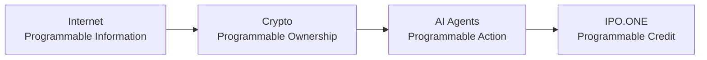

Autonomous action can scale only as far as capital, trust, and accountability allow.

A prepaid Agent can spend until its balance reaches zero. A sponsored Agent can operate until its owner stops funding it. A platform Agent can receive internal allowances that disappear outside the platform. These are useful operating models, but they are not portable credit.

Credit allows an economic actor to access resources in the present against an accountable commitment to future performance. It expands productive capacity beyond current cash. It also introduces risk: someone must define authority, assess repayment capacity, price uncertainty, record the Obligation, control use, reconcile payment, and absorb or allocate loss.

For Humans, institutions evolved legal contracts, identity systems, bureaus, underwriting models, servicing infrastructure, and collections processes to perform these functions. The systems are imperfect and fragmented, but the underlying questions are known.

For Agents, the questions must be answered in machine-readable form from the beginning.

The Agentic Economy therefore requires more than a payment layer. It requires a protocol for responsibility across time.

## 2. Payments Are Necessary but Insufficient

A payment proves or asserts that value moved. Credit must establish the economic relationship around that movement.

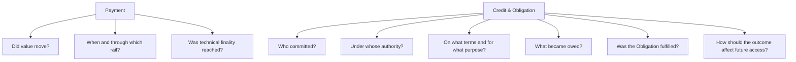

The distinction matters because identical transfers can represent different economic facts.

A payment may be:

- an advance under a credit Facility;
- a purchase funded from current cash;
- a repayment of principal;
- payment of interest or fees;
- a refund;
- collateral movement;
- a Provider settlement;
- a mistaken duplicate;
- a reversible processor event;
- an onchain transaction that later becomes non-canonical; or
- a transfer unrelated to any credit relationship.

Without identity, authority, accepted terms, allocation rules, servicing state, and Evidence, a payment cannot reliably update credit.

IPO.ONE does not replace payment networks. It gives payment events economic meaning inside a canonical Obligation.

## 3. Credit Is Trust Across Time

Credit is often described as money lent with an expectation of repayment. That definition is incomplete.

Credit is a governed transfer of present capacity based on a judgment about future accountable performance.

It contains at least six elements:

1. **Identity** - the relevant economic Subject and responsible Principal.
2. **Authority** - the right to request, accept, draw, spend, or settle.
3. **Terms** - amount, price, duration, schedule, purpose, conditions, and remedies.
4. **Obligation** - the canonical future commitment created by acceptance and use.
5. **Performance** - execution, repayment, delinquency, cure, loss, recovery, and resolution.
6. **Memory** - the durable evidence through which past performance informs future decisions.

Traditional systems often compress these elements into a private bureau score or lender-specific account history. That approach produces scale within institutions but weak portability across platforms, countries, payment rails, and emerging digital actors.

The Agentic Economy creates an opportunity to define credit more precisely:

> **Credit is permissioned access to present resources under accountable authority, canonical obligations, and verifiable future performance.**

This definition is subject-neutral. It can apply to a Human, organization, Agent, or machine while preserving the legal and risk differences among them.

## 4. Why the Transition Matters Now

Several infrastructure shifts are converging.

### 4.1 Agents are becoming economic interfaces

Agents increasingly sit between users and digital services. They search, compare, plan, call APIs, operate software, and coordinate other Agents. Protocols such as MCP and A2A are reducing integration friction between models, tools, and remote Agents.[7][8]

Interoperability increases economic opportunity, but it also increases the need for standardized authority and accountability. A system that can call any tool must not be assumed to have permission to accept any financial obligation.

### 4.2 Machine payments are becoming native

HTTP-native and onchain payment protocols, including x402, make it possible for software to discover a paid resource, satisfy a payment request, and receive service programmatically.[9]

This improves settlement. It does not answer who may borrow, how much, for what purpose, or how repayment history should travel.

### 4.3 Digital identity is becoming more verifiable

Standards such as W3C Verifiable Credentials 2.0 provide issuer-holder-verifier patterns for machine-verifiable, privacy-aware claims.[3] Wallet authentication, sender-constrained tokens, workload credentials, and account-control proofs make it possible to separate identity from authorization more cleanly than many legacy systems.

### 4.4 Capital remains fragmented

Capital providers operate under different laws, risk appetites, data requirements, currencies, and settlement systems. A global balance sheet is neither necessary nor desirable as the default architecture. What is needed is a common obligation language through which many capital providers can evaluate, price, fund, and monitor compatible credit relationships.

### 4.5 Account access has not solved credit access

The Global Findex 2025 shows substantial progress in account ownership, yet financial resilience remains weaker than account access. In low- and middle-income economies, many people have mobile connectivity and digital transaction histories but lack mechanisms that convert lawful cash flow and repayment into portable credit.[1]

Humans and Agents therefore arrive at the same structural gap from different directions:

- Humans may have economic activity without a portable credit file.
- Agents may have execution capability without a portable responsibility and repayment history.

IPO.ONE is designed around the shared infrastructure problem beneath both.

---

# Part II - The Missing Protocol Primitive

## 5. Identity, Payment, and Obligation

IPO.ONE retains the original **I-P-O model**:

> **Identity + Payment + Obligation**

Credit Intent acts as the request envelope that connects these primitives.

| Primitive | Question | Protocol role |
| --- | --- | --- |
| **Identity** | Who is acting, who authorized the action, and who is responsible? | Resolve Subjects, Principals, accounts, roles, credentials, and attestations. |
| **Intent** | What value is requested, for what purpose, under which constraints, and from which repayment source? | Represent a subject-neutral Credit Intent and optional Execution Plan. |
| **Payment / Settlement** | How does value move, reach technical finality, and reconcile? | Produce rail-neutral instructions and normalize authenticated receipts. |
| **Obligation** | What future commitment exists? | Create canonical terms, exposure, schedule, servicing, delinquency, default, correction, and resolution state. |
| **Evidence** | What actually happened, and how do we know? | Bind observations, receipts, state transitions, provenance, finality, and reconciliation. |

Identity without obligation produces authentication but no credit relationship.

Payment without obligation produces settlement but no durable representation of responsibility.

Obligation without Evidence produces a claim that cannot be trusted across systems.

IPO.ONE combines the three into a lifecycle that can be interpreted by Humans, Agents, capital providers, applications, and auditors.

## 6. Obligation as the Atomic Unit of Credit

The atomic unit of a payment network is a transfer.

The atomic unit of a credit system is an **Obligation**.

An Obligation records:

- the obligor and responsible Principal;
- the Capital Provider or beneficiary;
- the accepted Offer version;
- principal, price, fees, and total cost;
- asset or currency;
- purpose and permitted use;
- term and repayment schedule;
- repayment source;
- servicing and allocation rules;
- applicable policy and authority;
- permitted execution and settlement environments;
- current state;
- Evidence and reconciliation lineage; and
- remedies, correction, and resolution rules.

The Obligation is not merely a database row or legal-document hash. It is the canonical protocol representation of the accepted economic commitment. Legal agreements, disclosures, and jurisdiction-specific rights remain controlled by the applicable lender, Originator, counterparties, and law. IPO.ONE does not claim that software overrides those instruments.

The protocol requirement is narrower and more durable: every system participating in the lifecycle must refer to one canonical economic commitment and must not create contradictory sources of truth.

## 7. Responsibility Before Autonomy

Autonomy without responsibility produces unbounded risk.

IPO.ONE separates three concepts that are often collapsed:

- **Identity** answers which actor or account is present.
- **Responsibility** answers which person or organization ultimately bears economic accountability.
- **Authority** answers what exact action is currently permitted.

For a Human, these concepts may overlap but are not identical. A wallet can authenticate an address, while role selection, Consent, eligibility, Offer acceptance, and product policy determine what the Human may do.

For an Agent, the separation is essential. An Agent identity describes a workload or software actor. It does not establish legal personhood, balance-sheet capacity, or open-ended permission to borrow.

An accountable Principal establishes the relationship. A Mandate narrows authority. Deterministic authorization evaluates each exact action against current scope and state.

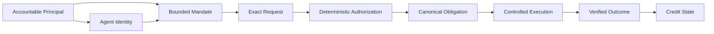

This design allows Agents to become more economically capable without granting them undefined autonomy.

## 8. Single Kernel, Dual-Native Access

Humans and Agents are equal first-class Subjects of the protocol. Equal status does not mean identical law, identity assurance, underwriting, user experience, or liability.

It means the protocol does not treat Humans as a legacy mode or Agents as an API wrapper around Human forms.

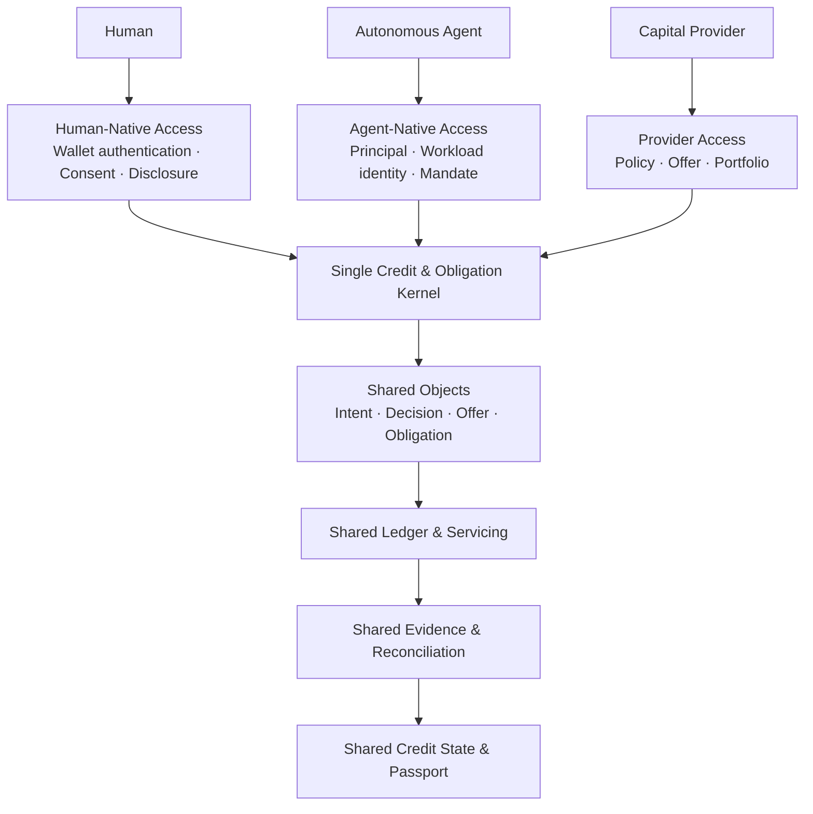

The edges differ:

| Dimension | Human-native profile | Agent-native profile | Shared kernel |
| --- | --- | --- | --- |
| Interaction | Product interface, embedded SDK, partner workflow | API, SDK, MCP-compatible tool, A2A-compatible adapter | Canonical commands and resources |
| Identity | Human authentication and identity attestations | Workload identity and account binding | Subject and Principal relationships |
| Authority | Consent, role, legal capacity, deliberate acceptance | Principal, Mandate, key binding, purpose and budget limits | Deterministic Authorization |
| Disclosure | Human-readable terms, schedule, cost, remediation | Machine-readable terms, constraints, receipts, errors | Versioned Offer and Obligation |
| Execution | User-directed approved operation | Replay-safe machine command | Shared Ledger and state machine |
| Output | Credit State, Track Record, Passport, Evidence | Same | One economic truth |

The canonical lifecycle remains:

> **Subject → Authority → Credit Intent → Decision → Offer → Obligation → Execution → Repayment → Credit Outcome → Credit State**

---

# Part III - The IPO.ONE Credit System

## 9. The Canonical Credit Loop

The IPO.ONE Credit Loop turns one accountable request into a durable economic outcome.

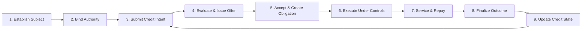

### 9.1 Establish Subject and responsibility

A Human or Agent becomes a canonical Subject. The system binds the relevant Principal relationship, role, Tenant, account-control evidence, and verification attestations.

### 9.2 Establish authority

A Human grants Consent and performs explicit lifecycle actions. An Agent operates under a bounded Mandate. Authority is versioned, revocable, and evaluated at the moment of action.

### 9.3 Submit Credit Intent

The Subject requests capital and states amount, asset, purpose, duration, repayment source, constraints, and preferred execution environment. Complex or restricted-use requests may include an Execution Plan.

### 9.4 Evaluate and issue Offer

Verified Evidence, active policy, affordability or repayment capacity, current exposure, and Capital Provider requirements inform an explainable Decision. The Capital Provider authors binding or conditional terms in a versioned Offer.

### 9.5 Accept and create Obligation

The authorized Subject or Principal accepts an exact Offer version. Acceptance creates the canonical Obligation and its servicing schedule. No later change may silently rewrite the original terms.

### 9.6 Controlled execution

Use of capital occurs only through approved operations, counterparties, Providers, assets, venues, or rails. Execution receipts remain linked to the Obligation.

### 9.7 Service and repay

Principal, financial charges, fees, refunds, reversals, corrections, delinquency, cure, restructuring, loss, and recovery update an append-only Ledger under explicit allocation rules.

### 9.8 Finalize outcome

A terminal Credit Outcome is created when the relevant obligation state, Evidence, and reconciliation conditions are satisfied.

### 9.9 Update Credit State

The verified outcome becomes part of longitudinal Credit State and can support future authorized decisions and disclosures.

## 10. Human Credit Access

Human access is a native protocol mode.

A Human journey should be understandable without requiring knowledge of blockchains, Agent protocols, or credit-system internals.

A complete Human lifecycle includes:

1. authenticate and select the intended role;
2. establish or recover the Human Subject;
3. grant purpose-limited Consent;
4. connect approved identity or economic Evidence;
5. submit Credit Intent;
6. receive an explainable Decision;
7. review exact Offer terms, cost, schedule, conditions, and lender identity;
8. deliberately accept the Offer;
9. create and inspect the resulting Obligation;
10. execute or receive the approved benefit;
11. repay according to schedule;
12. see delinquency, cure, dispute, or remediation state where relevant;
13. receive terminal Credit Outcome;
14. inspect Credit State, Track Record, Passport, and Evidence; and
15. recover the same canonical state across sessions and devices under current authorization.

Human product requirements include:

- clear total cost and repayment schedule;
- understandable reason codes;
- explicit Consent and disclosure scope;
- correction, complaint, and appeal mechanisms where required;
- affordability and overextension controls;
- privacy-preserving attestations rather than unnecessary raw documents;
- accessible remediation and support; and
- no implication that a wallet balance or onchain history alone defines identity or creditworthiness.

## 11. Agent Credit Access

Agent access is designed around structured authority, machine-readable constraints, and deterministic execution.

An Agent credit lifecycle includes:

1. establish the responsible Principal or Operator;
2. register a verifiable workload identity and approved key material;
3. bind the Agent to a Subject, account, or smart-account relationship;
4. create a bounded Mandate;
5. submit Credit Intent and, where needed, an Execution Plan;
6. validate purpose, Provider, amount, duration, current exposure, and repayment source;
7. receive a deterministic Decision and versioned Offer;
8. accept under explicit authority;
9. create the shared canonical Obligation;
10. execute only approved actions;
11. service repayment through replay-safe, idempotent commands;
12. finalize the Credit Outcome; and
13. recover durable Credit State, Passport, and Evidence through authorized machine interfaces.

### 11.1 The Mandate

A Mandate is not a general permission string. It is a versioned economic control object.

It may constrain:

- maximum amount and aggregate exposure;
- asset or currency;
- purpose and permitted use;
- approved Providers, counterparties, or venues;
- permitted operation types;
- duration and expiry;
- per-action and per-period limits;
- repayment source;
- revenue-capture or settlement routing;
- risk and loss limits;
- required Evidence;
- escalation and human-approval thresholds;
- revocation and stop conditions.

### 11.2 Sender-constrained authentication

Bearer credentials are inadequate for high-consequence Agent actions because copied secrets can be replayed by a different sender. IPO.ONE's Agent architecture uses sender-constrained authentication patterns, including proof-of-possession, so a request must demonstrate control of approved key material. RFC 9449 DPoP provides a relevant standards-track mechanism for sender-constraining OAuth tokens and detecting replay.[4]

Authentication is necessary but still not sufficient. The system evaluates current Mandate, role, expiry, revocation, resource ownership, amount, state, and reconciliation before authorizing an exact command.

### 11.3 Idempotency and concurrency

Machine systems retry. Networks duplicate. Workers restart. A financial protocol must expect this behavior.

Every mutating command requires a stable idempotency boundary. Concurrent requests cannot create duplicate Offers, Obligations, draws, repayments, or Evidence. The canonical outcome is derived from durable server state, not from browser memory, local process state, or an optimistic client assertion.

### 11.4 Controlled use of proceeds

Early Agent credit should be purpose-bound. Capital can be directed toward approved compute, APIs, data, software, infrastructure, inventory, or services rather than unrestricted cash withdrawal.

This structure improves observability and risk containment:

- the Provider is known;
- the intended resource is known;
- the amount and timing are bounded;
- execution can produce machine-readable receipts;
- productive outcomes may be observable;
- revenue or repayment sources can be linked; and
- authority can be revoked without granting general custody.

## 12. Capital Providers and Offer Formation

IPO.ONE is designed to coordinate external capital rather than require one universal balance sheet.

Capital Providers may include:

- banks and licensed non-bank lenders;
- fintech and embedded-credit providers;
- private-credit facilities;
- Provider or vendor trade-credit programs;
- institutional facilities;
- protocol or digital-asset capital;
- specialized Agent-finance providers; and
- compatible onchain capital facilities with defined legal, custody, investor, and servicing controls.

A Capital Provider publishes or applies a machine-readable policy or Capital Mandate defining:

- eligible jurisdictions and Subject classes;
- product and purpose;
- amount and tenor bounds;
- pricing and total-cost limits;
- required identity and Evidence standards;
- affordability or repayment-capacity rules;
- concentration and portfolio limits;
- permitted assets and rails;
- finality and reconciliation requirements;
- recourse, reserve, and loss-allocation terms;
- servicing obligations; and
- delegated decision authority.

IPO.ONE supports several decision modes:

| Mode | IPO.ONE role | Capital Provider control |
| --- | --- | --- |
| **Advisory** | Produce Credit Profile, reason codes, and recommended terms | Provider makes the final decision in its own system |
| **Delegated policy** | Approve, decline, or step up inside a signed policy envelope | Provider pre-approves policy, caps, pricing, exceptions, and oversight |
| **Request for Offer** | Route a standardized request to eligible Providers | Each Provider returns binding or conditional terms |

The Capital Provider owns the economic Offer. IPO.ONE preserves the integrity of the accepted Offer version and resulting lifecycle.

## 13. The Obligation Kernel and Ledger

The Obligation Kernel is the source of canonical economic state.

It manages:

- Offer acceptance and version binding;
- Obligation creation;
- Facility projection and available capacity;
- execution and draw state;
- repayment schedule;
- principal, financial income, fees, and total due;
- payment allocation;
- days past due;
- delinquency and cure;
- modification, restructure, repurchase, or refinance references;
- default, write-off, recovery, and resolution;
- Evidence and reconciliation status; and
- Credit Outcome finalization.

### 13.1 Append-only economic truth

Financial state must be reconstructable.

Funding, repayment, refund, reversal, correction, write-off, and recovery events are recorded additively. Historical events are not silently mutated to make projections appear correct. Derived balances and Credit State must be recomputable from canonical events and accepted terms.

### 13.2 Double-entry discipline

Where value is represented economically, the Ledger should preserve balanced accounting entries. A single external receipt may result in multiple internal allocations, but total recognized value cannot exceed the valid Obligation amount.

### 13.3 Technical finality and legal discharge

Technical finality is not always legal settlement.

Onchain finality may depend on inclusion, confirmation depth, protocol finality, or an accepted attestation. Traditional-rail finality may remain subject to return, chargeback, bank, processor, or scheme rules. The applicable agreement and law determine legal discharge.

IPO.ONE records both without conflating them.

## 14. Evidence

Evidence is the bridge between events and trust.

An Evidence item should be:

- typed;
- attributable;
- time-bounded;
- linked to the relevant Subject, authority, Obligation, and event;
- provenance-aware;
- immutable or additively correctable;
- explicit about observation and finality state;
- permissioned according to sensitivity; and
- sufficient to reconstruct why a state transition occurred.

Evidence may include:

- identity or account-control attestations;
- Consent and Mandate versions;
- Credit Intent and Decision snapshots;
- Offer and acceptance receipts;
- execution receipts;
- payment and rail receipts;
- finality proofs;
- Ledger allocation events;
- delinquency, cure, default, and recovery events;
- dispute or correction records;
- model and policy versions; and
- reconciliation outcomes.

A hash can help prove integrity. It does not, by itself, prove the meaning, truth, authority, or legal effect of the underlying event.

## 15. Credit State and the Credit Passport

Credit State is the longitudinal economic state derived from canonical obligations and verified outcomes.

It may include:

- active and completed Obligations;
- total funded and repaid value;
- repayment ratio;
- payment timing;
- maximum days past due;
- delinquency and cure history;
- default, loss, write-off, and recovery;
- purpose and Mandate compliance;
- execution quality;
- Evidence confidence;
- disputes and corrections;
- relevant concentration or stability factors; and
- policy-specific progression status.

Credit State is not a browser profile and not an opaque score generated without provenance. It is a recomputable projection over canonical economic truth.

The Credit Passport is a permissioned representation of relevant Credit State. It can disclose the minimum information required for a defined purpose:

- a proof of completed obligations;
- a repayment-performance summary;
- a purpose-specific Decision Passport;
- a bounded factor set;
- a Provider or lender-specific Evidence package;
- a credential or attestation reference; or
- a verifier-readable provenance chain.

W3C Verifiable Credentials 2.0 provides a useful interoperable issuer-holder-verifier pattern for machine-verifiable, privacy-aware claims.[3] IPO.ONE may use compatible credential formats where they improve portability, while each recipient remains responsible for its own decision rules.

## 16. Economic Memory

A central IPO.ONE concept is **economic memory**.

Economic systems remember unevenly. A bank remembers the accounts it services. A platform remembers activity inside its own marketplace. A blockchain remembers public transactions. A wallet remembers assets and signatures. An Agent runtime remembers local tasks.

None of these records necessarily forms a portable, permissioned account of responsibility and performance.

IPO.ONE economic memory is built from:

> **Accountable identity + bounded authority + canonical obligations + reconciled outcomes + provenance**

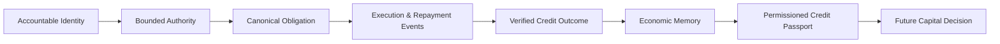

Economic memory changes the strategic value of a completed transaction. The outcome is not merely closed. It becomes an input into future capacity.

## 17. The Obligation Graph

As the network grows, IPO.ONE can represent a permissioned **Obligation Graph**.

The graph connects:

- Subjects;
- Principals;
- Agents;
- Mandates and Consent;
- Capital Providers;
- Offers and Facilities;
- Obligations;
- Providers and counterparties;
- execution environments;
- payment rails;
- Evidence issuers;
- outcomes; and
- Credit State.

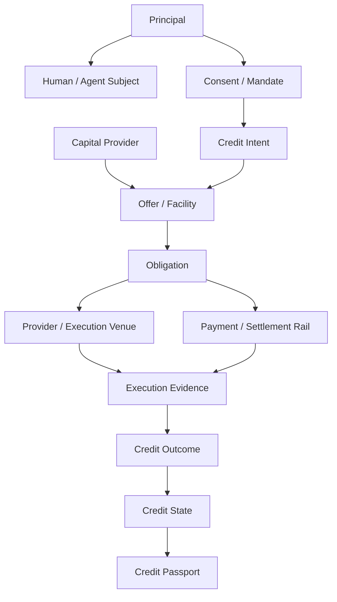

The Obligation Graph is not intended to become a public surveillance graph. Access remains purpose-limited and policy-controlled. Its value comes from normalized relationships and verified outcomes, not unrestricted visibility.

A mature graph can improve:

- duplicate-financing detection;
- authority and ownership resolution;
- Provider and attester quality assessment;
- concentration analysis;
- portfolio correlation;
- capital matching;
- fraud and collusion detection;
- cross-platform performance portability; and
- systemic-risk understanding.

---

# Part IV - Protocol Architecture

## 18. Stable Kernel + Replaceable Adapters

IPO.ONE uses a deliberately asymmetric architecture:

> **Stable Protocol Kernel + Replaceable Adapters**

The kernel changes slowly because it defines the meaning of credit and obligations. Adapters change more quickly because external systems, standards, Providers, chains, and payment rails evolve.

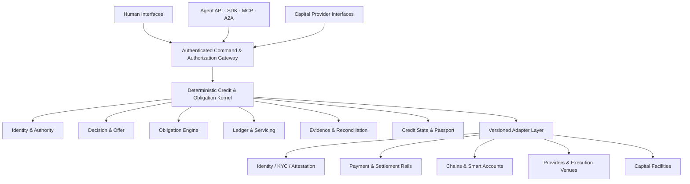

### 18.1 Kernel responsibilities

The kernel owns:

- canonical identifiers;
- Subject and Principal relationships;
- roles, Consent, Mandates, and Authorizations;
- Credit Intent;
- active policy versions;
- Decision and Offer versions;
- accepted Obligations;
- Facility projections;
- Ledger and servicing state;
- Evidence and outbox state;
- finality and reconciliation status;
- Credit Outcomes;
- Credit State and Passport permissions; and
- audit history.

### 18.2 Adapter responsibilities

Adapters may:

- normalize external identity or account-control proofs;
- translate Human or machine messages into canonical commands;
- prepare payment or execution instructions;
- submit an approved operation;
- observe external events;
- confirm technical finality;
- reconcile partial, reversed, or corrected events;
- register capital mandates;
- obtain Offers; or
- anchor and verify permitted proofs.

Adapters may not:

- grant credit authority;
- bypass Consent or Mandate;
- alter accepted terms;
- create or expand exposure outside policy;
- finalize an Obligation without required Evidence;
- rewrite Ledger history;
- substitute external state for canonical state; or
- treat a chain, wallet, or Provider as the universal source of credit truth.

## 19. Interface Architecture

IPO.ONE exposes one application protocol through role-appropriate interfaces.

### 19.1 Human interface

The Human interface supports:

- identity and role selection;
- Consent and disclosure;
- Credit Intent;
- Decision explanation;
- Offer review and acceptance;
- Obligation and schedule visibility;
- repayment;
- remediation;
- Evidence;
- Track Record; and
- Credit Passport.

### 19.2 Agent API and SDK

The Agent interface supports:

- capability discovery;
- authenticated operation catalog;
- Subject and Mandate retrieval;
- Credit Intent submission;
- Offer and Obligation operations;
- controlled execution;
- repayment;
- structured receipts;
- stable error semantics;
- Evidence and Passport retrieval; and
- server-derived state recovery.

### 19.3 MCP and A2A-compatible adapters

MCP standardizes Agent-to-tool interaction, while A2A standardizes communication between independent Agents.[7][8] IPO.ONE treats these protocols as interaction environments, not sources of financial authority.

An MCP tool call or A2A message is normalized into a canonical IPO.ONE command. The same authentication, Mandate, policy, idempotency, ownership, and state checks apply. No hidden financial action exists only because a machine protocol can invoke it.

### 19.4 Capital Provider interface

Capital Providers can access:

- authorized underwriting packages;
- policy and Capital Mandate configuration;
- Offer creation;
- portfolio and Facility state;
- exposure and concentration;
- servicing and repayment;
- Evidence and reconciliation;
- disputes and exceptions; and
- audit exports.

### 19.5 Operator and risk interface

Authorized operators require:

- Tenant and portfolio exposure;
- per-Subject, per-Agent, per-Provider, and per-rail limits;
- stop conditions;
- freeze and pause controls;
- dual-control actions;
- reconciliation discrepancies;
- incident state;
- model and policy versions;
- credential and Mandate revocation; and
- privacy-safe drill-down.

## 20. Multi-Rail Settlement

IPO.ONE is rail-neutral at the kernel and rail-aware at the adapter boundary.

Supported rail categories may include:

- bank and payment-processor rails;
- mobile-money and platform settlement;
- card or account-based payment where appropriate;
- stable-value and digital-asset settlement;
- smart-account execution;
- onchain capital facilities;
- Provider-internal credit; and
- hybrid settlement across multiple environments.

A Multi-Rail Adapter provides a common control surface for:

1. account binding;
2. instruction preparation;
3. approved submission;
4. event observation;
5. finality confirmation;
6. partial reconciliation;
7. reversal or reorganization handling;
8. correction; and
9. audit linking.

A single Obligation may receive multiple partial payments across different rails. IPO.ONE recognizes only authenticated, policy-valid, reconciled events and prevents the sum of recognized settlement from exceeding the valid Obligation.

Chain-aware identifiers can use interoperable account and network standards such as CAIP-2 and CAIP-10. The business Obligation remains chain-agnostic.

## 21. Onchain Components

Blockchains provide useful properties:

- programmable settlement;
- account-control proofs;
- public finality evidence;
- smart-account permissions;
- verifiable asset representation;
- shared event ordering; and
- portable anchoring.

They also introduce constraints:

- public data permanence;
- key and signer risk;
- reorganization or finality assumptions;
- contract risk;
- network and asset fragmentation;
- transaction-cost variability;
- legal ambiguity across jurisdictions; and
- the possibility of confusing public transactions with complete credit truth.

IPO.ONE uses onchain systems where they improve verifiability, coordination, or settlement. It does not place raw KYC documents, sensitive financial data, private policy, credentials, or unrestricted Credit State on public chains.

Tokenization is optional. A tokenized credit asset can represent an eligible legal or economic claim only when rights, custody, transfer restrictions, servicing, and investor eligibility are defined. Tokenization does not create the underlying claim and must never duplicate financing.

## 22. Reliability and Failure Isolation

A credit protocol must remain correct when external systems fail.

### 22.1 Fail closed

Unknown, stale, revoked, unauthorized, or unreconciled state cannot create new risk.

### 22.2 Durable truth

Canonical state is server-derived and persistent. A browser, Agent process, wallet UI, or adapter cache cannot become the authoritative record of an Obligation.

### 22.3 Atomic state transitions

A successful command should commit the relevant state transition, economic Event, Evidence reference, and downstream work atomically or through a durable outbox pattern.

### 22.4 Replay resistance

Authentication proofs, nonces, and idempotency keys prevent duplicated authorization and economic effects.

### 22.5 Isolation

A rail outage, chain reorganization, Provider failure, Agent protocol error, or identity-service interruption may pause affected operations. It cannot silently finalize an Obligation or corrupt unrelated state.

### 22.6 Reconciliation before expansion

Unreconciled discrepancies restrict further draw, settlement, or authority according to policy. The protocol does not compensate for uncertain state by assuming success.

---

# Part V - Credit Intelligence and Economics

## 23. The Credit Intelligence Network

Credit systems improve when they learn from real outcomes.

IPO.ONE's long-term intelligence layer is a governed network built on verified longitudinal Evidence, not an opaque universal score.

It can process signals across three scopes:

| Scope | Relevant signals | Potential outputs |
| --- | --- | --- |
| **Individual** | cash-flow stability, repayment, utilization, execution quality, Mandate compliance, intervention response | risk understanding, capacity, tenor, schedule, purpose limits, improvement actions |
| **Cohort** | comparable Subjects, products, Providers, tasks, jurisdictions, and vintages | calibration, pricing recommendations, policy thresholds, intervention effectiveness |
| **Network** | fraud rings, attester quality, Provider performance, capital performance, rail reliability, concentration, macro drift | anomaly controls, capital routing, diversification, fallback policy, systemic-risk signals |

### 23.1 Multiple outputs, not one score

A useful credit system produces several explainable outputs:

- probability of default or non-performance;
- loss given default;
- exposure at default;
- affordability or repayment capacity;
- fraud risk;
- Evidence confidence;
- stability and concentration;
- recommended limit;
- recommended tenor and schedule;
- required controls;
- indicative risk price;
- intervention or remediation recommendation; and
- capital-provider fit.

A single display score may improve usability, but it cannot override affordability, policy, identity, Mandate, Evidence quality, or legal constraints.

### 23.2 Governed learning loop

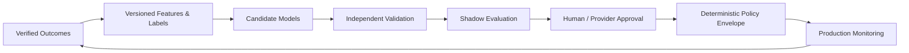

Candidate techniques may include deterministic scorecards, supervised learning, graph methods, Bayesian updating, causal inference, anomaly detection, contextual bandits, and constrained optimization.

NIST's AI Risk Management Framework provides a useful governance reference built around mapping, measuring, managing, and governing AI risk.[6]

### 23.3 Permanent authority boundary

No learning system may:

- approve outside an authorized policy envelope;
- increase exposure beyond current limits;
- alter an accepted Offer or Obligation;
- expand a Mandate;
- remove a stop condition;
- move funds;
- conceal the responsible Capital Provider;
- rewrite protocol invariants;
- self-promote into production; or
- optimize solely for borrowing volume or platform revenue.

## 24. Credit Decisioning

Credit decisions combine Evidence, policy, economics, and authority.

### 24.1 Expected loss

> **EL = PD × LGD × EAD**

Where:

- **PD** is probability of default or defined non-performance over the relevant horizon;
- **LGD** is expected economic loss after recoveries; and
- **EAD** is expected exposure at default.

All three are product-, cohort-, purpose-, and jurisdiction-specific.

### 24.2 Recommended capacity

A conceptual capacity bound is:

> **Limit\* = max(0, min(Affordability Cap, Cash-Flow Cap, Policy Cap, Facility Cap) × Evidence Confidence × Stress Haircut − Existing Exposure)**

For Agents, equivalent caps may include Principal capacity, observable revenue, Provider limits, Mandate limits, reserve requirements, execution performance, and purpose-specific loss bounds.

### 24.3 Indicative price

> **Price\* = Cost of Capital + Expected Loss + Operations + Compliance + Capital Charge + Margin**

Pricing remains subject to law, disclosure, lender policy, competition, and borrower protection.

### 24.4 Decision receipt

Every material decision should record:

- Subject and responsible Principal;
- requested product and purpose;
- Evidence snapshot and provenance;
- policy and model versions;
- reason codes;
- confidence and uncertainty;
- recommended or approved terms;
- responsible Capital Provider;
- decision authority; and
- timestamp and expiry.

## 25. Progressive Credit

Inclusive credit should not infer large unsecured exposure from weak Evidence.

IPO.ONE uses a progression principle:

> **Start bounded. Observe verified performance. Expand only when evidence, borrower benefit, and Capital Provider policy support it.**

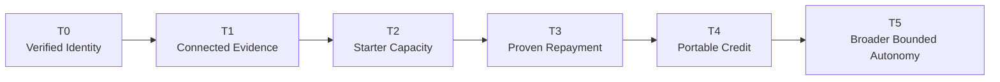

Progression may improve:

- amount;
- duration;
- price;
- repayment flexibility;
- eligible Providers;
- per-Agent sub-limits;
- settlement options;
- approval speed; or
- disclosure burden where legally reusable.

Progress is earned through verified behavior. It is not purchased through token ownership, social status, or unexplained scoring.

## 26. Business Model

IPO.ONE is designed to monetize useful infrastructure and successful economic coordination.

Potential revenue lines include:

| Revenue line | Typical payer | Economic rationale |
| --- | --- | --- |
| **Platform / API subscription** | Capital Provider, Originator, Provider, platform | Access to workflow, policy, reporting, and integration |
| **Decision / Offer-routing fee** | Capital Provider or partner; borrower only where lawful and transparent | Eligibility, delegated decisioning, and Offer orchestration |
| **Protocol execution fee** | Defined participant in a successful funding or draw event | Successful creation and execution of a governed Obligation |
| **Realized financial revenue participation** | Capital or product partner | Align protocol economics with financial income actually received |
| **Servicing / reconciliation fee** | Capital Provider, Facility, or Provider | Payment state, allocation, DPD, correction, reconciliation, and audit |
| **Facility / capital-routing fee** | Capital Provider | Eligibility, allocation, exposure, reserves, and portfolio reporting |
| **Passport verification / analytics** | Authorized verifier or institution | Purpose-limited proofs and portfolio intelligence |

IPO.ONE should not depend on:

- undisclosed interest spreads;
- indiscriminate balance-sheet growth;
- sale of raw personal data;
- speculative token issuance before product-market fit;
- hidden routing incentives that override borrower utility; or
- borrowing volume that produces negative risk-adjusted value.

The commercial objective is aligned infrastructure economics:

> **Revenue should grow when qualified obligations are created, serviced, repaid, reconciled, and reused safely.**

## 27. Capital Economics

Growth is valuable only when it produces positive risk-adjusted contribution.

A conceptual measure is:

> **Risk-Adjusted Contribution = Fees + Realized Financial Participation − Funding Cost − Expected Loss − Fraud − Servicing − Compliance − Partner Share**

Important operating metrics include:

- qualified Offer match rate;
- approval certainty;
- time to decision;
- time to execution;
- capital utilization;
- repayment and delinquency;
- net loss;
- fraud and unauthorized use;
- progression rate;
- repeat usage and retention;
- Provider value;
- reconciliation quality;
- borrower or Principal benefit; and
- contribution by cohort and vintage.

A high application count is not product-market fit. Neither is transaction volume without repayment, renewal, Provider value, or positive risk-adjusted economics.

## 28. Compounding Network Effects

The IPO.ONE network compounds through verified outcomes.

The moat is not one score, one model, one chain, one wallet, or one balance sheet.

It is the interaction among:

- canonical Obligation history;
- Human and Agent outcomes;
- Principal and Mandate relationships;
- Capital Provider policies;
- distribution integrations;
- servicing and reconciliation;
- Provider and attester quality;
- compliance adapters;
- portable Credit Passports;
- multi-rail state; and
- governed intelligence.

More Providers increase Offer diversity. More verified outcomes improve decision quality. Better decision quality attracts more capital. More capital creates more useful Facilities. Embedded distribution increases repeated activity. Portable Credit State reduces the need to restart from zero.

This is a network effect based on normalized responsibility and performance, not speculative liquidity.

---

# Part VI - Safety, Privacy, and Governance

## 29. Protocol Invariants

IPO.ONE is designed around permanent invariants.

1. No credit exposure without a valid Subject, accountable Principal, and applicable Capital Provider policy.
2. No automated approval outside an authorized decision envelope.
3. No Agent authority without a current, bounded, revocable Mandate.
4. No Obligation without exact accepted terms and a unique state transition.
5. No adapter may create authority, alter terms, or redefine canonical state.
6. No funding or repayment becomes final until the applicable Evidence and reconciliation policy is satisfied.
7. No partial or hybrid settlement may cause recognized value to exceed the valid Obligation.
8. No repayment, refund, reversal, correction, write-off, or recovery may be counted twice.
9. No stale, revoked, unknown, unauthorized, or unreconciled state may create new risk.
10. No model may directly move funds, expand authority, rewrite protocol invariants, or conceal the responsible Capital Provider.
11. No tokenized representation may duplicate or exceed the underlying claim.
12. No cross-purpose data reuse without valid authority and permitted use.

## 30. Bounded Authority

Bounded authority is the core safety primitive for Agent finance.

Permissions should be:

- explicit;
- minimal;
- purpose-limited;
- amount-limited;
- time-limited;
- asset- and counterparty-aware;
- revocable;
- inspectable;
- attributable; and
- enforced at the exact action boundary.

A system should prefer:

- Provider payment over unrestricted withdrawal;
- per-action limits over general account access;
- short-duration Facilities over undefined rolling exposure;
- revenue-linked repayment over opaque future funding;
- stop conditions over human hope;
- explicit escalation over silent authority expansion; and
- deterministic rules over model-generated permissions.

## 31. Privacy and Data Minimization

Credit requires information, but more data does not automatically produce better or fairer decisions.

IPO.ONE follows several principles:

- collect only information relevant to the declared purpose;
- store minimum necessary identity results and provenance;
- keep raw KYC documents with the qualified party where possible;
- separate raw data from derived Evidence;
- use purpose-limited Consent and Mandates;
- disclose minimal proofs rather than unrestricted dossiers;
- preserve correction and revocation state;
- encrypt sensitive data offchain;
- avoid public-chain publication of raw personal or commercially sensitive information;
- prohibit unconsented contact lists, private messages, or social content as default underwriting data;
- avoid opaque third-party scores without provenance and correction rights; and
- prevent persistent wallet or device surveillance unrelated to defined fraud, account-control, or underwriting needs.

FATF guidance recognizes that reliable digital identity can improve identification efficiency and inclusion while requiring risk-based assessment of assurance and use.[2] Identity verification is necessary, but it is not a substitute for affordability, authority, or credit assessment.

## 32. Human Protection and Fairness

Human credit products require explicit protections.

- Affordability constrains limits even when predicted default risk appears low.
- Total cost, lender identity, schedule, conditions, and material reasons are visible before acceptance.
- Repeat borrowing, rollovers, debt stacking, and harmful overextension are monitored.
- Data correction, complaint, and appeal routes are measurable product requirements.
- Fairness analysis examines approval, pricing, loss, and intervention outcomes.
- Proxy variables require explicit justification and review.
- Product design optimizes sustainable access and productive outcomes, not maximum debt.

Equal protocol status does not erase consumer-protection law or Human vulnerability. Human and Agent products share canonical semantics while applying different policy profiles where meaning, protection, and liability differ.

## 33. Model Governance

Every production model or scorecard requires:

- version and scope;
- named owner;
- feature and label provenance;
- training and observation windows;
- independent validation;
- calibration and stability analysis;
- fairness and harm analysis where applicable;
- shadow comparison against approved baselines;
- monitoring thresholds;
- rollback path;
- change approval; and
- auditability.

Exploration is bounded by explicit exposure, fairness, customer-harm, and loss budgets. Material deterioration triggers fallback to a safer approved policy.

Human and Agent models may share ontology and infrastructure, but feature transfer occurs only when validated, lawful, explainable, and beneficial in the target domain.

## 34. Regulated Role Separation

IPO.ONE coordinates infrastructure. External entities retain regulated responsibilities according to jurisdiction and product.

| Role | Responsibility boundary |
| --- | --- |
| **IPO.ONE** | Credit infrastructure, authority, decision technology, routing, canonical state, Evidence, reconciliation, and audit; not automatically lender, broker, servicer, custodian, or Originator in every jurisdiction |
| **Identity / KYC / KYB provider** | Performs identity, organization, signer, or screening checks within its assurance and contractual scope |
| **Originator / lender** | Owns regulated approval, agreement, disclosures, capital, servicing, and delegated oversight as applicable |
| **Capital Provider** | Funds eligible Obligations under a defined policy or Facility and bears agreed economic risk |
| **Platform / Provider** | Supplies permitted distribution, resources, or Evidence; cannot silently redefine credit state |
| **Rail / chain provider** | Executes approved external instructions and reports status or finality; cannot approve credit or mutate canonical state |
| **Operator / Principal** | Establishes Agent authority, responsibility, repayment sources, and supervision within the applicable structure |
| **Onchain capital facility** | Provides capital or receives eligible asset representations under defined legal, custody, investor, and servicing controls |

## 35. Security Posture

Security is not a single contract audit or access-control list. It is an end-to-end authority discipline.

Important controls include:

- role-bound Human authentication;
- wallet-domain and nonce binding;
- sender-constrained Agent authentication;
- key rotation and credential revocation;
- replay detection;
- least privilege;
- Tenant and Subject isolation;
- object-level authorization;
- idempotency and concurrency control;
- durable state and restart recovery;
- signed and versioned external instructions;
- fail-closed adapter behavior;
- finality and reconciliation gates;
- separation of production signing from application code;
- no raw secrets or private keys in Evidence;
- pause, freeze, and incident controls; and
- explicit approval before capital movement, custody, external execution, or higher-risk permissions.

---

# Part VII - Product Foundation and Protocol Evolution

## 36. Current Product Foundation

As of August 20, 2026, IPO.ONE has established the first complete Human-Agent Credit Loop as a deployed product foundation.

### 36.1 Shared lifecycle

Both Human and Agent paths converge on:

- Subject and accountable responsibility;
- Consent or Mandate;
- Credit Intent;
- explainable Decision;
- versioned Offer;
- canonical Obligation;
- controlled execution;
- repayment;
- terminal Credit Outcome;
- durable Credit State;
- Credit Track Record;
- Decision Passport;
- Evidence; and
- server-derived recovery.

### 36.2 Human foundation

The Human product supports wallet-based authentication with explicit role selection, Subject and Consent, application, Decision and Offer review, deliberate acceptance, Obligation visibility, repayment, outcome, Credit State, Track Record, Passport, Evidence, logout and login, refresh, and recovery from durable server truth.

### 36.3 Agent foundation

The Agent product supports an accountable Principal, registered workload identity, sender-constrained authentication, bounded Mandate, machine-readable Credit Intent, deterministic Decision and Offer, shared canonical Obligation, controlled execution, idempotent repayment, terminal Outcome, durable Credit State, Passport, Evidence, credential revocation, and separate-process recovery.

### 36.4 Interfaces and architecture

The foundation includes a Human-facing product interface, Agent-facing API and OpenAPI surfaces, SDK-oriented and MCP-compatible operations, Capital Provider and developer boundaries, persistent Ledger and Evidence state, and Stable Kernel + Replaceable Adapter architecture.

### 36.5 Activation boundary

The foundation establishes product and protocol truth. Capital movement, custody, production signing, unrestricted withdrawals, public liquidity, and external execution are separately governed capabilities and require explicit product, legal, compliance, security, risk, capital, and partner approval before activation.

This boundary is not a limitation of the thesis. It is the required sequence for safe financial infrastructure:

> **First establish correct authority, obligations, servicing, Evidence, and recovery. Then activate capital under controlled conditions.**

## 37. Initial Commercial Wedge

The most differentiated first real-value wedge is purpose-bound Agent working capital.

### 37.1 Target activity

Verified Agents or autonomous businesses purchase productive digital resources such as:

- compute;
- APIs;
- data;
- software;
- infrastructure;
- approved digital services;
- controlled inventory or resource access; and
- bounded execution at approved venues.

### 37.2 Why this wedge is structurally attractive

- use of proceeds can be constrained;
- Providers and prices are machine-readable;
- durations can be short;
- execution receipts can be produced automatically;
- outcomes and revenue may be observable;
- limits can be low and progressive;
- repayment can be linked to captured revenue or Principal support;
- Agents integrate through native interfaces; and
- the product demonstrates a category that legacy consumer lending systems were not designed to serve.

### 37.3 Capital structures

Initial capital can come from:

- Provider credit;
- Principal or sponsor-backed Facilities;
- closed private-credit programs;
- specialized Agent-finance partners;
- revenue-based structures; or
- compatible onchain Facilities where legal and operational controls are defined.

The product should not begin with unrestricted cash, public liquidity pools, or anonymous capital-provider exposure.

## 38. Human Product Evolution

Human productive credit remains a native protocol mode.

The initial Human product should focus on digitally observable borrowers and productive uses where lawful cash flow and repayment can be verified. Examples include software, equipment, inventory, education, tools, and working capital rather than unrestricted high-cost cash.

Human pilots require:

- one clearly defined jurisdiction;
- qualified identity and KYC partners;
- a licensed Originator or lender where required;
- transparent terms and consumer protection;
- external capital;
- reliable servicing;
- correction and complaint mechanisms;
- measurable borrower benefit; and
- evidence that verified performance improves future access.

The protocol remains shared with Agent credit even where product policy, legal structure, and Evidence differ.

## 39. Evidence-Gated Roadmap

IPO.ONE expands through evidence, not narrative.

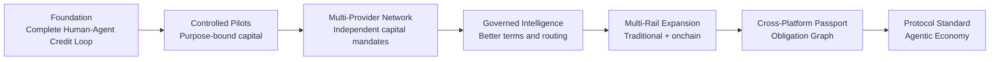

### Phase 0 - Protocol foundation

**Outcome:** complete Human-Agent lifecycle, deterministic authority, canonical Obligations, durable Ledger, Evidence, Credit State, Passport, Human interface, Agent API, and adapter boundaries.

**Gate:** correctness, recovery, security, product clarity, design partners, and approved pilot structure.

### Phase 1 - Controlled credit pilots

**Outcome:** purpose-bound Agent working capital and selected Human productive-credit pilots with named Capital Providers and Providers.

**Gate:** repeat demand, on-time performance, bounded loss, no unauthorized use, reconciliation integrity, partner renewal, and positive contribution.

### Phase 2 - Multi-Provider credit network

**Outcome:** multiple Capital Mandates, Offer competition, Provider integrations, production servicing, and portable Credit Passport.

**Gate:** at least two independent capital sources in qualified segments, measurable improvement in approval or price, concentration control, and complete portfolio Evidence.

### Phase 3 - Governed Credit Intelligence

**Outcome:** model-assisted decisions, term recommendations, intervention, and routing inside explicit Provider-approved policy envelopes.

**Gate:** independent validation, stable out-of-sample performance, explainable benefit, fairness and harm controls, zero policy-envelope breach, and rollback readiness.

### Phase 4 - Multi-rail and onchain capital expansion

**Outcome:** additional settlement adapters, smart-account controls, eligible onchain Facilities, and optional tokenized credit representations.

**Gate:** legally valid structures, custody and signer controls, finality and reorganization handling, no duplicate claims, stable loss, and positive contribution.

### Phase 5 - Cross-platform economic memory

**Outcome:** externally accepted Credit Passports, broader distribution, Obligation Graph intelligence, and privacy-preserving cross-platform learning.

**Gate:** revocation, correction, privacy, fairness, servicing, and jurisdiction controls proven in each market.

### Phase 6 - Credit and obligation protocol standard

**Outcome:** Humans, organizations, Agents, and machines use one interoperable intent-to-credit lifecycle across applications, capital providers, and rails.

**Gate:** sustained utility, resilient governance, high-quality Evidence, independent adoption, and durable participant benefit.

## 40. Strategic Non-Goals

IPO.ONE is not designed to become:

- a global consumer cash-loan application launching in many jurisdictions at once;
- a universal balance-sheet lender by default;
- an unrestricted Agent wallet;
- a public liquidity pool before asset quality and servicing exist;
- a token project that manufactures activity before product-market fit;
- a KYC company;
- an opaque universal credit score;
- a blockchain or payment-rail replacement;
- a chain-specific fork of credit semantics;
- a public repository of raw identity or financial data;
- an autonomous model that can approve, price, or move funds outside deterministic policy; or
- a system that maximizes borrowing volume at the expense of repayment capacity and productive outcomes.

These boundaries protect the product thesis. IPO.ONE is most valuable when it remains the neutral coordination and verification layer around responsibility, capital, obligations, and outcomes.

## 41. The Protocol Horizon

The mature Agentic Economy will contain vast numbers of software actors that differ in capability, ownership, jurisdiction, risk, and purpose.

Some Agents will remain tools under immediate Human control. Some will operate business processes. Some will purchase resources and coordinate other Agents. Some will manage revenue-generating systems. None should be granted financial authority merely because it can produce a signature or call an API.

A scalable economy needs graduated trust.

Trusted actors should be able to:

- establish identity and responsibility;
- receive explicit authority;
- request capital;
- compare qualified Offers;
- create canonical Obligations;
- execute within bounded permissions;
- repay through approved rails;
- prove performance;
- improve terms; and
- carry progress forward.

Capital Providers should be able to:

- express machine-readable policy;
- retain legal and economic control;
- evaluate standardized Evidence;
- fund through their preferred infrastructure;
- monitor exposure and performance;
- reconcile across rails; and
- reuse trusted outcomes without rebuilding every integration.

Applications and platforms should be able to embed credit without becoming credit bureaus, lenders, or servicing systems by default.

IPO.ONE's protocol horizon is therefore larger than one loan product and more disciplined than an autonomous lender.

It is the shared layer through which responsibility becomes machine-readable, Obligations become interoperable, and verified performance becomes future economic capacity.

---

# Conclusion

The next credit system cannot be designed only for the institutional workflows of the past or only for autonomous software at the edge.

Humans and Agents will increasingly share markets, services, capital, and settlement environments. They require one credit and obligation architecture that recognizes both as first-class Subjects while preserving the legal, identity, authority, and risk distinctions that matter.

IPO.ONE provides that common layer.

**Single Kernel, Dual-Native Access** keeps economic truth coherent.

**Identity, Payment, and Obligation** define the essential primitives.

**Stable Kernel + Replaceable Adapters** allows external systems to evolve without fragmenting credit semantics.

**Canonical Obligations, Evidence, and Credit State** convert isolated transactions into permissioned economic memory.

**External capital neutrality** allows many Providers to compete without forcing participants into one balance sheet.

**Governed Credit Intelligence** improves recommendations and allocation while deterministic policy preserves authority.

The end state is clear:

> **A trustworthy Human or Agent can establish responsibility, access appropriately governed capital, fulfill a bounded Obligation, convert verified performance into portable Credit State, and carry that progress across applications, capital providers, and economic environments.**

Payments make autonomous actors economically active.

Credit makes them economically scalable.

# BORROW. BUILD. PROVE.

---

# Appendix A - Canonical Objects

| Object | Definition |
| --- | --- |
| **Tenant** | Security and operational boundary containing authorized Subjects, roles, policy, and resources. |
| **Subject** | Human, organization, Agent, or machine whose economic activity is represented. |
| **PrincipalRelationship** | Link to the person or organization granting authority or bearing legal or economic responsibility. |
| **RoleEnrollment** | Durable record of approved role eligibility and current role selection. |
| **ConsentGrant** | Purpose, data scope, recipient, duration, permitted use, revocation, and audit state for Human authorization. |
| **AgentIdentity** | Verifiable workload identity and approved key relationship for an Agent. |
| **Mandate** | Versioned, bounded, revocable authority defining what an Agent may request, accept, or execute. |
| **VerificationAttestation** | Externally issued identity, organization, account-control, eligibility, or Evidence result with provenance, expiry, and revocation. |
| **CreditIntent** | Subject-neutral request for amount, asset, purpose, duration, repayment source, restrictions, and permitted execution environments. |
| **ExecutionPlan** | Optional bounded task, purchase, Provider, or resource plan linked to a complex or restricted-use Intent. |
| **CreditProfile** | Multidimensional risk, affordability or capacity, fraud, stability, Evidence confidence, and reason factors. |
| **Decision** | Versioned, explainable assessment under active policy and a defined Evidence snapshot. |
| **LenderPolicy / CapitalMandate** | Machine-readable eligibility, pricing, verification, concentration, capital, rail, finality, and servicing rules. |
| **CreditOffer** | Exact terms issued by an identified Capital Provider, including total cost, purpose, conditions, schedule, permitted rails, and expiry. |
| **Authorization** | Context-bound permission to perform one exact action under current identity, authority, policy, and state. |
| **Facility** | Purpose-bound capacity derived from accepted terms and active Obligations; never independent lending authority. |
| **Obligation** | Canonical accepted economic commitment with obligor, Provider, amount, terms, schedule, authority, and lifecycle state. |
| **SettlementInstruction** | Rail-neutral command specifying amount, destination, purpose, adapter profile, and idempotency key. |
| **RailReceipt** | Authenticated external status or transaction record normalized by an adapter. |
| **FinalityProof** | Evidence that the applicable technical-finality policy has been satisfied. |
| **LedgerEntry** | Append-only balanced economic record for funding, allocation, repayment, fee, refund, correction, loss, or recovery. |
| **RepaymentEvent** | Reconciled payment, cure, refund, reversal, correction, write-off, or recovery applied to an Obligation. |
| **Evidence** | Typed, attributable, provenance-aware record supporting a state transition or observation. |
| **CreditOutcome** | Finalized performance result such as on-time repayment, cure, default, loss, or resolution. |
| **CreditState** | Recomputable current exposure and longitudinal performance derived from canonical Obligations and Outcomes. |
| **CreditTrackRecord** | Authorized history of relevant completed and active credit cycles. |
| **DecisionPassport** | Permissioned representation of a specific Decision, Evidence snapshot, policy, terms, and provenance. |
| **CreditPassport** | Permissioned portable representation of relevant factors, Outcomes, and Evidence. |
| **TokenizedCreditAsset** | Optional onchain representation of an eligible legal or economic claim; never a duplicate source of the claim. |
| **OnchainCapitalFacility** | Capital Mandate executed through an onchain environment under defined legal, custody, investor, and servicing controls. |

---

# Appendix B - Obligation Lifecycle

| State | Meaning |
| --- | --- |
| **Proposed** | Intent and preliminary terms exist but no binding Offer has been accepted. |
| **Offered** | Conditional or binding terms are issued by an identified Capital Provider. |
| **Accepted** | Authorized acceptance binds an exact Offer version. |
| **Active** | The canonical Obligation exists and may permit controlled execution. |
| **Execution Pending** | An approved operation has been instructed but required execution or finality Evidence is incomplete. |
| **Outstanding** | Recognized value is owed under the schedule. |
| **Partially Repaid** | A valid portion has been allocated and reconciled. |
| **Due** | A scheduled amount is currently payable. |
| **Delinquent** | Payment is past due under the applicable DPD definition. |
| **Cured** | A delinquency has been resolved under accepted rules. |
| **Restructured** | Terms have been lawfully modified with complete version and Evidence history. |
| **Fully Repaid** | Principal, financial charges, and applicable fees are reconciled. |
| **Defaulted** | Defined default conditions are satisfied. |
| **Written Off** | Economic loss is recognized while recovery history remains possible. |
| **Resolved** | The Obligation has reached a terminal reconciled outcome. |
| **Corrected** | A reversal, duplicate, reorganization, or operational error has been handled through additive correction. |

---

# Appendix C - Illustrative Interface Surface

| Domain | Illustrative operations |
| --- | --- |
| **Identity and authority** | `create_subject`, `bind_principal`, `register_attestation`, `grant_consent`, `create_mandate`, `revoke_mandate`, `register_agent_identity` |
| **Credit and Offers** | `submit_credit_intent`, `submit_execution_plan`, `evaluate_intent`, `request_offers`, `accept_offer`, `get_obligation` |
| **Execution and servicing** | `authorize_action`, `execute_approved_operation`, `record_repayment`, `get_schedule`, `record_cure`, `apply_correction` |
| **Evidence and reconciliation** | `record_receipt`, `query_finality`, `reconcile_event`, `record_reversal`, `finalize_outcome`, `reconstruct_state` |
| **Credit State and Passport** | `get_credit_state`, `get_track_record`, `issue_decision_passport`, `issue_credit_passport`, `verify_passport` |
| **Capital Providers** | `register_capital_mandate`, `create_offer`, `reserve_capacity`, `monitor_exposure`, `export_portfolio_evidence` |
| **Trust and operations** | `rotate_credential`, `revoke_credential`, `freeze_subject`, `pause_adapter`, `get_incident_state`, `export_audit_receipt` |

These names are illustrative protocol operations, not a representation that every interface uses identical route names.

---

# Appendix D - Decision and Portfolio Measures

| Measure | Illustrative formulation | Use |
| --- | --- | --- |
| **Expected Loss** | `EL = PD × LGD × EAD` | Risk economics and reserve calibration |
| **Recommended Limit** | `min(capacity, policy, facility, purpose) × confidence × stress haircut − exposure` | Prevent score-only overextension |
| **Risk-Adjusted Contribution** | `fees + realized financial participation − funding cost − EL − fraud − servicing − compliance − partner share` | Determine whether growth creates economic value |
| **Offer Match Rate** | `qualified requests receiving ≥1 compliant Offer / qualified requests` | Measure capital-network liquidity |
| **Progression Rate** | `eligible good performers receiving improved terms / eligible good performers` | Measure whether verified history creates better access |
| **Capital Utilization** | `average funded exposure / committed Facility capital` | Measure capital efficiency |
| **Evidence Reconciliation Rate** | `fully reconciled economic events / recognized economic events` | Measure state integrity |
| **Unauthorized Action Rate** | `unauthorized or out-of-Mandate attempts with economic effect / total attempts` | Measure authority control; target economic effect is zero |

---

# Appendix E - Glossary

| Term | Definition |
| --- | --- |
| **Agentic Economy** | An economy in which autonomous or semi-autonomous software Agents participate in discovery, coordination, execution, purchasing, and value creation. |
| **Economic Memory** | Permissioned longitudinal memory derived from accountable authority, canonical Obligations, verified outcomes, and provenance. |
| **Obligation Graph** | Permissioned network of Subjects, Principals, Mandates, Offers, Obligations, Providers, rails, Evidence, and Outcomes. |
| **Bounded Authority** | Explicit permission limited by purpose, amount, time, asset, counterparty, operation, and revocation conditions. |
| **Single Kernel, Dual-Native Access** | Human and Agent interfaces differ at the edge but normalize into one canonical credit and obligation system. |
| **Stable Kernel + Replaceable Adapters** | Architecture in which long-lived credit semantics remain stable while external integrations evolve behind versioned boundaries. |
| **Multi-Rail Adapter** | Replaceable component that maps external account, payment, finality, and reconciliation behavior into canonical IPO.ONE events. |
| **Onchain Settlement** | Funding or repayment executed in a blockchain environment and recognized only after applicable technical and legal conditions. |
| **Hybrid Settlement** | Settlement of one Obligation through multiple partial events across traditional and onchain rails. |
| **Sender-Constrained Authentication** | Authentication in which token use requires proof of possession of approved key material rather than presentation of a freely replayable bearer secret. |
| **Evidence Confidence** | Versioned assessment of the relevance, provenance, freshness, consistency, and completeness of Evidence used for a decision. |
| **Credit Intelligence Network** | Governed learning and analytics layer that uses verified outcomes to improve recommendations while remaining subordinate to deterministic authority. |

---

# Appendix F - Selected References

[1] World Bank. *The Global Findex Database 2025: Connectivity and Financial Inclusion in the Digital Economy.* 2025.

[2] Financial Action Task Force. *Guidance on Digital Identity.* 2020.

[3] World Wide Web Consortium. *Verifiable Credentials Data Model v2.0.* W3C Recommendation, May 15, 2025.

[4] IETF. *RFC 9449: OAuth 2.0 Demonstrating Proof of Possession (DPoP).* September 2023.

[5] Ethereum Improvement Proposal 4361. *Sign-In with Ethereum.*

[6] National Institute of Standards and Technology. *Artificial Intelligence Risk Management Framework (AI RMF 1.0)* and *Generative Artificial Intelligence Profile.* 2023-2026.

[7] Model Context Protocol. *Specification 2026-07-28.* 2026.

[8] Agent2Agent Protocol. *A2A Protocol Specification and Governance.* Linux Foundation project.

[9] x402 Foundation / Coinbase Developer Platform. *x402 Protocol v2 Documentation and Specification.*

[10] Chain Agnostic Improvement Proposals. *CAIP-2 Blockchain ID Specification* and *CAIP-10 Account ID Specification.*

[11] W3C, IETF, Ethereum, and chain-agnostic standards are referenced as interoperability and security precedents. Reference does not imply partnership, endorsement, or that IPO.ONE depends exclusively on any named standard.

[12] IPO.ONE. *Product Charter v1.1*, canonical public README, and August 20, 2026 Human-Agent product baseline checkpoint in the public IPO.ONE repository.
