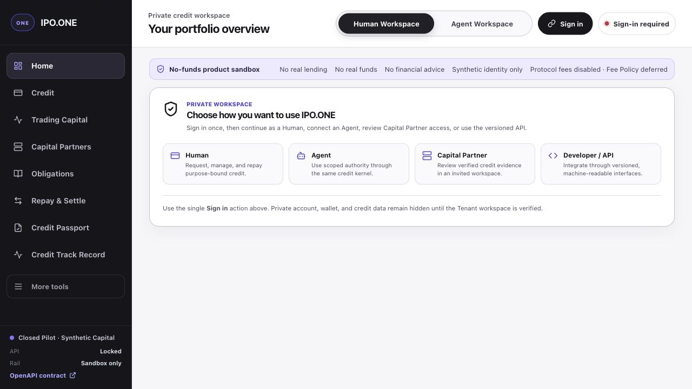
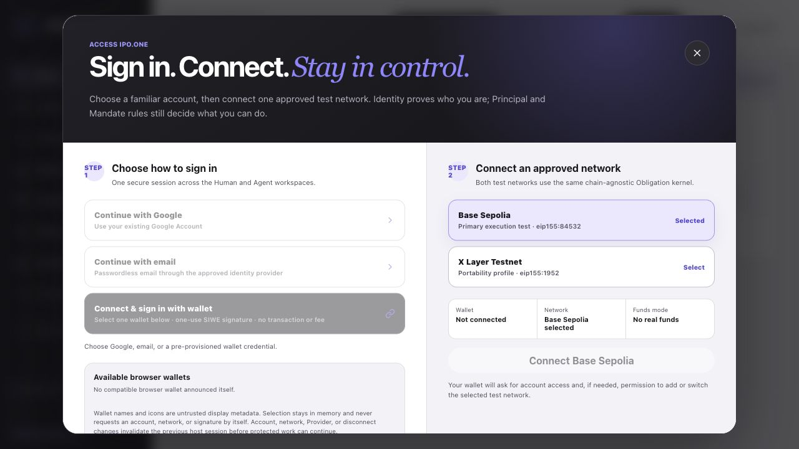
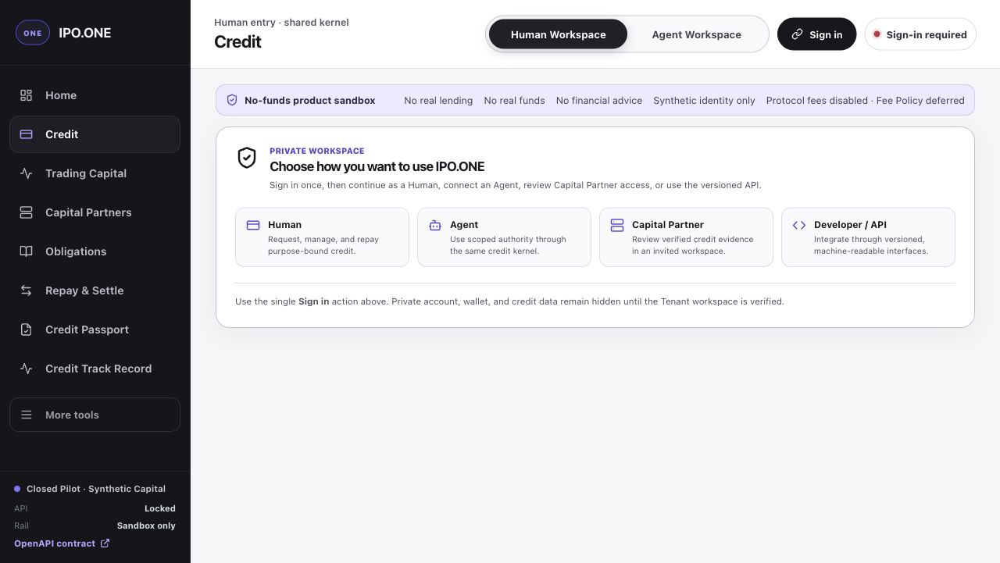

# UX-006 latest-version real-user usability baseline

Date: 2026-08-13 (Asia/Shanghai)

Status: **GATE 0 CLOSED LOCALLY · GATE 1 CLOSED LOCALLY · GATE 2 CLOSED LOCALLY**

Decision: this report remains the controlling UX-006 baseline and now records
the local Gate 0–2 remediation result. The original audit observations are
retained below as historical baseline evidence. The current result is an
uncommitted local synthetic/no-funds candidate; production, deployment,
permissions, contracts, risk policy and funds paths were not changed.

## 1. Executive conclusion

The current local candidate closes the confirmed Gate 0 dead ends, Gate 1
operability/usability findings, and Gate 2 navigation/session regressions. The
changed role journeys now use server-derived locators, goal-level Agent actions,
minimal role navigation, explicit one-read recovery, real Back/Forward history,
and a closed sign-out landing. Human, Principal/Agent, Risk and Capital Partner
fixtures provide current executable evidence for the touched happy, negative
and recovery states.

This is a **local usability closeout**, not a general production-readiness
claim. The public production runtime remains unchanged. The standard persistent
compose stack has also been rebuilt from the current source and passes its
closed no-funds acceptance. Prohibited capital, transaction, signer and
real-value paths remain unavailable; the only tested withdrawal transition is
the synthetic Capital Partner Offer withdrawal.

### Gate 0 closure update — 2026-08-12

Both original P0 defects are closed in the current local candidate and exact
synthetic browser fixtures. Production was not deployed or changed.

- **UX006-P0-001 closed locally:** production roles now derive exact browser
  workspace truth (`primary -> controller`, `risk -> risk`); Borrower and
  Controller no longer advertise Risk or deferred Capital Partner; Risk and
  local Capital Partner expose only their own protected destination; invalid
  or cross-role hashes canonicalize to the safe workspace default.
- **UX006-P0-002 closed locally:** active Agent Mandates now restore an exact
  Obligation before considering continuation absence; no-result recovery has
  one enabled read-only `Check Agent progress` action; the impossible active
  revoke/new-Draft instruction is gone; schema-valid exact continuation is
  required before browser activation review; the local Agent CLI persists the
  existing durable continuation without changing permission semantics.
- Fresh desktop, mobile, narrow/200%-equivalent, keyboard, reload and exact
  recovery browser evidence is in `output/playwright/ux-006-gate0-1/` and
  `output/playwright/ux-006-gate0-2/`. All observed consoles were clean.
- Repository regression passes 916/916. Transport, protocol, bundle, lint,
  typecheck and focused tests pass. PostgreSQL Gate 0 paths pass; the aggregate
  PostgreSQL suite remains 83/85 because the pre-existing Phase 2 Capital
  Partner timing fixture can author a timestamp earlier than the preceding
  database-created projection. Gate 0 changed no Capital Partner or database
  code.
- At that Gate 0 checkpoint, the normal persistent local compose stack was not
  counted because its migration `0054` checksum predated a terminal-blank-line
  cleanup. Gate 2 closeout later proved the SQL bodies are byte-identical apart
  from that terminal whitespace, added one exact fail-closed compatibility
  edge, rebuilt the stack without rewriting the migration table or resetting
  the volume, and passed the current standard local acceptance.

At the Gate 0 checkpoint, closing the two hard dead ends did not yet make the
whole product a usability GO: the P1/P2 findings below remained the controlling
Gate 1 and Gate 2 backlog. The later Gate 1/2 closure updates above supersede
that checkpoint status for the current local candidate.

### Gate 1.1 closure update — 2026-08-12

UX006-P1-001 is closed in the current local no-funds candidate. The browser now
composes exact `/auth/v1/options` truth with current wallet discovery: absent
OIDC methods are absent, wallet/network actions appear only after an explicit
Provider choice, and the signed-out card exposes one primary `Sign in` action.
Options failure clears stale methods and offers a single-flight manual retry;
no-wallet and failure states expose enabled recovery plus a bounded diagnostic
that excludes credentials, addresses, and private resource IDs. The dialog
keeps focus trapped and returns focus to the invoking action on Escape.

Fresh no-wallet, OIDC-only, 503-to-success, and injected EIP-6963 browser
evidence is stored in `output/playwright/ux-006-gate1-1/`. This is local
candidate evidence only: production was not deployed or modified, and the
named ordinary access-support channel remains a separate `REQ-PILOT-002` L2
gate. The next ordered finding is UX006-P1-002.

### Gate 1.2 closure update — 2026-08-12

UX006-P1-002 is closed in the current local no-funds candidate. The ten
permanently unavailable Deposit, allocation, public-pool, funding, withdrawal,
pricing, worker-settlement and transaction-submission items are now four
semantic status lists with exact reasons, not controls. No prohibited
capability, handler, operation, permission or funds path was enabled.

Current browser proof covers Capital Partner, Provider Network, Trading Capital
and Wallet & Permissions at 1440px, 390px and a 720px 200%-equivalent viewport.
The status lists contain zero focusable descendants, never entered an 80-Tab
keyboard traversal, have zero horizontal overflow and dispatched zero economic
mutation. All fixture consoles were clean. Evidence is stored in
`output/playwright/ux-006-gate1-2/`. Production was not deployed or modified.
The next ordered remediation is Gate 1.3 server-derived resource selection for
UX006-P1-004. The remaining signed-out information architecture finding stays
open for its later focused slice.

### Gate 1.3a closure update — 2026-08-12

The Principal single-Agent slice of UX006-P1-004 is closed in the current local
no-funds candidate. Actor, Subject and Mandate identifiers are no longer normal
form inputs, and the manual `Load exact Mandate` action is gone. One exact
authenticated assignment auto-restores; zero, multiple, malformed or incomplete
server truth remains closed without choosing the first resource. Technical
identifiers and receipts are available only inside a collapsed disclosure.

Before each touched Agent-authority mutation, the browser now re-reads
authenticated workspace truth and requires the actor, Subject and Mandate
selection to remain byte-exact. Selection drift synchronously clears the
browser-held challenge, binding, Mandate, Decision, Offer, Obligation, repayment
and Evidence state before mutation dispatch. Completed stages fold away, so the
touched Principal setup states expose one primary next action instead of old
disabled controls or duplicate handoff buttons.

Fresh single, empty, multiple and incomplete-page browser evidence at 1440px,
390px and 720px (200%-equivalent) is stored in
`output/playwright/ux-006-gate1-3a/`. Production was not deployed or modified.
At Gate 1.3a closure, Risk portfolio/queue and Capital Partner
profile/Passport locators remained open because their authorized resume
contracts did not expose safe discovery truth. Gate 1.3b below supersedes the
Risk portion; Capital Partner discovery remained open at that checkpoint and
Gate 1.3c below supersedes it. The
current Principal resume also returns controlled Agent actors and controller
resources as separately authorized sets; this UI slice adds no direct
actor-to-resource association contract, and that hardening remains a separate
permission/protocol decision.

### Gate 1.3b closure update — 2026-08-12

The Risk Portfolio and Servicing Queue slice of UX006-P1-004 is closed in the
current local no-funds candidate. Two narrow, role-specific read queries recover
only the unique active Tenant locator: Risk/Auditor may recover a Portfolio and
Risk/Operations may recover a Queue. Each following detail read independently
reauthorizes the existing capability, exact Tenant resource and recent
phishing-resistant MFA. No capability, role bundle, binding, migration, seed or
business mutation was added.

The normal Risk screen no longer asks for Portfolio or Queue IDs. Startup is
bounded to two locator reads, one Portfolio read and one Queue first page;
health and feedback remain behind the explicit `Load supporting insights`
action. Empty, ambiguous, denied and stale truth clear old data. Cross-session
owner tokens prevent an old response or `finally` block from overwriting or
unlocking a new authenticated session, and Risk ignores browser-held Human or
Obligation locators. Queue pagination denial clears rows and cursor rather than
leaving a stale retry loop. Freeze remains a separate, unchanged protective
mutation and is never prefilled or invoked by Queue recovery.

If any required Risk catalog operation is absent, both resource states clear
and the browser performs zero Risk operations. The enabled Refresh action makes
one bounded catalog request with no automatic loop; after the complete catalog
returns, one Refresh performs the exact four-read bootstrap.

Fresh synthetic no-funds Risk QA-host evidence, including polluted storage,
hard reload, fresh host/browser context, sign-out/sign-in, delayed in-flight
reads, one-side denial, stale detail, pagination denial, 1440/720/390,
keyboard, contrast and reduced motion, is in
`output/playwright/ux-006-gate1-3b/`. Controlled negative responses are the
expected non-enumerating HTTP 400/404 results, not uncaught JavaScript errors
or retry loops. Production was not deployed or modified.
At Gate 1.3b closure, Capital Partner self-profile and Passport inbox discovery
remained separate permission/protocol work. Gate 1.3c below supersedes that
remaining locator finding.

### Gate 1.3c closure update — 2026-08-13

The Capital Partner slice of UX006-P1-004 is closed in the current local
no-funds candidate. Two narrow empty-payload reads recover only the
authenticated Partner's active own Profile and current verifier-bound Passport
applications. Existing Portfolio-read and Offer-authoring capabilities are
reused; every economic command retains its independent exact authorization.

The normal workspace no longer asks for Profile, Passport, Intent, hash or
version inputs. Startup is bounded to `Self -> Inbox -> Portfolio`; a single
application opens automatically, multiple applications use a keyboard-complete
authorized picker, and technical references are collapsed and read-only.
Authoring first rereads the Inbox and requires an exact tuple match, so stale
truth clears the form and sends zero mutation.

Fresh single, empty, multiple, denied, stale-preflight, catalog recovery,
re-login and delayed sign-out browser evidence at 1440/720/390 is in
`output/playwright/ux-006-gate1-3c/`. Normal startup is exactly three reads and
zero mutations; every final recovery audit records zero mutation. Production
was not deployed or modified. No capability, credential, role, migration,
seed, signer or funds path was added.

### Gate 1 closeout update — 2026-08-13

The remaining Gate 1 findings UX006-P1-003, UX006-P1-005,
UX006-P1-006 and UX006-P1-007, plus the Human/Risk remainder of
UX006-P1-004, are closed in the current local candidate.

- Signed-out navigation now exposes Home and one dominant access action.
  Authenticated primary navigation contains at most four destinations for
  Borrower/Controller and only the exact workspace for Risk/Capital Partner.
- A credential-isolated local reference Agent completes application and the
  sandbox runtime behind goal-level browser actions. Principal authority still
  requires explicit decisions; terminal, JSON and exact references are
  collapsed under Developer/Technical details.
- Silent account-binding polling was removed. An explicit Refresh performs one
  bounded read and reports a visible success or retryable failure.
- Human Subject/Consent and owned Obligation references now recover from
  authenticated truth. Risk freeze starts from a labelled authorized Queue
  selection and retains reason, acknowledgement, recent MFA and exact
  reauthorization.
- All four current role fixtures start. Final changed-state evidence includes a
  completed Human lifecycle, the fully repaid reference Agent lifecycle, one
  authored/withdrawn synthetic Capital Partner Offer (4 reads, 2 deliberate
  mutations), and one exact synthetic protective freeze (7 reads, 1 deliberate
  mutation).

Fresh closeout evidence is in
`output/playwright/ux-006-gate1-closeout/README.md`. It complements rather than
erases the Gate 1.1–1.3c negative, re-login, recovery, keyboard, viewport,
contrast and reduced-motion artifacts. No production, standard compose, funds,
role, policy, signer, chain or deployment authority changed.

### Gate 2 closure update — 2026-08-13

UX006-P2-001 and UX006-P2-002 are closed locally, and the UX006-P2-003 silent
polling behavior was removed as part of Gate 1.

- Home → Credit → Obligations creates product history; Back and Forward restore
  the exact authorized views without mutation.
- Invalid hashes canonicalize by replacement, valid deep links survive reload,
  and `#mainContent` remains a native focus anchor rather than a product route.
- Sign-out clears private state, keeps the access dialog closed, returns to the
  canonical signed-out landing and focuses Sign in. No automatic dialog loop
  remains.
- A single ten-minute maximum, presentation-only destination intent is consumed
  once only after the matching authenticated workspace is recovered. Invalid,
  expired, malformed and cross-role values fail closed.

Fresh browser evidence is in `output/playwright/ux-006-gate2/README.md`.
Navigation/session checks dispatched no economic mutation and recorded no
console error or warning. This remains local synthetic/no-funds evidence only.

## 2. Audited versions and environments

| Surface | Exact version / state | Current result |
| --- | --- | --- |
| Audited repository baseline | `65f999c0882ebd16486324509e0eb342a116cb19` on `codex/m1-b-deployable-sandbox`; remote branch matched at audit start | Original audit baseline |
| Current local candidate | Same branch and baseline plus uncommitted, reviewed Gate 0–2 changes | Current-source isolated no-funds review candidate; not deployed |
| Production runtime | `d36ff20c2049b199ed3032e85752f36e36300312` from `/livez` and `/readyz` | Alive and ready; `closed_non_funds_pilot`; `realFundsEnabled=false` |
| Original product assets | Baseline and production `app.js` SHA-256 `b205e648...`; `styles.css` SHA-256 `ccd68a06...` | Byte-equivalent only at audit start; no longer describes the local candidate |
| Local review runtime | Loopback role experience on ports 8787–8790 plus isolated current-source QA hosts | Clickable review surface and changed-state fixture evidence; separate from the standard compose acceptance target |
| Authentication advertised online | OIDC providers `[]`; wallet authentication `true`; Base Sepolia and X Layer Testnet | Wallet-only closed-pilot access |

The deployed runtime is an ancestor of the repository HEAD. At the original
audit baseline, the intervening committed checkout changes were documentation
only. The current uncommitted local candidate now contains Gate 0–2
product changes and is not byte-equivalent to production. Backend release
identity remains reported separately and is not conflated with either state.

Audited experience URLs:

- Production: [https://ipo.one](https://ipo.one)
- Human Borrower: [http://127.0.0.1:8787/#overview](http://127.0.0.1:8787/#overview)
- Principal / Agent authority: [http://127.0.0.1:8788/#request-credit](http://127.0.0.1:8788/#request-credit)
- Risk Operations: [http://127.0.0.1:8789/#risk-operations](http://127.0.0.1:8789/#risk-operations)

The root `pnpm dev` process-local sandbox on port 3000 is not this audit's
product baseline. These links use current canonical view names; legacy
`#human`/`#risk` aliases canonicalize without creating a navigation loop.

## 3. Scope, method, and evidence limits

### In scope

- Current public production entry and current durable local role entries.
- Real-user discoverability, clickability, comprehensibility, completion,
  failure, refresh, navigation, and recovery.
- Human, Principal/Agent, Risk, and Capital Partner product surfaces.
- Visible controls and their actual handlers/unlock conditions.
- Current browser screenshots, live HTTP/runtime checks, current source control
  paths, current static tests, and current local acceptance.

### Out of scope

- Implementing any remediation in this phase.
- Changing credit policy, pricing, limits, roles, permissions, deployment, or
  economic semantics.
- Enabling real funds, custody, withdrawals, transaction submission, public
  pools, mainnet, or production signers.
- Treating historical screenshots or old launch reports as current pass
  evidence.

### Method

1. Identified the exact repository, deployed, and locally running versions.
2. Opened the current product in a fresh browser state and inspected the
   signed-out landing, navigation, and access dialog.
3. Queried current production liveness, readiness, authentication options, and
   delivered workspace metadata.
4. Traced every high-risk control to its render condition, handler, server
   operation, and recovery branch.
5. Ran the current local stack acceptance and static UI suite.
6. Re-ran the current authenticated Human browser host to test whether prior
   browser evidence could be refreshed.

### Original baseline evidence limits

These limits describe the first audit run. The Gate 0–2 closure sections above
record the focused current-browser evidence that later superseded them for the
changed states only; standard compose is separately proven by current local
acceptance, while production remains unchanged.

- The fresh browser had no compatible wallet extension or invited signer. The
  current deployment offered no OIDC provider. Therefore current authenticated
  Human/Principal mutations could not be executed through that browser.
- The current authenticated Human browser QA host fails before launch with
  `invalid_authentication_claims: capabilities is invalid`; this prevents old
  authenticated screenshots from being accepted as current evidence.
- The browser viewport override did not reliably change the in-app viewport, so
  mobile, 200% zoom, complete keyboard operation, contrast, and reduced-motion
  remain **not revalidated**, not passed.
- Source assertions and screenshots establish defects and entry behavior; they
  do not establish an authenticated happy path. Any item needing an invited
  signed-in session is marked as a verification gap until the harness/access
  path is repaired.

## 4. Original baseline visual evidence

### 4.1 Signed-out landing

The boundary text is clear and does not expose private data. However, the left
navigation presents eight prominent destinations plus more tools before the
user has a usable session, while the card's own Sign in control is permanently
hidden and the user is told to find the top-bar action.

### 4.2 Access dialog in a fresh browser

Google and email are visible but unavailable because production reports no OIDC
providers. Wallet is also disabled in this browser because no compatible wallet
was discovered. The modal nevertheless asks the user to choose among those
methods and devotes half of the first screen to network selection before an
identity method can be used.

### 4.3 Product navigation without product differentiation

Selecting Credit updates the page title and URL, but the content remains the
same generic role chooser. This makes the navigation appear productive while
providing no destination-specific explanation or retained post-login intent.

## 5. Findings

Severity rules used here:

- **P0** — a core role journey or recovery path cannot complete, or the public
  surface routes the user to a structurally impossible state.
- **P1** — a user faces dead controls, raw technical inputs, excessive steps,
  misleading availability, or a missing critical recovery action.
- **P2** — navigation, feedback, or secondary efficiency is materially poor but
  a supported route may still exist.

Current local disposition:

| Finding | Current local status |
| --- | --- |
| UX006-P0-001, UX006-P0-002 | Closed in Gate 0 |
| UX006-P1-001, UX006-P1-002 | Closed in Gate 1.1–1.2 |
| UX006-P1-003 through UX006-P1-007 | Closed across Gate 1.3a–1.3c and Gate 1 closeout |
| UX006-P2-001 through UX006-P2-003 | Closed across Gate 2 and Gate 1 polling closeout |

The detailed sections retain the original defect descriptions and acceptance
criteria for traceability. Their `Current local result` paragraphs and the
closure updates above are the controlling current status. None of these local
closures changes production; standard compose is separately proven only for
the local closed no-funds contract.

### UX006-P0-001 — public role topology advertises a deferred, unreachable Capital Partner workspace

**Closed locally in Gate 0; production remains unchanged.** At the original
baseline, the deployed architecture assigned the Primary origin to
Principal/Agent and a separate origin to Risk
(`docs/deployment/VERCEL_SANDBOX_ARCHITECTURE.md:16-48`); it explicitly defers
the Capital Partner browser workspace
(`docs/deployment/VERCEL_SANDBOX_ARCHITECTURE.md:147-155`). Production HTML
nevertheless delivers an empty `ipo-one-workspace-name` meta value.
`currentWorkspaceName()` reads only that value
(`apps/web/src/app.js:1578-1581`), and the production runtime does not pass a
`workspaceNameProvider` (`apps/private-pilot/src/production-runtime.js:166-183`).
Capital Partner requires both an authenticated tenant and
`currentWorkspaceName() === "capitalPartner"`
(`apps/web/src/app.js:5953-6017`). The public shell still advertises Capital
Partners (`apps/web/src/index.html:48-61`).

**User impact:** a user can discover a role destination that is intentionally
not deployed and that this origin cannot bootstrap into a connected workspace.
It ends in a sign-in/role dead end rather than the promised Partner experience.

**Target state:** each deployed origin must expose only its actual role topology
and inject an exact workspace identity. Until a dedicated invited Capital
Partner origin is proven, remove that destination from the public primary
navigation and offer an honest access-request/status page instead.

**Acceptance:** production HTML contains the correct workspace name for its
actual role and does not advertise Capital Partner while that workspace remains
deferred. If/when a separately approved Partner origin exists, an invited
Capital Partner reaches Inbox/Portfolio in one successful sign-in and an
uninvited user gets one actionable access explanation; no other role's
protected navigation is advertised on either origin.

### UX006-P0-002 — Agent active-Mandate recovery instruction is impossible

**Closed locally in Gate 0.** At the original baseline, an active Mandate with
no matching Offer receipt entered
`application_missing` (`apps/web/src/app.js:2427-2445`). The primary button then
says `Create a new Draft Mandate`, but that stage is excluded from the enabled
states (`apps/web/src/app.js:2516-2534`). The helper asks the user to revoke the
active Mandate (`apps/web/src/app.js:2567-2568`), but Web has no revoke action,
and the protocol operation is explicitly `pilotRevokeDraftMandate`
(`packages/api-contract/src/tenant-protocol.js:702-712`). The page reaches this
state only after its server-resume lookup finds no exact continuation receipt,
so this is the unresolved recovery branch, not ordinary client-cache loss.

**User impact:** when durable continuation truth is absent or unrecoverable, the
Principal is stranded on a disabled primary action with an instruction the
product cannot perform. Moving between Console and setup does not resolve the
state and can feel like a loop.

**Target state:** first restore the Offer/workflow receipt from durable server
truth. If restoration is impossible, expose one supported, terminal or
replacement operation with exact consequences. Never ask the user to revoke an
active resource through a draft-only operation.

**Acceptance:** with an active Mandate, clear the client receipt both when a
durable continuation exists and when it does not. Refresh, new-tab, re-login,
and local restart must either restore the exact continuation or reach a
truthful, supported terminal/replacement state in at most two deliberate
interactions; there is no disabled primary CTA and no browser-owned canonical
receipt.

### UX006-P1-001 — visible authentication methods are unavailable

**Closed locally; production remains unchanged.** The original deployment reports
`oidcProviders=[]` and wallet authentication enabled. The dialog always renders
Google, email, and wallet controls (`apps/web/src/index.html:2512-2530`), while
rendering only disables Google/email when absent and wallet when no provider is
discovered (`apps/web/src/app.js:614-621`). The unavailable methods are hidden
only after authentication (`apps/web/src/app.js:663-665`).

**User impact:** the first interaction presents three apparent choices, none of
which can be used in a fresh browser. This directly violates the requirement
that a visible button be actionable.

**Target state:** render only methods returned by the authentication options and
actually usable in the browser. If there is no method, replace the action list
with an explanation, install/open-wallet guidance, a retry, and a real pilot
support/access route.

**Acceptance:** every visible authentication button is enabled or has a
short-lived, visibly stated prerequisite that the user can complete in place;
OIDC methods absent from options are absent from the UI; auth-options failure
has a working retry and never silently cycles.

**Current local result:** the browser renders only exact server-advertised OIDC
providers, exposes wallet and network actions only after an explicit discovered
Provider selection, and replaces unavailable wallet/auth discovery with enabled
rediscovery or single-flight retry. A first-screen card CTA opens the dialog;
Escape restores focus; no non-pending changed control is visibly disabled.
Evidence and command results are recorded by
`UX_006_GATE_1_AUTHENTICATION_TRUTH.md`.

### UX006-P1-002 — ten permanent disabled pseudo-buttons

**Closed locally; production remains unchanged.** The original product renders
ten disabled buttons with no ID, handler, or possible enable transition:

- Deposit, Allocate funds, Withdraw (`apps/web/src/index.html:1383-1387`)
- Join public pool, Fund facility, Withdraw, Set production pricing
  (`apps/web/src/index.html:1492-1497`)
- Run settlement and Withdraw (`apps/web/src/index.html:1572-1573`)
- Submit transaction (`apps/web/src/index.html:1663`)

Global CSS deliberately renders them as buttons and uses a not-allowed cursor
for disabled state (`apps/web/src/styles.css:61-80`).

**User impact:** the interface visually offers actions it will never accept.
Safety boundaries become frustrating controls instead of clear product status.

**Target state:** keep the safety boundary but replace these elements with
plain-language status rows, phase badges, or an unavailable-capabilities list.
Do not enable the underlying actions.

**Acceptance:** outside a pending request, there are zero visible buttons with
no reachable enabled state; every visible button maps to a real handler and one
observable result; permanently unavailable capabilities are not buttons.

**Current local result:** the exact 3+4+2+1 inventory is now four
`role=list`/`role=listitem` status collections with a reason for every item and
no interactive descendant. A fail-closed static test includes disabled buttons
instead of skipping them; 34 remaining initially disabled controls all have
stable browser-action IDs and zero are anonymous. Browser evidence at desktop,
390px and 200%-equivalent width proves the status rows are not Tab stops, have
no legacy pseudo-button match or overflow, and trigger no economic request.

### UX006-P1-003 — signed-out navigation is broad but indistinguishable

**Closed locally in Gate 1 closeout.** The original
sidebar defines fifteen product/tool
destinations (`apps/web/src/index.html:40-123`). In signed-out state, every
private panel is hidden (`apps/web/src/styles.css:1263-1273`) and the same
generic shield remains. The shield's own Sign in button is permanently hidden
by render logic (`apps/web/src/app.js:642-654`).

**User impact:** the user can click many destinations and see headings/hashes
change, but receives the same content and no role-specific next step. It feels
like empty navigation and forces the user to hunt for the one top-bar sign-in
action.

**Target state:** signed-out navigation should be Home, product explanation,
and one Sign in/access action. After role recovery, show no more than four
role-specific destinations and preserve the intended destination through
authentication.

**Acceptance:** signed-out primary navigation contains only useful public
destinations; the landing card contains the dominant, keyboard-reachable Sign
in CTA; after authentication, navigation reflects the exact role and returns to
the intended valid destination.

**Current local result:** signed-out presentation exposes Home and an explicit
dominant Sign in action. Authenticated Borrower/Controller navigation is capped
at four primary destinations; Risk and Capital Partner expose only the exact
workspace. One short-lived destination intent restores only after matching
server workspace recovery, and hidden cross-role destinations are not tabbable.

### UX006-P1-004 — normal role journeys require internal identifiers

**Closed locally across Human, Principal, Risk and Capital Partner normal
journeys.** The original normal-journey Human Subject/Consent and owned
Obligation inputs, Agent Actor/Subject/Mandate inputs, Risk Portfolio/Queue
inputs, and Partner Profile/Passport/Intent/hash/version inputs have been
removed by Gates 1.3a–1.3c and the Gate 1 closeout.

**Gate 1.3a closed locally:** the Principal single-Agent slice now derives its
Agent, Subject and Mandate locators from authenticated workspace resume truth,
automatically reloads an exact Subject/Mandate, removes all three ID inputs and
the manual `Load exact Mandate` action, and moves receipts behind Technical
details. Zero, multiple, malformed or incomplete selections fail closed and
clear prior transient Agent state.

**Gate 1.3b closed locally:** Risk Portfolio and Queue now use two narrow
server-derived reference queries and exact reauthorized reads. ID inputs and
prerequisite-only Load buttons are absent; ambiguous or stale truth fails
closed, and no browser locator can become authority.

**Gate 1.3c closed locally:** Capital Partner Self and authorized Passport Inbox
queries derive the own Profile and current verifier-bound applications from
authenticated server truth. A single application auto-opens; multiple items use
a labelled keyboard picker; Offer preflight rereads and exact-matches the tuple
before any mutation.

**Original user impact:** users had to obtain, copy and correctly type opaque
values the authenticated workspace already knew. The reviewed role slices no
longer require that ceremony in the current local candidate.

**Target state:** use authenticated server-derived resume, automatically open a
single bound resource, and provide an authorization-filtered picker for
multiple resources. Put IDs, hashes, versions, and operation names inside an
expandable technical receipt.

**Acceptance:** zero manual ID/hash/version entry in Human, Principal, Risk, and
Capital Partner normal journeys; single resources auto-open; multiple resources
use a labelled authorized picker; receipts remain queryable.

### UX006-P1-005 — Agent's normal browser route exposes terminal handoffs and repeated checks

**Closed locally in Gate 1 closeout.** At the original baseline, Principal
authority was presented as six numbered stages
(`apps/web/src/index.html:763-899`). The application copy says that this
Principal screen cannot execute or independently verify the Agent
(`apps/web/src/index.html:870-880`). The local controller runtime does provide
a credential-isolated reference-Agent HTTP service
(`apps/private-pilot/src/local-reference-agent-http.js:25-31`, `406-475`), but
the current browser calls only its account-proof route
(`apps/web/src/app.js:8303-8331`). Application and runtime are presented through
download/`pnpm` instructions (`apps/web/src/app.js:2800-2816`) followed by
manual checks of persisted Offer, Obligation, spend, repayment, and Evidence
(`apps/web/src/app.js:2829-3005`).

**User impact:** the product already has the service needed for a browser-based
reference-Agent path, yet an ordinary pilot user is routed through repository,
JSON handoff, terminal, role-switching, and repeated-check concepts to finish
one synthetic lifecycle.

**Target state:** provide a credential-isolated, server-orchestrated reference
Agent path in the browser. Show one Principal decision at a time. Keep CLI/JSON
transport under Developer / Technical details.

**Acceptance:** Principal Agent authorization requires no more than three
deliberate decisions; an active Mandate starts one in-scope workflow with one
goal-level action; no normal-user terminal, copied ID, or downloaded JSON; every
stage shows current state, one next action, and a queryable result.

**Current local result:** the credential-isolated local reference Agent now
runs application and the complete sandbox lifecycle through goal-level browser
actions. The current fixture reaches `Fully Repaid` and leaves one enabled
`Review Agent obligations` action. CLI/JSON material remains in collapsed
Developer details, and production-like Principal paths cannot invoke the local
reference-Agent routes.

### UX006-P1-006 — authenticated real-browser regression path is currently broken

**Closed locally in Gate 1 closeout.** At the original baseline, running
`node apps/web/test/support/human-lifecycle-browser-host.mjs` on the current
checkout exits before serving the page with
`invalid_authentication_claims: capabilities is invalid` from
`createAuthenticationContext`.

**User impact:** prior browser screenshots cannot be refreshed against the
latest code, and the release suite can remain green while the real signed-in
flow is unproven.

**Target state:** restore the authenticated role browser hosts, remove duplicate
or invalid capability claims, and make current Human, Agent, Risk, and Capital
Partner browser journeys a required release gate.

**Acceptance:** all four current role hosts start from a clean checkout; each
core role has happy, rejected/failed, refresh, re-login, duplicate-click, and
restart coverage; browser evidence binds the exact release.

**Current local result:** Human, Principal/Agent, Risk and Capital Partner
fixtures start against current assets. Gate-specific artifacts cover the
applicable happy, rejected/failure, recovery, duplicate, reload/re-login and
restart conditions; the final closeout additionally records completed Human,
Agent, Capital Partner and Risk outcomes. These are isolated synthetic fixture
proofs, not standard compose or hosted availability evidence.

### UX006-P1-007 — primary-action contract omits Risk and Capital Partner

**Closed locally in Gate 1 closeout.** At the original baseline,
`apps/web/test/manual-primary-actions.v1.json` inventoried Human, Agent, and
shared actions but no complete Risk or Capital Partner journey. The original
static test skipped every button containing `disabled`; Gate 1.2 removed that
exemption and added the exact ten-item semantic inventory. At that checkpoint,
full role transition and observable-result proof remained open; the Gate 1
closeout evidence below supersedes it.

**User impact:** green tests do not prove those role controls ever enable,
execute, report failure, or reach a durable result.

**Target state:** inventory every role and state, not only initially enabled
controls, and verify the full transition from prerequisite to result.

**Acceptance:** the action inventory covers all visible buttons in all four
roles and asserts `visible -> prerequisite or enabled -> exactly one action ->
understandable result`; a permanently disabled button fails CI.

**Current local result:** the inventory and static contract include the Risk
protective action and Capital Partner Offer lifecycle. Every authored HTML
button has a handler/result contract, and permanently disabled controls fail
the test. Real-browser fixture evidence records one exact Capital Partner
author/withdraw sequence and one exact Risk freeze sequence with explicit read
and deliberate-mutation counts.

### UX006-P2-001 — Back, deep links, and invalid hashes are not canonical

**Closed locally in Gate 2.** At the original baseline, `showView` used only
`history.replaceState`
(`apps/web/src/app.js:8580-8619`), so sequential product navigation creates no
browser history. Boot and hash changes can render Overview for an unknown hash
without normalizing the URL (`apps/web/src/app.js:11096-11114`). The local
Principal link emits `#human` (`apps/web/src/app.js:1635-1646`), which is not a
defined product view.

**Target state:** user navigation uses push state; boot/canonicalization uses
replace state; valid aliases resolve to a defined view; invalid hashes are
replaced with the canonical URL.

**Acceptance:** Home -> Credit -> Obligations then Back returns Credit and Home;
refresh preserves every legal deep link; invalid hashes visibly and
addressably normalize; cross-role links use valid destinations.

**Current local result:** deliberate product navigation pushes history;
Back/Forward restore exact role-authorized views. Boot, alias, invalid and
cross-role canonicalization replace rather than append. Reload retains valid
deep links, and native `#mainContent` focus does not change the product view.

### UX006-P2-002 — Sign out immediately reopens Sign in

**Closed locally in Gate 2.** At the original baseline, successful sign-out
closed the dialog and immediately opened it
again (`apps/web/src/app.js:1084-1088`).

**User impact:** the user can interpret sign-out as having failed or as a
navigation loop.

**Target/acceptance:** sign-out lands on the signed-out home, keeps the dialog
closed, clears private state, and returns focus to the card Sign in CTA. Only a
new user action may reopen the dialog.

**Current local result:** sign-out clears private state, canonicalizes to
`#overview`, leaves the access dialog closed, focuses the visible access action,
hides authenticated controls, and does not reopen authentication without a new
user action.

### UX006-P2-003 — bounded Agent polling fails silently

**Closed locally in Gate 1 closeout.** At the original baseline, account binding
polled
every 1.5 seconds for up to five minutes or 200 attempts
(`apps/web/src/app.js:95-101`, `8334-8413`). Errors are swallowed and polling
continues without a visible attempt, failure, or timeout state.

**Target state:** visible wait status, bounded exponential backoff, a clear
timeout/failure result, and a user-triggered Retry. One subject may have at most
one polling timer.

**Acceptance:** consecutive transport failures stop at a defined threshold and
show Retry; expiry shows a terminal message; success, expiry, navigation,
sign-out, and subject change all stop the timer.

**Current local result:** the background timer and repeated read loop were
removed. Account-binding recovery occurs only after an explicit Refresh; each
action sends one read and shows success or a retryable failure. There is no
timer to survive navigation, sign-out, Subject change, expiry or transport
failure.

## 6. What was healthy at the original baseline, plus current changed-state proof

- Production `/livez`, `/readyz`, and authentication-options requests succeed.
- The production boundary explicitly reports no real funds.
- The loopback role entries remain the Founder-review product surface. Exact
  current-source changed-state behavior is additionally proven by isolated
  Human, Principal/Agent, Risk and Capital Partner QA hosts. These are not a
  substitute for standard compose acceptance.
- The current Web suite passes 178/178, including navigation, role surface,
  server-recovery and all-button/control contracts.
- No empty visible `href="#"`, empty click handler, unbounded redirect/reload,
  browser storage used as authorization truth, or generic View/Open/Continue
  label hiding an economic mutation was found.
- The signed-out surface hides private data, communicates no-funds boundaries,
  and uses semantic navigation, headings, dialog labelling, status regions, and
  a skip link.
- Human accept, execute, and repay actions use explicit mutation language and
  protected confirmation logic.

These positives establish the current local candidate's changed-state
infrastructure and safety posture. They do not prove production, hosted-pilot,
testnet or real-value readiness; standard compose is verified only for the
local closed no-funds contract.

## 7. Target experience and remediation plan

Remediation must be delivered as issue-sized changes. The order below is the
release order; later polish must not leapfrog unresolved blockers.

### Gate 0 — eliminate dead ends

1. **Role-topology truth:** inject exact workspace identity per origin and show
   only that origin's available role surface. Remove or redirect unserved role
   destinations. **Closed locally in UX-006 Gate 0.1.**
2. **Agent durable recovery:** restore exact Offer/continuation data from server
   truth; expose one supported read-only waiting/unknown state for unrecoverable
   active authority; remove the active-Mandate/draft-revoke contradiction.
   **Closed locally in UX-006 Gate 0.2.**

Exit: both P0 findings pass current production/local browser fixtures; there is
no unreachable primary action or role destination.

### Gate 1 — make every visible action real and shorten the journey

3. **Authentication truth:** render only available methods; make the landing
   card Sign in the dominant CTA; add actionable retry/support states.
   **Closed locally in UX-006 Gate 1.1.**
4. **Control semantics:** replace all permanently disabled pseudo-buttons with
   non-interactive status content; retain prohibited-action boundaries.
   **Closed locally in UX-006 Gate 1.2.**
5. **Server-derived role workspaces:** remove normal-user ID/hash/version input;
   auto-open or provide authorized pickers. **Principal single-Agent slice
   closed locally in UX-006 Gate 1.3a; Risk Portfolio/Queue closed locally in
   Gate 1.3b; Capital Partner Profile/Passport Inbox closed locally in Gate
   1.3c.**
6. **Agent one-goal flow:** reduce Principal authorization to at most three
   decisions; orchestrate the registered reference Agent behind one browser
   next action; move CLI handoffs to developer details. **Closed locally in
   UX-006 Gate 1 closeout.**
7. **Role information architecture:** signed-out minimal navigation; authenticated
   role navigation no more than four primary destinations; one dominant action
   per surface. **Closed locally in UX-006 Gate 1 closeout.**
8. **Visible async recovery:** explicit progress, timeout, failure, reconcile,
   and retry states; no silent five-minute polling. **Closed locally in UX-006
   Gate 1 closeout by replacing polling with one explicit bounded read.**

Exit: a normal user never needs a terminal, internal locator, hidden
prerequisite, or permanently disabled button to complete an in-scope role task.

### Gate 2 — navigation, accessibility, and regression proof

9. **Browser navigation:** push/Back/Forward behavior, canonical deep links,
   truthful post-sign-out landing, and retained post-login intent. **Closed
   locally in UX-006 Gate 2.**
10. **Role browser matrix:** Human, Principal/Agent, Risk, and Capital Partner
    happy/rejection/failure/recovery/duplicate/restart tests; full control-state
    inventory in CI. **Closed locally for the changed Gate 0–2 states using the
    cumulative current-candidate artifacts.**
11. **Accessibility/responsiveness:** current-run desktop and mobile screenshots,
    complete keyboard path, visible focus/focus return, status announcements,
    200% zoom, contrast, reduced motion, and no horizontal task loss. **Closed
    locally for the changed Gate 0–2 states.**

Exit: the exact candidate release has current executable evidence for every
required role and state; no historical evidence is substituted.

## 8. Universal iteration acceptance contract

Every subsequent UX-006 remediation issue must include and satisfy:

1. One context and one user-visible defect from this report.
2. Explicit scope and non-goals, including what remains unavailable.
3. A complete control inventory for all states touched by the issue.
4. Exactly one visually dominant next action on each primary state.
5. No manual internal ID/hash/version in a normal role journey.
6. No permanently disabled visible button; pending/busy is time-bounded and
   visibly explained.
7. Positive, rejection, failure, unknown-result, duplicate-click, refresh,
   re-login, new-tab, Back, and restart evidence as applicable.
8. Idempotency or explicit non-retryable behavior for every mutation.
9. Queryable Event/Evidence or a clear no-mutation result.
10. Desktop, mobile, keyboard, focus, 200% zoom, contrast, and reduced-motion
    checks for every changed primary flow.
11. Exact commit/release binding, test commands, screenshots, and a clickable
    experience URL kept available for Founder review.
12. No deployment, funds, permission, policy, or production claim beyond the
    separately approved boundary.

## 9. Verification results from this audit

| Check | Result |
| --- | --- |
| Current local review surface | PASS — standard compose serves the current Gate 2 asset graph on 8787–8790; fresh in-app-browser smoke at desktop and 390px confirms exact borrower/controller/risk/capitalPartner metadata, visible Sign in, zero visible disabled controls, zero horizontal overflow and zero console errors/warnings. Exact signed-in changed states are additionally verified on isolated current-source QA hosts |
| `pnpm run local:status` | PASS — standard compose PostgreSQL, Pilot and Worker are healthy; Lima loopback forwarding is ready |
| `pnpm run local:acceptance` | PASS — PostgreSQL 17, 61 migrations, four wallet-gated role workspaces, durable Agent proof, forced RLS, Worker heartbeat, reconciliation and empty pending outbox |
| Current Web suite | PASS — 178/178; includes navigation, role-surface, server-recovery, permanent-capability and all-button structural contracts |
| Gate 1.2 four-surface browser matrix | PASS — 12 screenshots; 1440/390/720, keyboard, overflow, console, request, contrast and reduced-motion evidence |
| Gate 1.3a Principal Agent-selection matrix | PASS — 12 matrix screenshots plus 2 fresh-sign-in contrast captures; single/empty/multiple/incomplete truth at 1440/390/720, sign-out/sign-in recovery, keyboard, contrast, reduced motion, IDs removed and zero unsafe mutation |
| Gate 1.3b Risk server-recovery matrix | PASS — synthetic no-funds QA-host evidence in `output/playwright/ux-006-gate1-3b/`; single/empty/multiple/one-side denied/stale, four catalog-missing variants and recovery, polluted storage, fresh host/browser context, delayed sign-out/sign-in, pagination denial, 1440/720/390, keyboard, contrast, reduced motion and zero mutation; negative console entries are only the expected controlled 400/404 responses |
| Gate 1.3c Capital Partner recovery matrix | PASS — synthetic no-funds QA-host evidence in `output/playwright/ux-006-gate1-3c/`; single/empty/multiple/denied/stale preflight, catalog recovery, re-login and in-flight sign-out at 1440/720/390; normal startup is 3 reads/0 mutation and all final recovery audits record 0 mutation |
| Gate 1 closeout role journeys | PASS — current synthetic QA-host evidence in `output/playwright/ux-006-gate1-closeout/`; Human completed, Agent fully repaid, Capital Partner author/withdraw 4 reads + 2 deliberate mutations, Risk freeze 7 reads + 1 deliberate protective mutation; no real funds |
| Gate 2 navigation/session | PASS — current evidence in `output/playwright/ux-006-gate2/`; Back/Forward, canonical invalid/deep links, native skip focus, closed sign-out and matching post-login intent; zero navigation mutation and clean consoles |
| `pnpm run test:postgres` on fresh isolated test DB | PASS — 86/86; persistent Pilot DB untouched |
| `pnpm test` | PASS — 961/961 |
| Transport, security, bundle, lint and typecheck | PASS — 79/79 transport; 34/34 security; 37 authored Web modules and 904 unique IDs; lint and typecheck clean |
| Production `/livez`, `/readyz`, `/auth/v1/options` | PASS — exact release and closed no-funds boundary recorded |
| Original authenticated Human browser host | HISTORICAL BASELINE FAIL — `invalid_authentication_claims: capabilities is invalid`; superseded for the current changed state by the repaired fixture and completed Human evidence |
| Current signed-in fixtures | PASS for the exact Gate 0–2 changed states across Human, Principal/Agent, Risk and Capital Partner; isolated fixture evidence is not hosted/production availability |
| Changed Gate 0–2 mobile, keyboard, 200%, contrast, reduced motion | PASS in the cumulative gate artifacts for the exact touched states; no product-wide production-readiness claim |
| `git diff --check` | PASS after the final shared-tree edits |

## 10. Final remediation decision

Gate 0, Gate 1 and Gate 2 are **closed locally** for the current exact
synthetic/no-funds candidate. The confirmed role-topology, Agent recovery,
authentication truth, permanent pseudo-control, internal-locator, Agent
handoff, role-navigation, silent-polling, browser-history and sign-out-loop
findings no longer remain open in the reviewed local states. Current executable
evidence covers the four required roles and the applicable positive, negative,
recovery and session behaviors.

The candidate remains **NO-GO for any claim of production, hosted-pilot,
testnet or real-value readiness**. Production is unchanged; the standard
persistent compose stack passes only the local closed no-funds contract.
Subsequent iteration must preserve
the closed Gate 0–2 contracts and pass a separately authorized delivery gate
before any broader operational claim.
