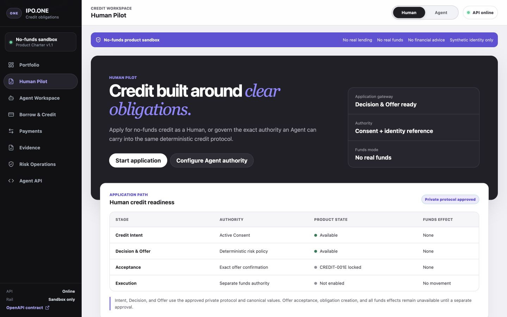
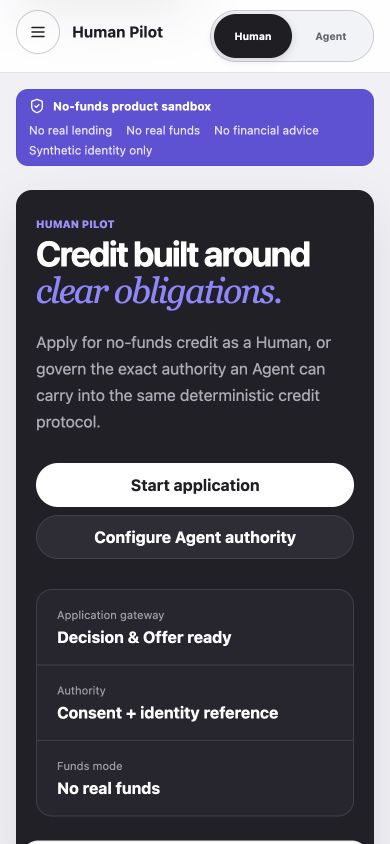
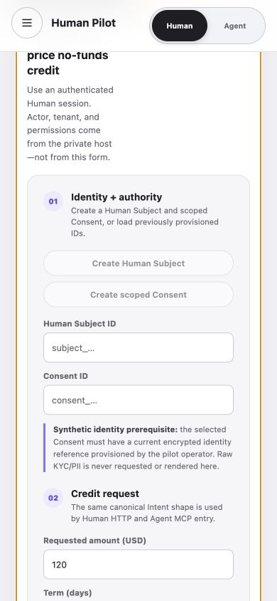
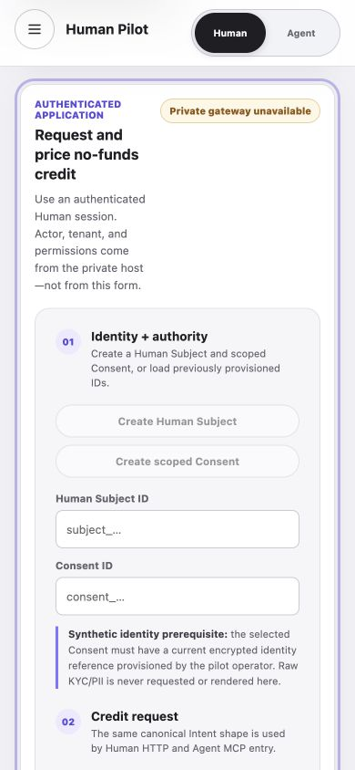
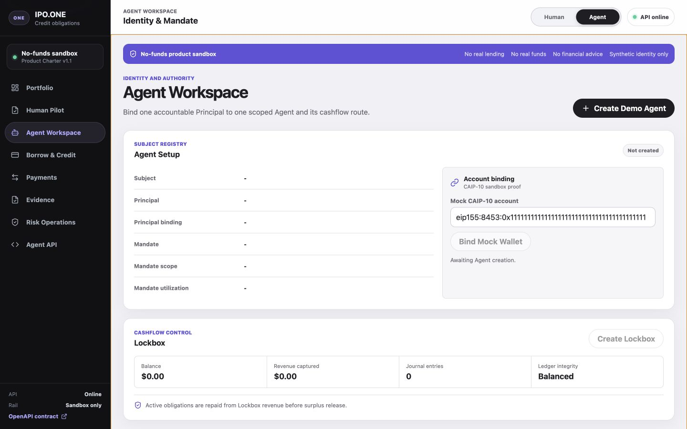
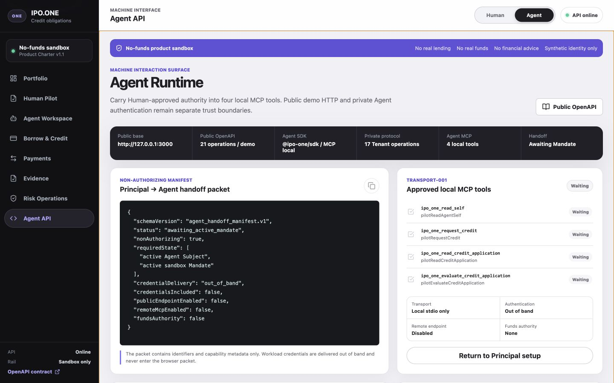
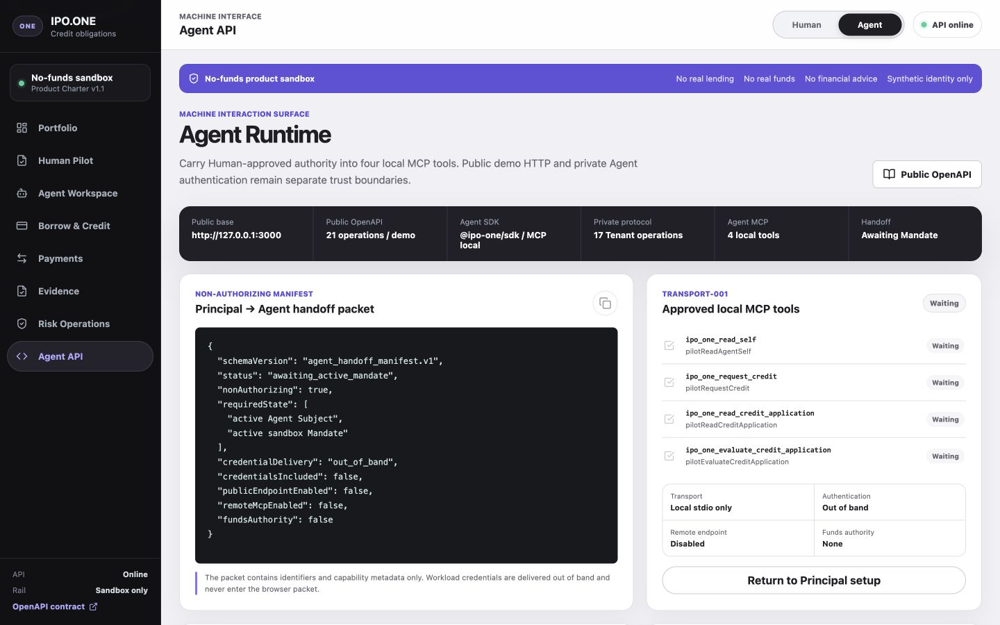

# WEB-003 Human and Agent Navigation Audit

Date: 2026-07-16
Mode: Combined UX and accessibility audit
Surface: Current local IPO.ONE no-funds product at `127.0.0.1:3000`
Reference: The three Aave desktop captures supplied by the project owner

## Audit Scope

The captured flow covers the default Human entry, mobile jump into the Human
application, Agent Workspace, and Agent API. It checks visible hierarchy,
capability clarity, responsive reflow, focus placement, view-change status, and
horizontal overflow. It does not claim full WCAG conformance or authenticate a
production Human or Agent.

## User Goal and Accessibility Target

A Human should be able to enter the no-funds credit product, understand the
authority and locked stages, and reach the application without losing its
heading behind the sticky header. An Agent operator should be able to switch to
the machine surface and hear the correct selected view. Target: clear keyboard
focus, polite live-region feedback, no horizontal overflow, and 44px mobile
primary controls.

## Numbered Flow

### 1. Human Pilot entry — healthy

- Strong Aave-aligned hierarchy: dark navigation and hero, light data surface,
  restrained violet accent, large human-readable action labels.
- The no-funds boundary and locked Acceptance stage are visible without
  implying a real loan or disbursement.
- The actual application remains below the readiness summary, but the primary
  action is prominent and unique.

### 2. Human mobile entry — healthy

- The 390x844 layout reflows without horizontal overflow.
- Human/Agent mode and both primary choices expose touch-friendly targets.
- The hero is dense but coherent; the application status is readable without
  exposing raw identity data.

### 3. Jump to Human application — issue found, then fixed

Before:

After:

- Before the fix, `scrollIntoView({ block: "start" })` placed the workbench at
  viewport top while the sticky 73px header covered its heading. The visible
  title started at “price no-funds credit”.
- After the fix, the workbench starts at 91.84px, its heading starts at
  136.84px, the sticky header ends at 73px, and horizontal overflow remains
  exactly zero.
- The focused workbench now has an intentional violet indicator instead of the
  browser's unrelated default outline. Reduced-motion preference selects an
  immediate rather than smooth jump.

### 4. Agent Workspace — healthy with an intentional boundary

- Subject, Principal, Mandate, CAIP-10 sandbox proof, and Lockbox are grouped
  into understandable operational cards.
- The public demo action and separately locked account-binding action are
  visually distinct. This is accurate but is not evidence of the pending
  `IDENTITY-001` activation capability.

### 5. Agent API — issue found, then fixed

Before:

After:

- The machine surface clearly separates 21 public demo operations, 17 private
  Tenant operations, four local MCP tools, out-of-band authentication, and no
  funds authority.
- Before the fix, switching here left the live region saying “IPO.ONE human
  workspace ready” and drew a default non-brand outline around the complete
  main landmark.
- After the fix, the live region says “Agent API view selected”, the main
  landmark remains focused for assistive technology, its decorative outline is
  removed, and horizontal overflow remains zero.

## Strengths

- The selected Aave visual reference is recognizable without copying product
  claims that IPO.ONE cannot make.
- Human and Agent presentation differ while the same protocol maturity and
  no-funds boundary remain explicit.
- Controls use semantic buttons, labels, landmarks, a skip link, live regions,
  visible disabled states, and responsive touch targets.

## UX and Accessibility Risks

- The public shell can display the complete Human form while the private
  Gateway is unavailable. The disabled status is explicit, but external users
  still need an approved authenticated pilot composition to complete the flow.
- The page is long on mobile. The corrected jump makes the primary task usable,
  but Acceptance and later servicing screens remain permission-gated rather
  than merely hidden.
- Screenshots and DOM inspection cannot prove contrast ratios, screen-reader
  speech output, browser zoom to 400%, or complete keyboard order across every
  view.

## Recommendations

1. Keep the new scroll offset and view-announcement behavior as regression
   contracts for every added lifecycle workbench.
2. When `CREDIT-001E` is approved, add Offer acceptance inside the existing
   result console rather than creating an unrelated second borrowing flow.
3. Run the same 390x844 and 1440x900 capture path after every approved Human or
   Agent lifecycle increment.
