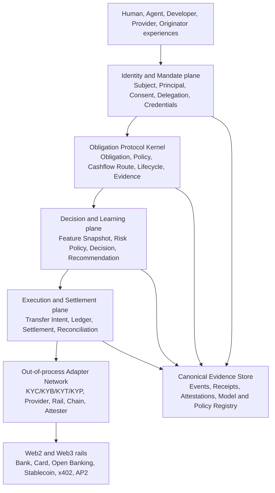

# IPO.ONE Architecture Review and Target Product Model v0.2 (Draft)

版本：v0.2 Draft
日期：2026-07-11
状态：Architecture review proposal, not yet canonical
适用范围：Product Charter、MVP Build Spec、public interactive MVP、未来 Human/Agent/Web2/Web3 扩展

> 本文是对现有 Product Charter、MVP Build Spec、两份 Codex mission、全部
> MVP 源码、SQL migration、测试、README 和真实浏览器流程的独立审计。它不
> 自动替代 v1.0 Product Charter 或 v0.1 MVP Build Spec。涉及协议对象、资金
> 路径、权限、模型治理和生产部署的变更，仍需 Founder/CTO/Security/Legal
> review 后通过 ADR 进入正式 canon。

## Implementation Checkpoint (2026-07-11)

本审计提出的第一组协议内核缺口，现已在 local interactive MVP 中完成可运行实现：

- first-class `Mandate v2`，包括实时撤销、过期、capability、provider/category、
  asset、per-action 和 aggregate reservation；
- append-only double-entry Ledger、idempotent posting、trial balance、Lockbox
  projection 和 repayment route replay protection；
- 每个 Credit/Audit append 自动生成 `evidence_event.v2` envelope；
- data-only Plugin Manifest/Registry，禁止 executable payload、secret、fail-open
  policy 和非 sandbox HTTP endpoint；
- JSON Schema、SQL baseline、deferred ledger balance constraint、ADR 和测试。
- Rail-first PostgreSQL event repository、serializable command append、stream
  version、Evidence、transactional outbox/inbox、lease/retry/dead-letter、真实
  migration up/down/up 和 crash/restart replay 测试。
- OpenAPI 3.1.2 覆盖全部 21 个当前 API operation，RFC 9457-compatible Problem
  Details、request correlation、route/SDK parity check，以及 zero-dependency
  JavaScript SDK + TypeScript declarations。

这些实现只将设计从“概念缺口”推进到“可执行协议原型”。它们不改变本文的
production no-go 结论；认证/RBAC/tenant、非 Rail 核心状态持久化、reconciliation、
real rail、remote attestation verification、multi-chain reservation 和 legal review
仍未完成。

## 1. Executive Verdict

IPO.ONE 的核心方向是合理且有长期价值的。最有价值的不是“Agent 借贷”，而是：

> **为 Human 与 Agent 提供可验证、可组合、跨 Web2/Web3 rail 的机器可读
> Obligation、Mandate、Payment 和 Evidence 协议。**

现有设计中最正确的选择有五个：

1. 以 `Obligation` 而不是 `Loan` 作为最小信用原语。
2. 将执行主体 `Subject`、经济责任主体 `Principal` 和账户 `Account` 分离。
3. 用 `SpendPolicy + CashflowRoute + Lockbox` 约束信用，而不是只依赖评分。
4. Human 通过持牌 Originator/KYC partner 执行，IPO.ONE 不直接替代它们。
5. 使用 versioned schema、CAIP IDs、append-only evidence 和 adapter boundary
   为多链与多 rail 留出空间。

最初审计发现的 Mandate、Ledger、Evidence、Plugin Manifest 和统一 Rail 语义缺口
已经形成 local implementation。当前仍影响商业化的主要缺口是：

- canonical Obligation authorization/funding state machine 尚未通过正式 ADR 冻结；
- Rail 与 Plugin 仍是 local sandbox/data contract，没有 remote signature、webhook、
  attestation verification、reconciliation 或 certified conformance；
- “self-learning” 目前是 demo 规则分，不是由不可伪造事件驱动、受治理的学习系统；
- “decentralized” 仍是分阶段策略，不是当前 runtime 的生产能力；
- PostgreSQL event runtime 只覆盖 Rail；其余核心状态仍在内存，且系统没有
  AuthN/RBAC/tenant、contract enforcement、indexer 或 production operations。

审计成熟度判断（不是安全认证或投资评级）：

| 维度 | 当前判断 | 说明 |
| --- | --- | --- |
| Product thesis | Strong | Obligation-first 和 Agent Lockbox wedge 成立。 |
| Long-term protocol model | Promising but incomplete | 核心对象已有 local kernel；remote trust、reconciliation、contracts 和 governance 未完成。 |
| MVP scope discipline | Strong | No real funds/Human lending/token/public LP 边界明确。 |
| Document consistency | Medium | Product Charter、Build Spec、mission 和 README 有状态机与 scoring 冲突。 |
| Demo implementation | Functional prototype | 主流程真实可运行；Rail 可选 PostgreSQL，其余核心状态仍为共享内存。 |
| Production architecture | Foundation only | Rail DB/outbox 已验证；无 auth/RBAC/tenant、contracts、indexer、reconciliation、real adapters。 |
| Production readiness | No-go | 不应接真实资金、真实信用决策或真实 KYC/PII。 |

## 2. IPO.ONE Should Be This Product

### 2.1 Product Definition

IPO.ONE 应该是：

> **The programmable obligation and trust-routing protocol for humans and
> autonomous agents.**

它让任何合格应用表达并验证：

- 谁在行动：Human、Agent、Org、Originator、Provider。
- 谁承担责任：Principal、guarantor、originator、facility、capital provider。
- 行动是否被授权：Mandate、Consent、delegation、scope、limit、expiry、nonce。
- 当前获得了什么价值：money、API、compute、data、inventory、service。
- 未来必须履行什么：payment、delivery、repayment、revenue share、settlement。
- 资金可以去哪里：provider/category/asset/rail/amount/time policy。
- 未来现金流如何被捕获：Lockbox、payroll、merchant acquiring、platform revenue、
  originator collection。
- 结果如何证明：signed receipt、settlement proof、repayment/default event、attestation。
- 风险政策如何更新：evidence-derived feature、versioned decision、guardrailed policy。

它不应该被定义为：

- 一个普通 lending app。
- 一个替代银行、Originator、KYC/KYB/KYT provider 的单体平台。
- 一个把所有用户压成 wallet address 的 Web3 credit score。
- 一个自动修改生产授信规则、无法解释或无法回滚的 AI model。
- 一个用“decentralized”掩盖法律责任、数据来源和资本损失承担者的系统。

### 2.2 Keep the IPO Brand, Expand the Internal Primitive

外部叙事仍可以保留：

```text
I = Identity
P = Payment
O = Obligation
```

内部协议必须明确增加两个横切对象：

```text
Identity + Mandate + Payment + Obligation + Evidence
```

`Mandate` 解决“谁授权 Agent/Human 在什么边界内行动”；`Evidence` 解决“哪些
结论可以被谁验证”。这两个对象不能只藏在 metadata 或 event payload 中。

## 3. Recommended Target Architecture



关键边界：

- Protocol Kernel 定义对象、状态机、授权、证明和不变量，不绑定具体 KYC 或 rail vendor。
- Decision Plane 可以替换模型，但不能重写历史 evidence 或绕过 hard risk policy。
- Execution Plane 负责 money movement intent、ledger、receipt 和 reconciliation。
- Plugins 必须 out-of-process、最小权限、可撤销；不能让第三方任意代码进入资金核心。
- Data Plane 是可验证事实来源；模型输出只是 versioned decision，不是事实本身。

## 4. Canonical Protocol Objects

建议将 canonical v1 schema 收敛为以下对象组。

### 4.1 Identity and Authority

| Object | Role |
| --- | --- |
| `Subject` | Human、Agent、Org、Originator、Provider 等被描述主体。 |
| `Principal` | 对行为或义务承担经济/法律责任的主体。 |
| `AccountBinding` | Subject/Principal 与 Web2/Web3 account 的可撤销绑定。 |
| `CredentialReference` | KYC/KYB/KYT/KYP/role/capability 证明引用与状态。 |
| `Mandate` | Principal 授予 Subject/Agent 的能力、用途、额度、时间、rail 和撤销规则。 |
| `ConsentRecord` | Human 的条款、数据用途、版本、有效期和撤销证据。 |

`Mandate` 至少包含：

```text
mandate_id
principal_id
delegate_subject_id
capabilities[]
allowed_counterparties[]
allowed_categories[]
asset_and_rail_constraints[]
per_action_limit
aggregate_limit
valid_from / expires_at
nonce / replay_domain
revocation_status
terms_hash
signature_or_attestation_refs[]
schema_version
```

### 4.2 Economic and Execution Objects

| Object | Role |
| --- | --- |
| `Money` | Currency/asset、minor unit、precision；不默认等于链上 token。 |
| `Rail` | Bank、card、open banking、stablecoin、x402、internal ledger 等执行通道。 |
| `Counterparty` | Provider、merchant、employer、platform、originator 等交易方。 |
| `SpendPolicy` | recipient/category/amount/time/velocity/rail/asset 限制。 |
| `CashflowRoute` | 收入来源、捕获比例、destination 和 waterfall。 |
| `Obligation` | 被授权的未来履约承诺和生命周期。 |
| `TransferIntent` | 尚未执行的支付/收款意图，包含 idempotency 和 expiry。 |
| `SettlementReceipt` | Rail 返回的不可重复结算证据和 finality 状态。 |
| `LedgerEntry` | 双重记账 debit/credit，不可只靠对象余额字段。 |
| `Attestation` | Issuer 对 Subject/Obligation/Event 的带 schema、有效期和撤销状态声明。 |

### 4.3 Risk and Learning Objects

| Object | Role |
| --- | --- |
| `EvidenceEvent` | 可验证行为事实，不可由被评分方任意自报。 |
| `FeatureSnapshot` | 在某一时间点、某一 feature definition version 下的输入快照。 |
| `RiskPolicy` | Hard rules、caps、eligibility、jurisdiction、model references。 |
| `RiskDecision` | 由明确 policy/version/input 产生的 approve/reject/freeze/review。 |
| `Recommendation` | 非自动执行的 limit/rate/terms 建议。 |
| `ModelVersion` | 训练数据窗口、代码/参数 hash、validation、owner、status。 |
| `PolicyPromotion` | shadow -> approved -> canary -> active -> retired 的治理记录。 |

## 5. Self-Learning, Without Self-Deception

### 5.1 What Should Learn

可以学习的是：

- 收入捕获稳定性。
- 还款 timing 和 completeness。
- provider/category concentration。
- utilization 与现金流 coverage。
- fraud、wash activity、self-dealing、synthetic revenue pattern。
- rail reliability、settlement delay、reversal 和 reconciliation quality。
- policy 对 loss、approval、retention、provider GMV 的真实结果。

不能由学习系统自动改变的是：

- 法律/合规边界。
- Human eligibility 和禁止性用途。
- global/per-chain/per-provider hard cap。
- arbitrary withdrawal prohibition。
- raw PII handling rules。
- production model promotion authority。

### 5.2 Correct Learning Loop

```text
Signed/verified events
-> feature definitions (versioned)
-> point-in-time feature snapshots
-> deterministic baseline or model inference
-> reason-coded recommendation
-> hard policy and cap checks
-> human/governed promotion or bounded auto-decision
-> observed repayment/loss outcome
-> offline evaluation and retraining
```

必要控制：

1. Positive signal 必须引用 evidence event；不能由 public API 直接提交“我按时还款”。
2. 每个 event/feature/evaluation 必须幂等，重复 replay 不得重复加分。
3. Score 不是 canonical truth；同一 Subject 可以在不同产品、资本方和司法辖区下得到不同 decision。
4. 推荐额度必须再次经过 cashflow coverage、exposure、concentration 和 capital policy。
5. Model 只能先 shadow，经过 backtest、out-of-time validation、stress、bias/fairness、drift review 后 promotion。
6. Production change 必须有 model owner、independent validation、rollback、kill switch 和 audit。
7. Human credit 必须支持 adverse-action/reason requirements 和本地法律 review。

因此，长期命名建议从单一 `Credit Score` 转向：

```text
Obligation Evidence Graph + Risk Policy Engine + Decision Passport
```

Demo score 可以保留为教学视图，但不能成为协议的唯一信誉原语。

## 6. Web2/Web3 and On-Ramp/Off-Ramp

现有文档的 `AssetId` 和 `CAIP-10` 适合链上账户，但不足以统一银行、卡、开放银行、
法币账户和稳定币。正确做法不是把所有 rail 伪装成 chain，而是建立统一 intent/receipt
语义，再让每个 rail adapter 负责执行。

### 6.1 Rail Adapter Contract

```text
discoverCapabilities(context)
quote(transferIntent)
createSession(subject, quote, complianceRefs)
authorize(mandate, transferIntent)
execute(authorizedIntent)
getStatus(externalReference)
verifyWebhook(headers, body)
normalizeReceipt(providerPayload)
cancelOrExpire(externalReference)
reconcile(window)
```

每个 adapter 必须声明：

- supported jurisdictions、currencies/assets、directions、limits。
- custody model、settlement finality、reversal/chargeback semantics。
- KYC/KYB/KYT prerequisites 和 evidence schema。
- fee/FX quote expiry。
- webhook signature algorithm、idempotency、retry policy。
- data residency、PII class、retention、subprocessors。
- availability/SLA 和 degraded-mode behavior。

### 6.2 Seamless UX

用户界面应以“余额、额度、用途、收款/付款状态”呈现，不要求普通用户理解链。
实现路径可以包括 smart account、session key、gas sponsorship 和 embedded wallet，
但这些是可替换 adapter，不应进入 canonical Obligation ID。

Agent 流程应同时容纳：

- x402 风格 HTTP-native payment。
- AP2 风格 cryptographically signed mandate/receipt。
- MCP/A2A capability endpoint。
- Web2 card/bank/open-banking payment intent。
- stablecoin transfer 和 on/off-ramp settlement。

## 7. KYC/KYP as Plugins

用户提出的方向是正确的：IPO.ONE 不自己做 KYC/KYP，但要让合格机构接入。

这里的 `KYP` 在市场上可能指 Partner、Payee、Provider 或 Protocol due diligence。
协议不应把歧义写死；应使用 capability taxonomy：

```text
identity.kyc
identity.kyb
transaction.kyt
counterparty.due_diligence
provider.assurance
protocol.risk_assessment
sanctions.screening
accreditation.check
```

### 7.1 Plugin Must Be a Trust Boundary

第三方 plugin 不能是加载进资金服务进程的任意 JavaScript/Solidity 代码。推荐：

- out-of-process service 或 reviewed onchain verifier。
- mTLS/OAuth/private-key bound auth。
- signed response/VC/attestation。
- least-privilege data request。
- explicit timeout、circuit breaker、fail-open/fail-closed policy。
- issuer registry、schema registry、key rotation、revocation、expiry。
- sandbox + conformance tests + production allowlist。

### 7.2 Minimum Plugin Manifest

```text
plugin_id
publisher_id
plugin_type
capability_ids[]
schema_versions[]
jurisdictions[]
data_classes[]
required_inputs[]
produced_attestations[]
auth_method
callback_security
failure_policy
service_version
terms_ref
audit_contact
status
```

Plugin 输出不能只有 `pass=true`。至少应包含 issuer、subject、assurance level、
policy version、validity、reason codes、evidence hash/reference、revocation/status endpoint。

## 8. Decentralization Strategy

IPO.ONE 应优先去中心化“验证与可替换性”，而不是过早去中心化所有业务责任。

### Stage 0: Verifiable Centralized Pilot

- Central API/DB，明确 operator。
- Open schemas、signed receipts、public test vectors。
- No public funds；all limits centrally governed and auditable。

### Stage 1: Open Protocol and Anchored Evidence

- Canonical schemas/SDK/conformance suite 开源。
- Event batch roots、attestations、contract addresses 可独立验证。
- Multiple rail/KYC/provider adapters；无 vendor lock-in。

### Stage 2: Multi-Attester and Multi-Executor

- Issuer/attester registry 与 schema-scoped permissions。
- 多个 indexer/facilitator/verifier 可验证同一 receipt/event。
- Contracts enforce spend/lockbox/repayment invariants on supported rails。

### Stage 3: Permissionless Verification, Permissioned Risk Domains

- 任何人可验证 Obligation evidence。
- 每个 capital/risk domain 明确自己的 policy、capital、jurisdiction 和 loss bearer。
- Governance 只管理 protocol-level registry/standards，不替代 lender/originator responsibility。

不要在 PMF、真实还款数据和安全能力之前发行治理 token 或把 admin key 包装成 DAO。

## 9. Event, Ledger, and Consistency Model

### 9.1 Current Claim vs Reality

当前代码先修改内存 `Map`，再追加 event；event 不能重建全部状态，SQL migration 也未被
runtime 使用。因此它是 **event-recorded simulator**，不是严格 event-sourced system。

### 9.2 Canonical Event Envelope

```text
event_id
event_type
schema_version
aggregate_type
aggregate_id
aggregate_version
subject_id
obligation_id
causation_id
correlation_id
idempotency_key
actor_ref
occurred_at
recorded_at
source_system
source_finality
payload_hash
payload_ref_or_json
signature_or_attestation_refs[]
```

生产实现需要：

- command validation + database transaction。
- state update + append event + transactional outbox 原子提交。
- optimistic aggregate version/concurrency control。
- idempotent consumers、inbox、retry、dead-letter 和 replay。
- immutable corrections/compensating events，禁止重写历史。
- materialized view rebuild 和 reconciliation proof。

### 9.3 Double-Entry Ledger

Lockbox balance、credit utilization、provider payable、principal outstanding、fee、reserve、
surplus 都不能只存一个可变字符串余额。生产资金系统必须使用 balanced journal：

```text
sum(debits) == sum(credits)
```

每个 settlement/repayment/reversal/write-off 都应有 journal transaction、entries、currency、
minor units、external receipt 和 idempotency key。

## 10. Multi-Chain Credit Safety

CAIP-2/10 和统一 event store 只能解决标识与观察，不能单独防止并发双花式授信。

如果 Chain A 与 Chain B 同时依据稍旧的聚合状态批准 credit，`global limit` 仍可能被突破。
生产方案必须选择一个明确的一致性模型：

1. 单一 canonical credit authority 负责 reservation；各链只消费短期、带 nonce/expiry 的
   signed capacity lease。
2. 或将 global capacity token/escrow 放在一个安全域，各链额度预分配且总和不超过 global cap。
3. 或在跨链最终性不足时 fail closed，不允许实时释放跨链额度。

MVP 首选：一条执行链 + centralized canonical reservation service + per-chain allocated cap。
不要在 MVP 里声称 event aggregation 已解决 cross-chain duplicate credit。

## 11. Document and Implementation Findings

### 11.1 Document Conflicts

- Product Charter 说早期不输出 score；第二份 mission 又要求固定 500 分和 interest
  recommendation。解决方式：score 仅为 `demo view`，协议输出 evidence/decision。
- Product Charter/Build Spec 的 Obligation 包含 `DRAFT/AUTHORIZED/FUNDED/FROZEN`；当前代码
  只有 `created -> active` 等简化状态。生产前必须统一 canonical state machine。
- Build Spec 要求 issue-based sequential delivery；后续 mission 要求一次完成 full-stack demo。
  当前 repo 应明确“public demo”与“production MVP”不是同一个 release gate。
- 文档同时使用 PostgreSQL canonical state、append-only event store 和 event-sourced state，
  但没有确定唯一 source-of-truth/write model。

### 11.2 Implementation Truth Table

| Capability | Current reality |
| --- | --- |
| Browser demo | Real local interaction against one Node process. |
| API | 21 个 demo operation 已有 OpenAPI 3.1.2、stable Problem Details、request ID、alpha SDK 及进程级流量/并发边界；有界 sandbox session 只做公开演示隔离，不是 AuthN/RBAC/tenant。本地另有 durable Tenant Command Gateway，已组合 Agent Subject 创建、unsigned draft Mandate create/read/revoke、Agent self-read 和 Risk/Operations protective Subject freeze。API-002 已为这 6 个 operation 增加 closed request/result/catalog JSON Schema、TypeScript discriminated union、conformance fixtures，以及 pre-admission request / pre-commit result runtime enforcement；freeze 只能转为 `suspended`，unfreeze 仍是未实现的 dual-control gate。它仍不是 public route，也没有 production credential provisioning 或 authenticated HTTP/MCP/A2A transport。 |
| Wallet binding | CAIP-like format plus explicit mock signature; no production cryptographic verification. |
| Payment | Instruction records only; no funds move. |
| Lockbox | Public demo uses an in-memory projection; normalized Lockbox/Ledger repositories, immutable snapshots and reconciliation are PostgreSQL-tested but not composed behind the API; no contract or custody. |
| Credit line | Deterministic demo rules over supplied inputs; no verified revenue adapter. |
| Credit learning | Rule-based demo; event-derived primary evaluation after hardening; scripted cycles remain synthetic. |
| Events | Public demo services use append-only in-memory Evidence; Rail and the core repository foundation support PostgreSQL batch events, replay, Evidence, outbox/inbox, normalized projections and discrepancy Evidence. |
| Database | Nine reversible migration pairs are validated. Rail plus Principal/Subject/Mandate/Provider/Spend/Lockbox/Ledger/Obligation/Repayment/Risk/Admin repositories, immutable snapshots, reconciliation, approval-gated repair, Tenant command authority, and domain-anchored identity-resource caps are PostgreSQL-tested; the public command path remains process-local. |
| Smart contracts | Not present. |
| Multi-chain | Identifier shape only; no chain registry/indexer/finality/cap enforcement. |
| Human compatibility | Partial enums/prototype guard; no complete consent/originator/loan-tape runtime. |
| Plugins/on-off-ramp | Data-only Plugin Registry and sandbox Rail adapter boundaries exist; no remote plugin execution, certified provider, real on/off-ramp, or funds. |

### 11.3 P0 Defects Found in the Audit

The audit reproduced these issues before hardening:

- Repayment could reduce an Obligation and then fail to debit an insufficient Lockbox, leaving inconsistent state.
- Negative credit utilization was accepted.
- Repeated requests created multiple lines for one Subject/asset.
- An overdue Obligation could not be fully repaid because the state transition was missing.
- Empty credit-learning evaluation added a positive score signal.
- Scripted healthy cycles reached maximum score without repayment evidence.
- Account binding accepted empty signatures because it never verified them.
- API-controlled text was rendered with `innerHTML`.
- At 390px viewport the page measured 759px wide.
- Node `sha3-256` demo hashes could be mistaken for Ethereum `keccak256` protocol hashes.

The local simulator hardening task `MVP-051` addresses these narrow defects. It does not convert the
system into production-grade financial infrastructure.

## 12. Prioritized Build Plan

### Milestone A: Protocol Kernel v0.2

1. Freeze canonical schemas for Subject, Principal, Mandate, Obligation, Policy, CashflowRoute,
   EvidenceEvent, TransferIntent, SettlementReceipt and Attestation.
2. Publish JSON Schema/OpenAPI plus cross-language test vectors.
3. Resolve one canonical Obligation state machine.
4. Specify canonical IDs with reviewed Keccak implementation and encoding test vectors.
5. Write ADRs for source of truth, ledger, plugin trust and multi-chain reservation.

Exit gate: schema conformance tests and no unresolved P0 semantic conflicts.

### Milestone B: Persistent Single-Rail Vertical Slice

1. PostgreSQL repositories, transactional outbox, idempotency and migrations tested in CI.
2. Double-entry ledger and reconciliation.
3. AuthN/AuthZ, tenant isolation, RBAC, audit reason and break-glass controls.
4. Event-derived risk features with evidence references.
5. One provider sandbox and one testnet stablecoin rail adapter.

Exit gate: crash/retry/replay tests preserve ledger and Obligation invariants.

### Milestone C: Testnet Contract Enforcement

1. Minimal Subject/AccountBinding/SpendPolicy/Obligation/Lockbox contracts after human review.
2. Foundry unit/fuzz/invariant tests and OWASP SCSVS-based review checklist.
3. Indexer finality/reorg/reconciliation.
4. ERC-4337/7702/7579 compatibility evaluated through adapters, not hardcoded into core.

Exit gate: no P0/P1 security findings and full local/testnet reconciliation.

### Milestone D: Agent Pilot

1. Real provider integration and verifiable revenue source.
2. Limited capital, one chain, one asset, hard per-agent/provider/global caps.
3. 10-20 internal agents first; then 50-100 only after metrics pass.
4. Shadow risk model only; deterministic policy remains decision authority.

Exit gate: repayment/capture/loss/reconciliation and incident metrics meet signed thresholds.

### Milestone E: Human/Originator Sandbox, Then Pilot

1. KYC/KYB/KYT/KYP plugin conformance and credential flow.
2. One jurisdiction, one originator, one asset, one product.
3. Daily loan tape, first-loss, stop-loss, repurchase, dispute and write-off evidence.
4. External legal/compliance/security/model review before any production Human credit.

## 13. Immediate Issue Backlog

| Priority | Issue | Outcome |
| --- | --- | --- |
| P0 | ARCH-001 Canonical protocol schema v1 | One versioned object model and state machine. |
| P0 | LEDGER-001 Double-entry ledger ADR and schema | No balance mutation without balanced entries. |
| P0 | EVENT-001 Transactional event/outbox model | Atomic state + event + idempotency. |
| P0 | AUTH-001 Mandate and delegation model | Principal-to-Agent authority is explicit and revocable. |
| P0 | HASH-001 Protocol ID test vectors | Keccak/encoding interoperable with contracts and SDKs. |
| P1 | PLUGIN-001 Adapter manifest and trust model | Vendor-neutral KYC/KYP/rail/provider integrations. |
| P1 | RAIL-001 TransferIntent/SettlementReceipt SPI | Web2/Web3/on-off-ramp normalization. |
| P1 | RISK-001 Evidence-derived feature pipeline | No self-reported positive signals. |
| P1 | MODEL-001 Model registry and promotion gates | Safe learning lifecycle and rollback. |
| P1 | DATA-001 PostgreSQL repositories and replay | Persistent, testable state and materialized views. |
| P1 | SECURITY-001 Auth/RBAC/tenant/threat model | Public demo boundary separated from internal admin. |
| P2 | CONTRACT-001 Minimal testnet enforcement | Spend/Lockbox/Obligation invariants onchain. |
| P2 | API-001 Developer contract foundation (local complete) | OpenAPI, stable errors/request IDs, JavaScript SDK, and conformance checks; Python/generated SDK remains future work. |
| P2 | HUMAN-001 Originator and credential sandbox | Human-compatible flow without real lending. |

### 13.1 RAIL-001 Implementation Checkpoint (2026-07-11)

The local MVP now implements the first sandbox-only `RailAdapter` vertical
slice proposed by this review:

- closed `rail_descriptor.v2`, `transfer_intent.v2`, `transfer_quote.v2`, and
  `settlement_receipt.v2` interoperability schemas;
- a policy-bound Transfer Intent aggregate rebuilt from append-only events;
- command idempotency, optimistic aggregate versions, quote expiry, exact
  rational minor-unit conversion, explicit settlement finality, and append-only
  reversal evidence;
- live SpendPolicy and Mandate rechecks before authorization and submission;
- a deterministic in-process sandbox adapter with no network or production fund
  movement;
- SQL projection/receipt structures and immutable receipt/quote guards; and
- API/UI replay proof for the Agent provider-spend demonstration.

DATA-001 / EVENT-001 completes the Rail event-runtime portion of Milestone B.
DATA-002 and the local RECON-001 foundation now add a serializable multi-event
unit of work, normalized core repositories, immutable projection snapshots,
event/state/Ledger reconciliation, discrepancy Evidence, and approval-gated
repair. Crash/retry/restart, drift, concurrency, and repair tests run against
real PostgreSQL.

Milestone B is still incomplete at the application boundary: the public demo
orchestrator remains process-local. A separate authenticated Tenant Command
Gateway now uses these repositories for Agent Subject creation, unsigned draft
Mandate create/read/revoke, Agent self-read, and strong-MFA Risk/Operations
protective Subject freeze, but the Lockbox lifecycle is not yet composed. Its
six-operation local application protocol now has closed
versioned request/result/catalog schemas, fixtures, typed declarations, runtime
validation, and repository drift checks; the catalog enables only in-process
non-funds use. Production identity provisioning, signed account/Mandate proof,
webhook verification, remote adapter certification, custody, production
database operations, and real settlement do not exist.

## 14. Final Recommendation

Do not abandon the current thesis. Refine it.

The best IPO.ONE is not “AI credit scoring onchain.” It is the neutral protocol that makes identity,
authority, value transfer, future obligation and outcome evidence interoperable across Human/Agent and
Web2/Web3 systems. Its learning advantage should come from a high-integrity Obligation Evidence Graph,
not from an easily gamed global score. Its decentralization should make claims independently verifiable
and providers replaceable, while keeping capital, compliance and loss responsibility explicit.

The next correct move is the V0.3 Pilot-Ready Control Plane defined in the
commercialization roadmap: durable non-Rail state, tenant/auth controls,
reconciliation, signed Mandates, and one remote provider sandbox. It is not a
production contract or broad lending launch.

## 15. External Standards Calibration

- W3C Verifiable Credentials Data Model 2.0: https://www.w3.org/TR/vc-data-model/
- W3C DID Core series: https://www.w3.org/TR/did-core/all/
- OpenID for Verifiable Presentations 1.0: https://openid.net/specs/openid-4-verifiable-presentations-1_0.html
- OpenID for Verifiable Credential Issuance 1.0: https://openid.net/specs/openid-4-verifiable-credential-issuance-1_0.html
- CAIP-2: https://standards.chainagnostic.org/CAIPs/caip-2
- CAIP-10: https://standards.chainagnostic.org/CAIPs/caip-10
- CAIP-19 (still Review at audit time): https://standards.chainagnostic.org/CAIPs/caip-19
- x402 flow and facilitator model: https://docs.cdp.coinbase.com/x402/core-concepts/how-it-works
- Agent Payments Protocol: https://ap2-protocol.org/ap2/specification/
- ERC-4337: https://eips.ethereum.org/EIPS/eip-4337
- ERC-7579 (Draft): https://eips.ethereum.org/EIPS/eip-7579
- ERC-8004 Trustless Agents (Draft): https://eips.ethereum.org/EIPS/eip-8004
- NIST AI Risk Management Framework: https://www.nist.gov/itl/ai-risk-management-framework
- Federal Reserve SR 26-2 revised model-risk guidance: https://www.federalreserve.gov/supervisionreg/srletters/SR2602.htm
- OWASP Smart Contract Security Verification Standard: https://owasp.org/www-project-smart-contract-security-verification-standard/
