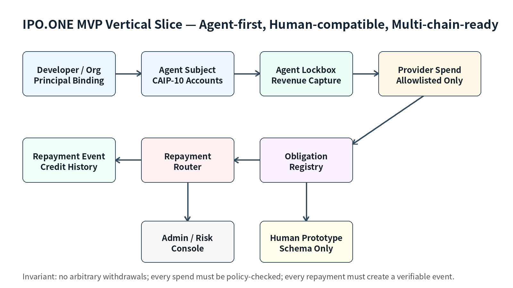
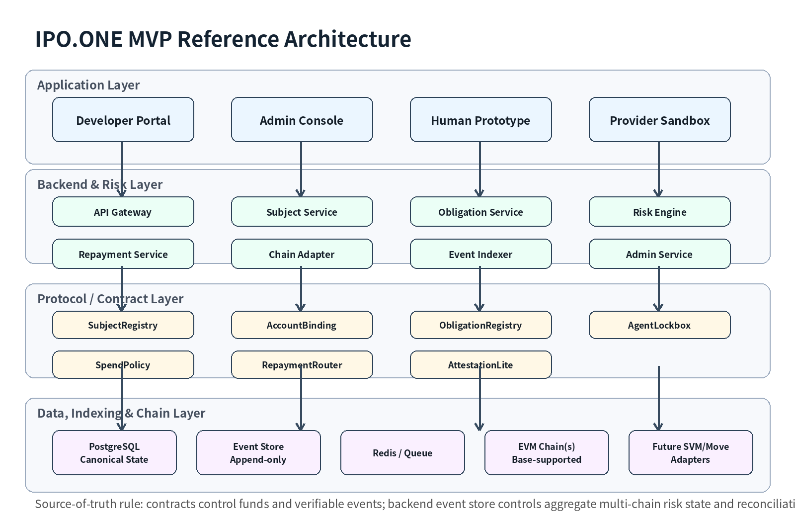
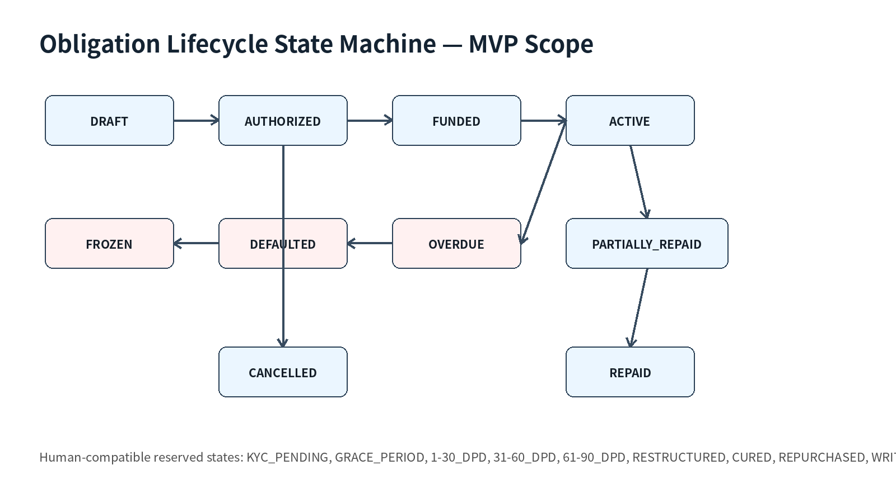

<!--
Source: /Users/cptmao/Downloads/IPO_ONE_MVP_Build_PRD_Technical_Architecture_Codex_Task_Spec_v0.1_FINAL.md
Paired DOCX source: /Users/cptmao/Downloads/IPO_ONE_MVP_Build_PRD_Technical_Architecture_Codex_Task_Spec_v0.1_FINAL.docx
Generated/archived in project: 2026-07-01
Purpose: MVP build PRD, technical architecture, and Codex task specification for IPO.ONE.
Extracted image assets: assets/IPO_ONE_MVP_Build_PRD_Technical_Architecture_Codex_Task_Spec_v0.1_FINAL/
-->

# IPO.ONE MVP Build PRD & Technical Architecture Spec v0.1

*图 1：MVP 最小纵向闭环。先用 Agent Lockbox
跑通真实信用义务生命周期，同时从 Day 1 保留 Human 与 Multi-chain 兼容。*

版本：v0.1 \| 日期：2026-07-01 \| 状态：Engineering Kickoff Draft \|
父文档：IPO.ONE Product Charter v1.0

受众：Founder / CTO / Product Lead / Smart Contract Lead / Backend Lead
/ Frontend Lead / Security Lead / Codex / 外部审计与顾问

# 0. 文档控制与使用方式

<table>
<colgroup>
<col style="width: 100%" />
</colgroup>
<thead>
<tr class="header">
<th>
<strong>本文件的定位</strong>

这不是商业计划书，也不是普通功能清单，而是从 IPO.ONE Product Charter
v1.0 下钻到 MVP 工程执行层的开工规格。它应该直接进入 GitHub repo 的
/docs/prd/、/docs/architecture/、/codex/tasks/，并作为第一批
Codex/GitHub issues 的来源。
</th>
</tr>
</thead>
<tbody>
</tbody>
</table>

| **项目**         | **内容**                                                                                                            |
|------------------|---------------------------------------------------------------------------------------------------------------------|
| 文档名称         | IPO.ONE MVP Build PRD & Technical Architecture Spec v0.1                                                            |
| 父级文档         | IPO.ONE Product Charter v1.0 / Product Description and PRD v1                                                       |
| 核心原则         | Agent-first, Human-compatible, Multi-chain-ready；Obligation-first, not Loan-first                                  |
| MVP 目标         | 证明有收入的 Agent 可以通过 Lockbox 获得用途限定额度、白名单消费、收入捕获、自动还款、生成信用事件                  |
| MVP 真实生产范围 | Agent Developer Portal + Agent Lockbox + Spend Policy + Obligation Registry + Repayment Router + Admin/Risk Console |
| MVP 非生产范围   | 真实人类放贷、public LP、token、DAO、复杂跨链放款、任意提现、黑箱信用分                                             |
| 工程使用方式     | 先冻结本文件；再建 monorepo；再写 AGENTS.md；再按本文件拆 issue；最后让 Codex 逐个 issue 出 PR                      |

## 可靠性边界

- 本文档将“已经确定的产品/架构决策”和“可在工程评审中调整的实现选择”分开标注。任何改变核心协议对象、资金路径、Human
  合规边界、多链 ID 规则的修改，必须新建 ADR。

- 本文档不把未来收入、市场规模、融资路径写成事实。MVP
  的所有商业假设都必须通过真实 usage、repayment、loss、developer
  retention 和 provider integration 数据验证。

- 本文档采用成熟标准和已知工程模式作为默认选择：CAIP-2/10/19、EIP-155/EIP-712、OpenZeppelin
  5.x、Foundry、PostgreSQL event store、GitHub PR
  review。任何自研密码学、桥、价格预言机、黑盒评分模型均不进入 MVP。

- Codex 不是产品经理或安全负责人。Codex 只能在本文件和 AGENTS.md
  约束下执行明确 issue，所有合约、资金、风控、权限、数据隐私相关 PR
  必须人类 review。

# 目录

- 1\. MVP Executive Summary

- 2\. MVP 产品 PRD

- 3\. 用户画像与核心流程

- 4\. MVP 功能需求 FR

- 5\. Human-compatible 要求

- 6\. Multi-chain-ready 要求

- 7\. 技术架构总览

- 8\. 架构决策 ADR

- 9\. 数据模型与状态机

- 10\. 智能合约范围与接口

- 11\. 后端服务与 API Spec

- 12\. 前端与 Admin Console PRD

- 13\. 风控、权限、安全与合规边界

- 14\. 测试、监控、运维与 Launch Gate

- 15\. Codex 工程工作流

- 16\. AGENTS.md 初稿

- 17\. 第一批 GitHub/Codex Issues

- 18\. 里程碑、团队分工与 Definition of Done

- 19\. 附录：Launch Checklist / 风险清单 / 参考资料

# 1. MVP Executive Summary

IPO.ONE 的长期定位是人类与 AI Agent 经济的机器可读信用义务协议层。MVP
不是完整协议网络，也不是普通 lending
app，而是第一条可验证的信用义务闭环：一个有收入的 Agent
获得小额用途限定信用额度，通过白名单 Provider 消费，收入进入
Lockbox，系统自动还款并生成 Repayment Event。

本 MVP 必须同时满足三个条件：第一，Agent
真实闭环可运行；第二，Human-compatible 数据结构从 Day 1
预留；第三，Multi-chain-ready 架构从 Day 1
固化。任何无法同时满足这三点的实现，都可能在 V1/V2
阶段产生重构性技术债。

<table>
<colgroup>
<col style="width: 100%" />
</colgroup>
<thead>
<tr class="header">
<th>
<strong>核心判断</strong>

现在可以开始使用 Codex，但不能让 Codex 直接“开发 IPO.ONE
MVP”。正确顺序是：冻结本 Build Spec → 建 monorepo → 写 AGENTS.md → 拆
GitHub issues → Codex 逐个 issue 交付 PR → 人类 review/security review →
合并。
</th>
</tr>
</thead>
<tbody>
</tbody>
</table>

## 1.1 MVP 一句话定义

<table>
<colgroup>
<col style="width: 100%" />
</colgroup>
<thead>
<tr class="header">
<th>
IPO.ONE MVP = Agent Lockbox Credit Primitive

A production-limited, Agent-first credit obligation loop that
supports:

- Agent Subject creation

- Economic Principal binding

- CAIP-10 multi-chain account binding

- Spend-policy-constrained credit use

- Lockbox revenue capture

- Automated repayment routing

- Repayment Event generation

- Human-compatible schemas and state machines

- Multi-chain-ready ID, event, and risk architecture
</th>
</tr>
</thead>
<tbody>
</tbody>
</table>

## 1.2 MVP 成功的真实含义

| **维度**     | **MVP 成功定义**                                                                              | **为什么重要**                                       |
|--------------|-----------------------------------------------------------------------------------------------|------------------------------------------------------|
| 产品闭环     | Agent 可以创建、获得额度、消费、产生收入、自动还款、生成信用事件                              | 证明“机器可读信用义务”不是叙事，而是可运行的经济闭环 |
| 风控闭环     | 所有信用使用都受 Spend Policy、Lockbox、credit limit、admin freeze 控制                       | 避免早期变成无约束小额贷款产品                       |
| 数据闭环     | 每个 Subject、Account、Obligation、Repayment 都进入 append-only event store                   | 未来 Credit Passport、风控模型和机构报表都依赖这层   |
| 人类兼容     | Human Subject、Consent、KYC/VC reference、Originator mock、DPD 状态机已存在                   | V2 接人类 Originator 时不推倒重写                    |
| 多链兼容     | 使用 CAIP-2/CAIP-10、chain-agnostic obligation_id、per-chain caps、multi-chain indexer schema | 防止 Base-only 技术债，避免跨链重复授信              |
| Codex 可执行 | 每个模块有 issue、acceptance criteria、test command、security checklist                       | 让 Codex 生成可 review 的 PR，而不是不可控 demo      |

# 2. MVP 产品 PRD

## 2.1 MVP Goals

1.  让开发者可以创建 Agent Subject，并绑定经济责任主体 Principal。

2.  让 Agent 绑定至少一个 CAIP-10 多链账户，MVP
    首发生产执行链为一条低成本 EVM 链，Base
    可以作为首发候选但不是唯一架构边界。

3.  让 Agent 创建 Lockbox，并把可捕获收入路由进入 Lockbox。

4.  让 Risk Engine v0 根据收入捕获、白名单
    provider、还款历史、额度利用率给出小额 credit line。

5.  让 Agent 只能向 allowlisted Provider 使用额度，不允许任意提现。

6.  让每次支出创建或占用 Obligation，每次收入优先还款，每次还款生成
    Repayment Event。

7.  让 Admin 可以查看 exposure、utilization、revenue
    capture、overdue、default、abnormal activity，并执行
    freeze/adjust/close。

8.  让系统从 Day 1 具备 Human Subject schema、Originator mock、loan tape
    simulator、human obligation state machine，但不开放真实人类借款。

9.  让系统从 Day 1 具备 multi-chain ID、account binding、event
    normalization、per-chain cap、cross-chain duplicate credit
    prevention 的数据/服务基础。

## 2.2 MVP Non-Goals

| **Non-goal**      | **明确不做**                                                                  | **原因**                                                         |
|-------------------|-------------------------------------------------------------------------------|------------------------------------------------------------------|
| 人类真实放贷      | 不做人类借款申请、放款、现金贷、催收、消费者金融合同                          | 合规、KYC、催收和坏账执行属于 V2 Originator Facility，不进入 MVP |
| Public LP / Vault | 不开放 LP 存款、不做 public pool、不做 ERC-4626 vault                         | MVP 只验证产品闭环，不把投资者资金暴露在未审计风险中             |
| Token / DAO       | 不发行 token，不做治理，不做激励挖矿                                          | 避免 PMF 前的激励噪音和合规复杂度                                |
| 复杂跨链放款      | 不在多链同时开放真实信用额度，不做跨链循环借贷                                | 多链先做 ID/event/risk 兼容，资金执行保守                        |
| 任意提现          | Agent 借来的额度不得转到任意地址，只能支付白名单 Provider                     | 保证用途可控和现金流闭环                                         |
| 黑盒信用分        | 不输出 universal score，不卖 credit score API                                 | 早期数据不足，先沉淀 Repayment/Default/Cashflow events           |
| 未验证 Originator | 不接入没有 daily loan tape、first-loss、stop-loss、audit rights 的 Originator | 防止 Goldfinch 式代理人风险                                      |

## 2.3 MVP Success Metrics

| **指标**                              | **目标** | **Launch Gate / 解释**                                   |
|---------------------------------------|----------|----------------------------------------------------------|
| Active Agent Accounts                 | 50–100   | Controlled pilot 目标，不追求虚高注册数                  |
| Revenue Capture Ratio                 | \>90%    | 可捕获收入是信用额度基础；低于阈值必须降额或停止 lending |
| Automated Repayment Success           | \>95%    | 核心证明：收入进入 Lockbox 后可自动还款                  |
| Allowlisted Spend Ratio               | 100%     | MVP 绝不允许任意提现                                     |
| Average Credit Line Utilization       | \>40%    | 证明额度有真实需求                                       |
| Repeat Borrowing / Reuse              | \>40%    | 证明 Agent 有持续 working capital 场景                   |
| 30-day Gross Loss                     | \<3%     | 若超过阈值，停止扩容并复盘 risk rules                    |
| Cross-chain Duplicate Credit Incident | 0        | 多链绑定和 global limit 的核心验收                       |
| Human Production Lending              | 0        | MVP 只做 schema/prototype/mock，不做真实人类放贷         |

# 3. 用户画像与核心流程

## 3.1 MVP Personas

| **Persona**                | **MVP 支持级别**             | **核心需求**                                              | **主要界面**       |
|----------------------------|------------------------------|-----------------------------------------------------------|--------------------|
| Agent Developer / Operator | Production                   | 创建 Agent、绑定账户、接入 Lockbox、查看额度和还款        | Developer Portal   |
| Agent / Bot                | Production via API           | 请求白名单支出、接收收入、自动还款                        | SDK / API          |
| Provider                   | Sandbox / Limited Production | 被 allowlist、接收 Agent 支付、发送 revenue/usage webhook | Provider Sandbox   |
| IPO.ONE Admin / Risk       | Production                   | 额度审批、冻结、查看 exposure、异常处理、事件对账         | Admin Console      |
| Human Borrower             | Prototype only               | 查看未来 borrower profile / repayment schedule mock       | Human Prototype    |
| Originator                 | Mock / Sandbox               | 模拟 loan tape、human obligation 状态、DPD、stop-loss     | Originator Sandbox |
| LP / Capital Provider      | Not production               | MVP 不提供 LP 产品，只保留未来 reporting schema           | N/A                |

## 3.2 Core MVP Vertical Slice

<table>
<colgroup>
<col style="width: 100%" />
</colgroup>
<thead>
<tr class="header">
<th>
Developer login

→ Create Org / Principal

→ Create Agent Subject

→ Bind CAIP-10 wallet accounts

→ Create Agent Lockbox

→ Configure allowlisted Provider(s)

→ Risk Engine v0 grants small credit line

→ Agent requests Provider spend

→ Spend Policy verifies provider + asset + limit

→ Obligation is created / utilization increases

→ Agent revenue enters Lockbox

→ Repayment Router applies funds to active Obligation

→ Repayment Event emitted + indexed

→ Surplus released to Developer

→ Admin Console displays exposure, repayment, alerts
</th>
</tr>
</thead>
<tbody>
</tbody>
</table>

## 3.3 User Flow Requirements

| **Flow**         | **输入**                                                  | **系统动作**                                                             | **输出 / 验收**                                               |
|------------------|-----------------------------------------------------------|--------------------------------------------------------------------------|---------------------------------------------------------------|
| Agent Onboarding | Developer identity, principal info, wallet signature      | Create org/principal, create Agent Subject, bind account, create lockbox | Agent profile active; account binding stored; lockbox visible |
| Credit Request   | Agent subject, revenue proof/mock, requested limit        | Risk Engine v0 evaluates conservative rule set                           | Credit line approved/rejected with reasons                    |
| Provider Spend   | Provider ID, asset, amount, purpose, obligation ref       | Spend Policy checks provider, cap, utilization, status                   | Payment prepared/executed; obligation active                  |
| Revenue Capture  | Stablecoin inflow to Lockbox or webhook-simulated revenue | Indexer detects inflow; Repayment Router calculates allocation           | Repayment Event created; utilization reduced                  |
| Admin Freeze     | Risk alert or manual decision                             | Admin role action with reason, audit log, onchain/offchain status update | Credit line frozen; new spends rejected                       |
| Human Mock       | Human subject + KYC/VC reference + simulated loan tape    | Create non-production human obligation with DPD state machine            | Human schema verified without real lending                    |

# 4. MVP 功能需求 FR

所有功能需求必须以 Given / When / Then 的 acceptance criteria 进入
GitHub issue。下表定义 MVP 的第一层需求编号。

| **ID** | **模块**                    | **需求**                                                                                                    | **验收标准**                                                                                                                  |
|--------|-----------------------------|-------------------------------------------------------------------------------------------------------------|-------------------------------------------------------------------------------------------------------------------------------|
| FR-001 | Subject Registry            | 系统必须支持 AGENT / HUMAN / ORG / ORIGINATOR 四类主体；MVP production 只启用 AGENT/ORG。                   | Given valid principal and signature, when creating Agent Subject, then subject_id and subject_hash are created and queryable. |
| FR-002 | Principal Binding           | 每个 Agent 必须绑定经济责任主体 Principal；Agent 是执行主体，Principal 是责任主体。                         | Agent without principal cannot request credit line.                                                                           |
| FR-003 | Multi-chain Account Binding | 账户必须用 CAIP-10 表达；链必须用 CAIP-2 表达；EVM 签名必须包含 EIP-155 chain ID。                          | Replay across a different chain is rejected.                                                                                  |
| FR-004 | Agent Lockbox               | 系统必须支持 Agent revenue first route；未清偿 Obligation 前收入优先还款。                                  | Revenue inflow triggers repayment allocation before surplus release.                                                          |
| FR-005 | Spend Policy Engine         | MVP 资金只能支付 allowlisted Provider；支持 provider cap / daily cap / obligation cap。                     | Non-allowlisted recipient payment is rejected.                                                                                |
| FR-006 | Obligation Registry         | 每笔信用义务必须包含 Subject、Principal、Authorization、Spend Policy、Cashflow Route、Amount、Due、Status。 | No obligation can exist without those references.                                                                             |
| FR-007 | Repayment Router            | 每次还款必须生成 repayment_event；事件可按 subject_id / obligation_id 查询。                                | Partial and full repayments update utilization correctly.                                                                     |
| FR-008 | Risk Engine v0              | 用规则而非 ML：基于 captured revenue、allowlisted spend、repayment history、utilization 计算额度。          | Rules are deterministic and explainable in API response.                                                                      |
| FR-009 | Admin Console               | Admin 可查看 exposure、revenue capture、utilization、overdue、alerts，并可 freeze/adjust/close。            | Every admin action writes immutable audit log.                                                                                |
| FR-010 | Human Prototype             | 系统支持 Human Subject、KYC/VC reference、human obligation states、loan tape simulator；不得真实放贷。      | Human prototype cannot trigger fund movement.                                                                                 |
| FR-011 | Event Indexer               | 监听 contracts events，写入 append-only event store，并维护 materialized state。                            | Event replay can rebuild current state.                                                                                       |
| FR-012 | Provider Sandbox            | Provider 可被 allowlist；支持 spend request / revenue webhook simulation / settlement view。                | Provider without allowlist cannot receive credit spend.                                                                       |

## 4.1 Critical Product Invariants

| **Invariant ID** | **不可破坏约束**                                                                    | **测试方式**                                               |
|------------------|-------------------------------------------------------------------------------------|------------------------------------------------------------|
| INV-001          | 任何信用额度使用必须有 active subject + principal + spend policy + cashflow route。 | Unit + integration test: missing reference reverts/rejects |
| INV-002          | MVP 不允许任意提现；credit spend recipient 必须是 allowlisted Provider。            | Contract test + API test + E2E test                        |
| INV-003          | 存在 active obligation 时，Lockbox revenue 必须优先还款。                           | Foundry invariant + backend E2E                            |
| INV-004          | 每次 repayment/default/freeze/adjust 都必须产生 event 和 audit trail。              | Event store replay test                                    |
| INV-005          | 同一 Subject 的跨链 exposure 必须受 Global Credit Limit 约束。                      | Multi-chain simulation test                                |
| INV-006          | Human Prototype 不得触发真实资金流。                                                | Route-level permission + contract absence test             |
| INV-007          | 原始 KYC/PII 不上链、不写日志、不进入 Codex prompts。                               | Security review + log scanner                              |
| INV-008          | Admin 权限必须 RBAC + multisig/timelock where production critical。                 | Role tests + deployment checklist                          |

# 5. Human-compatible 要求

<table>
<colgroup>
<col style="width: 100%" />
</colgroup>
<thead>
<tr class="header">
<th>
<strong>设计原则</strong>

MVP 不做人类真实信贷，但 Human 不是以后临时加的功能。MVP
必须让协议对象能表达一笔人类信用义务：Human Subject、Consent、KYC/VC
reference、Originator、Cashflow Route、Loan
Tape、DPD、Default、Restructure、Repurchase、Credit Passport
placeholder。
</th>
</tr>
</thead>
<tbody>
</tbody>
</table>

## 5.1 Human Compatibility Scope in MVP

| **层**                      | **MVP 要做到**                                                                                   | **MVP 不做**                            |
|-----------------------------|--------------------------------------------------------------------------------------------------|-----------------------------------------|
| Human Subject               | subject_type=HUMAN；human_profile 表；country/jurisdiction；privacy flags；KYC/VC reference 字段 | 不收集真实护照/身份证/手机号原始数据    |
| Consent / Authorization     | consent_ledger 表；terms/version/hash；授权用途和过期时间                                        | 不执行真实金融合同签署                  |
| Originator                  | originators 表；facility mock；loan_tape_simulator                                               | 不接真实 Originator 资金和真实 borrower |
| Human Cashflow Route        | cashflow_route_type 支持 PAYROLL / MERCHANT / PLATFORM / ORIGINATOR_COLLECTION                   | 不接真实工资扣款或法币收款              |
| Human Obligation States     | KYC_PENDING、APPROVED、ACTIVE、DPD、RESTRUCTURED、DEFAULTED、REPURCHASED 等状态枚举              | 不发放真实人类 loan                     |
| Credit Passport Placeholder | repayment_attestation schema；default_attestation schema                                         | 不对外销售信用分/API                    |

## 5.2 Human Obligation Reserved State Machine

<table>
<colgroup>
<col style="width: 100%" />
</colgroup>
<thead>
<tr class="header">
<th>
HUMAN_OBLIGATION_STATES = [

"CREATED", "KYC_PENDING", "APPROVED_BY_ORIGINATOR", "FUNDED",
"ACTIVE",

"GRACE_PERIOD", "DPD_1_30", "DPD_31_60", "DPD_61_90",

"RESTRUCTURED", "CURED", "DEFAULTED", "REPURCHASED",
"WRITTEN_OFF",

"CLOSED", "DISPUTED"

]

MVP rule:

- These states exist in schema and simulator only.

- No production human credit line can be funded in MVP.

- Any attempt to call a production funding route for
subject_type=HUMAN must be rejected.
</th>
</tr>
</thead>
<tbody>
</tbody>
</table>

# 6. Multi-chain-ready 要求

<table>
<colgroup>
<col style="width: 100%" />
</colgroup>
<thead>
<tr class="header">
<th>
<strong>设计原则</strong>

Base 可以是首发链之一，但 IPO.ONE 绝不能是 Base-only。MVP
的真实信用执行可以先在一条低成本 EVM
链上运行，但所有主体、账户、资产、事件、obligation、risk exposure 必须从
Day 1 按 chain-agnostic 方式建模。
</th>
</tr>
</thead>
<tbody>
</tbody>
</table>

## 6.1 Chain / Account / Asset Standards

| **对象**              | **标准/字段**                              | **MVP 规则**                                                    | **备注**                                               |
|-----------------------|--------------------------------------------|-----------------------------------------------------------------|--------------------------------------------------------|
| Chain                 | CAIP-2 chain_id                            | 所有链用 namespace:reference；EVM 使用 eip155:\<id\>            | 例如 eip155:1、eip155:8453                             |
| Account               | CAIP-10 account_id                         | account_id = chain_id + account_address；后台存原文和 hash      | 链上尽量只存 bytes32 hash，减少 gas 与隐私风险         |
| EVM replay protection | EIP-155 / EIP-712 domain                   | 签名必须绑定 chainId、verifyingContract、protocolVersion、nonce | 禁止跨链 replay                                        |
| Asset                 | Internal asset registry + CAIP-19-style id | 记录 chain_id、token address、symbol、decimals、is_native_usdc  | CAIP-19 当前状态为 Review，MVP 使用兼容式内部 registry |
| Obligation ID         | chain-agnostic bytes32                     | 不得使用链上自增 ID 作为业务唯一 ID                             | 跨链事件必须归并到同一 obligation_id                   |

## 6.2 Multi-chain Launch Policy

| **阶段**               | **链范围**                                                     | **真实资金规则**                  | **目标**                                        |
|------------------------|----------------------------------------------------------------|-----------------------------------|-------------------------------------------------|
| Local Dev              | Anvil / Foundry local                                          | 无真实资金                        | 快速开发与 invariant tests                      |
| Testnet                | Base Sepolia + Ethereum Sepolia + optional Arbitrum/OP testnet | 测试资金                          | 验证 CAIP、indexer、event replay、per-chain cap |
| MVP Limited Production | 一条生产执行链，Base-supported / Base-first 可选               | 内部/试点资金，硬上限             | 跑通 Agent Lockbox 闭环                         |
| V1                     | 多 EVM limited deployment                                      | 每条链独立 cap；禁止跨链循环借贷  | 验证多链账户与事件归一化                        |
| V2+                    | 按市场/Originator/稳定币出入金选择链                           | human facility 独立链/池/风险参数 | 按真实业务选择链，而不是按叙事选链              |

## 6.3 Cross-chain Risk Controls

| **风险**                   | **MVP 控制**                                                                                     |
|----------------------------|--------------------------------------------------------------------------------------------------|
| 跨链重复授信               | Global credit limit + subject aggregate utilization + obligation nonce + duplicate detection     |
| 消息/事件延迟              | pending / confirmed / finalized 状态；未 finalized 不释放新的跨链额度                            |
| 桥/跨链协议风险            | MVP 不把桥作为信用安全根；只预留 adapter；每个 bridge exposure cap = 0 或极低                    |
| 资产 decimals/合约地址混乱 | asset registry 记录 decimals、token address、native/wrapped、allowlisted；金额统一用 minor units |
| 链重组                     | per-chain finality policy；reorged events 必须 invalidated 并触发 reconciliation                 |
| 单链暂停                   | per-chain pause + global pause；暂停链不得新增 spend，只允许安全还款/withdrawal routes           |

# 7. 技术架构总览

*图 2：MVP
参考架构。核心原则：合约控制资金与可验证事件；后端维护多链聚合状态和风险；数据层采用
append-only event store。*

## 7.1 Recommended Tech Stack

| **层**        | **默认选择**                                           | **原因 / 约束**                                                          |
|---------------|--------------------------------------------------------|--------------------------------------------------------------------------|
| Monorepo      | pnpm + Turborepo                                       | 统一 TypeScript、SDK、API types、contracts artifacts；Codex 易于运行测试 |
| Frontend      | Next.js + React + TypeScript + Tailwind                | 快速构建 Developer Portal / Admin Console；组件化；适合内部产品快速迭代  |
| Wallet / Web3 | Viem + Wagmi + wallet adapter layer                    | 类型安全、EVM 支持强；多链抽象需通过内部 chain adapter 统一              |
| Backend       | NestJS with Fastify adapter + TypeScript               | 模块化、依赖注入、OpenAPI、RBAC、队列和服务边界清晰                      |
| Database      | PostgreSQL + Drizzle/SQL-first migrations              | 信用/事件/审计需要强一致关系型数据；SQL-first 防止 ORM 魔法造成技术债    |
| Queue         | Redis + BullMQ                                         | 异步 indexer、risk recalculation、webhook retry、reconciliation          |
| Contracts     | Solidity + Foundry + OpenZeppelin 5.x                  | 审计友好、测试快、可做 invariant/fuzz；避免自研基础库                    |
| Indexer       | Custom viem indexer v0; Ponder optional after ADR      | 事件归一化是核心资产，MVP 先自控 schema；引入框架必须不破坏 event store  |
| Testing       | Foundry, Vitest, Playwright, Slither, optional Echidna | 覆盖 contracts、API、frontend E2E、安全静态分析                          |
| Infra         | Docker + GitHub Actions + Vercel/Render/AWS staging    | 先简单可复现；生产前再做更完整 IaC                                       |

## 7.2 Repo Structure

<table>
<colgroup>
<col style="width: 100%" />
</colgroup>
<thead>
<tr class="header">
<th>
ipo-one/

apps/

web/ # Developer Portal + Human Prototype routes

admin/ # Admin/Risk Console

api/ # NestJS API Gateway and services

contracts/

src/ # Solidity contracts

test/ # Foundry tests

script/ # Deploy scripts

packages/

sdk/ # IPO.ONE TypeScript SDK

shared/ # shared types, enums, validators

config/ # chain/asset/provider config

infra/

docker/ # local dev compose

ci/ # CI scripts

docs/

prd/ # this spec and module PRDs

architecture/ # ADRs and diagrams

api/ # OpenAPI specs

security/ # threat model, review checklists

codex/

tasks/ # issue-level task specs

prompts/ # reusable prompt templates

review-checklists/ # PR review checklists

AGENTS.md

README.md

pnpm-workspace.yaml

turbo.json
</th>
</tr>
</thead>
<tbody>
</tbody>
</table>

# 8. 架构决策 ADR

| **ADR** | **决策**                                                       | **内容**                                                                                          | **原因**                                                    |
|---------|----------------------------------------------------------------|---------------------------------------------------------------------------------------------------|-------------------------------------------------------------|
| ADR-001 | Agent-first, Human-compatible from Day 1                       | MVP 生产闭环只做 Agent，但 Human schema/state/Originator mock 必须存在。                          | 降低合规风险，同时防止 V2 人类信用重构。                    |
| ADR-002 | Obligation-first, not Loan-first                               | 所有信用产品都表达为 Obligation；loan 只是执行形式。                                              | 未来支持 Agent API 后付费、工资预支、设备分期、RWA credit。 |
| ADR-003 | Base-supported, not Base-only                                  | MVP 可选择 Base 首发；系统 ID/event/risk 不能写死 Base。                                          | 保留多链、市场选择和资金路由空间。                          |
| ADR-004 | Contracts control funds; backend controls aggregate risk state | 资金约束和关键事件上链；跨链聚合、风控、报表由 event store 派生。                                 | 避免把复杂多链状态全部放链上，也避免纯后端黑箱。            |
| ADR-005 | No arbitrary withdrawal in MVP                                 | Agent credit 只能支付白名单 Provider。                                                            | 用途可控是 MVP 风控核心。                                   |
| ADR-006 | Versioned contracts over premature complex upgradeability      | MVP funds-holding contracts优先简单、可暂停、可迁移；如用 UUPS 必须 timelock + multisig + audit。 | 降低代理升级风险，保留未来迁移路径。                        |
| ADR-007 | Append-only event store                                        | 所有状态变化先写事件，再派生 current state。                                                      | 支持审计、回放、Credit Passport、风控训练。                 |
| ADR-008 | Codex issue-based workflow only                                | Codex 不接大任务；每个任务必须有 scope/non-goals/test command。                                   | 减少越界修改和不可 review 代码。                            |

# 9. 数据模型与状态机

*图 3：MVP Obligation 状态机。Human 扩展状态从 schema 预留，但 MVP
不触发真实人类资金流。*

## 9.1 ID Strategy

<table>
<colgroup>
<col style="width: 100%" />
</colgroup>
<thead>
<tr class="header">
<th>
// Database identifiers

id: UUIDv7 // operational primary key

// Protocol identifiers

subject_hash: bytes32 // keccak256(domain-separated subject
payload)

principal_hash: bytes32

obligation_id: bytes32 // chain-agnostic economic obligation
identifier

cashflow_route_id: bytes32

spend_policy_id: bytes32

account_id_hash: bytes32 // keccak256(CAIP-10 account_id)

asset_id_hash: bytes32 // keccak256(internal asset id / CAIP-19-style
id)

// Obligation ID rule

obligation_id = keccak256(

"IPO_ONE_OBLIGATION_V1",

subject_hash,

principal_hash,

origin_chain_id_hash,

obligation_nonce,

cashflow_route_id,

spend_policy_id,

asset_id_hash,

principal_amount_minor,

due_at

)

Rule: never use chain-local auto-increment IDs as the business
identifier.
</th>
</tr>
</thead>
<tbody>
</tbody>
</table>

## 9.2 Core Tables

| **Table**          | **Key fields**                                                                            | **Purpose**                                                |
|--------------------|-------------------------------------------------------------------------------------------|------------------------------------------------------------|
| subjects           | id, subject_hash, subject_type, status, display_name, metadata_json, created_at           | Universal actor table; supports AGENT/HUMAN/ORG/ORIGINATOR |
| principals         | id, principal_hash, principal_type, legal_name_hash, status, jurisdiction, created_at     | Economic responsibility binding                            |
| subject_principals | subject_id, principal_id, role, effective_from, effective_to                              | Agent→developer/org; human→self/originator relationship    |
| chains             | chain_id, namespace, reference, family, is_enabled, finality_blocks, risk_cap_minor       | CAIP-2 registry                                            |
| accounts           | id, account_id, account_hash, chain_id, address, account_type, risk_status                | CAIP-10 accounts; raw account_id offchain only             |
| account_bindings   | subject_id, account_id, signature_hash, nonce, bound_at, revoked_at                       | Wallet binding and revocation                              |
| assets             | asset_id, asset_hash, chain_id, token_address, symbol, decimals, is_native_usdc, status   | Internal asset registry, CAIP-19-compatible                |
| providers          | id, provider_hash, name, status, settlement_account_id, risk_tier                         | Allowlisted API/compute/model providers                    |
| spend_policies     | id, policy_hash, subject_id, provider_id, asset_id, daily_cap, obligation_cap, status     | Purpose and destination controls                           |
| cashflow_routes    | id, route_hash, subject_id, route_type, lockbox_id, status                                | LOCKBOX/PAYROLL/MERCHANT/PLATFORM/ORIGINATOR_COLLECTION    |
| lockboxes          | id, lockbox_hash, subject_id, chain_id, contract_address, asset_id, status                | Agent revenue capture container                            |
| credit_lines       | id, subject_id, asset_id, limit_minor, utilized_minor, status, risk_snapshot_id           | Current usable line, derived from risk rules               |
| obligations        | id, obligation_hash, subject_id, principal_id, asset_id, amount_minor, due_at, status     | Credit obligation economic record                          |
| repayment_events   | id, obligation_id, subject_id, amount_minor, asset_id, chain_event_id, occurred_at        | Repayment history                                          |
| default_events     | id, obligation_id, reason_code, dpd, amount_minor, occurred_at                            | Default and overdue records                                |
| attestations       | id, attester_id, subject_id, obligation_id, attestation_type, payload_hash, expires_at    | Future Credit Passport substrate                           |
| risk_snapshots     | id, subject_id, model_version, inputs_hash, limit_minor, reason_json, created_at          | Explainable risk decisions                                 |
| chain_events       | id, chain_id, tx_hash, log_index, block_number, finality_status, event_type, payload_json | Append-only onchain event store                            |
| admin_actions      | id, admin_id, action_type, target_type, target_id, reason, created_at                     | Immutable admin audit log                                  |

## 9.3 SQL DDL Skeleton

<table>
<colgroup>
<col style="width: 100%" />
</colgroup>
<thead>
<tr class="header">
<th>
CREATE TYPE subject_type AS ENUM ('AGENT', 'HUMAN', 'ORG',
'ORIGINATOR');

CREATE TYPE obligation_status AS ENUM (

'DRAFT','AUTHORIZED','FUNDED','ACTIVE','PARTIALLY_REPAID','REPAID',

'OVERDUE','DEFAULTED','FROZEN','CANCELLED',

'KYC_PENDING','APPROVED_BY_ORIGINATOR','GRACE_PERIOD','DPD_1_30',

'DPD_31_60','DPD_61_90','RESTRUCTURED','CURED','REPURCHASED',

'WRITTEN_OFF','CLOSED','DISPUTED'

);

CREATE TABLE subjects (

id UUID PRIMARY KEY,

subject_hash BYTEA UNIQUE NOT NULL,

subject_type subject_type NOT NULL,

status TEXT NOT NULL DEFAULT 'ACTIVE',

display_name TEXT,

metadata_json JSONB NOT NULL DEFAULT '{}',

created_at TIMESTAMPTZ NOT NULL DEFAULT now(),

updated_at TIMESTAMPTZ NOT NULL DEFAULT now()

);

CREATE TABLE obligations (

id UUID PRIMARY KEY,

obligation_hash BYTEA UNIQUE NOT NULL,

subject_id UUID NOT NULL REFERENCES subjects(id),

principal_id UUID NOT NULL REFERENCES principals(id),

asset_id UUID NOT NULL REFERENCES assets(id),

amount_minor NUMERIC(78,0) NOT NULL,

outstanding_minor NUMERIC(78,0) NOT NULL,

spend_policy_id UUID NOT NULL REFERENCES spend_policies(id),

cashflow_route_id UUID NOT NULL REFERENCES cashflow_routes(id),

status obligation_status NOT NULL,

due_at TIMESTAMPTZ NOT NULL,

created_at TIMESTAMPTZ NOT NULL DEFAULT now()

);

CREATE TABLE chain_events (

id UUID PRIMARY KEY,

chain_id TEXT NOT NULL REFERENCES chains(chain_id),

tx_hash TEXT NOT NULL,

log_index INTEGER NOT NULL,

block_number BIGINT NOT NULL,

finality_status TEXT NOT NULL,

event_type TEXT NOT NULL,

obligation_hash BYTEA,

subject_hash BYTEA,

payload_json JSONB NOT NULL,

observed_at TIMESTAMPTZ NOT NULL DEFAULT now(),

UNIQUE(chain_id, tx_hash, log_index)

);
</th>
</tr>
</thead>
<tbody>
</tbody>
</table>

# 10. 智能合约范围与接口

<table>
<colgroup>
<col style="width: 100%" />
</colgroup>
<thead>
<tr class="header">
<th>
<strong>MVP 合约边界</strong>

MVP 合约只做可验证资金约束与事件，不做 public
LP、tranche、governance、human
facility、复杂跨链消息。核心资金合约必须简单、可测试、可暂停、可审计。
</th>
</tr>
</thead>
<tbody>
</tbody>
</table>

## 10.1 Contract Set

| **Contract**            | **MVP 作用**                                            | **不做**                                             |
|-------------------------|---------------------------------------------------------|------------------------------------------------------|
| SubjectRegistry         | 记录 subject_hash / subject_type / status；emit events  | 不存 PII，不存原始 CAIP-10 字符串                    |
| AccountBindingRegistry  | 记录 account_id_hash 与 subject_hash 的绑定/撤销事件    | 不做复杂身份验证，签名校验可由后端完成并把 hash 上链 |
| ObligationRegistry      | 创建 obligation、状态更新、repayment/default event      | 不做复杂信用评分                                     |
| SpendPolicyRegistry     | provider allowlist、asset allowlist、cap 配置           | 不做开放任意 recipient                               |
| AgentLockbox            | 接收 revenue、按 RepaymentRouter 规则还款、释放 surplus | 不做 human loan、不做 LP pool                        |
| RepaymentRouter         | 根据 obligation outstanding 分配还款并 emit event       | 不做跨链 routing v0                                  |
| AttestationRegistryLite | 记录 payload_hash 和 attester 权限的最小证明事件        | 不做完整 Credit Passport API                         |

## 10.2 Solidity Interface Skeleton

<table>
<colgroup>
<col style="width: 100%" />
</colgroup>
<thead>
<tr class="header">
<th>
// SPDX-License-Identifier: MIT

pragma solidity ^0.8.24;

interface ISubjectRegistry {

enum SubjectType { AGENT, HUMAN, ORG, ORIGINATOR }

event SubjectCreated(bytes32 indexed subjectHash, SubjectType
subjectType, bytes32 indexed principalHash);

event SubjectStatusChanged(bytes32 indexed subjectHash, uint8
previousStatus, uint8 newStatus, string reason);

function createSubject(bytes32 subjectHash, SubjectType subjectType,
bytes32 principalHash) external;

function setSubjectStatus(bytes32 subjectHash, uint8 status, string
calldata reason) external;

function subjectExists(bytes32 subjectHash) external view returns
(bool);

}

interface IObligationRegistry {

enum ObligationStatus { DRAFT, AUTHORIZED, FUNDED, ACTIVE,
PARTIALLY_REPAID, REPAID, OVERDUE, DEFAULTED, FROZEN, CANCELLED }

event ObligationCreated(

bytes32 indexed obligationHash,

bytes32 indexed subjectHash,

bytes32 indexed principalHash,

address asset,

uint256 amount,

uint256 dueAt

);

event RepaymentRecorded(bytes32 indexed obligationHash, bytes32
indexed subjectHash, address asset, uint256 amount, uint256
remaining);

event DefaultRecorded(bytes32 indexed obligationHash, bytes32 indexed
subjectHash, uint256 dpd, string reasonCode);

function createObligation(bytes32 obligationHash, bytes32
subjectHash, bytes32 principalHash, address asset, uint256 amount,
uint256 dueAt) external;

function recordRepayment(bytes32 obligationHash, uint256 amount)
external;

function markDefault(bytes32 obligationHash, uint256 dpd, string
calldata reasonCode) external;

}

interface IAgentLockbox {

event RevenueDeposited(bytes32 indexed subjectHash, address indexed
asset, uint256 amount, address from);

event ProviderSpend(bytes32 indexed subjectHash, bytes32 indexed
obligationHash, address indexed provider, address asset, uint256
amount);

event SurplusReleased(bytes32 indexed subjectHash, address indexed
asset, uint256 amount, address to);

function depositRevenue(bytes32 subjectHash, address asset, uint256
amount) external;

function spendToProvider(bytes32 subjectHash, bytes32 obligationHash,
address provider, address asset, uint256 amount) external;

function releaseSurplus(bytes32 subjectHash, address asset, address
to, uint256 amount) external;

}
</th>
</tr>
</thead>
<tbody>
</tbody>
</table>

## 10.3 Contract Security Requirements

- 所有资金路径使用 OpenZeppelin
  SafeERC20、ReentrancyGuard、Pausable、AccessControl 或
  Ownable2Step/AccessManager。

- 所有 admin 权限在 testnet 可用 deployer；limited production 必须迁移到
  multisig；任何 upgradeable/proxy 合约必须有 timelock。

- 不使用自定义 fixed-point/math 库；金额以 token minor units
  存储；decimals 由 asset registry 管理。

- 合约 emit 的事件必须足以被 event store 重放；事件字段必须包含
  subjectHash、obligationHash、asset、amount、chain context。

- MVP 不做 onchain KYC、PII、credit score、originator loan tape。

- 每个 revert 必须使用 custom error；每个 external 函数必须有 NatSpec。

# 11. 后端服务与 API Spec

## 11.1 Services

| **Service**           | **职责**                                                     | **核心依赖**                         |
|-----------------------|--------------------------------------------------------------|--------------------------------------|
| API Gateway           | Auth、request validation、OpenAPI、routing、rate limit       | Auth Service, RBAC, validators       |
| Subject Service       | Subject/Principal/Account lifecycle                          | Postgres, signature verifier         |
| Obligation Service    | Obligation creation, status transitions, queries             | Postgres, contracts, event store     |
| Risk Service          | v0 credit limit rules, risk snapshots, alerts                | Event store, credit lines, providers |
| Repayment Service     | Revenue allocation, repayment events, surplus calculation    | Lockbox events, obligations          |
| Provider Service      | Allowlist, spend request, settlement state, sandbox webhooks | Providers, spend policies            |
| Chain Adapter Service | EVM RPC adapters, signature domain config, chain registry    | Viem, contracts artifacts            |
| Event Indexer         | Read chain logs, finality, reorg handling, replay            | RPC, Postgres, queues                |
| Admin Service         | Exposure dashboard, actions, audit logs                      | RBAC, risk service, DB               |

## 11.2 API Endpoint Summary

| **Method** | **Endpoint**                       | **Purpose**                            | **Actor**        |
|------------|------------------------------------|----------------------------------------|------------------|
| POST       | /v1/principals                     | Create org/developer principal         | Developer        |
| POST       | /v1/subjects/agent                 | Create Agent Subject                   | Developer        |
| POST       | /v1/subjects/human-prototype       | Create Human Subject in prototype mode | Internal/Admin   |
| POST       | /v1/accounts/bind                  | Bind CAIP-10 account to subject        | Developer        |
| POST       | /v1/lockboxes                      | Create Agent Lockbox                   | Developer        |
| GET        | /v1/credit-lines/{subject_id}      | Read current credit line               | Developer/Admin  |
| POST       | /v1/credit-lines/request           | Request v0 credit line                 | Developer        |
| POST       | /v1/provider/spend-request         | Provider requests spend approval       | Provider         |
| POST       | /v1/obligations                    | Create obligation / draw credit        | System/Provider  |
| GET        | /v1/obligations/{id}               | Read obligation detail                 | Developer/Admin  |
| GET        | /v1/repayment-events               | List repayment events                  | Developer/Admin  |
| POST       | /v1/provider/revenue-webhook       | Provider sandbox revenue event         | Provider sandbox |
| GET        | /v1/admin/exposure                 | Aggregate exposure dashboard           | Admin            |
| POST       | /v1/admin/credit-lines/{id}/freeze | Freeze credit line with reason         | Admin            |
| POST       | /v1/admin/credit-lines/{id}/adjust | Adjust credit limit                    | Admin            |
| GET        | /v1/admin/risk-alerts              | Risk alerts                            | Admin            |
| POST       | /v1/originator/loan-tape/simulate  | Loan tape simulator only               | Internal/Admin   |

## 11.3 Example API Types

<table>
<colgroup>
<col style="width: 100%" />
</colgroup>
<thead>
<tr class="header">
<th>
export type SubjectType = 'AGENT' | 'HUMAN' | 'ORG' |
'ORIGINATOR';

export interface CreateAgentSubjectRequest {

principalId: string;

displayName: string;

agentType: 'API_AGENT' | 'WORKFLOW_BOT' | 'AUTONOMOUS_SERVICE';

metadata?: Record&lt;string, unknown&gt;;

}

export interface BindAccountRequest {

subjectId: string;

accountId: string; // CAIP-10, e.g. eip155:8453:0x...

signature: string;

message: string;

nonce: string;

}

export interface CreditLineDecision {

subjectId: string;

assetId: string;

limitMinor: string;

utilizationMinor: string;

status: 'APPROVED' | 'REJECTED' | 'FROZEN';

modelVersion: 'risk-rules-v0';

reasons: Array&lt;{ code: string; message: string }&gt;;

}

export interface SpendRequest {

subjectId: string;

providerId: string;

assetId: string;

amountMinor: string;

purposeCode: 'MODEL_API' | 'COMPUTE' | 'RPC' | 'DATA' |
'WORKFLOW';

}
</th>
</tr>
</thead>
<tbody>
</tbody>
</table>

# 12. 前端与 Admin Console PRD

## 12.1 Developer Portal Screens

| **Screen**                     | **MVP 功能**                                  | **验收**                                  |
|--------------------------------|-----------------------------------------------|-------------------------------------------|
| Login / Wallet Connect         | 连接钱包、显示链、签名登录、会话管理          | 错误链/签名失败可解释                     |
| Organization / Principal Setup | 创建 Principal，显示 responsibility warning   | 没有 Principal 不能创建 Agent credit line |
| Create Agent                   | 创建 Agent Subject、选择类型、绑定 principal  | 创建后可进入 Agent Dashboard              |
| Account Binding                | 绑定 CAIP-10 钱包，显示链与地址 hash          | 可绑定/撤销，多链 replay 被拒绝           |
| Lockbox Setup                  | 创建/查看 Lockbox、显示收入地址、资产、状态   | 未创建 Lockbox 不能申请额度               |
| Credit Line Dashboard          | 额度、已用、可用、状态、风险提示              | 冻结/逾期状态清晰                         |
| Obligation Detail              | 金额、provider、due、status、repayment events | 状态和 event store 一致                   |
| Provider Spend Demo            | 模拟 provider spend request                   | 非白名单 provider 被拒绝                  |
| Repayment History              | 显示 repayment events 和 surplus release      | 可导出 CSV                                |

## 12.2 Admin/Risk Console Screens

| **Screen**           | **MVP 功能**                                                  | **高风险注意事项**                  |
|----------------------|---------------------------------------------------------------|-------------------------------------|
| Overview             | active agents、active obligations、utilization、loss、alerts  | 不能只显示 vanity metrics           |
| Agent Detail         | subject、principal、accounts、lockbox、credit line、repayment | PII/secret 不显示                   |
| Exposure Monitor     | 按 chain/provider/asset/subject 聚合 exposure                 | 跨链 exposure 必须有 global view    |
| Risk Alerts          | revenue drop、overdue、provider anomaly、duplicate account    | 每条 alert 可追溯到事件             |
| Credit Line Actions  | freeze、adjust、close，必须填写 reason                        | 写 admin_actions audit log          |
| Event Reconciliation | chain event vs DB state vs contract state                     | 支持 replay / invalidated / reorged |
| Human Prototype      | Human subject 和 loan tape simulator                          | UI 明确标注 non-production          |

# 13. 风控、权限、安全与合规边界

## 13.1 Risk Engine v0 Rules

<table>
<colgroup>
<col style="width: 100%" />
</colgroup>
<thead>
<tr class="header">
<th>
Inputs:

- captured_revenue_30d_minor

- captured_revenue_7d_minor

- existing_outstanding_minor

- repayment_success_count

- overdue_count

- allowlisted_provider_count

- principal_status

- lockbox_status

- subject_age_days

- provider_risk_tier

Rule sketch:

base_limit = min(

captured_revenue_30d_minor * advance_rate_30d,

captured_revenue_7d_minor * advance_rate_7d,

global_mvp_subject_cap_minor,

per_chain_cap_remaining_minor,

provider_cap_remaining_minor

)

if lockbox_status != ACTIVE: reject

if principal_status != VERIFIED: reject or cap at prototype limit

if revenue_capture_ratio &lt; threshold: freeze/decrease

if overdue_count &gt; 0: freeze

if provider not allowlisted: reject

Output:

- APPROVED / REJECTED / FROZEN

- explainable reasons

- risk_snapshot record

- max_limit and utilization
</th>
</tr>
</thead>
<tbody>
</tbody>
</table>

## 13.2 Permission Model

| **Role**       | **Can do**                                                                   | **Cannot do**                                                              |
|----------------|------------------------------------------------------------------------------|----------------------------------------------------------------------------|
| Developer      | Create principal/agent, bind own account, request line, view own obligations | Modify risk rules, allowlist providers, bypass lockbox                     |
| Provider       | Submit spend request, receive allowlisted payment, send sandbox webhook      | Create subject, change obligation, withdraw arbitrary funds                |
| Risk Admin     | Freeze/adjust/close credit lines, view exposure, resolve alerts              | Deploy contracts, change multisig, move funds without policy               |
| Protocol Admin | Configure providers/assets/chains, pause contracts                           | Bypass audit log, access PII raw data                                      |
| Indexer Worker | Read chain events, write event store                                         | Write business decisions without service authorization                     |
| Codex          | Modify code within issue scope and run tests                                 | Change secrets, expand scope, alter protocol invariants, deploy production |

## 13.3 Compliance Boundary

- MVP
  不做人类真实放贷，因此不触发人类消费信贷发放、催收和本地合同执行流程。

- Human prototype
  数据不得包含真实身份证、护照、手机号、地址、收入流水等原始敏感数据。

- 未来 V2 Human Credit 必须通过持牌 Originator 执行
  KYC、法币放款、催收、消费者保护和本地合规；IPO.ONE
  作为协议/路由/证明层。

- 任何 Originator 接入必须具备 daily borrower-level loan
  tape、first-loss、stop-loss trigger、audit rights、fraud repurchase
  covenant。

- 日志、Codex prompts、issue、PR description 中不得包含 PII、private
  keys、seed phrase、API secret、borrower raw data。

## 13.4 Threat Model Summary

| **Threat**                           | **Impact**               | **MVP Mitigation**                                                        |
|--------------------------------------|--------------------------|---------------------------------------------------------------------------|
| Provider bypass / fake spend         | 额度被盗用或虚假支出     | Provider allowlist + cap + settlement account binding + admin review      |
| Agent revenue bypass                 | 还款现金流捕获失败       | Only captured revenue counts for limit; capture ratio alerts; line freeze |
| Cross-chain duplicate borrowing      | 同一主体多链重复获得额度 | Global limit + account binding + event store aggregation                  |
| Admin key compromise                 | 额度或资金被恶意修改     | RBAC + multisig/timelock + pausable + audit logs                          |
| Contract reentrancy/token edge cases | 资金损失                 | SafeERC20 + ReentrancyGuard + tested token list + no arbitrary callbacks  |
| Indexer failure/reorg                | 状态错误导致错误授信     | Finality states + reconciliation + replay + fail-closed risk engine       |
| Codex overeager changes              | 越界修改关键逻辑         | AGENTS.md + issue scope + protected files + human review                  |
| PII leakage                          | 合规/信任灾难            | No raw PII in MVP; redaction/log scanning; prototype-only human data      |

# 14. 测试、监控、运维与 Launch Gate

## 14.1 Test Matrix

| **测试层**          | **工具**                               | **必须覆盖**                                                                           |
|---------------------|----------------------------------------|----------------------------------------------------------------------------------------|
| Contract unit       | Foundry                                | Subject creation, policy checks, lockbox revenue, repayment, pauses, access control    |
| Contract invariant  | Foundry invariant / Echidna optional   | No arbitrary withdrawal; outstanding never negative; repayment allocation conservation |
| Backend unit        | Vitest/Jest                            | Services, validators, risk rules, state transitions                                    |
| API integration     | Supertest / Docker Compose             | DB migrations, API flows, auth, RBAC, error cases                                      |
| Indexer integration | Local chain + seeded events            | Event ingestion, finality, replay, reorg simulation                                    |
| Frontend E2E        | Playwright                             | Agent onboarding, spend demo, repayment history, admin freeze                          |
| Security static     | Slither, pnpm audit, dependency review | Known Solidity and package vulnerabilities                                             |
| Reconciliation      | Custom jobs                            | Contract state vs event store vs materialized state                                    |

## 14.2 MVP Launch Gates

| **Gate**                 | **Required evidence**                                                  | **Owner**            |
|--------------------------|------------------------------------------------------------------------|----------------------|
| Spec Freeze              | This document merged to docs/prd; ADRs accepted; non-goals signed off  | Founder/CTO/Product  |
| Repo Ready               | Monorepo, CI, AGENTS.md, issue templates, branch protections           | CTO/DevOps           |
| Contract Alpha           | Foundry unit + invariant tests pass; Slither no critical/high          | Smart Contract Lead  |
| Backend Alpha            | Migrations + core APIs + risk rules + event store pass CI              | Backend Lead         |
| Frontend Alpha           | Developer Portal + Admin Console vertical slice works on testnet/local | Frontend Lead        |
| E2E Vertical Slice       | Create Agent → Spend → Revenue → Repay → Event → Admin view            | All leads            |
| Security Review          | Threat model, RBAC, secrets, no PII, no arbitrary withdrawal verified  | Security Lead        |
| Controlled Testnet Pilot | 10–20 internal/test Agent flows with no critical incidents             | Product/Risk         |
| Limited Production Go    | Cap limits set, multisig, monitoring, incident runbook, rollback plan  | Founder/CTO/Security |

## 14.3 Observability

- Metrics: active agents, active obligations, utilization, captured
  revenue, repayment success, overdue, freeze count, provider spend,
  chain event lag, indexer lag, reconciliation failures.

- Alerts: unexpected provider recipient, revenue capture below
  threshold, failed repayment job, credit line over cap, chain finality
  delay, event replay mismatch, admin action outside business hours,
  duplicate account binding.

- Logs: structured JSON logs with request_id, actor_id, subject_id,
  obligation_id, chain_id; no PII, secrets, raw signatures beyond
  hashes.

- Runbooks: pause chain, freeze subject, disable provider, replay
  events, invalidate reorged event, rotate provider key, roll back
  deployment.

# 15. Codex 工程工作流

<table>
<colgroup>
<col style="width: 100%" />
</colgroup>
<thead>
<tr class="header">
<th>
<strong>Codex 使用原则</strong>

Codex 适合执行工程任务、读写代码、跑测试、生成
PR，但不适合接收模糊的大型金融协议任务。IPO.ONE 必须通过 GitHub issue +
AGENTS.md + acceptance criteria + test command 管理 Codex。
</th>
</tr>
</thead>
<tbody>
</tbody>
</table>

## 15.1 Codex Operating Model

10. 先把本 Build Spec 放入
    repo：docs/prd/IPO_ONE_MVP_Build_Spec_v0_1.docx 和同名 .md 摘要。

11. 在 repo root 创建
    AGENTS.md，写入不可破坏的协议规则、测试命令、代码风格和安全边界。

12. 每个 GitHub issue 必须有 Context、Scope、Non-goals、Files likely to
    modify、Acceptance Criteria、Test Command、Security Checklist。

13. Codex 只按 issue 工作；禁止让 Codex 一次性实现完整 MVP。

14. 每个 PR
    必须包含测试结果、风险说明、是否修改协议对象、是否修改资金路径、是否触及
    PII/secret 的自检。

15. 合约、风控、权限、数据隐私、多链 exposure 相关 PR 必须由人类 lead
    review 后合并。

16. 任何 Codex 生成的新依赖必须由人类确认，不得自动引入生产依赖。

## 15.2 Issue Template

<table>
<colgroup>
<col style="width: 100%" />
</colgroup>
<thead>
<tr class="header">
<th>
## Context

Explain the relevant IPO.ONE module and link to the Build Spec
section.

## Scope

- [ ] Exact work item 1

- [ ] Exact work item 2

## Non-goals

- Do not modify protocol invariants.

- Do not add production dependencies without approval.

- Do not touch secrets or deployment keys.

## Files likely to modify

- apps/api/...

- packages/shared/...

- contracts/src/...

## Acceptance Criteria

Given ... When ... Then ...

## Test Command

pnpm test &lt;scope&gt;

forge test --match-contract &lt;ContractName&gt;

## Security Checklist

- [ ] No arbitrary withdrawal path added

- [ ] No raw PII logged or stored

- [ ] No cross-chain replay risk introduced

- [ ] RBAC enforced where needed

- [ ] Events/audit logs added for state changes
</th>
</tr>
</thead>
<tbody>
</tbody>
</table>

# 16. AGENTS.md 初稿

将以下内容作为 repo root AGENTS.md 的第一版。后续可在
contracts/、apps/api/、apps/admin/ 下放置更具体的 AGENTS.override.md。

<table>
<colgroup>
<col style="width: 100%" />
</colgroup>
<thead>
<tr class="header">
<th>
# AGENTS.md — IPO.ONE MVP Repository Instructions

## Project Canon

This repository implements IPO.ONE MVP Build Spec v0.1.

IPO.ONE is an Agent-first, Human-compatible, Multi-chain-ready credit
obligation protocol.

The minimum credit unit is Obligation, not Loan.

## Non-negotiable Product Rules

- MVP production credit is Agent-only.

- Human subjects, KYC/VC references, Originator mocks, and Human
obligation states are schema/prototype only.

- Do not implement real human lending in MVP.

- Do not implement public LP pools, token, DAO governance, tranches,
or unrestricted withdrawals.

- Agent credit can only be spent to allowlisted providers through
SpendPolicy.

- Every credit spend must map to an Obligation.

- Every repayment/default/freeze/adjustment must produce an event and
audit trail.

- No raw PII, private keys, seed phrases, or API secrets may be
committed, logged, or placed in prompts.

## Architecture Rules

- Use CAIP-2 for chain IDs and CAIP-10 for account IDs.

- Use chain-agnostic obligation_id / obligation_hash; never use
chain-local auto-increment IDs as business IDs.

- Contracts control funds and verifiable events.

- Backend event store controls aggregate multi-chain risk state and
reconciliation.

- Use append-only events and derived materialized state.

- Base may be supported first, but code must not assume
Base-only.

## Tech Stack Defaults

- pnpm + Turborepo monorepo.

- TypeScript everywhere outside contracts.

- Backend: NestJS/Fastify style modules.

- Database: PostgreSQL with SQL-first migrations.

- Contracts: Solidity + Foundry + OpenZeppelin 5.x.

- EVM client: Viem/Wagmi.

- Tests: Foundry, Vitest/Jest, Playwright, Slither where
applicable.

## Coding Rules

- Keep changes scoped to the GitHub issue.

- Do not add production dependencies without explicit approval.

- Add or update tests for every behavior change.

- Prefer explicit types and pure functions for risk rules.

- Do not silently change protocol enums, state machines, or ID
generation.

- All public Solidity functions must include NatSpec.

- Use custom errors in Solidity; avoid string reverts.

- Do not write custom crypto or math unless the issue explicitly asks
and includes proof/test vectors.

## Required Commands

Before opening a PR, run the relevant subset:

- pnpm lint

- pnpm test

- pnpm typecheck

- forge test

- forge fmt --check

- slither . (if contracts changed and environment supports it)

## PR Requirements

Every PR must include:

- Summary of changes

- Issue ID

- Tests run and results

- Security impact

- Whether protocol IDs/state machines changed

- Whether funds, permissions, or PII handling changed

- Screenshots for UI changes

## Review Guidelines

Codex and human reviewers must treat the following as P0/P1:

- Any arbitrary withdrawal path

- Any bypass of SpendPolicy

- Any production human lending route

- Any unbounded credit line or missing per-chain/global cap

- Any missing event/audit log for financial state changes

- Any raw PII/secret logging

- Any admin action without RBAC

- Any cross-chain replay or duplicate credit risk
</th>
</tr>
</thead>
<tbody>
</tbody>
</table>

# 17. 第一批 GitHub / Codex Issues

第一批任务分为
Foundation、Contracts、Backend、Frontend、Risk/Admin、Testing/Security
六组。建议先完成 Foundation + Skeleton，再做第一个 vertical slice。

| **Issue** | **Group**   | **Title**                                 | **Acceptance Criteria**                                                               |
|-----------|-------------|-------------------------------------------|---------------------------------------------------------------------------------------|
| MVP-001   | Foundation  | Create monorepo scaffold                  | pnpm/turbo/apps/packages/contracts/docs/codex structure exists; CI placeholder passes |
| MVP-002   | Foundation  | Add root AGENTS.md and issue templates    | AGENTS.md matches spec; GitHub templates include security checklist                   |
| MVP-003   | Foundation  | Create shared enums and validators        | SubjectType, ObligationStatus, CAIP validators with tests                             |
| MVP-004   | Foundation  | Create database migration baseline        | Postgres schema for core tables; migration up/down tested                             |
| MVP-005   | Foundation  | Create Docker Compose dev environment     | Postgres/Redis/API local boot documented                                              |
| MVP-006   | Contracts   | Foundry project setup                     | OpenZeppelin imported; forge test runs in CI                                          |
| MVP-007   | Contracts   | Implement SubjectRegistry skeleton        | createSubject + status events + RBAC + tests                                          |
| MVP-008   | Contracts   | Implement AccountBindingRegistry skeleton | account hash binding/revocation events + tests                                        |
| MVP-009   | Contracts   | Implement SpendPolicyRegistry             | provider/asset allowlist + cap reads + tests                                          |
| MVP-010   | Contracts   | Implement ObligationRegistry              | create obligation + repayment/default event + tests                                   |
| MVP-011   | Contracts   | Implement AgentLockbox                    | deposit revenue, provider spend, surplus release; no arbitrary withdrawal             |
| MVP-012   | Contracts   | Implement RepaymentRouter v0              | apply revenue to outstanding obligations and emit events                              |
| MVP-013   | Contracts   | Implement AttestationRegistryLite         | payload hash registration with attester role                                          |
| MVP-014   | Contracts   | Contract invariant tests                  | no arbitrary withdrawals; outstanding never negative; policy enforced                 |
| MVP-015   | Backend     | NestJS/Fastify API skeleton               | health, config, logging, OpenAPI base                                                 |
| MVP-016   | Backend     | Subject Service                           | create AGENT/HUMAN prototype; principal binding; tests                                |
| MVP-017   | Backend     | Account Binding Service                   | CAIP-10 validation, EIP-712 message generation, nonce, replay tests                   |
| MVP-018   | Backend     | Chain Registry Service                    | CAIP-2 registry, finality, per-chain cap models                                       |
| MVP-019   | Backend     | Asset Registry Service                    | asset ids, decimals, allowlisted stablecoins                                          |
| MVP-020   | Backend     | Provider Service                          | provider allowlist, settlement account, risk tier                                     |
| MVP-021   | Backend     | Spend Policy Service                      | policy creation and checks                                                            |
| MVP-022   | Backend     | Obligation Service                        | create/query/state transitions; rejects invalid references                            |
| MVP-023   | Backend     | Credit Line Service                       | limit/utilization/status with audit events                                            |
| MVP-024   | Backend     | Risk Engine v0                            | deterministic rules + risk snapshots + reason codes                                   |
| MVP-025   | Backend     | Repayment Service                         | apply revenue, create repayment events, update outstanding                            |
| MVP-026   | Backend     | Event Store module                        | append-only chain_events and domain_events                                            |
| MVP-027   | Backend     | EVM Chain Adapter                         | viem client, contract event decoder, finality policy                                  |
| MVP-028   | Backend     | Indexer Worker                            | ingest events, handle finalized/reorged, idempotent writes                            |
| MVP-029   | Backend     | Admin Service                             | exposure, freeze, adjust, audit logs                                                  |
| MVP-030   | Backend     | Originator Loan Tape Simulator            | mock-only human loan tape states; no funds                                            |
| MVP-031   | Frontend    | Developer Portal scaffold                 | login shell, navigation, typed API client                                             |
| MVP-032   | Frontend    | Create Principal / Agent screens          | forms and success states                                                              |
| MVP-033   | Frontend    | Account Binding UI                        | chain/account display, signature flow                                                 |
| MVP-034   | Frontend    | Lockbox Dashboard                         | status, asset, address, revenue, outstanding                                          |
| MVP-035   | Frontend    | Credit Line Dashboard                     | limit, utilization, status, reasons                                                   |
| MVP-036   | Frontend    | Provider Spend Demo                       | allowlisted spend request happy/error paths                                           |
| MVP-037   | Frontend    | Repayment History screen                  | repayment/default events query and display                                            |
| MVP-038   | Admin       | Admin Console scaffold                    | RBAC shell and dashboard navigation                                                   |
| MVP-039   | Admin       | Exposure Dashboard                        | by subject/provider/asset/chain aggregation                                           |
| MVP-040   | Admin       | Risk Alerts and Actions                   | freeze/adjust/close with reason and audit log                                         |
| MVP-041   | Admin       | Human Prototype UI                        | human subject and loan tape simulator pages marked non-production                     |
| MVP-042   | SDK         | TypeScript SDK v0                         | create agent, bind account, request spend, query events                               |
| MVP-043   | Testing     | E2E vertical slice test                   | Create Agent → spend → revenue → repay → event → admin view                           |
| MVP-044   | Security    | Threat model doc                          | STRIDE-style table, critical invariants, mitigation map                               |
| MVP-045   | Security    | Static analysis and dependency scan       | Slither/pnpm audit configured; no criticals                                           |
| MVP-046   | Ops         | Monitoring metrics and alerts             | basic metrics endpoints + alert definitions                                           |
| MVP-047   | Ops         | Deployment scripts                        | local/testnet deploy, addresses registry, env docs                                    |
| MVP-048   | Docs        | OpenAPI and README                        | developer start guide and API docs generated                                          |
| MVP-049   | QA          | Launch checklist automation               | script/checklist links CI outputs to launch gates                                     |
| MVP-050   | Integration | Provider Sandbox webhook                  | simulate provider spend/revenue and settlement states                                 |

## 17.1 First Vertical Slice Task Sequence

<table>
<colgroup>
<col style="width: 100%" />
</colgroup>
<thead>
<tr class="header">
<th>
Recommended sequence:

1. MVP-001 → MVP-005 Foundation

2. MVP-006 → MVP-014 Contract skeleton + tests

3. MVP-015 → MVP-029 Backend core services + indexer

4. MVP-031 → MVP-040 Developer/Admin UI

5. MVP-043 End-to-end vertical slice

First shippable internal demo:

Create Agent Subject → Bind Wallet → Create Lockbox → Provider Spend
→ Revenue Inflow → Auto Repayment → Repayment Event → Admin
Dashboard.
</th>
</tr>
</thead>
<tbody>
</tbody>
</table>

# 18. 里程碑、团队分工与 Definition of Done

| **Milestone**       | **时间建议** | **交付物**                                            | **Exit Criteria**                       |
|---------------------|--------------|-------------------------------------------------------|-----------------------------------------|
| M0 Spec Freeze      | Week 0–1     | 本 Build Spec、ADR、AGENTS.md、issue backlog          | Founder/CTO sign-off；非目标明确        |
| M1 Repo Skeleton    | Week 1–2     | monorepo、CI、dev env、shared types、migrations       | pnpm test/typecheck/lint baseline pass  |
| M2 Contract Alpha   | Week 2–5     | core contracts + Foundry tests + event schema         | contract tests and invariants pass      |
| M3 Backend Alpha    | Week 3–7     | core services, DB, risk rules, indexer                | API integration tests pass              |
| M4 UI Alpha         | Week 5–8     | Developer Portal + Admin Console core flows           | Playwright happy path pass              |
| M5 Vertical Slice   | Week 8–10    | full E2E demo local/testnet                           | single Agent lifecycle complete         |
| M6 Security / QA    | Week 10–12   | threat model, static analysis, runbooks, launch gates | no P0/P1; all launch gate docs ready    |
| M7 Controlled Pilot | Week 12+     | limited agent users and providers                     | metrics above thresholds before scaling |

## 18.1 Team RACI

| **Area**                  | **Responsible**          | **Accountable** | **Consulted**                 |
|---------------------------|--------------------------|-----------------|-------------------------------|
| Product Scope / Non-goals | Product Lead             | Founder/CEO     | CTO, Risk, Legal              |
| Protocol Architecture     | CTO / Protocol Architect | Founder/CTO     | Smart Contract Lead, Security |
| Smart Contracts           | Smart Contract Lead      | CTO             | Security Lead, Auditor        |
| Backend / Data / Risk     | Backend Lead             | CTO             | Risk Lead, Product            |
| Frontend / UX             | Frontend Lead            | Product Lead    | Backend Lead                  |
| Security / Threat Model   | Security Lead            | CTO             | All engineering leads         |
| Codex Workflow            | Engineering Manager      | CTO             | All leads                     |
| Human Compliance Boundary | Legal/Compliance Advisor | Founder         | Product, Risk, CTO            |

## 18.2 Definition of Done

- 每个 issue 的 acceptance criteria 全部满足，测试命令附在 PR。

- 所有状态变化有 event 或 audit log；事件字段可被 indexer 解析。

- 没有任意提现、没有未授权 provider spend、没有 production human funding
  route。

- 所有新 DB 表有 migration、索引、必要外键和回放/重建说明。

- 所有合约 public/external 方法有 NatSpec；Foundry tests
  通过；新增资金逻辑有 invariant/fuzz 测试。

- 所有 API 有 validation、RBAC、OpenAPI 更新和 error response。

- 所有 UI 新流程有 happy path 和关键 error state。

- 所有 PR 通过 Codex review + human review；合约/安全/风控 PR 通过对应
  lead review。

# 19. 附录

## 19.1 MVP Launch Checklist

| **Area**    | **Checklist**                                                                                    |
|-------------|--------------------------------------------------------------------------------------------------|
| Product     | MVP goals/non-goals approved; no production human lending route; no arbitrary withdrawal route   |
| Contracts   | All tests pass; Slither clean for critical/high; multisig/pause configured; addresses documented |
| Backend     | Migrations applied; event store replay works; risk rules deterministic; admin audit logs enabled |
| Frontend    | Developer/Admin flows tested; non-production labels visible for Human Prototype                  |
| Multi-chain | CAIP validators pass; per-chain caps configured; event finality policy documented                |
| Security    | Threat model reviewed; secrets not in repo; logs checked for PII/secrets                         |
| Ops         | Monitoring and alerts configured; incident runbook exists; rollback plan exists                  |
| Codex       | AGENTS.md loaded; branch protections; issue template; PR review checklist                        |

## 19.2 Open Questions for Human Review

- MVP limited production first chain: Base, Arbitrum, Optimism, or
  another EVM chain? Build Spec supports all; business choice should be
  decided separately.

- Wallet onboarding approach: pure wallet connect vs Privy-style
  embedded wallet? Choose based on first 50–100 developer users.

- Provider integration: who are the first 3 allowlisted providers? MVP
  can use sandbox providers until signed integrations exist.

- Capital source for limited production: founder/grant/strategic pilot
  only; exact amount and per-agent caps need founder/finance decision.

- Upgradeability posture: non-upgradeable versioned contracts vs UUPS
  with timelock; final decision should follow security lead review
  before production. The default recommendation is simple versioned
  contracts for v0 funds-holding modules unless a concrete upgrade
  requirement exists.

## 19.3 References and Verification Notes

| **Type** | **Source**                                                 | **How used**                                                                                                           |
|----------|------------------------------------------------------------|------------------------------------------------------------------------------------------------------------------------|
| Internal | IPO.ONE Product Charter / Product Description and PRD v1.0 | Parent product canon for commercial strategy and global architecture.                                                  |
| Internal | IPO.one Version 3.2 Strategic Thesis & Execution Blueprint | Source for Obligation-first thesis, Agent Lockbox, phased execution, metrics.                                          |
| Internal | IPO.one Comprehensive Startup Proposal                     | Source for protocol failure/success lessons, Originator boundary, progressive trust, Agent PayFi.                      |
| Internal | Principle.txt                                              | Engineering principles: first-principles protocol design, OpenZeppelin, risk isolation, no hallucinated code.          |
| External | OpenAI Codex docs                                          | Codex can read/edit/run code, work in cloud environments, create PRs, use AGENTS.md, and review GitHub PRs.            |
| External | CAIP-2 / CAIP-10 / CAIP-19                                 | Chain/account/asset identifier standards used for multi-chain-ready design.                                            |
| External | EIP-155 / EIP-712                                          | EVM chain replay protection and domain-separated typed signatures.                                                     |
| External | Circle CCTP                                                | Reference for future native USDC cross-chain transfers; not MVP credit safety root.                                    |
| External | Chainlink CCIP                                             | Reference for future cross-chain messaging/token transfer adapter; not MVP trust root.                                 |
| External | Base documentation                                         | Base has developer docs for payments and agents/x402; Base can be first supported chain but not architecture boundary. |

## 19.4 Final Founder/CTO Decision

<table>
<colgroup>
<col style="width: 100%" />
</colgroup>
<thead>
<tr class="header">
<th>
<strong>Recommended next action</strong>

Approve this Build Spec v0.1 as the engineering kickoff baseline.
Then create the monorepo, commit AGENTS.md, convert Section 17 into
GitHub issues, and let Codex start with MVP-001 to MVP-005 only. Do not
assign contracts/funds logic to Codex until Foundation and tests are in
place.
</th>
</tr>
</thead>
<tbody>
</tbody>
</table>

### Verified external URLs

- OpenAI Codex cloud:
  [<u>https://developers.openai.com/codex/cloud</u>](https://developers.openai.com/codex/cloud)

- OpenAI Codex AGENTS.md guide:
  [<u>https://developers.openai.com/codex/guides/agents-md</u>](https://developers.openai.com/codex/guides/agents-md)

- OpenAI Codex GitHub review:
  [<u>https://developers.openai.com/codex/integrations/github</u>](https://developers.openai.com/codex/integrations/github)

- CAIP-2:
  [<u>https://standards.chainagnostic.org/CAIPs/caip-2</u>](https://standards.chainagnostic.org/CAIPs/caip-2)

- CAIP-10:
  [<u>https://standards.chainagnostic.org/CAIPs/caip-10</u>](https://standards.chainagnostic.org/CAIPs/caip-10)

- CAIP-19:
  [<u>https://standards.chainagnostic.org/CAIPs/caip-19</u>](https://standards.chainagnostic.org/CAIPs/caip-19)

- EIP-155:
  [<u>https://eips.ethereum.org/EIPS/eip-155</u>](https://eips.ethereum.org/EIPS/eip-155)

- Circle CCTP:
  [<u>https://developers.circle.com/cctp</u>](https://developers.circle.com/cctp)

- Chainlink CCIP:
  [<u>https://docs.chain.link/ccip</u>](https://docs.chain.link/ccip)

- Base docs: [<u>https://docs.base.org/</u>](https://docs.base.org/)
