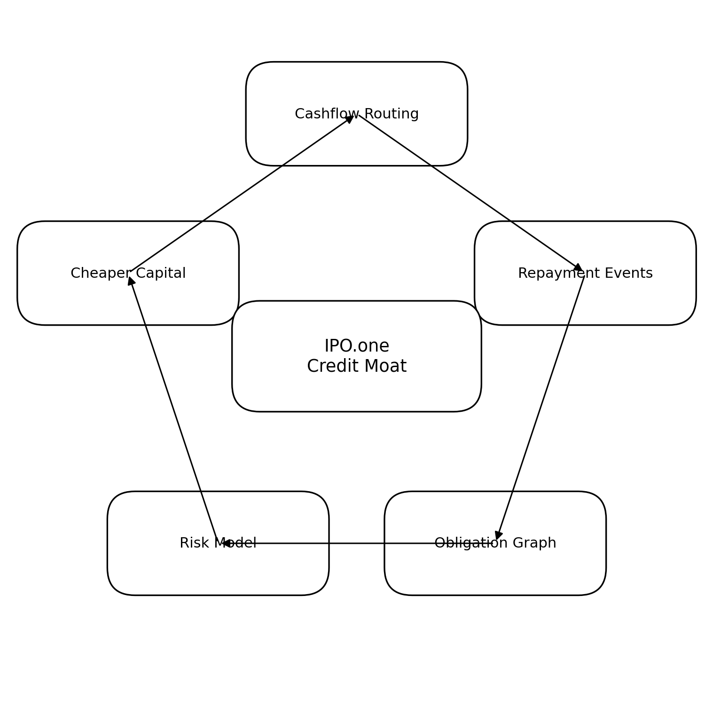
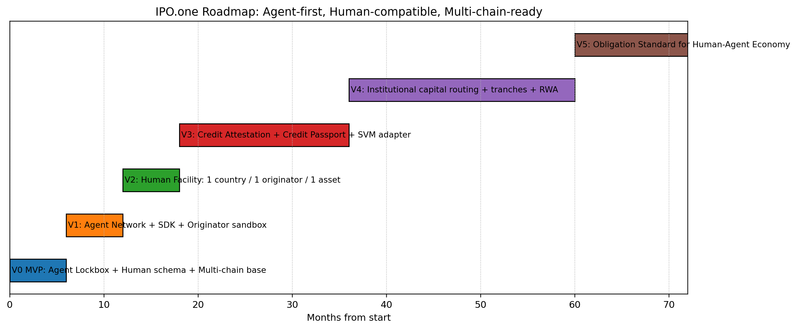
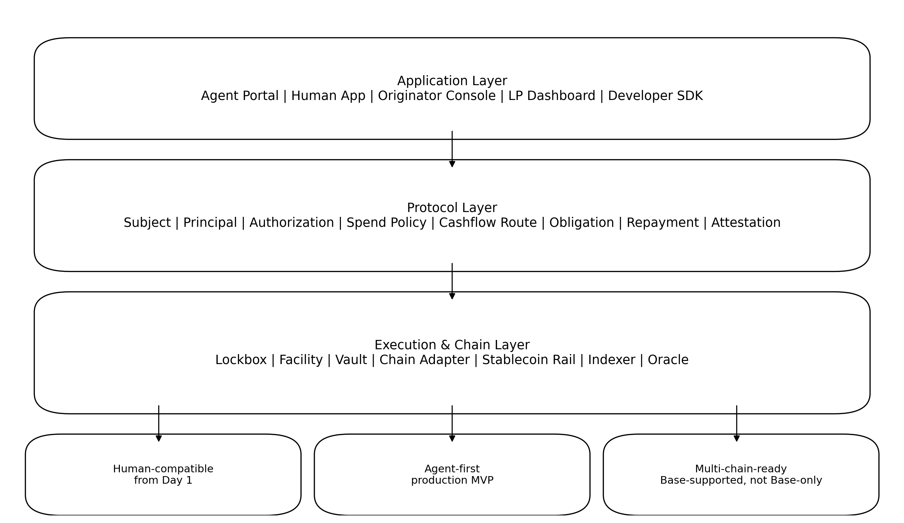

<!--
Source: /Users/cptmao/Downloads/IPO_one_Product_Description_and_PRD_v1.docx
Generated: 2026-07-01
Purpose: Project guidance source for IPO.ONE. Keep future iterations in docs/guidance/.
-->

# IPO.one Product Description and PRD v1

This Markdown file is an extracted, reviewable project guidance copy of the source DOCX. The original DOCX is archived next to this file as `IPO_one_Product_Description_and_PRD_v1.docx`. Extracted image assets are stored in `assets/IPO_one_Product_Description_and_PRD_v1/`.

IPO.one / IPo1 产品描述文档

Business Plan + Technical PRD for a World-Class Product & Engineering Team

版本：v1.0 | 日期：2026-07-01 | 语言：中文，技术接口与代码为英文 | 受众：核心创始团队、顶级工程团队、协议架构师、风控团队、BD/融资团队、合规顾问

定位：本文件是 IPO.one 的产品描述、商业计划与可执行 PRD 的合并版。它不只是 pitch narrative，也不是普通功能清单，而是将商业逻辑、协议对象、产品范围、工程架构、数据边界、安全约束、路线图和验收标准统一到同一份开发基准文档中。

## 文档控制与可靠性边界

| 项目 | 说明 |
| --- | --- |
| Document Name | IPO.one / IPo1 Product Description + Business Plan + Technical PRD |
| Version | v1.0, prepared 2026-07-01 |
| Primary Thesis | IPO.one 是人类与 AI Agent 经济的机器可读信用义务协议层。 |
| Core Product Rule | Agent-first, Human-compatible from Day 1, Multi-chain-ready from Day 1. |
| Non-negotiable Boundary | IPO.one 不直接替代本地持牌放贷机构；不在早期做人类无用途现金贷；不在积累真实还款事件前销售黑盒信用分。 |
| Engineering Rule | 协议核心对象必须 versioned、chain-agnostic、event-sourced、adapter-based，避免因未来多链、人类信用、Originator、RWA 或机构资金扩展而推倒重建。 |
| Legal Boundary | 本文件不是法律、税务、会计、投资或牌照意见；真实上线前必须由目标市场本地律师、合规顾问和审计团队复核。 |

真实性说明：本文件将已经核验的外部技术标准与项目内部战略约束分开处理。对市场规模、未来收入、融资路径等内容，本文件使用“方向性假设”和“可验证 KPI”表达，不把未经验证的预测写成事实。对工程设计，本文件优先采用已被验证的成熟模式，例如 W3C DID / VC、CAIP-2 / CAIP-10、EIP-155 / EIP-712、ERC-4626、OpenZeppelin 5.x、event-sourced indexer、per-chain exposure cap、first-loss tranche、stop-loss covenant 等。

## 目录

- Part I 商业化产品描述与商业计划书
- 1. Executive Summary
- 2. 产品定义与第一性原理
- 3. Why Now
- 4. 目标客户与应用场景
- 5. 市场与竞争格局
- 6. 商业模式
- 7. 护城河
- 8. Go-to-Market 与 Roadmap
- 9. 风险纪律、合规边界与成功指标
- Part II Technical PRD
- 10. PRD 总览与范围
- 11. 架构决策 ADR
- 12. 系统架构
- 13. 协议对象与数据模型
- 14. 人类兼容能力
- 15. 多链兼容能力
- 16. MVP / V0 详细 PRD
- 17. V1-V5 版本 PRD
- 18. 模块级 PRD 与验收标准
- 19. 合约接口与数据接口
- 20. 安全、风控、测试、运维
- 21. 交付计划与工程组织
- 22. 附录：参考资料与核验清单

# Part I — 商业化产品描述与商业计划书



*图 1：IPO.one 的长期商业飞轮：现金流路由 → 还款事件 → Obligation Graph → 风控 → 更便宜资本。*

## 1. Executive Summary

IPO.one 的最终产品定义不是“借贷 App”，而是“人类与 AI Agent 经济的机器可读信用义务协议层”。当稳定币让价值传输变成可编程，当 x402 让 HTTP 级支付变成机器可读，市场仍然缺少一个同样机器可读的“信用义务层”：谁是主体、谁承担责任、资金能用于哪里、未来现金流从哪里还、是否按时履约、违约如何记录、还款历史如何跨平台迁移。IPO.one 的核心机会就在这里。

上一代 DeFi lending 的核心能力是 collateralized borrowing；下一代 PayFi / AgentFi / RWA credit 的核心能力将是 cashflow-constrained obligation。IPO.one 不是为了在早期最大化贷款余额，而是为了标准化信用世界的最小原语：Obligation。

产品战略采用三段式：第一阶段用 Agent Lockbox 证明机器信用可以被创建、使用、自动还款和证明；第二阶段通过 Originator Facility 将人类现金流与本地合规执行协议化；第三阶段通过 Credit Passport / Attestation Network 让还款历史、违约状态和信用证明跨链、跨平台、跨市场迁移。

### 核心结论

| 结论 | 含义 | 产品动作 |
| --- | --- | --- |
| 信用的最小单位不是 Loan，而是 Obligation。 | Loan 只是信用义务的一种。Agent API 后付费、设备分期、工资预支、库存预支都应使用同一套生命周期。 | 从 Day 1 建立 Subject、Principal、Authorization、SpendPolicy、CashflowRoute、Obligation、RepaymentEvent、DefaultEvent、Attestation。 |
| MVP Agent-first。 | Agent 的收入可被 Lockbox 程序化捕获，能用极小规模验证闭环。 | 先做有收入 Agent 的小额 working capital，不做人类真实现金贷。 |
| Human-compatible from Day 1。 | 人类不是另一个产品，而是同一套 Obligation Protocol 的 Human execution adapter。 | MVP 即预留 Human Subject、Consent、KYC/VC reference、Originator、Loan Tape、DPD/default 状态。 |
| Multi-chain-ready from Day 1。 | Base 可以是首发链之一，但不能成为架构边界。 | 使用 CAIP-2、CAIP-10、chain-agnostic obligation_id、per-chain cap、multi-chain indexer。 |
| 早期不卖黑盒信用分。 | 没有真实还款事件前，信用分不可被市场信任。 | 先卖 Repayment Proof、Obligation Status、Attestation API、Cashflow Route Proof。 |
| 不直接替代持牌放贷机构。 | 人类信用的执行依赖本地 KYC、合同、催收、消费者保护和牌照。 | 使用 Originator Facility + first-loss + daily loan tape + stop-loss + audit。 |

## 2. 产品定义与第一性原理

IPO.one = Identity + Payment + Obligation。Identity 解决“谁是主体”；Payment 解决“钱如何流动”；Obligation 解决“未来承诺是什么、如何履约、如何证明”。这也是 IPO.one 名字中 I-P-O 三层含义最自然、最有延展性的产品解释。

```text
I = Identity
Human DID | Agent DID | Org DID | Originator ID | Wallet Account | Principal Binding
```
```text
P = Payment
Stablecoin rails | x402 | Lockbox | Payroll route | Merchant cashflow | Originator settlement
```
```text
O = Obligation
Amount | Term | Fee | Spend Policy | Cashflow Route | Repayment Event | Default Event | Attestation
```

### 第一性原理

1. 信用的本质不是贷款，而是“当前获得价值，未来在约定条件下偿还、交付或结算”的义务。
1. 信用风险的核心不是链上合约风险，而是现金流可捕获性、身份/责任可追踪性、用途可控性、执行可落地性。
1. 早期产品要优先选择现金流闭环强、合规摩擦低、可用智能合约强制执行的场景。
1. 人类信用必须通过本地持牌 Originator 或合规伙伴执行，不应由协议直接承担 KYC、法币放款、催收与消费者保护责任。
1. 多链信用的核心不是桥接资产，而是跨链唯一主体、跨链唯一 obligation、跨链事件归一化、跨链重复授信防护。
1. 长期护城河不是 TVL，而是 Obligation Graph、Cashflow Routing、Attester Registry、Risk + Capital Routing。

## 3. Why Now

IPO.one 的时间窗口来自三条趋势叠加：稳定币规模化、机器可读支付兴起、AI Agent 与新型数字劳动者成为经济主体。

| 趋势 | 已核验事实 / 可观察变化 | 对 IPO.one 的意义 |
| --- | --- | --- |
| 稳定币成为全球支付与链上结算底层资产 | DeFiLlama 稳定币页面在 2026-07-01 抓取时显示 Total Stablecoins Market Cap 约 $311.485B，USDT 约 $184.398B、USDC 约 $73.449B。该数值为动态市场数据，需要在对外材料中实时刷新。 | 信用协议可以使用稳定币作为全球可编程结算层，但必须限定合规资产白名单、链上风险限额和跨链资金归集规则。 |
| x402 让 HTTP 支付可被人和机器原生使用 | Coinbase x402 官方文档将其定义为 open payment protocol，允许 human developers 和 AI agents 通过 HTTP 402 / stablecoin payment 访问 API 和数字服务，并明确支持多网络、CAIP-2、EVM/Solana、USDC/EURC/EIP-3009/Permit2。 | Agent 可以按请求付费、按收入还款；IPO.one 可在 x402 支付前加一层 credit line、spend policy 与 lockbox repayment。 |
| RWA 与 tokenized private credit 仍缺少高质量风控与透明度 | RWA.xyz 是主流 RWA 数据平台；近期研究也指出 RWA 市场不能只看 TVL，需要评估流动性、集中度、资产结构和法律执行。 | IPO.one 应从 obligation transparency、loan tape、attestation、stop-loss covenant 做差异化，而不是把不透明坏账包装成高收益 RWA。 |
| AI Agent 的支付、授权与安全成为监管关注点 | 2026 年监管与学术讨论已经开始关注 agentic AI 在支付、交易、授权、责任归属上的系统性风险。 | IPO.one 必须提供 principal binding、spend policy、kill switch、human/agent consent、attestation 和风险限额，而不是只做支付钱包。 |

## 4. 目标客户与应用场景

IPO.one 不是单一 C 端借款产品，而是一个多角色协议网络。不同角色看到的产品界面不同，但底层共享同一套 Obligation Lifecycle。

| 角色 | 痛点 | IPO.one 产品价值 | 早期优先级 |
| --- | --- | --- | --- |
| Agent Developer / Operator | Agent 有收入但现金流波动，需要先支付 API、模型、算力、数据、RPC 成本。 | 提供小额 working capital credit line；资金只可用于白名单 provider；收入进入 Lockbox 自动还款。 | P0 |
| AI Agent / Workflow Bot | 需要无需人工介入地支付服务、扩展调用能力、保留可迁移信誉。 | Agent DID、spend policy、programmatic payment、repayment events、credit passport。 | P0 |
| API / Compute / Model Provider | 希望获客，但不想承担客户信用风险与坏账。 | 接受 IPO.one credit spend；由 Lockbox / protocol 管理授信与还款；获得更多 Agent 消费。 | P0-P1 |
| Human Borrower / Merchant / Gig Worker | 缺少传统信用记录，但有工资流、商户流水或平台收入。 | 通过 Originator 或平台形成用途限定信用；按现金流自动还款；积累可迁移信用历史。 | V2 起真实上线 |
| Local Originator | 资金成本高、资产透明度不足、很难接入全球稳定币资本。 | 获得 facility、capital routing、loan tape API、first-loss / senior capital structure。 | V1 sandbox, V2 production |
| Institutional LP / Credit Fund | 想接触新型 cashflow credit，但要求透明度、first-loss、covenant 和 reporting。 | 查看 facility exposure、loan tape summary、loss waterfall、stop-loss status、yield/risk reporting。 | V2-V4 |
| Wallet / DeFi / Marketplace | 需要可验证信用状态，但不想自建风控与履约历史。 | 调用 Credit Passport API、Repayment Attestation、Default Status。 | V3+ |

### 核心用例地图

| 用例 | 主体 | 现金流来源 | 资金用途 | 是否适合早期 |
| --- | --- | --- | --- | --- |
| Agent API 后付费 | Agent + Developer Principal | Agent 收入 / x402 收款 | 模型 API、数据 API、推理服务 | MVP 核心 |
| Agent 算力工作资本 | Agent + Company Principal | 服务收入 / 用户订阅 | GPU / inference / node service | MVP / V1 |
| 工资预支 | Human + Employer/Platform/Originator | 工资流 / 平台收入 | 用途限定或现金流预支 | V2 优先 |
| 设备分期 | Human / Merchant | 工资或设备产生的收入 | 设备或服务白名单付款 | V2 优先 |
| 小商户库存预支 | Merchant Human/Org | POS / marketplace cashflow | 库存采购 | V2-V3 |
| 平台工作者收入预支 | Gig Worker | 平台收入流 | 工作资本 / 设备 / 交通 | V2-V3 |
| 机构 RWA credit pool | Originator / LP | Loan tape cashflow | private credit exposure | V4 |

## 5. 市场与竞争格局

IPO.one 的竞争并不是单一维度。它横跨 DeFi lending、PayFi、Agent payments、RWA tokenization、credit bureau、identity / KYC、payment routing、developer infrastructure。正确定位不是“比 Aave 更便宜”或“比 FICO 更 Web3”，而是成为这些系统之间缺失的 obligation and repayment state layer。

| 类别 | 代表 | 他们解决什么 | 没有解决什么 | IPO.one 差异化 |
| --- | --- | --- | --- | --- |
| Overcollateralized DeFi Lending | Aave、Compound | 链上抵押借贷、清算、利率模型、资金池安全。Compound III 初始部署以 USDC 为 base asset；Aave V3 有 isolation mode、debt ceiling 等成熟风险隔离模式。 | 不能服务缺抵押但有现金流的 Human / Agent 主体。 | IPO.one 不替代它们，而是补足 undercollateralized / cashflow-constrained obligation。 |
| Institutional Onchain Credit | Maple、Goldfinch Prime 等 | 机构借款、私募信贷、基金管理、合规投资者入口。 | 通常依赖 offchain diligence、借款人或管理人报告，难以覆盖 Agent 小额高频信用。 | IPO.one 以 loan tape、first-loss、stop-loss、cashflow proof 作为硬约束，并从 Agent 闭环切入。 |
| PayFi / Payment Financing | Huma、跨境支付融资网络 | 围绕真实支付流水做融资，强调现金流。 | 主要集中在特定支付场景和 B2B flow，不一定提供人机统一 Obligation Protocol。 | IPO.one 将 PayFi 原理扩展到 Agent API、Human cashflow、Originator facility 和 Credit Passport。 |
| Agent Payments | x402、AP2、agent wallets | 让 Agent 或人类可直接按请求付款。 | 付款不是信用；缺少额度、还款、违约、信用迁移。 | IPO.one 是 x402 上方的 credit layer，而不是替代 x402。 |
| Credit Bureau / Scoring | FICO、Experian、TransUnion、本地征信 | 传统人类信用记录和评分。 | 不能自然覆盖 AI Agent、钱包、跨链支付、程序化 obligation；也不直接读取链上 cashflow。 | IPO.one 先积累可验证 repayment events，再形成 Credit Passport API。 |
| RWA Tokenization | Securitize、Ondo、Centrifuge、RWA platforms | 资产上链、合规发行、投资者准入。 | tokenization 不等于信用透明；很多 RWA 的执行和风险仍在链下。 | IPO.one 把底层 credit obligation、loan tape、cashflow proof 和 attestation 标准化。 |

### 竞争定位图

```text
Traditional Credit Bureau          DeFi Lending Protocols
|                                      |
|  human history                       |  collateral + liquidation
|                                      |
+------------------- IPO.one -------------------+
|
machine-readable obligation layer
|
Agent Credit + Human Cashflow + Originator Facility
|
Repayment Proof + Default State + Attestation
```

## 6. 商业模式

IPO.one 的商业模式不能依赖对弱势人类用户收取高 APR。长期收入应该来自协议使用费、现金流路由费、资金路由费、风险管理费、Credit Passport API 和机构数据订阅。早期通过极窄场景验证 unit economics；后期通过 Obligation Graph 和 Attester Network 放大网络效应。

| 收入层 | 触发点 | 收费方式 | 适用版本 | 备注 |
| --- | --- | --- | --- | --- |
| Protocol Usage Fee | 创建 credit line、写入 obligation、记录 repayment/default、生成 attestation。 | 小额固定费或 bps。 | MVP 起 | 不能为了收费制造无意义交易；优先给开发者低摩擦。 |
| Cashflow Routing Fee | Agent Lockbox 或 Human cashflow route 发生还款、分账、释放余额。 | basis points 级 routing fee。 | MVP 起 | 应与实际成功收款绑定。 |
| Provider Routing Fee | Agent 使用 IPO.one credit 支付白名单 API/compute/model provider。 | provider 侧成交费或 volume rebate。 | V1 起 | 需要防止 provider 自刷交易。 |
| Facility Fee | Originator 使用 IPO.one facility 获取资金或上报 loan tape。 | annual facility fee 或 origination fee。 | V2 起 | 只对有 first-loss 和透明 loan tape 的 facility 开放。 |
| Risk Management Fee | IPO.one 提供风控、covenant、stop-loss、capital routing。 | management fee / performance fee。 | V2-V4 | 不可将高风险包装成低风险。 |
| LP Vault Fee | 机构 LP vault 管理、报告、资金分配。 | AUM fee / admin fee。 | V4 起 | 需明确投资者适当性与监管边界。 |
| Credit Passport API | 第三方读取 repayment proof、default status、cashflow attestation。 | per query / subscription / enterprise API。 | V3 起 | 早期不输出黑盒 score，只输出可验证状态。 |

### 示例收入路径：作为规划假设，而非保证

| 阶段 | 核心收入来源 | 关键前提 | 收入模型 |
| --- | --- | --- | --- |
| Phase 0 / MVP | Agent usage + lockbox routing + provider routing | 50-100 个有真实收入 Agent；自动还款成功率 >95%；gross loss <3%。 | 小额手续费 + bps；目标是验证行为，不是追求 ARR。 |
| Phase 1 / V1 | SDK adoption + provider network + agent credit network | 数百个 Agent、多个 provider、重复使用率 >40%。 | developer / provider / routing 组合收入。 |
| Phase 2 / V2 | Originator facility fee + risk fee + LP dashboard | 单国家、单资产、单 Originator、first-loss、daily loan tape。 | permissioned facility fee + risk management fee。 |
| Phase 3 / V3+ | Credit Passport API + capital routing | 足够多 repayment/default events，可被第三方信任。 | API subscription + enterprise reporting + capital routing。 |

## 7. 护城河

IPO.one 的护城河不是一份信用分表，而是一张不断增长、可验证、可路由、可被资本使用的 Obligation Graph。

| 护城河 | 形成方式 | 为什么难复制 |
| --- | --- | --- |
| Obligation Graph | 每个 Agent / Human / Originator 的 obligation、cashflow route、repayment、default、attestation 被标准化记录。 | 没有真实还款事件就无法复制；历史越长，预测能力越强。 |
| Cashflow Routing | Agent 收入先进 Lockbox；Human 通过工资流、商户流水、平台收入或 Originator 收款账户还款。 | 谁控制现金流入口，谁就拥有风险定价权。 |
| Attester Registry | API provider、Originator、Employer、Platform、Protocol 各自只能签发其权限内证明。 | 信任网络需要时间、审计、声誉和权限治理。 |
| Risk + Capital Routing | 更好数据带来更便宜资本，更便宜资本吸引更好主体，形成正向循环。 | 资本、数据、风险模型、执行通道相互强化。 |
| Developer Integration | SDK、API、webhook、provider marketplace 形成开发者嵌入。 | 嵌入支付/信用/还款流程后替换成本高。 |
| Multi-chain Credit State | 跨链账户、跨链 obligation、跨链 repayment proof 归一化。 | 简单桥或单链协议难以复制完整 credit state。 |

## 8. Go-to-Market 与 Roadmap



*图 2：从 Agent Lockbox 到 Credit Protocol Standard 的版本路线图。*

产品路线不应同时攻击所有市场。正确顺序是先证明最窄闭环，再把底层协议对象持续复用到更大场景。

| 版本 | 时间 | 商业目标 | 产品目标 | Go / No-Go |
| --- | --- | --- | --- | --- |
| V0 / MVP | 0-6 个月 | 证明 Agent 信用闭环。 | Agent Lockbox + Human schema + Multi-chain base。 | 50-100 active Agents；还款成功率 >95%；收入捕获率 >90%；gross loss <3%。 |
| V1 | 6-12 个月 | 商业化 Agent Credit Network。 | SDK、provider integration、agent credit lifecycle、Originator sandbox。 | 数百 Agent、多 provider、重复使用率 >40%；human flow 可模拟。 |
| V2 | 12-18 个月 | 真实人类信用试点。 | 单国家、单资产、单 Originator facility、daily loan tape、first-loss、stop-loss。 | 无黑箱资产；first-loss 10%-20%；loan tape 每日同步；stop-loss 可自动执行。 |
| V3 | 18-36 个月 | 信用证明网络。 | Attester Registry、Credit Passport API、跨链 credit state、SVM adapter。 | 第三方 API 调用增长；多 Originator 但每个都有 covenant。 |
| V4 | 36-60 个月 | 机构信用与资本路由。 | risk-tiered pools、tranches、institutional vaults、multi-chain treasury。 | 机构级 reporting、审计、合规投资者限制。 |
| V5 | 5 年+ | Obligation Standard。 | 开放标准、生态应用、全链 credit state protocol。 | 外部平台主动使用 IPO.one status / attestation。 |

## 9. 风险纪律、合规边界与成功指标

IPO.one 的风险纪律必须写进产品，不应停留在运营手册。每一个模块都要有暂停、限额、审计、透明度和可追责的状态机。

### 明确不做

| 阶段 | 不做什么 | 原因 |
| --- | --- | --- |
| MVP | 不做人类真实放贷；不开放 public LP；不做 token；不允许任意提现。 | 避免监管、坏账、资金池挤兑和叙事过早金融化。 |
| V1 | 不为了增长放松 Lockbox；不接无收入 Agent；不补贴虚假交易。 | 防止伪 PMF 和早期坏账污染数据。 |
| V2 | 不直接 KYC；不直接催收；不接无 first-loss、无 loan tape 的 Originator。 | 避免 Goldfinch 式代理风险和本地法律执行风险。 |
| V3 | 不卖无依据黑盒信用分；不让 attester 权限泛化。 | 信用证明必须可验证、可追责、可撤销。 |
| V4+ | 不把不透明坏账包装成 RWA；不把高风险产品卖给不适当投资者。 | 保护协议声誉与长期资本来源。 |

### 核心 KPI

| 类别 | MVP 指标 | V1-V2 指标 | 长期指标 |
| --- | --- | --- | --- |
| Agent | Active Agent 50-100；收入捕获率 >90%；自动还款成功率 >95%。 | SDK 调用、provider 数、重复使用率、agent GMV。 | Agent credit passport 复用率、provider network moat。 |
| Human | schema 100% 准备；Originator mock 可跑完整生命周期。 | 1 国家 / 1 资产 / 1 Originator；daily loan tape；stop-loss。 | 多市场 repayment attestation、默认率、信用迁移。 |
| Risk | gross loss <3%；allowlisted spend 100%。 | first-loss 10%-20%；DPD 监控；facility covenant。 | portfolio-level expected loss / realized loss 差异。 |
| Multi-chain | CAIP-2/10；多链账户绑定；per-chain cap。 | 多 EVM 测试；跨链对账。 | 跨链 credit state、capital routing、treasury rebalancing。 |
| Business | 真实需求、重复使用、低 CAC 验证。 | provider / originator / LP 合作。 | Credit Passport API、capital routing、institutional subscription。 |

# Part II — Technical PRD for World-Class Engineering Team



*图 3：IPO.one 三层产品与系统架构。核心协议层必须同时兼容 Human、Agent 与 Multi-chain。*

## 10. PRD 总览与范围

本 PRD 的目标是让顶级工程团队可以直接开始设计 repository、模块边界、schema、合约接口、API、测试计划和版本迭代。它不是最终代码实现，但已经定义了不可随意改变的协议对象、状态机、架构边界和验收标准。

### 产品愿景

IPO.one 构建一个多链、可验证、可组合的人机信用义务协议，帮助人类、AI Agent、开发者、商户、Originator、DeFi 协议与资金池，用统一的机器可读规则创建、使用、偿还、证明和迁移信用。

### V0 / MVP 产品目标

1. 上线 Agent Lockbox 真实生产闭环：Agent 可以获得小额用途限定信用额度，用于白名单 API / compute / model provider，并通过可捕获收入自动还款。
1. 完成 Human-compatible schema：即使 MVP 不开放真实人类借款，系统也能表达 Human Subject、Consent、KYC/VC reference、Originator、Loan Tape、DPD、Default、Restructure、Repurchase。
1. 完成 Multi-chain-ready architecture：使用 CAIP-2、CAIP-10、chain-agnostic obligation_id、多链账户绑定、多链事件索引、per-chain cap、bridge adapter interface。
1. 建立内部 Admin / Risk Console：团队可以实时查看额度、利用率、还款、逾期、provider spend、链上 exposure、异常与暂停状态。

### V0 / MVP 非目标

- 不做人类真实现金贷。
- 不开放 public LP vault。
- 不发行 token，不做 DAO 治理。
- 不做复杂机器学习信用评分；先用规则 + 现金流覆盖。
- 不支持任意提现；资金只能用于白名单 spend policy。
- 不在所有链同时部署真实信用池。
- 不将原始 KYC、护照、设备指纹、行为数据上链。

## 11. 架构决策 ADR

| ADR | 决策 | 原因 | 工程结果 |
| --- | --- | --- | --- |
| ADR-001 | Agent-first, Human-compatible from Day 1。 | Agent 是最容易闭环验证的信用主体；人类信用的 schema 必须前置，否则 V2 会重构。 | SubjectType 包含 HUMAN / AGENT / ORG / ORIGINATOR；Human state machine 和 Originator hooks 从 V0 预留。 |
| ADR-002 | Obligation 是协议最小原语。 | Loan、postpaid API、device installment、payroll advance 都是 obligation。 | 统一 ObligationRegistry，不为不同产品线创建互不兼容的数据模型。 |
| ADR-003 | Base-supported, not Base-only。 | Base 适合 MVP，但多链是长期产品能力。 | 所有账户使用 CAIP-10，所有链使用 CAIP-2；obligation_id 不包含单链自增假设。 |
| ADR-004 | 不把跨链桥作为信用安全根。 | 跨链桥和消息延迟会产生重复授信、replay 和资产损失风险。 | Canonical Event Store + finality policy + global credit cap + per-chain cap；跨链消息只是 adapter。 |
| ADR-005 | 协议不直接替代本地放贷机构。 | 人类信用执行依赖本地法律、KYC、催收和牌照。 | Originator Facility 模块要求 first-loss、daily loan tape、stop-loss、audit、repurchase covenant。 |
| ADR-006 | 数据隐私采用 reference/hash/attestation，而不是原始数据上链。 | PII 上链不可逆，且容易违反隐私与消费者保护。 | KYC/VC/loan tape 原始数据 offchain；链上仅存 reference、hash、status、event。 |
| ADR-007 | 升级边界受限，历史不可重写。 | 避免“可升级合约”篡改历史信用状态。 | 新功能通过 versioned factories / adapters 扩展；历史 repayment/default events append-only。 |
| ADR-008 | 早期不卖信用分。 | 没有足够还款事件前，score 不可靠。 | API 输出 status/proof/attestation，不输出黑盒 rating。 |

## 12. 系统架构

```text
┌──────────────────────────────────────────────────────────────────────────────┐
│ Application Layer                                                             │
│ Agent Portal | Human Borrower App | Originator Console | LP Dashboard         │
│ Developer SDK | Provider Dashboard | Admin/Risk Console                       │
└──────────────────────────────────────────────────────────────────────────────┘
↓
┌──────────────────────────────────────────────────────────────────────────────┐
│ Protocol Service Layer                                                        │
│ Subject Service | Principal Service | Authorization Service                   │
│ Obligation Service | Spend Policy Service | Cashflow Route Service            │
│ Repayment Service | Attestation Service | Risk Engine | Credit Passport API   │
└──────────────────────────────────────────────────────────────────────────────┘
↓
┌──────────────────────────────────────────────────────────────────────────────┐
│ Onchain Execution Layer                                                       │
│ SubjectRegistry | ObligationRegistry | AgentLockbox | SpendPolicyManager      │
│ RepaymentRouter | AttestationRegistry | Facility | Vault | ChainAdapter       │
└──────────────────────────────────────────────────────────────────────────────┘
↓
┌──────────────────────────────────────────────────────────────────────────────┐
│ Data / Risk / Compliance Layer                                                │
│ Multi-chain Indexer | Event Store | Loan Tape Store | Risk Feature Store      │
│ Reconciliation | Monitoring | Alerting | Audit Log | Privacy Boundary         │
└──────────────────────────────────────────────────────────────────────────────┘
```

### 核心设计原则

1. 事件驱动：Repayment、Default、Attestation、LimitChange、Freeze、StopLoss 等都是 append-only events。
1. 状态可重建：任意时点 obligation status 应可由事件日志重建，避免数据库状态漂移。
1. 链无关：Subject、Principal、Obligation、Attestation 的 canonical ID 不依赖单链地址。
1. 执行链隔离：每条链有独立 cap、资产白名单、合约地址、finality policy、pause。
1. 模块可替换：risk engine、KYC adapter、chain adapter、originator adapter、cross-chain messaging adapter 可升级替换，不改变核心 obligation schema。
1. 敏感数据不上链：Human PII、原始 KYC、设备指纹、原始行为数据、完整 loan tape 明细默认 offchain。
1. 安全优先：所有可转移资产模块使用 ReentrancyGuard、Pausable、AccessControl、SafeERC20、timelock/multisig、rate limits。

## 13. 协议对象与数据模型

协议对象必须稳定、可版本化、可扩展。以下是 V0 必须实现的 canonical schema。实际工程中建议使用 protobuf / JSON Schema / TypeScript types / Solidity structs 同步生成，以避免多端 drift。

### 13.1 Subject

```text
type SubjectType = "HUMAN" | "AGENT" | "ORG" | "ORIGINATOR";
```
```text
type Subject = {
subjectId: string;              // deterministic UUID/hash, chain-agnostic
subjectType: SubjectType;
did?: string;                   // W3C DID if available
primaryPrincipalId: string;
linkedAccounts: CAIP10Account[];
status: "ACTIVE" | "FROZEN" | "SUSPENDED" | "CLOSED";
riskTier: "UNRATED" | "TIER_1" | "TIER_2" | "TIER_3" | "TIER_4";
metadataRef?: string;           // offchain encrypted metadata reference
createdAt: string;
updatedAt: string;
schemaVersion: "subject.v1";
};
```
```text
type CAIP10Account = {
accountId: string;              // e.g. eip155:8453:0x..., solana:...:...
purpose: "PRIMARY" | "REVENUE" | "REPAYMENT" | "TREASURY" | "EXECUTION";
verifiedAt: string;
verificationMethod: "EIP712" | "SOLANA_SIGN" | "MOVE_SIGN" | "CUSTODIAL_ATTESTATION";
status: "ACTIVE" | "REVOKED" | "COMPROMISED";
};
```

### 13.2 Principal

```text
type Principal = {
principalId: string;
principalType: "HUMAN_SELF" | "DEVELOPER" | "COMPANY" | "ORIGINATOR" | "EMPLOYER" | "PLATFORM";
legalEntityRef?: string;        // offchain, encrypted
jurisdiction?: string;
responsibilityScope: "FULL" | "LIMITED" | "OPERATIONAL" | "FIRST_LOSS";
linkedSubjects: string[];
status: "ACTIVE" | "UNDER_REVIEW" | "RESTRICTED" | "CLOSED";
schemaVersion: "principal.v1";
};
```

### 13.3 Obligation

```text
type ObligationStatus =
| "CREATED" | "AUTHORIZED" | "FUNDED" | "ACTIVE" | "PARTIALLY_REPAID"
| "REPAID" | "GRACE_PERIOD" | "DPD_1_30" | "DPD_31_60" | "DPD_61_90"
| "RESTRUCTURED" | "CURED" | "DEFAULTED" | "REPURCHASED"
| "WRITTEN_OFF" | "DISPUTED" | "CLOSED" | "FROZEN";
```
```text
type Obligation = {
obligationId: string;           // hash(protocolVersion, subjectId, principalId, nonce, cashflowRouteId, spendPolicyId)
subjectId: string;
principalId: string;
originatorId?: string;
obligationType: "AGENT_WORKING_CAPITAL" | "API_POSTPAID" | "PAYROLL_ADVANCE" | "DEVICE_INSTALLMENT" | "MERCHANT_INVENTORY" | "ORIGINATOR_FACILITY";
asset: AssetId;
principalAmount: string;        // integer string in asset smallest unit
feeModelId: string;
dueAt: string;
repaymentPriority: number;
spendPolicyId: string;
cashflowRouteId: string;
status: ObligationStatus;
outstandingPrincipal: string;
accruedFees: string;
repaidAmount: string;
defaultEventId?: string;
attestations: string[];
chainExecutions: ChainExecutionRef[];
schemaVersion: "obligation.v1";
};
```
```text
type AssetId = {
chainId: string;                // CAIP-2, e.g. eip155:8453
tokenAddress: string;
symbol: string;
decimals: number;
assetRiskTier: "APPROVED_NATIVE" | "APPROVED_WRAPPED" | "RESTRICTED";
};
```

### 13.4 Spend Policy

```text
type SpendPolicy = {
spendPolicyId: string;
policyType: "ALLOWLIST_ONLY" | "CATEGORY_LIMIT" | "ORIGINATOR_DISBURSEMENT";
allowedRecipients: CAIP10Account[];
allowedCategories: string[];    // API, COMPUTE, MODEL, DATA, DEVICE, INVENTORY, PAYROLL
perTxLimit: string;
dailyLimit: string;
weeklyLimit: string;
expiryAt?: string;
requiresProviderAttestation: boolean;
status: "ACTIVE" | "PAUSED" | "EXPIRED";
schemaVersion: "spend_policy.v1";
};
```

### 13.5 Cashflow Route

```text
type CashflowRoute = {
cashflowRouteId: string;
routeType: "AGENT_LOCKBOX" | "PAYROLL" | "MERCHANT_POS" | "PLATFORM_REVENUE" | "ORIGINATOR_COLLECTION";
sourceAccounts: CAIP10Account[];
destinationLockbox: CAIP10Account;
repaymentWaterfall: RepaymentWaterfallStep[];
captureRequirement: {
minCaptureRatioBps: number;   // e.g. 9000 = 90%
lookbackDays: number;
};
status: "ACTIVE" | "DEGRADED" | "PAUSED" | "FAILED";
schemaVersion: "cashflow_route.v1";
};
```
```text
type RepaymentWaterfallStep = {
order: number;
destination: "FEES" | "PRINCIPAL" | "PENALTY" | "RESERVE" | "BORROWER_RELEASE" | "DEVELOPER_RELEASE";
bpsOrAmount: string;
};
```

### 13.6 Events

```text
type CreditEvent = {
eventId: string;
eventType: "SUBJECT_CREATED" | "ACCOUNT_BOUND" | "OBLIGATION_CREATED" | "SPEND_EXECUTED" |
"REPAYMENT_POSTED" | "DEFAULT_RECORDED" | "ATTESTATION_ISSUED" |
"LIMIT_CHANGED" | "FREEZE" | "UNFREEZE" | "STOP_LOSS_TRIGGERED";
subjectId: string;
obligationId?: string;
chainId?: string;
txHash?: string;
blockNumber?: number;
finalityStatus: "PENDING" | "CONFIRMED" | "FINALIZED" | "REORGED" | "INVALIDATED";
payloadHash: string;
payloadRef?: string;
timestamp: string;
schemaVersion: "event.v1";
};
```

## 14. 人类兼容能力

Human-compatible 不是在 V2 临时加一个借款页面，而是从 V0 起在协议对象、身份授权、现金流、状态机、Originator 接口、隐私边界中预留。MVP 不做人类真实放贷，但必须能完整表达一笔人类信用义务。

### 14.1 Human 模块范围

| 层 | V0 需要做 | V1 需要做 | V2 生产上线 |
| --- | --- | --- | --- |
| Human Subject | SubjectType.HUMAN、jurisdiction、riskTier、KYC/VC reference 字段。 | Borrower profile read-only。 | 真实 borrower onboarding 由 Originator/KYC partner 执行。 |
| Consent | ConsentLedger schema；termsRef、dataUsageRef、revocationStatus。 | 用户授权 UX 原型。 | 真实授权签名、合同 reference、撤销与过期。 |
| KYC/VC | 只存 reference/hash/status。 | KYC adapter mock、VC adapter mock。 | Originator/KYC partner 签发 VC / attestation。 |
| Cashflow | PAYROLL / MERCHANT_POS / PLATFORM_REVENUE / ORIGINATOR_COLLECTION route type。 | Payroll / merchant mock。 | 真实现金流由 Originator / platform 集成。 |
| Loan Tape | LoanTapeRecord schema。 | Loan Tape Simulator。 | 每日 borrower-level loan tape；hash anchor；audit。 |
| DPD/Default | 状态机预留。 | DPD dashboard。 | 真实 DPD、restructure、repurchase、write-off。 |
| Credit Passport | placeholder 和 read model。 | read-only profile。 | repayment/default attestation 可被第三方读取。 |

### 14.2 Human Obligation 状态机

```text
CREATED
-> KYC_PENDING
-> APPROVED_BY_ORIGINATOR
-> FUNDED
-> ACTIVE
-> PARTIALLY_REPAID
-> REPAID -> CLOSED
-> GRACE_PERIOD
-> DPD_1_30
-> DPD_31_60
-> DPD_61_90
-> RESTRUCTURED -> CURED | DEFAULTED
-> DEFAULTED -> REPURCHASED | WRITTEN_OFF
-> DISPUTED -> ACTIVE | CLOSED
```

### 14.3 人类扩张原则

1. V2 只做一个国家、一个资产类型、一个 Originator、一个资金池。
1. 优先工资预支、设备分期、小商户库存预支、平台工作者收入预支。
1. 不做纯现金贷、不做高 APR 短贷、不做无用途限制贷款。
1. Originator 必须承担 10%-20% first-loss，且必须每日同步 borrower-level loan tape。
1. 任何 Originator 如果 loan tape 延迟、DPD 超阈值、欺诈率超阈值、first-loss 不足，facility 自动 stop-loss。

## 15. 多链兼容能力

Multi-chain-ready 必须从身份、账户、obligation ID、事件、资产、消息、安全限额七层开始，而不是后面临时接桥。

| 层 | 设计要求 | V0 实现 |
| --- | --- | --- |
| Chain Identity | 使用 CAIP-2 表达 chain_id；EVM 使用 eip155 namespace。 | ChainRegistry 支持 eip155:1、eip155:8453、eip155:42161、eip155:10、eip155:137 等配置。 |
| Account Binding | 使用 CAIP-10 表达账户；每个 subject 可绑定多个账户和用途。 | EVM EIP-712 签名绑定；Solana/Move 预留 adapter。 |
| Obligation ID | chain-agnostic deterministic ID；不能使用单链自增 ID。 | hash(protocolVersion, subjectId, principalId, nonce, route, policy)。 |
| Event Indexing | 所有链上事件进入统一 Event Store；区分 pending/confirmed/finalized/reorged。 | 多链 indexer schema；V0 先接生产链 + 若干只读链。 |
| Asset Layer | 每链独立 token whitelist、decimals、risk tier、cap。 | USDC 优先；wrapped asset 默认 restricted。 |
| Cross-chain Messaging | Adapter interface，不绑定唯一桥。 | V0 只预留；V1/V2 可评估 CCTP/CCIP/LayerZero/Wormhole/Hyperlane。 |
| Risk Control | global credit limit + per-chain cap + bridge exposure cap + finality delay。 | Risk Engine 必须在审批前检查全局 exposure。 |

### 主流链兼容路线

| 链族 | 代表链 | 策略 | 上线阶段 |
| --- | --- | --- | --- |
| EVM L1 / L2 | Ethereum、Base、Arbitrum、Optimism、Polygon、BNB Chain、Avalanche、Celo | 第一优先级。合约、钱包、USDC、x402、开发者生态成熟。 | V0/V1 |
| SVM | Solana | schema 兼容、账户绑定、repayment event、agent revenue proof。 | V3 生产适配 |
| Move | Aptos、Sui | schema 兼容；根据用户与机构需求做 adapter。 | V3+ |
| Cosmos / IBC | Cosmos appchains | 后续根据区域/应用链需求评估。 | V4+ |
| Bitcoin / UTXO | Bitcoin L2、payment proof | 不作为早期执行层；可做证明读取。 | V4+ |

### 跨链安全不变量

- 同一 subject 在所有链上的 aggregate utilization 不得超过 global credit limit。
- 同一 obligation_id 不得在不同链重复创建 funded active state。
- 未 finalized 的 repayment event 不得释放更高额度。
- 任意 cross-chain message 必须有 source chain、destination chain、nonce、expiry、payload hash、replay protection。
- 桥或消息 adapter 发生异常时，相关链的 credit issuance 自动 pause，但 repayment route 可以保留安全入口。
- 每条链的 asset whitelist、decimals、price/risk oracle、settlement time 必须独立配置。

## 16. MVP / V0 详细 PRD

### 16.1 MVP 用户旅程：Agent Developer

1. Developer 使用钱包或组织账户登录 Developer Portal。
1. 创建 Agent Subject，绑定 Agent execution account、revenue account、developer principal。
1. 系统读取历史收入、provider spend、收入捕获率、调用成功率，给出初始小额 credit line。
1. Developer 接受 EIP-712 typed authorization，创建 spend policy 和 cashflow route。
1. Agent 使用 credit line 支付白名单 API / compute / model provider。
1. Agent 收入进入 Lockbox；Repayment Router 按 waterfall 自动还 fee/principal。
1. 还款成功后生成 RepaymentEvent 和 Attestation；剩余余额释放给 developer。
1. 若收入捕获率下降、逾期或异常支出，系统自动降额、冻结或触发 review。

### 16.2 MVP 功能清单

| 模块 | P0 功能 | 验收标准 |
| --- | --- | --- |
| Developer Portal | 登录、Agent 创建、账户绑定、credit line、obligation、repayment history、API key。 | 开发者可在 10 分钟内完成 Agent 注册和 Lockbox 接入。 |
| Agent Lockbox | 收入接收、还款 waterfall、余额释放、冻结、emergency pause。 | 任意 outstanding obligation 未还清前，Lockbox 收入优先还款。 |
| Spend Policy Engine | provider allowlist、per tx/daily/weekly limit、category limit。 | 100% 资金流向白名单 recipient；越权交易 revert。 |
| Obligation Registry | create/authorize/fund/repay/default/freeze。 | 每笔 obligation 有 deterministic ID；事件完整可重建状态。 |
| Repayment Router | 自动计算 principal/fee/outstanding、生成事件。 | 还款金额、余额、释放金额与测试向量一致。 |
| Risk Engine v0 | 规则额度、收入覆盖、capture ratio、repeat repayment 提额。 | 无收入 Agent 不进入 lending，只进入 prepaid spend management。 |
| Admin/Risk Console | active obligation、exposure、loss、late、provider spend、chain cap。 | 风险团队可一键 freeze subject / obligation / chain。 |
| Multi-chain Base | CAIP-2/10、account binding、event schema、per-chain cap。 | 至少支持 3 条 EVM 链账户绑定，1 条生产链执行。 |
| Human Schema | Human subject、consent、originator、loan tape、DPD/default schema。 | 可用 simulator 跑完整 Human Obligation lifecycle。 |

### 16.3 MVP Go / No-Go 指标

| 指标 | 目标 | Fail 时动作 |
| --- | --- | --- |
| Active Agent Accounts | 50-100 | 低于目标时不扩大 provider，先重做 onboarding 和定位。 |
| Monthly Revenue per Active Agent | > $5-$20 | 收入太低的 Agent 不授信，转 prepaid。 |
| Gross Margin | > 50% | 链上/支付成本过高则调整 batch、gas sponsorship 或链选择。 |
| Credit Line Utilization | > 40% | 低利用率说明额度或用途不匹配。 |
| Repeat Borrowing / Reuse | > 40% | 低重复说明不是刚需。 |
| Revenue Capture Ratio | > 90% | 低于阈值自动降额/冻结。 |
| Automated Repayment Success | > 95% | 低于阈值暂停新增授信。 |
| 30-day Gross Loss | < 3% | 触发 risk review，降低额度/收紧 spend policy。 |
| Allowlisted Spend Ratio | 100% | 任何越权 spend 为 P0 security incident。 |

## 17. V1-V5 版本 PRD

| 版本 | 产品范围 | 核心交付 | 非目标 |
| --- | --- | --- | --- |
| V1 Agent Credit Network | 商业化 Agent、SDK、provider network、Originator sandbox。 | Developer SDK、Provider Dashboard、Webhook、Agent Metrics、Loan Tape Simulator、Borrower UI beta、多 EVM 测试。 | 不放松 Lockbox；不做人类大规模放贷。 |
| V2 Human Credit Primitive | 单国家、单资产、单 Originator 真实试点。 | Originator Facility、Daily Loan Tape、First-loss、Stop-loss、LP Facility Dashboard、真实 Human DPD 状态。 | 不做多国并发；不接黑箱 Originator。 |
| V3 Credit Attestation Network | 信用证明网络和跨链 Credit Passport。 | Attester Registry、Credit Passport API、Solana/SVM adapter、Wallet/DeFi integration。 | 不输出黑盒 score；不让 attester 权限泛化。 |
| V4 Institutional Capital Routing | 机构级资金池和跨链资本路由。 | Risk-tiered pools、tranches、institutional vaults、multi-chain treasury、RWA/DAT/GMC integration。 | 不向不适当投资者开放高风险产品。 |
| V5 Obligation Standard | 开放标准与生态应用。 | 公共标准、第三方应用、生态基金、全链 credit state。 | 治理不先于真实 PMF。 |

## 18. 模块级 PRD 与验收标准

| 模块 | 目的 | 核心功能 | 验收标准 |
| --- | --- | --- | --- |
| Subject Registry | 统一管理 Human / Agent / Org / Originator subject。 | createSubject, bindAccount, revokeAccount, freezeSubject, updateRiskTier。 | subjectId deterministic；CAIP-10 account 唯一；被冻结 subject 不可创建新 obligation。 |
| Principal Registry | 记录最终责任主体和责任范围。 | createPrincipal, linkSubject, updateResponsibilityScope。 | 每个 funded obligation 必须有 principalId；Agent obligation 必须绑定 developer/company principal。 |
| Authorization Service | 处理 EIP-712、人类 consent、Agent policy、VC/KYC reference。 | createAuthorization, verifySignature, revokeAuthorization。 | 所有 obligation authorization 必须 domain-separated，包含 chainId / verifyingContract / expiry / nonce。 |
| Chain Registry | 管理多链配置。 | addChain, updateFinalityPolicy, setAssetWhitelist, setChainCap, pauseChain。 | 暂停链后不能新增 spend/fund，但可允许安全还款入口。 |
| Obligation Registry | 记录标准化信用义务。 | createObligation, authorize, fund, repay, default, restructure, close。 | 状态转换必须符合状态机；不能跳过 authorization；历史事件不可删除。 |
| Agent Lockbox | 捕获 Agent 收入并自动还款。 | depositRevenue, executeSpend, repayWaterfall, releaseSurplus, freeze。 | 未清偿 obligation 前收入优先还款；spend 只允许白名单 recipient。 |
| Spend Policy Manager | 限制资金用途和交易限额。 | createPolicy, setAllowlist, checkSpend, pausePolicy。 | 任何不符合 recipient/category/limit 的 spend 必须 revert。 |
| Cashflow Router | 定义未来现金流入口和 waterfall。 | createRoute, updateStatus, postRevenue, routeRepayment。 | route degraded 时自动降低额度；route failed 时冻结新增授信。 |
| Repayment Router | 计算还款、费用、余额与事件。 | postRepayment, applyWaterfall, computeOutstanding。 | outstanding = principal + fees - repayment - writeoff；所有计算使用整数和明确 rounding。 |
| Attestation Registry | 记录第三方证明。 | issueAttestation, revokeAttestation, queryAttestation。 | attester 权限最小化；每类 attestation 有 schema 和 expiry。 |
| Risk Engine v0/v1 | 规则额度、风险层级、提额/降额、stop-loss。 | scoreSubject, approveLimit, monitorRisk, triggerFreeze。 | 审批必须检查 global limit、per-chain cap、capture ratio、default history。 |
| Originator Facility | 人类信用执行方接入。 | createFacility, setCovenants, ingestLoanTape, triggerStopLoss。 | 没有 first-loss 和 daily loan tape 不允许 facility active。 |
| Loan Tape Oracle | 同步 borrower-level loan tape。 | submitLoanTapeHash, ingestRecords, validateTape, generateSummary。 | 每日同步；延迟或字段异常触发 facility warning/stop-loss。 |
| Capital Vault | 机构资金池和风险分层。 | deposit, withdraw, allocate, reportNAV。 | 遵循 ERC-4626 where appropriate；tranche waterfall 清楚；withdrawal limits 可读。 |
| Credit Passport API | 对第三方提供信用状态。 | getSubjectStatus, getRepaymentProof, getDefaultStatus, getAttestations。 | V3 前不输出 score；只输出可验证状态与证明引用。 |
| Admin/Risk Console | 内部风险运营。 | dashboards, freeze, override review, incident management。 | 所有人工操作有 audit log；高危操作需要 multisig / role approval。 |

## 19. 合约接口与数据接口

以下接口是 PRD 级接口，不是完整实现。工程实现必须补充 NatSpec、事件、错误类型、访问控制、测试向量、gas 优化和审计。

### 19.1 Solidity Interface Skeleton

```text
// SPDX-License-Identifier: MIT
pragma solidity ^0.8.24;
```
```text
interface ISubjectRegistry {
enum SubjectType { HUMAN, AGENT, ORG, ORIGINATOR }
enum SubjectStatus { ACTIVE, FROZEN, SUSPENDED, CLOSED }
```
```text
event SubjectCreated(bytes32 indexed subjectId, SubjectType subjectType, bytes32 indexed principalId, string did);
event AccountBound(bytes32 indexed subjectId, string caip10Account, bytes32 purposeHash);
event SubjectStatusChanged(bytes32 indexed subjectId, SubjectStatus status, bytes32 reasonHash);
```
```text
function createSubject(SubjectType subjectType, bytes32 principalId, string calldata did) external returns (bytes32 subjectId);
function bindAccount(bytes32 subjectId, string calldata caip10Account, bytes calldata signature, uint256 expiry) external;
function setSubjectStatus(bytes32 subjectId, SubjectStatus status, bytes32 reasonHash) external;
function getSubjectStatus(bytes32 subjectId) external view returns (SubjectStatus);
}
```
```text
interface IObligationRegistry {
enum Status { CREATED, AUTHORIZED, FUNDED, ACTIVE, PARTIALLY_REPAID, REPAID, GRACE_PERIOD, DPD_1_30, DPD_31_60, DPD_61_90, RESTRUCTURED, CURED, DEFAULTED, REPURCHASED, WRITTEN_OFF, DISPUTED, CLOSED, FROZEN }
```
```text
struct ObligationTerms {
bytes32 subjectId;
bytes32 principalId;
bytes32 spendPolicyId;
bytes32 cashflowRouteId;
address asset;
uint256 principalAmount;
uint64 dueAt;
uint32 feeBps;
bytes32 termsHash;
}
```
```text
event ObligationCreated(bytes32 indexed obligationId, bytes32 indexed subjectId, bytes32 indexed principalId, address asset, uint256 amount);
event ObligationStatusChanged(bytes32 indexed obligationId, Status oldStatus, Status newStatus, bytes32 reasonHash);
event RepaymentPosted(bytes32 indexed obligationId, address asset, uint256 amount, uint256 outstandingAfter);
event DefaultRecorded(bytes32 indexed obligationId, bytes32 defaultEventHash);
```
```text
function createObligation(ObligationTerms calldata terms, bytes calldata authorization) external returns (bytes32 obligationId);
function fundObligation(bytes32 obligationId) external;
function postRepayment(bytes32 obligationId, uint256 amount, bytes32 paymentRef) external;
function recordDefault(bytes32 obligationId, bytes32 defaultEventHash) external;
function getStatus(bytes32 obligationId) external view returns (Status);
}
```
```text
interface ISpendPolicyManager {
event SpendPolicyCreated(bytes32 indexed spendPolicyId, bytes32 indexed subjectId, bytes32 policyHash);
event SpendExecuted(bytes32 indexed obligationId, address indexed recipient, address asset, uint256 amount);
```
```text
function checkSpend(bytes32 spendPolicyId, address recipient, address asset, uint256 amount, bytes32 categoryHash) external view returns (bool);
function executeSpend(bytes32 obligationId, address recipient, address asset, uint256 amount, bytes32 categoryHash) external;
}
```
```text
interface IAgentLockbox {
event RevenueDeposited(bytes32 indexed subjectId, address asset, uint256 amount, bytes32 sourceRef);
event SurplusReleased(bytes32 indexed subjectId, address asset, uint256 amount, address to);
event LockboxFrozen(bytes32 indexed subjectId, bytes32 reasonHash);
```
```text
function depositRevenue(bytes32 subjectId, address asset, uint256 amount, bytes32 sourceRef) external;
function applyRepayment(bytes32 subjectId, bytes32 obligationId) external returns (uint256 repaidAmount);
function releaseSurplus(bytes32 subjectId, address asset, address to, uint256 amount) external;
}
```
```text
interface IAttestationRegistry {
event AttestationIssued(bytes32 indexed attestationId, bytes32 indexed subjectId, bytes32 indexed schemaId, bytes32 payloadHash);
event AttestationRevoked(bytes32 indexed attestationId, bytes32 reasonHash);
```
```text
function issueAttestation(bytes32 subjectId, bytes32 schemaId, bytes32 payloadHash, uint64 expiry) external returns (bytes32 attestationId);
function revokeAttestation(bytes32 attestationId, bytes32 reasonHash) external;
}
```

### 19.2 EIP-712 Obligation Authorization

```text
EIP712Domain(
string name,              // "IPO.one Obligation Protocol"
string version,           // "1"
uint256 chainId,
address verifyingContract
)
```
```text
ObligationAuthorization(
bytes32 subjectId,
bytes32 principalId,
bytes32 spendPolicyId,
bytes32 cashflowRouteId,
address asset,
uint256 principalAmount,
uint64 dueAt,
uint32 feeBps,
uint256 nonce,
uint64 expiry,
bytes32 termsHash
)
```

### 19.3 REST / API Surface

| Endpoint | Method | Role | Purpose |
| --- | --- | --- | --- |
| /v1/subjects | POST | Developer / Originator | Create Human / Agent / Org / Originator subject. |
| /v1/subjects/{id} | GET | All authorized roles | Read subject profile and status. |
| /v1/accounts/bind-request | POST | Subject owner | Create account binding challenge. |
| /v1/accounts/bind-confirm | POST | Subject owner | Verify signature and bind CAIP-10 account. |
| /v1/credit-lines/quote | POST | Developer / Originator | Get credit line quote based on risk and cashflow. |
| /v1/obligations | POST | Authorized app | Create obligation draft. |
| /v1/obligations/{id}/authorize | POST | Principal | Submit EIP-712 / consent authorization. |
| /v1/obligations/{id}/spend | POST | Agent / App | Execute allowlisted spend. |
| /v1/lockboxes/{subjectId}/revenue | POST | Provider / Indexer | Post captured revenue. |
| /v1/repayments | POST | Lockbox / Originator | Post repayment event. |
| /v1/attestations | POST | Registered Attester | Issue attestation. |
| /v1/originators/{id}/loan-tape | POST | Originator | Submit daily loan tape hash / records. |
| /v1/credit-passport/{subjectId} | GET | Authorized third party | Read status/proofs, not raw sensitive data. |
| /v1/admin/freeze | POST | Risk Admin | Freeze subject/obligation/chain/policy. |

### 19.4 SQL / Event Store Core Tables

```text
CREATE TABLE subjects (
subject_id TEXT PRIMARY KEY,
subject_type TEXT NOT NULL CHECK (subject_type IN ('HUMAN','AGENT','ORG','ORIGINATOR')),
principal_id TEXT NOT NULL,
did TEXT,
status TEXT NOT NULL,
risk_tier TEXT NOT NULL,
metadata_ref TEXT,
schema_version TEXT NOT NULL,
created_at TIMESTAMPTZ NOT NULL,
updated_at TIMESTAMPTZ NOT NULL
);
```
```text
CREATE TABLE account_bindings (
subject_id TEXT NOT NULL REFERENCES subjects(subject_id),
caip10_account TEXT NOT NULL,
purpose TEXT NOT NULL,
verification_method TEXT NOT NULL,
status TEXT NOT NULL,
verified_at TIMESTAMPTZ NOT NULL,
PRIMARY KEY(subject_id, caip10_account)
);
```
```text
CREATE TABLE obligations (
obligation_id TEXT PRIMARY KEY,
subject_id TEXT NOT NULL REFERENCES subjects(subject_id),
principal_id TEXT NOT NULL,
originator_id TEXT,
obligation_type TEXT NOT NULL,
asset_chain_id TEXT NOT NULL,
asset_address TEXT NOT NULL,
asset_decimals INT NOT NULL,
principal_amount NUMERIC(78,0) NOT NULL,
outstanding_principal NUMERIC(78,0) NOT NULL,
accrued_fees NUMERIC(78,0) NOT NULL,
repaid_amount NUMERIC(78,0) NOT NULL DEFAULT 0,
due_at TIMESTAMPTZ NOT NULL,
status TEXT NOT NULL,
spend_policy_id TEXT NOT NULL,
cashflow_route_id TEXT NOT NULL,
schema_version TEXT NOT NULL,
created_at TIMESTAMPTZ NOT NULL,
updated_at TIMESTAMPTZ NOT NULL
);
```
```text
CREATE TABLE credit_events (
event_id TEXT PRIMARY KEY,
event_type TEXT NOT NULL,
subject_id TEXT NOT NULL,
obligation_id TEXT,
chain_id TEXT,
tx_hash TEXT,
log_index INT,
block_number BIGINT,
finality_status TEXT NOT NULL,
payload_hash TEXT NOT NULL,
payload_ref TEXT,
occurred_at TIMESTAMPTZ NOT NULL,
indexed_at TIMESTAMPTZ NOT NULL
);
```
```text
CREATE TABLE loan_tape_records (
facility_id TEXT NOT NULL,
originator_id TEXT NOT NULL,
tape_date DATE NOT NULL,
borrower_ref TEXT NOT NULL,
loan_ref TEXT NOT NULL,
origination_date DATE,
original_amount NUMERIC(78,0) NOT NULL,
outstanding_principal NUMERIC(78,0) NOT NULL,
days_past_due INT NOT NULL DEFAULT 0,
status TEXT NOT NULL,
record_hash TEXT NOT NULL,
PRIMARY KEY(facility_id, tape_date, loan_ref)
);
```

## 20. 安全、风控、测试、运维

### 20.1 安全基线

| 层 | 要求 |
| --- | --- |
| Smart Contracts | Solidity ^0.8.24；OpenZeppelin 5.x；SafeERC20；ReentrancyGuard；Pausable；AccessControl；自定义错误；NatSpec；事件完整；禁止未审计库。 |
| Upgradeability | 只在必要模块使用 UUPS/Transparent proxy；storage layout append-only；升级必须 timelock + multisig + audit；历史 events 不可重写。 |
| Funds Movement | 所有资金转移必须经过 spend policy / repayment waterfall / cap check；所有 token decimals normalize；禁止任意 recipient。 |
| Cross-chain | adapter allowlist；message nonce；expiry；source/destination chain verification；replay protection；bridge exposure cap。 |
| Identity | EIP-712 domain separation；签名 nonce；expiry；device/KYC reference 不上链；账户撤销与恢复流程。 |
| Operations | role-based access；break-glass pause；incident runbook；audit log；admin action approval。 |
| Data | PII encrypted offchain；hash/reference onchain；least privilege access；data retention policy；DPA review。 |

### 20.2 风控不变量

1. outstanding = principal + accrued_fees + penalties - repayments - writeoffs。
1. 任意 obligation 的 spend 必须满足 spendPolicy.checkSpend == true。
1. subject aggregate utilization across all chains <= global credit limit。
1. per-chain utilization <= chain cap；per-asset utilization <= asset cap；per-provider spend <= provider cap。
1. 没有 active cashflow route 的 subject 不能获得 lending，只能获得 prepaid spend management。
1. Agent obligation 必须绑定经济责任主体 principal。
1. Human production obligation 必须绑定 originatorId 和 facilityId。
1. Originator facility 没有 first-loss、daily loan tape、stop-loss covenant 时不得 active。
1. stop-loss 触发后不得新增放款，但可以继续收款和还款。
1. 原始 PII、KYC、passport、device fingerprint 不得写入链上 event payload。

### 20.3 测试策略

| 测试类型 | 范围 | 必须覆盖 |
| --- | --- | --- |
| Unit Tests | 每个合约 / service / schema。 | 状态转换、权限、签名、rounding、fee accrual、spend check。 |
| Fuzz / Property Tests | 资金和状态机。 | 任意输入下不违反 outstanding、cap、policy、status machine 不变量。 |
| Invariant Tests | Foundry / Echidna。 | 锁仓、还款、释放、freeze、default、tranche waterfall。 |
| Integration Tests | Portal + backend + contracts + indexer。 | 完整 Agent onboarding → spend → revenue → repayment → release。 |
| Cross-chain Simulation | 多链 indexer + finality + cap。 | 同一 subject 多链重复授信、reorg、message replay、bridge delay。 |
| Loan Tape Tests | Originator facility。 | 缺字段、重复 loan、DPD 异常、延迟、hash mismatch、stop-loss。 |
| Security Tests | 资金转移与权限。 | reentrancy、ERC20 false return、malicious token、paused state、role escalation。 |
| Load Tests | API、indexer、event store。 | 高频 Agent spend、x402 provider events、webhook retry。 |
| Chaos Tests | RPC down、chain reorg、provider outage。 | 系统进入 degraded / paused，不产生重复授信。 |

### 20.4 监控与告警

| Metric | Alert Threshold | Action |
| --- | --- | --- |
| revenue_capture_ratio | < 90% for subject / route | Auto downgrade limit; risk review. |
| repayment_success_rate | < 95% rolling 7 days | Pause new credit for affected cohort. |
| gross_loss_30d | > 3% | Risk committee review; cap reduction. |
| chain_exposure_utilization | > 80% of cap | Block new issuance on chain. |
| loan_tape_delay_hours | > 24h | Facility warning; >48h stop-loss. |
| dpd_30_rate | > covenant threshold | Stop-loss; originator review. |
| unexpected_recipient_spend | > 0 | P0 incident; freeze policy. |
| indexer_lag_blocks | > finality threshold | Mark chain degraded; stop credit increases. |
| admin_high_risk_action | any | Require audit log + multisig evidence. |

## 21. 交付计划与工程组织

### 21.1 推荐团队结构

| 团队 | 职责 | MVP 人员建议 |
| --- | --- | --- |
| Protocol / Smart Contract | 合约架构、资金安全、接口、测试、审计。 | 2-3 senior Solidity engineers + 1 security lead |
| Backend / Data | API、event store、indexer、risk engine、loan tape。 | 3 backend/data engineers |
| Frontend / Product | Developer Portal、Admin/Risk Console、Borrower prototype。 | 2 frontend engineers + 1 product designer |
| Risk / Quant | 规则额度、现金流覆盖、cohort analysis、loss monitoring。 | 1-2 risk/quant specialists |
| DevRel / SDK | TypeScript/Python SDK、docs、provider integration。 | 1-2 developer relations engineers |
| Security / QA | test strategy、fuzzing、monitoring、incident runbook。 | 1 security engineer + QA automation |
| Compliance / Ops | Originator contracts、KYC/VC boundary、market review。 | 1 compliance ops + external counsel |

### 21.2 Repository Structure

```text
ipo-one/
contracts/
src/
registry/SubjectRegistry.sol
registry/PrincipalRegistry.sol
obligation/ObligationRegistry.sol
lockbox/AgentLockbox.sol
policy/SpendPolicyManager.sol
repayment/RepaymentRouter.sol
attestation/AttestationRegistry.sol
facility/OriginatorFacility.sol
vault/CapitalVault.sol
chain/ChainRegistry.sol
test/
script/
audits/
services/
api-gateway/
risk-engine/
event-indexer/
repayment-service/
loan-tape-service/
attestation-service/
reconciliation-service/
apps/
developer-portal/
admin-risk-console/
originator-console/
borrower-prototype/
sdk/
typescript/
python/
go/
schemas/
json-schema/
protobuf/
openapi/
docs/
adr/
runbooks/
integration-guides/
security/
infra/
terraform/
k8s/
monitoring/
ci-cd/
```

### 21.3 24 周 MVP 交付节奏

| 周期 | 交付 | 验收 |
| --- | --- | --- |
| Week 0-2 | ADR finalized、schema v1、repo scaffolding、threat model。 | 所有核心对象和状态机 freeze v1。 |
| Week 3-6 | Subject/Principal/Obligation/SpendPolicy/ChainRegistry 合约和服务。 | unit + property tests；account binding test vectors。 |
| Week 7-10 | Agent Lockbox、Repayment Router、provider allowlist、risk rules v0。 | 完整 local e2e：create → spend → revenue → repay。 |
| Week 11-14 | Developer Portal alpha、Admin/Risk Console alpha、indexer alpha。 | 内部团队可操作 Agent lifecycle；事件可重建状态。 |
| Week 15-18 | Testnet launch、SDK alpha、provider integration pilot。 | 10-20 pilot agents 跑测试网闭环。 |
| Week 19-22 | Security review、fuzz/invariant、monitoring、incident runbook。 | 无 P0/P1 unresolved；pause/freeze 演练通过。 |
| Week 23-24 | Limited mainnet production。 | small capital cap；50-100 Agent onboarding 计划；daily risk report。 |

## 22. 附录：参考资料与核验清单

### 22.1 内部资料依据

| 资料 | 提取出的约束 |
| --- | --- |
| Principle.txt | 第一性原理、参考 Aave/Goldfinch/Compound/OpenZeppelin/ERC-4626、hybrid PD、risk-tiered pools、tranching、KYC via partners、DID/anti-sybil、production-grade Solidity、ADR-first 输出。 |
| IPO_one_Comprehensive_Startup_Proposal.md | 放弃直接放贷，做信用与流动性路由；Agent PayFi 是第一破局点；渐进式信任；Originator first-loss；五层复合商业模式。 |
| IPO_one_v3_2_Startup_Proposal.md | IPO.one 是人机经济信用协议层；Obligation 是最小原语；I-P-O primitive；统一 Human/Agent lifecycle；Obligation Graph、Cashflow Routing、Attester Registry、Risk + Capital Routing 四层护城河。 |
| 本轮对话产品规划 | Agent-first 但 Human-compatible from Day 1；Base-supported not Base-only；多链从 CAIP-2/10、chain-agnostic obligation ID、event indexing、per-chain caps 开始。 |

### 22.2 外部标准与事实核验

| 来源 | 核验内容 | URL |
| --- | --- | --- |
| W3C DID Core v1.0 | W3C Recommendation, 19 July 2022；DID 支持人、组织、事物等主体并通过 DID document 表达验证方法。 | https://www.w3.org/TR/did-core/ |
| W3C Verifiable Credentials Data Model v2.0 | W3C Recommendation, 15 May 2025；VC 用 issuer-holder-verifier 模型表达可验证 claims。 | https://www.w3.org/TR/vc-data-model-2.0/ |
| CAIP-2 | Final standard；定义跨生态 blockchain ID，例如 eip155:1。 | https://standards.chainagnostic.org/CAIPs/caip-2 |
| CAIP-10 | Final standard；定义任意 CAIP-2 链上的 account ID，例如 eip155:1:0x...。 | https://standards.chainagnostic.org/CAIPs/caip-10 |
| EIP-155 | Simple replay attack protection；将 chain ID 加入交易签名。 | https://eips.ethereum.org/EIPS/eip-155 |
| EIP-712 | Typed structured data hashing and signing；包含 domain separator 和 chainId 字段。 | https://eips.ethereum.org/EIPS/eip-712 |
| ERC-4626 | Tokenized Vaults standard；标准化 vault deposit/withdraw/share accounting。 | https://eips.ethereum.org/EIPS/eip-4626 |
| OpenZeppelin Contracts 5.x | Secure smart contract library；role-based permissioning、standards implementations、audited releases。 | https://docs.openzeppelin.com/contracts/5.x/ |
| Coinbase x402 Docs | Open payment protocol for instant automatic stablecoin payments over HTTP；supports human developers and AI agents, multi-network, CAIP-2, EVM/Solana。 | https://docs.cdp.coinbase.com/x402/welcome |
| Circle CCTP | Native USDC cross-chain transfer via burn on source and mint on destination, without traditional bridge liquidity pools or wrapped tokens。 | https://developers.circle.com/cctp |
| Chainlink CCIP | Cross-chain token/message/programmable transfer；includes rate limiting and timelocked upgrades in security model。 | https://docs.chain.link/ccip |
| DefiLlama Stablecoins | Market data source；2026-07-01 page showed total stablecoin market cap about $311.485B. Dynamic figure, refresh before publication。 | https://defillama.com/stablecoins |
| Visa Onchain Analytics | Dashboard for fiat-backed stablecoin flows across public blockchains, powered with Allium data。 | https://visaonchainanalytics.com/ |
| RWA.xyz | Industry data platform for tokenized real-world assets across public blockchains。 | https://rwa.xyz/ |

### 22.3 交叉检查结论

1. 商业定位与工程架构一致：不是 lending app，而是 obligation protocol。
1. MVP 收敛足够窄：只做有收入 Agent 的小额用途限定 credit，不做人类真实放贷。
1. Human 扩展没有被推迟到 V2 才设计：V0 schema 即支持 Human lifecycle。
1. 多链兼容没有依赖某一条链：Base 只是首发候选，核心 ID 与事件模型使用链无关标准。
1. 风险纪律嵌入产品：first-loss、loan tape、stop-loss、cap、pause、finality policy 都是系统功能。
1. 没有把未经验证的市场预测写成确定事实：商业预测以假设和 KPI 表达，需在融资材料中继续做实时市场数据刷新。
1. 架构避免“未来推倒重来”的关键是：versioned schemas、adapter pattern、event-sourced state、immutable history、limited upgradeability、chain-agnostic identifiers。
最后判断：这份文档定义的是一个可从 MVP 开始、同时不堵死人类扩张、多链扩张、Originator facility、RWA credit、机构资本路由和 Credit Passport 的产品架构。它不能保证未来永远不发生任何演进，但已经把未来变化隔离在 adapter、schema version、policy module、facility module 和 chain execution layer 内，避免核心协议对象被推倒重建。

## End State

IPO.one 的最终形态是 Human-Agent Economy 的默认 Obligation Standard：人类、AI Agent、开发者、商户、Originator、钱包、DeFi 协议、机构资金和 RWA 市场，都可以用同一套机器可读规则表达信用义务、现金流、还款、违约与信用证明。
